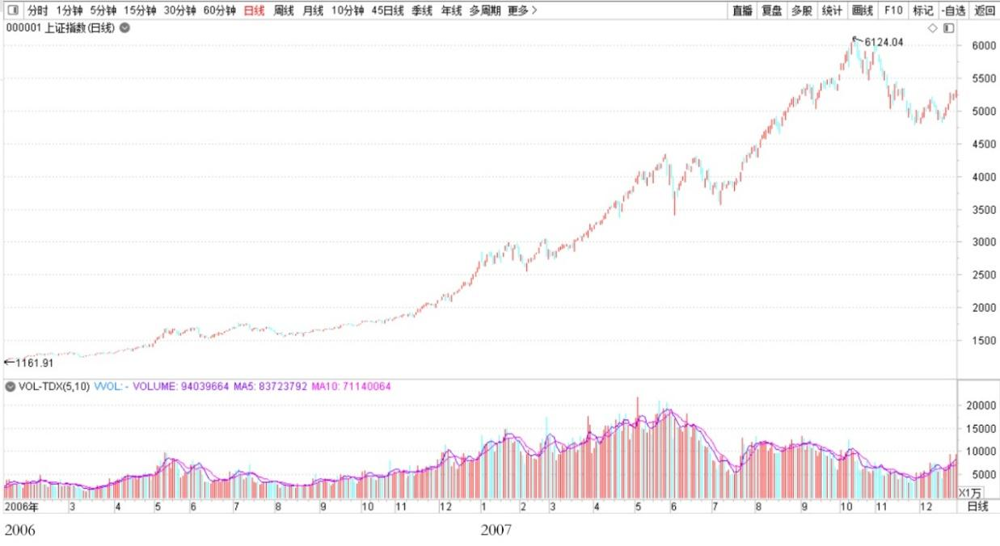
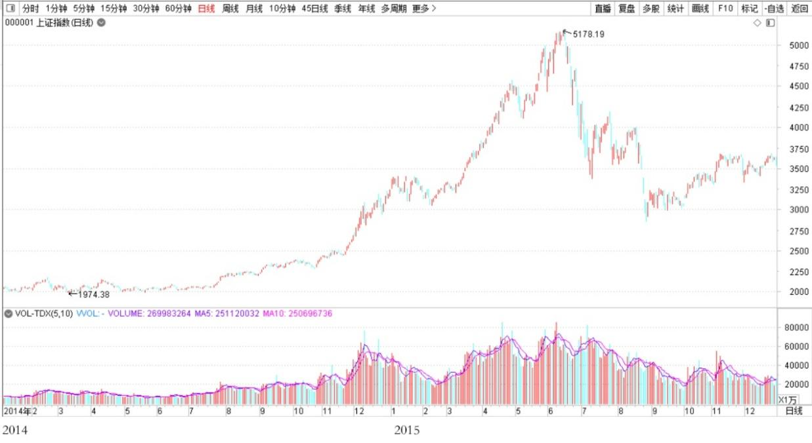
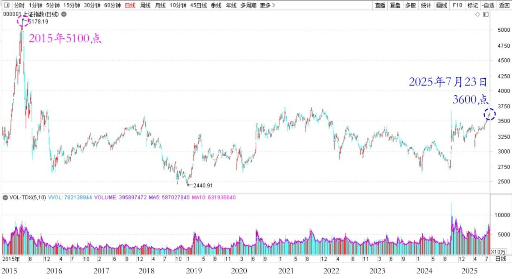

167篇.一年20倍，是怎样做到的？

清一山长[2025年7月23日17:42](https://www.zhihu.com/pin/1931408753950951007)

[情人消费、豪车、豪包、豪手机消费本质是啥？](https://zhuanlan.zhihu.com/p/1929949210259743433)

网友问：2006年A股市场虽然是大牛市，但一年不到的时间，股票账户从20万增值到400万，涨幅20倍，也是超级股神一样的存在！期待山长能回忆分享一下当年股票账户如何一年增值20倍的鬼谷子金融市场炼金术！

**上证指数2006～2007年日线图**

[山长 清一](https://www.zhihu.com/people/shan-chang-qing-yi)**回复：**你没发现，在这之后，连我自己都再也没有实现过这个记录吗？所以你就算去学来这本事，也没有用处了，连我自己都不会用了。2014～2015年，用了两年时间，还动用了融资，满仓满融，我也只做到了十倍，没法实现20倍了！

**上证指数2014～2015年日线图**

现在的我，水平就更差了，越来越没本事了。到今天为止，差不多又过了10年，现在才勉强增值了十倍还不到！我是越来越不行了，创造奇迹，靠你们了！（相比2015年的5100点，今天才3600点。我这10年，还是远远超过了市场，先自我安慰一下。）

**上证指数2015～2025年日线图**

**（标题、图片为编者所加）**

**文章音频**：

[584篇.一年20倍，是怎样做到的](http://link.zhihu.com/?target=https%3A//www.ximalaya.com/sound/895897902)

**参考链接：**

[160篇.贬低巴菲特，并不能让自己赚钱！](https://zhuanlan.zhihu.com/p/1925299829367608333)

[161篇.7年10倍利润增长](https://zhuanlan.zhihu.com/p/1927944535373247107)

[162篇.只想拿股息，没想赚快钱](https://zhuanlan.zhihu.com/p/1928066355866861887)

[163篇.比亚迪的对手，应该是丰田](https://zhuanlan.zhihu.com/p/1927780975305266754)

[164篇.如果德隆能坚持到今天](https://zhuanlan.zhihu.com/p/1932814644625510702)

[165篇.反身性理论看冠农](https://zhuanlan.zhihu.com/p/1932822111392621569)

[166篇.什么是匮乏之心？什么是富足之心？](https://zhuanlan.zhihu.com/p/1933972314027984331)

