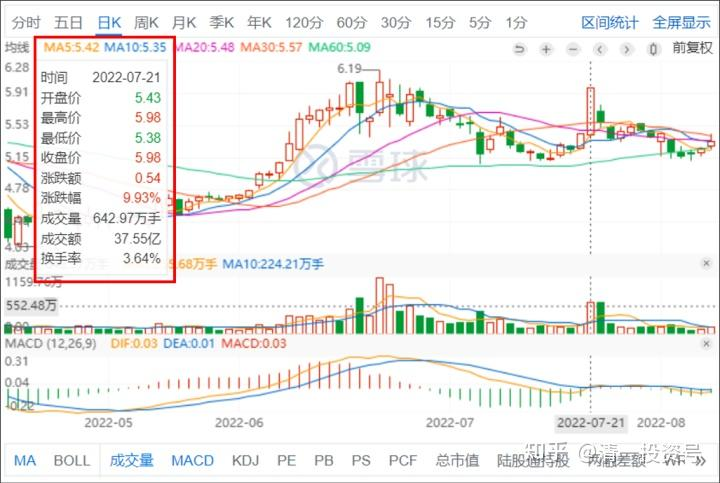
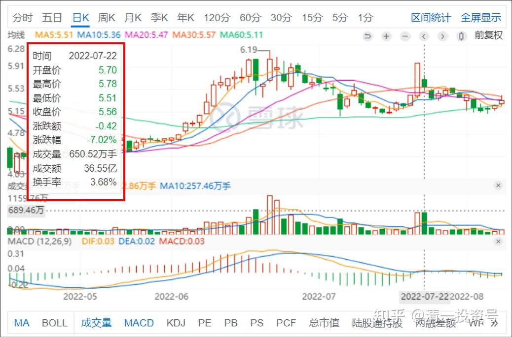

30篇.洛阳钼业A股已经赚了三次

清一山长 2022年7月22日

昨天我尾盘看到洛阳钼业A股涨停，有点奇怪，心想涨停秀身材？我就走吧。反正我港股持有不少，价格很低。A股给了6元就可以走了。上次是6元多走掉了，跌了又买回来。现在几乎又回到6元了（5.98元），就赶快趁涨停抛掉了全部的A股，只留了200股做纪念。打开账户，我只有几分钟时间操作。卖完之后，再想看看别的股，已经收市了。

原以为，今天会继续涨的，我也不在乎，让别人赚钱去吧。今早起来，写武道的文章去了，没有看盘。刚才发完文章，我想起来去看了一下，好惊讶：洛阳钼业今天居然跳空大跌。一路下跌，现在再掉一点，就把昨天的涨停幅度全跌完了。我看昨天涨了8.8%，因为绝对价格还很低，我没舍得抛出的港股洛钼，也几乎跌回原地了。这个股在干什么？大起大落的？妖股吗？存心让人失去方向？昨天成交37个亿，难道主力是在做善事？分钱给散户吗？

我抛出的时候，看到盘面抛单源源不绝。这些抛单，今天都赚了一笔呢[冷汗]。真心为主力揪心——你赚到钱没有呀？跳空下跌，就是把昨天涨停抢进来的资金全给锁住了。主力也套住了吗？还是昨天就悄悄的换单，利用涨停出货。昨天就跑掉了？真有追涨的散户这么傻的吗？但——答案如何不知道，我今天也不买进来，等着瞧好了。如果再跌回五元，我肯定会再买回来的。

我的A股，已经反复来回的，赚了三次洛钼的钱了。就是H股总是坐电梯[尴尬]。没捞到钱。我看我跟A股有缘，H股有仇。

