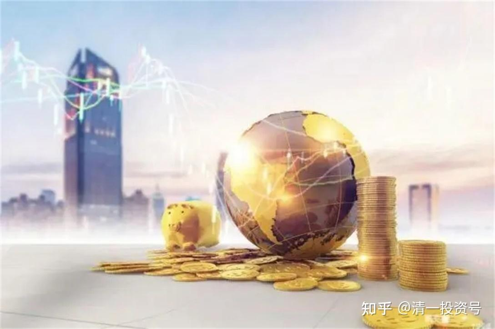
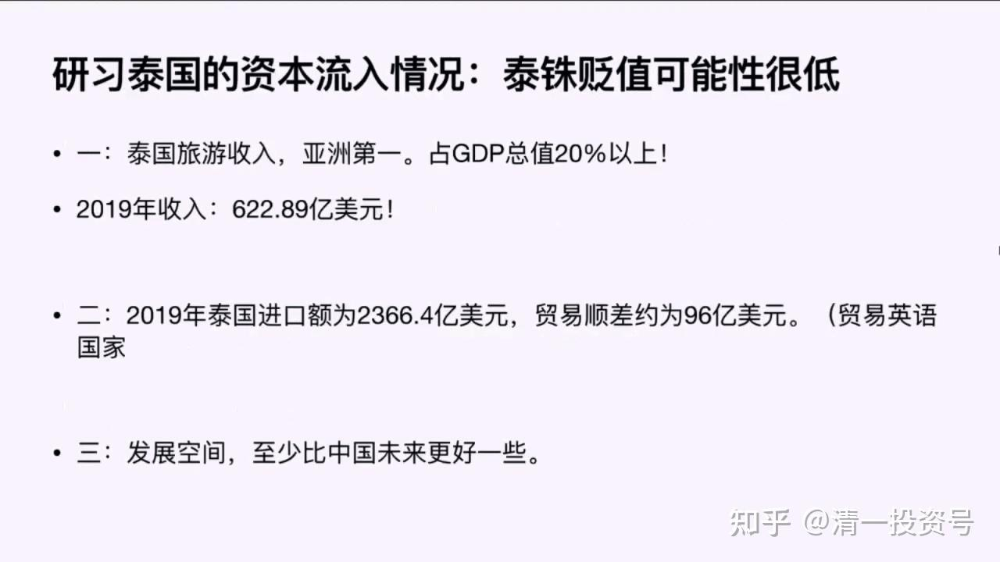
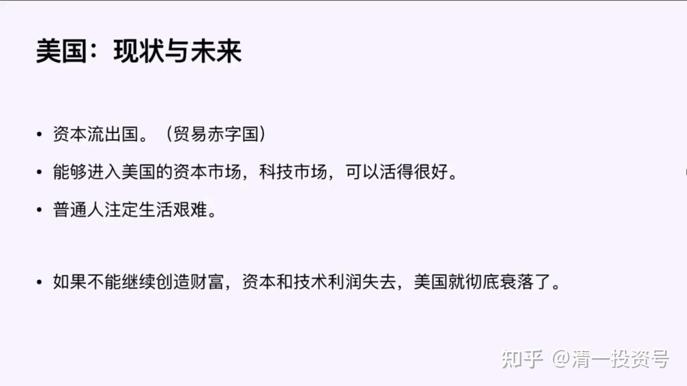
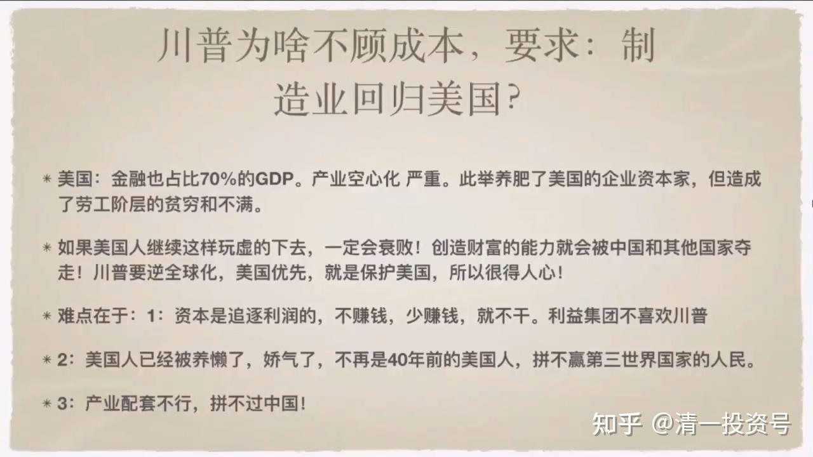
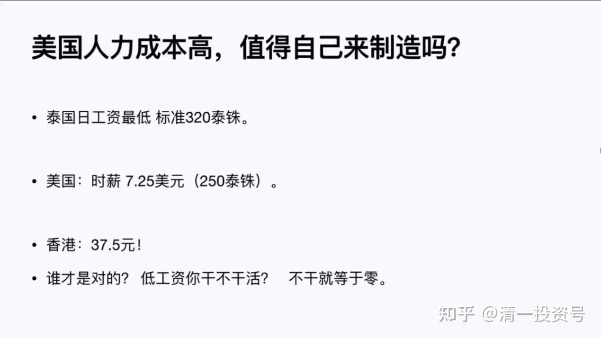

——节选清一山长 2020年演讲《泰国的投资与生活解析》系列三

22篇.通过国际化资源配置来聪明地工作和生活

——节选清一山长 2020年演讲《泰国的投资与生活解析》系列三

**1.泰国的经济状况与发展空间**

我答应过要给大家介绍一下泰国的。泰国的资本利润情况是怎么样的呢？**泰国的旅游收入是亚洲第一名，占GDP总值20%以上**，跟中国不一样。中国的旅游收入不占太大的比例，但是泰国旅游收入占比很高，2019年它的旅游行业收入是600多亿美元。泰国总共有5000万人口，可能只有我们一个省那么多，好像河南、四川这样的人口大省比它还多。但是2019年进入泰国旅游的外国人有多少呢？3600多万。一个只有5000万人口的国家，有3000多万外国人进入泰国，**这些进入泰国的外国人都要给泰国带来资本流入的。资本流入跟中国的贸易流入不一样，资本流入的贸易是最划算的**，我们出口美国赚到了贸易顺差，比如我们有100元的顺差，但这个顺差当中可能有90%以上都是成本，我们真正能够得到的顺差可能只有10%，甚至只有5%，我们的利润只有那么多。但是旅游收入没成本的，因为不管别人来不来，这个国家的成本都一样。就像现在外国人没有来泰国，国家的成本一点都没降低，但是**外国人来的话它就是零成本获得了外国资源。所以这600多亿外国资源，我会把它算成净利润。600多亿的净利润，如果按10%计算，是不是相当于6000多亿美金的外汇产值才能形成这么多的利润？**中国是产值，中国跟美国的贸易顺差原来是4000多亿的贸易总额，但咱们赚到的利润不见得比泰国多。为什么泰铢一直很强势，一直在涨？就是这个原因。所以**泰铢贬值的可能性很低**。人民币就不好说了，资本流出，最后慢慢的人民币就不太值钱了。

第二个，2019年泰国的进口额2360亿，贸易顺差96亿，它有大量的东西进口，但是它也有大量的出口，**它是贸易顺差国**，它不像一些国家是贸易逆差国，比如说美国。美国是典型的贸易逆差国，美国靠在全世界印票子、印国债来支付这些收入，但是它是逆差。逆差的话老百姓会活得很辛苦，**泰国的老百姓活得不辛苦**。

**泰国的发展空间跟越南、菲律宾、非洲相比，我觉得要差一些**。如果你在这些国家进行资本投入，可能你的回报更高。但是生活而言，泰国的基础设施很完善，所以泰国是生活最舒服的国家之一。泰国未来发生大规模的贬值或经济动荡的可能性不大，在泰国可进行一些适度的投资——比如我买了些泰国的银行、房地产股票——获得一个稳定的回报是没问题的，但是超额回报不太可能。要获得超额回报，你就要找到前面所说的资本、技术、人才都大量流入的行业，比如IT行业，智能行业。但是在泰国要找到人工智能行业的企业进行投资，我是不愿意投资的，我也不敢投资，**我宁可找一些跟随泰国同步发展的企业，能够稳定发展，这就够了**。

**2.美国的现状与未来**

我们再来看美国的现状与未来。美国现在是资本流出国，**如果能够进入美国的资本市场、科技市场，你可以活得很好。普通人注定生活艰难**，要靠低保过日子。在美国出现一种很荒诞的迹象：在美国很多人去工作得到的回报还不如他在家里坐等失业救济金的钱多。在这种情况之下，你觉得这个人的最佳选择是去工作还是在家等着失业救济金呢？所以美国有很多人是靠失业救济金过生活。美国的就业率不像你想象的那么高。为什么去工作的人工资不高？因为它给不起更高的工资，因为它没有太多的机会。这就是美国。在美国找工作是很困难的。很多中国人到了美国，**如果你指望在美国找到一个工作，除非你表现出过人的能耐，否则是很难的。所以现在海龟大量回到中国，其实不是他要回到中国，是他在外国根本活不下去**。

**全球化生存，就是我能在任何国家都活得下去，要么你有资本实力，要么你有技术实力。你不能做个游客，做游客你可以去世界上任何国家，去那里花钱，谁不欢迎你**？中国现在很多是游客，他不懂得怎样在这个国家获得资本收入，也不懂得在这个国家获得技术收入，他就没有国际化生存的条件。作为我们今日学堂整体而言，我们在任何国家都有生活下去的权利，因为我们在任何国家都可以有资本投入，虽然不多，但是支持一个团队活下去的资本投入，我们是有的。第二个，我们有技术实力，我们现在能用3年完成美国12年完不成的教育，这也是技术，这也是一种能力。我们可以培养未来的理工科人才，这是基础教育，我们培养他考一个高分，他可以去最好的大学。如果不想去美国的大学，你可以去日本的大学、德国的大学、欧洲的大学、英国的大学。这些国家跟美国也是竞争关系，不可能不收中国的学生。日本的理工科大学挺厉害，我们干吗不去呢？我们能够培养，我们可以教孩子日语，没问题，你可以去这些地方。我们也可以教你德语，教你法语，教你任何一门语言，这些国家都可以去。想学文科的人可以在泰国。这就是我给大家说的一个趋势。**美国不再是我们选择的对象，美国是高消费国家，你到那边消费划不来。到美国进行投资的话，美国本来不是投资的地方**。

**3.川普为何要制造业回归美国？**

有一件事情大家要思考一下，我认为这件事值得大家去算账。美国的人力成本高，它值不值得自己再制造。我们发现了一个事实，就是川普不顾成本，要求制造业回归美国。他为什么这样呢？

因为**美国的GDP中金融占比70%，产业空心化很严重**。这个策略以前是没问题的，把美国的企业和资本家都养肥了，但是劳工阶层贫穷不满。而且把贫穷不满对准中国，认为中国抢走了他们的机会。是不是呢？的确也是。中国的劳动力，只要一块钱就给你干活了，而美国人可能要五块钱才给你干活，所以是美国资本家选了中国，不是中国人一定要过去的。所以很多美国资本家其实不愿意离开中国，但是美国总统让苹果公司、所有公司回去，成本高也得回去，不回去就是不爱国。

美国为什么这样说？因为美国现在再玩虚的，它已经发现不仅中国，其他国家都开始了解了美国以前的玩法，不那么轻易受美国控制了。所以**美国现在玩虚的，用金融来收割全世界，它现在的招数不像原来那么灵。特别中国在世界国家中是最大的经济体，它根本玩不动中国，搞不定中国，它还这样玩，它这个国家就会完蛋**。所以美国必须利权交换，未来是一个利权交换时代。原来是美国倡导全球化，大家都听美国大哥的，中国沾了光，利用全球化迅速地成为了世界老二。现在成为老二之后，中国又想要当老大。美国人一看不行，咱们不能让你玩，不能让中国继续全球化。你会发现，中国的政府领导说全球化趋势不可逆改，中国一定要全球化。**全球化对中国有利，但全球化对美国没利。因为中国是全产业结构，中国现在是资本、技术、劳动力全部具备的国家。**美国资本具备，技术原来还具备，现在技术也开始被欧洲、被日本超越。比如5G技术，美国根本没有一个企业有5G技术。有这个技术的，两家，爱立信，是欧洲公司，还有中国。美国没有5G技术，美国发现在技术上开始失落。资本上其他国家也有。英国是老牌资本主义国家，英国的资本也非常雄厚。中国的资本也开始起来，日本的资本，这些东西都开始起来。美国在技术受到了挑战的情况之下，它就必须要求制造业回到美国，它就必须重新打造自己这个国家的全产业化结构。所以美国的未来一定走向封闭，它必须封闭才能把自己的资源留住。

但难点就是，美国总统或美国经济建设有这个想法，但是美国的资本家未必跟它一条心，因为资本是逐利的。你让我为了爱国来给美国工人付五美元，而让我失去到中国或东南亚国家付一块钱的机会，所以**这些资本家会反对美国总统**。我相信不是所有人都会支持，特别一些小一点的企业，它可能更不管你，所以美国的企业不愿意回去。甚至于像特斯拉更可恶，跟美国对着干。它自己还逆着美国总统的利益，在上海开了一家制造厂，已经在中国出产品，把美国气死了。但是有一条，为了吸引它过来，中国付出了巨大的代价，它到这边来，只提供了技术标准，钱都是中国给它的，它一分美国人的钱都没用，是中国的几家大银行给了它需要的上百亿美金，全部的制造成本。而且中国用最快的速度把它建成的。中国这样做就是告诉它，我给你好处，资本我给你提供，劳动力我也给你提供。技术——其实这个技术中国也有，但是中国没这个品牌。特斯拉一看，马斯克一看，那么好的事，我干吗不做？但是这样做的好处就是，它可以把一部分钱留在中国，把这个企业留在中国。而这些支持中国的企业家对美国有一定发言权，就会使川普的策略不再有效。但是在这件事情上，中国要说能赚到多大的好处，谈不上的，因为钱都是中国出的，中国出钱、出人，赚了钱给美国人。这种好事，特斯拉当然愿意干了。但是，中国吃这个亏，是因为中国要拉住美国，不能让美国跟中国脱钩，不能让全球化脱钩。

另外，**美国的教育已经把美国人养懒了**。美国的教育就是精英教育，很勤奋，非常努力，它培养高端人才，普通人在那混日子。这种教育当然就把大部分美国人给养懒了。美国不再是40年前勤劳肯干的美国工人，跟大家看到的卓别林时代不同。你看卓别林时代的工厂比中国要严重得多，它是靠那样来赢得美国优势的，美国拼不赢第三世界国家的人民。

最后，美国还有一大劣势，就是产业配套不行，拼不赢中国。

所以成本也好，优势也好，都没有，美国为啥还一定要让它们回去呢？因为美国明确地知道自己的战略实力正在下降，继续这样下去的话会快速衰落。回流美国，它靠自己庞大的人口优势和地域优势，它可以延缓衰落的时间，所以这就是成本。

**4.从成本来看，如何聪明地工作和生活？**

这就是成本。**在成本这个问题上，我们要记住，劳动力成本，它可以一钱不值，也可以价值很高，我们不要把它看得太重了。**

我们家里面我比较勤奋，因为家里面一直教育我一个格言，我妈妈对我说：“力气是个怪，用了还有。”意思就是说不要珍惜力气，学会勤奋。我父母都是很勤奋的人，一辈子。他觉得反正我用不用，这一天就过去了。对呀！**这一天我用来攒点钱，攒一毛钱也好两毛钱也好，一块钱也好两块钱也好，但是我游手好闲过了，也是一天，这就是劳动力的价值。我们不要认为劳动力标了个日工资，低于这个我就不干，如果不干中国就没有今天，中国如果不给全世界打工，中国就没有今天。**我们看看人力成本的比较，我们看看我们应该怎么生活。

泰国的日最低工资标准一天是320泰铢，美国的时薪是7.25美金，相当于250泰铢。也就是说美国人的工资收入是泰国工资收入的7倍以上。那是不是美国人就比泰国人聪明很多呢？其实不是，这就是劳动力成本。香港呢？香港也很贵的，香港是37.5港币一小时，工资跟美国也接近了。美国兑换一港币是七倍，香港时薪相当于5美金，美国7美金，那么谁才是对的？低工资你干不干？

这里给大家一个聪明的建议，最后一个建议，就是我觉得你最好的办法的话就是到美国去工作，到香港去工作，不是到它那去消费，去它那消费太划不来了。香港的一盒饭38港币，泰国的一盒饭20-30泰铢，你就可以买一盒盒饭，比如说一盒泰国的鸡油饭标准价格就是25泰铢。那么在香港的话，你38买的是最差的盒饭，如果有点肉的盒饭大概是50港币。那么在香港消费你肯定划不来，但是在香港每小时能赚37，那你比在泰国赚得多得多，比泰国多了5倍。因此**你可以在香港干活，但你要把钱省下来，省下来干嘛呢？到泰国生活。这就是最聪明的办法。**

谁能够这样做？当然了你说生活和工作怎么能够分离？可以分离的，**我们就是我就是。我们赚的钱实际上是中国的标准来赚钱的，但是我们的生活是按泰国的标准来生活的**。以后，我们的教育如果推向全世界，全世界的人到我们这来上学的话，我们可能会收美金。我们现在国际今日是按照外汇来算的，今年的国际今日我们上学都是用外汇，你要用国外的钱，用国际标准来给我们支付。这就实现了国际化生存，如果你是香港来的人，你是美国来的人，你们就是在香港和美国挣钱，在泰国生活，这就是最聪明的办法。

**这就叫国际化生存，也叫国际化资源配置。我从资源最好的地方赚钱，工资最高的地方赚钱，在生活成本最低的地方生活**。你在香港只能买一套50平方米的一个小居室，但是在泰国，你可以买一个1000平方米的一个大别墅，在这种条件之下，你干吗要守住香港的50平方，觉得它是世界上最好的房子呢？香港大概价格是20万到40万港币一个平方这种水准，一个50平方的房子就是一千万到两千万的价格。一千万、两千万港币，在泰国足够买一个500平方到1000平方大豪宅。当然我们不一定需要那么大的房子，那么大房子其实你住在里面打扫卫生也麻烦。你可以买一个同样的小房间，买个100多200多平方的房子，剩下的钱拿来投资，光靠利息你都可以在泰国生活得很好。这就叫国际资源的有效配置，可以让我们的人生更顺利。**我们要劳动，我们要工作，但是我们可以用最聪明的方式去劳动和工作，而不是用最笨的方式**。这就是今天给大家的建议。

**5.在泰国进行股票投资的方法与策略**

在泰国买股票很简单，最后告诉大家在泰国投资股票的奥秘。泰国跟中国不一样，中国的银行只是银行，没有投行业务，但是泰国银行是有投行业务的。**在泰国，你在银行开一个户，你就可以同时要求银行给你开一个证券账户**，这个证券账户你可以用英文操作，看懂这些东西很容易。我在泰国，因为**我也不懂泰国的公司谁最厉害，我就看排名，我就看指标，我就看它的财务报表，找每年的股息率最高的，市盈率最低的，股价走势最差的，选择其中最有竞争力的，估值最低的，股息率最高的，买个一篮子股票。买个一篮子指的是10-20只股票，其中某一只踩雷了，不会影响你，因为每一只股票不超过5%。但是我买的都是行业前十名的，前十名的话，大家互相竞争，只要他们竞争，谁上去了，你都有好处。而且我买的价格是五年甚至是十年的最低价**。前段时间我买了泰国的银行股，比如泰国四大银行之一，开泰银行。我买的价格，当时它跌到了80多泰铢，我看了一下，是十年最低价，除了2008年的金融危机之外，没有哪一年的价格低到过这个价格。半年多以前它的价格是200多泰铢，跌到80多，只剩1/3了，我买吧。买了不少，买了几千万泰铢的银行股票进来。没想到这段时间随着美股上涨，它也跟着狂涨一气，涨到多少？最高涨到了118，涨到115.75这个价格我就把它全卖掉了。全卖掉了之后，现在又跌到多少呢？现在又跌到91，比我买的价格只高几块钱。如果我不卖掉，现在几乎跌回我的成本区，接近我原来86的成本区。在这个情况之下，我在泰国意外地赚了一笔泰国的钱，波动的钱。但是为什么我要把它卖掉？因为我判断，第一，美股现在高企，美股还会有一个下跌。第二，现在大家看泰国疫情平复，所以人民态度开始乐观，开始积极。我认为真正最倒霉的报表还没来，因为，我们刚才算了账，泰国靠外汇收入，靠国际旅游收入是600多个亿，它的比例是很高的，如果消除20%之后，它几乎是净消除的，对它的打击影响是非常非常大的。所以我个人认为它6月份出的半年报会很难看。半年报一旦出来，公司业绩特别难看之后，会引起泰国社会信用市场的恐慌，它会进一步下跌，它很可能跌破我上一次的最低价，跌破最低价、最恐慌的时候重新再买进来就得了。因为我觉得也没必要那么恐慌，它以后会逐步恢复，但恢复时间会比较长。所以**现在涨了我一定会卖掉，跌了我就不卖，我就死守不放，这是我的策略**。这个策略简不简单呢？我几分钟就可以教给你，所以任何人都可以到泰国来赚钱。因为我刚才这个策略根本不费脑子，**如果它不该涨的时候涨了，你把它卖掉就完了**。现在我的资产已经又增加了相当部分，这赚出来的钱就等着泰国股票下一步再下跌，我相信它一定会下跌，就在今年下半年。

中国也一样，我认为中国很多企业的半年报会非常难看。这些东西会引起新一轮恐慌性的估值下跌。在中国，要找到一些不下跌的企业比较难。为什么我只敢买入中建，而银行不敢买，其他也不敢买？原因也是这样。**中国建筑大致上疫情对它影响不大，大概它6月份的报表会比较正常，但是很多公司6月份的利润、产值可能会出现断崖式下跌，这种情况下可能就会又有一个波动**。当然不是6月份，是7月份、8月份，我看很多报表是8月底才出来，等报表出来了之后，肯定业绩不会好看的。所以一定要等下半年了，当然也可能提前反映，因为有些报表内部提前就知道了，会传一些消息。

所以**今年大家就别乐观了，准备好足够的现金，足够的子弹，如果出现一些意外超跌的很便宜的股，大家可以买入**。泰国是这样，中国也是这样。这是一个机会，全球变化的机会，就是我们的机会。你要跟随变化、掌握变化，你就是赢家。如果忽略变化、排斥变化，你就是输家。这就是未来。

**参考链接：**

[系列一：清一投资号：17篇.财富三要素的未来展望及原因分析](https://zhuanlan.zhihu.com/p/596692830)

[系列二：清一投资号：20篇.跟随资本走向的三种创富模式](https://zhuanlan.zhihu.com/p/599465414)

