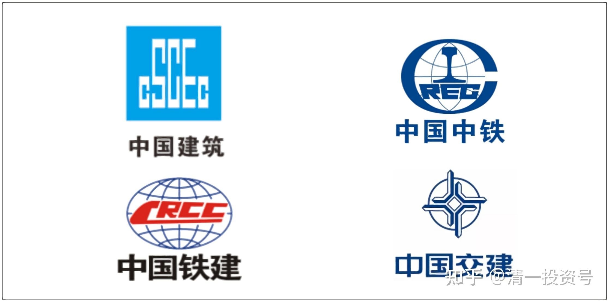
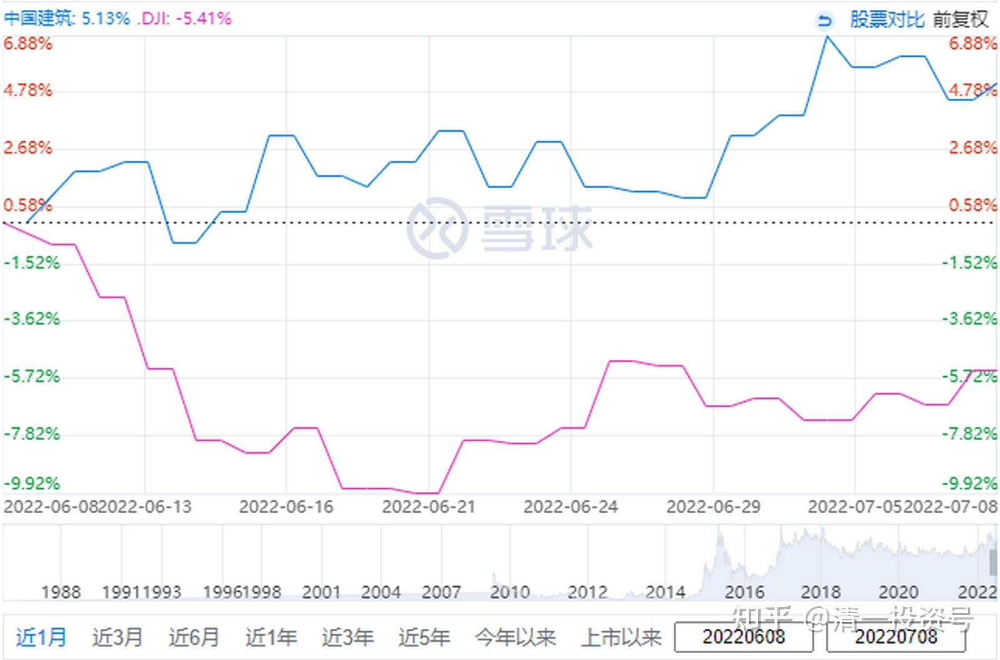
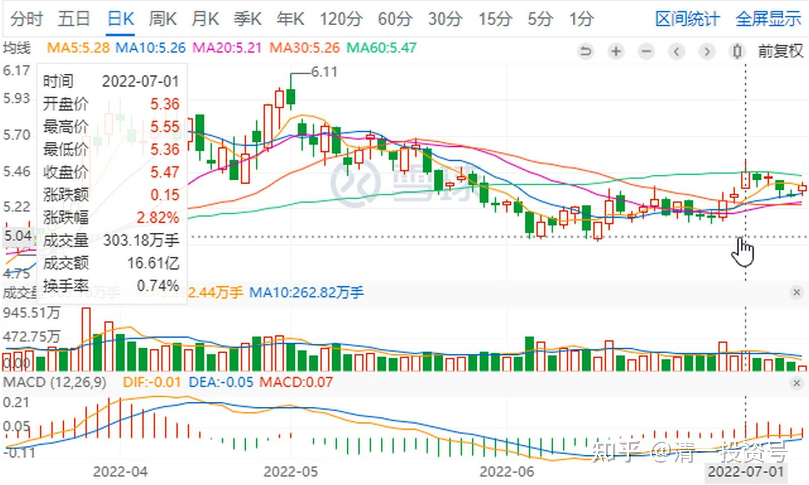
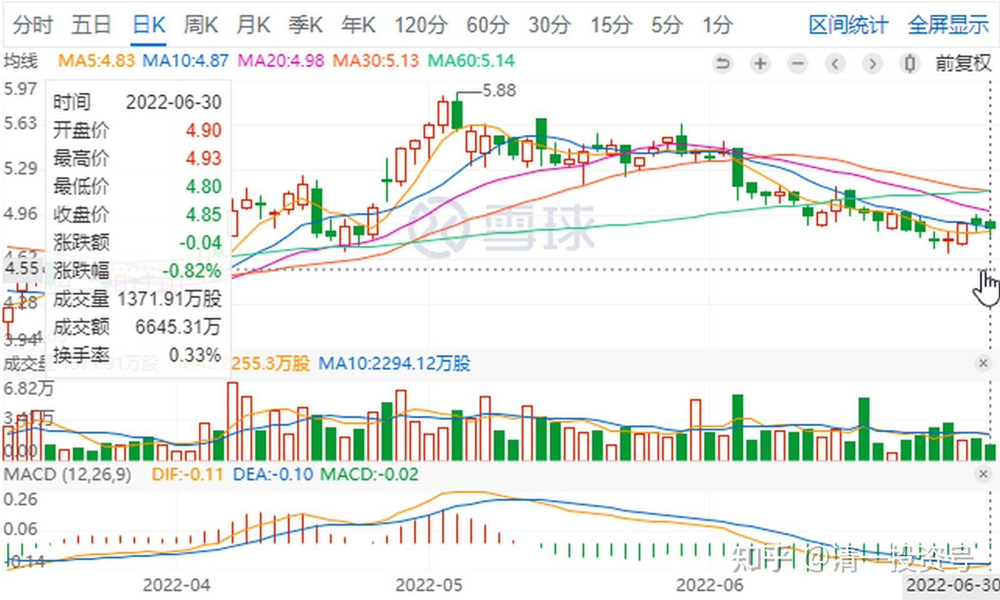
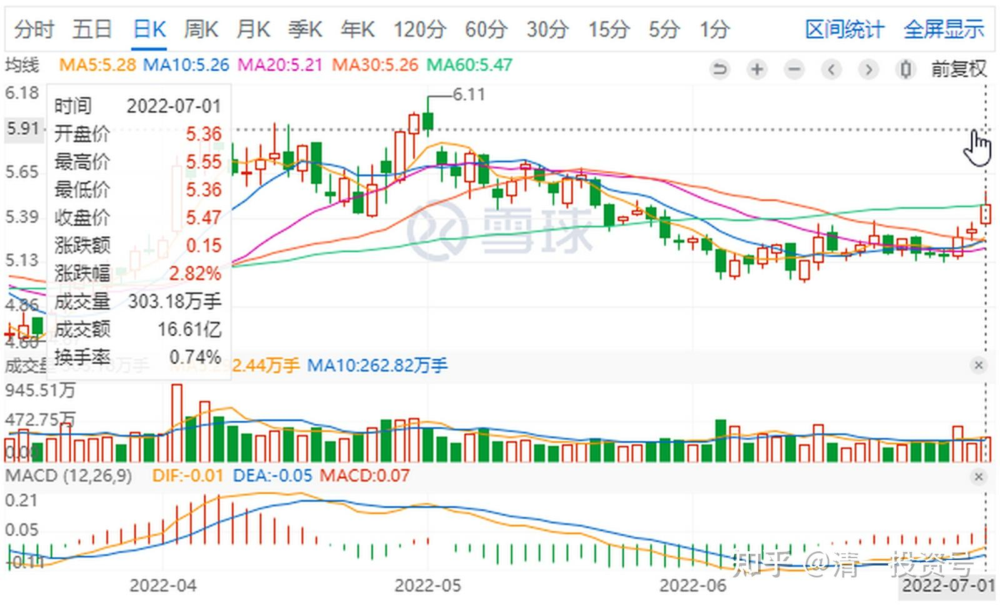
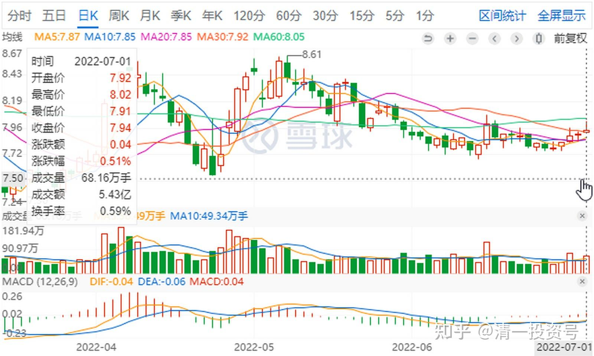
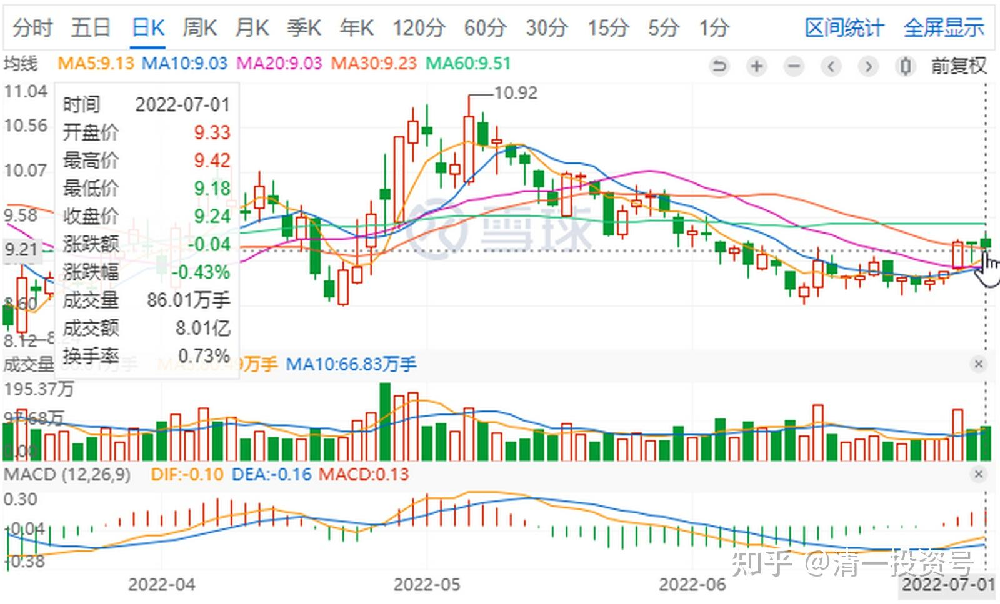

28篇.估值切换，两边获益

清一山长2022年6月24日～7月1日

**某球友发帖：**

清仓中国建筑加仓平煤股份

**山长清一2022/6/24 23:11:50评论上贴**

点评：搞不懂球友守了六年的中建，居然清仓换14.5元的平煤？不就是当天跌得多了一点吗？现在还跌到12元了。跌了就这么情绪激动吗？球友在平煤7.5元的时候，中建换平煤是“有眼光”。现在翻倍了，再来换平煤？会不会真的是赌一把？假如燕京涨过16元，再跌回12元的时候，我敢不敢卖掉6元的中建去追燕京？虽然我赌燕京将来有一天会过20元，也不是啥稀奇的事情。而且我判断我几乎不会清仓燕京，我认为燕京可以比可乐。**但我猜我不敢这样换，因为我恐高。而且，大概率我反过来换一些筹码，保住我的收益。我不想把所有的好处都赚到手。**中国建筑有一个好处——如果通胀严重，它的PPP反而成了保值的工具。这是球友原来最看好的项目，现在改了，我都不习惯了。

下周一，中建大概率要跌的，今天晚上美股大涨。我对中建，其实没有燕京忠诚。上次中建过了6元，我卖掉了一千多万股。回过头来觉得自己狠心丢弃，不过并不是认为中建不涨了，而是我看燕京和有色跌得太难看，我卖点钱去补仓。现在回头看，有色其实没有赚钱，几个点。燕京涨了不少，不过中建跌了不少，我的切换算是成功的。燕京继续上涨，会卖掉一些换低价的资源股。尽管卖掉的燕京继续涨我也没意见。我的习惯——多买一点股。现在的有色，还停留在2014年的位置的几只股，我看了有点馋。中建如果继续跌，不排除再买一些。一句话——**不赌股票的涨跌，我只利用涨跌。涨了多卖一点，跌了才能多买一些。**

美股涨，A股如果跟涨，大概率要用中建，大蓝筹压盘。所以——美股不崩，中建就没戏。不过，等了五六年了，**美股崩的可能性，越来越大了，现在投降，有点划不来。**早几年干啥去了？

**山长清一2022/7/1 11:03:32**

中国建筑这三天都在抢权。四天前的收盘价是5.41元，现在是5.53元，外加0.25元的股息。已经完美填权。现价相当于含权5.78元。大建已经算是涨了不少了。有一些想要除权的前一天卖出，第二天买回的，专门逃股息税的聪明人，这回就玩亏了一年的利息。我认为主力是有意识抢权的。**不过，我认为中建是大盘不稳，故意出来护盘的。再涨下去，我都要卖了。**原因就是：我认为中铁港股(HK:00390)、中铁建港股(HK:01186)，都比它便宜多了。中铁建居然才2倍多PE。实在太低了。如果中建继续涨，我就想换股了。美股昨天很弱，如果继续跌的，中建估计会涨。我认为中建等是用于护盘的。**大盘稳住了，就会阴跌。**现在还不是大涨的时候（因为美股还在维持）。但我相信你们已经看到了美股与中建相反的走势了？美股大跌800多点的时候，中建是发动了抢权行情的。别人以为是抢权，我认为正好配上了时间点而已。给人的印象是中建国之重器，就应该抢权。

*中国建筑日K图*

山长清一2022/7/1 11:07:26

今晚美股跌的可能性很大。所以——明天中建应该继续拉。关键看今晚美股如果大跌，外围股市大跌，港股也大跌，为了未来A股的独立地位，中建就不得不大涨，就跟上次突破6元一样。所以，**聪明人可以利用跟随外围的股票和中建玩跷跷板。**中建大涨了，用来换外围大跌的股票。外围涨起来了，卖掉换中建。我就用了这种策略，上一轮赚了不少价差，多赚了不少股票。

山长清一2022/7/1 13:39:31

**中国中铁今天A股涨两个多点。已经很难得了。但港股跌。为啥？A股四大建在护盘呢！**大盘好了，护盘就取消了，大盘跟随美股涨的话，四大建还要出来打压。这就是我会别的股赚了钱，买四大建。但四大建不断涨高的时候。反而会卖出去买跌惨了其他股。这就是估值切换，利用国家队的资金去两边跳，两边获益。这种人多了，会很讨厌的，等于抢他们的钱。[大笑]

《中国中铁：中国中铁关于控股股东增持公司股份进展情况的公告》[网页链接](http://link.zhihu.com/?target=http%3A//www.sse.com.cn/disclosure/listedinfo/announcement/c/new/2022-07-01/601390_20220701_1_G7dZMsvi.pdf)

中国中铁(SH601390，收盘价：6.14元)6月30日晚间发布公告称，公司收到控股股东中铁工的通知，截至2022年6月30日，中铁工通过上海证券交易所集中竞价交易系统累计增持了公司A股股份1160万股，增持均价约为6.54元/股。

放着4元左右的港股不买。为啥只买贵得多的A股？明显是有政治任务的。[笑]

*中国中铁（SH601390）日K图*

*中国中铁（00390）日K图*

*中国建筑日K图*

*中国铁建日K图*

*中国交建日K图*

参考链接：

[清一投资号：8篇.中国建筑系列之六：熊市布局，牛市收获](https://zhuanlan.zhihu.com/p/534585889) （整理文）

[清一投资号：7篇.中国建筑系列之五：投资中建的核心逻辑和理由](https://zhuanlan.zhihu.com/p/528942534) （整理文）

[清一投资号：18篇.全面狂跌中如何独善其身](https://zhuanlan.zhihu.com/p/513631895) （新作）

