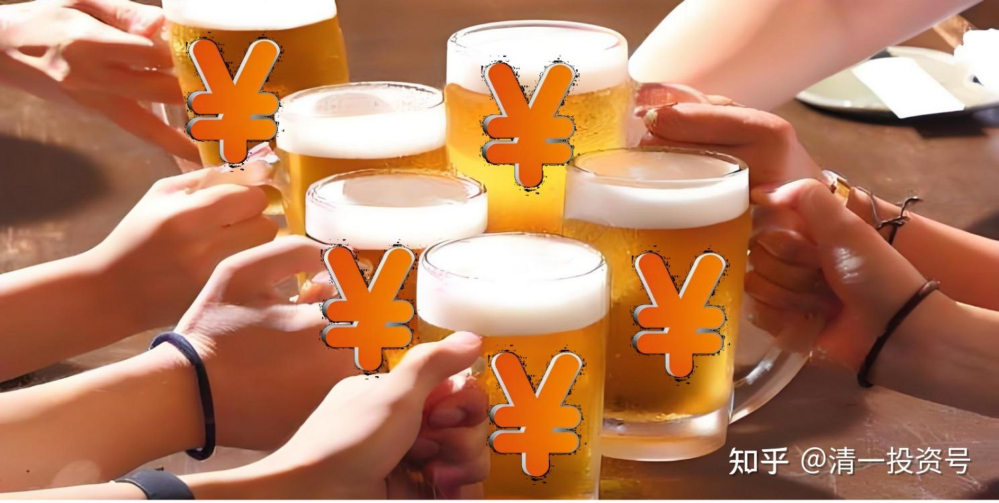

68篇.中国的啤酒迟早会赚钱

清一山长2020年11月24日

**一、持有惠泉，还可以有理由坚持十年**

清一山长2020-11-24 12:13:17

[$兰州黄河(SZ000929)$](http://link.zhihu.com/?target=http%3A//xueqiu.com/S/SZ000929) **最标准的上吊线，是兰州黄河昨天画出来的，且伴随相对巨大的成交量**，一天就达到了15.8%的换手率。可以判定昨天套住了很多追高的人。

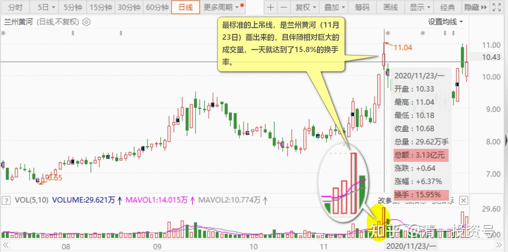

但我没看昨天的日线图，不知道日线具体咋走的，所以不好判断主力的作为。但主力肯定出了不少货。昨天冲了涨停，今天碰了跌停。跟惠泉一样玩得很精彩。

这个黄河，基本面比燕京啤酒、惠泉啤酒的质地要差多了。它都可以连创新高，甚至破了11元。燕京、惠泉，可以继续努力，勇破12元[大笑]。一年前，我考虑过，是不是要用黄河作为投机股的。因为发现它和惠泉一样的妖娆，甚至更妖娆（涨跌更变态）。但因为两个原因放弃了，一个原因是持股人太散了，大股东持股只有20%多，浮动筹码太分散，拉起来其实成本更高一些。另外一个原因是黄河的业绩太差，未来走向不明。**惠泉啤酒背后是燕京集团，它肯定不会垮掉。业绩也在步步高升，销量、利润都在提升。**黄河只有一个“并购概念”，它的基本面改善，看来还遥遥无期。

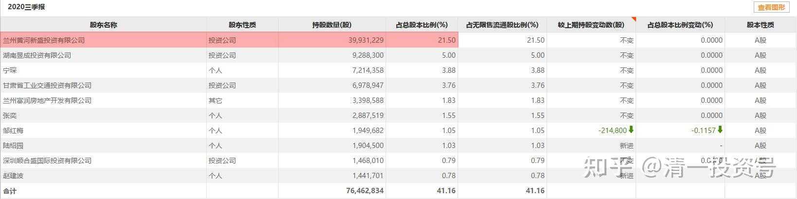

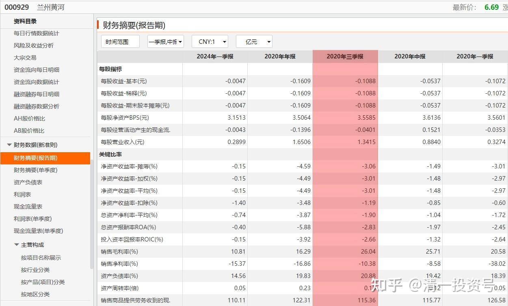

不过回过来看，一年前买惠泉和买黄河，是差不多的，都可以赚不少钱。比燕京和珠江更多的钱。

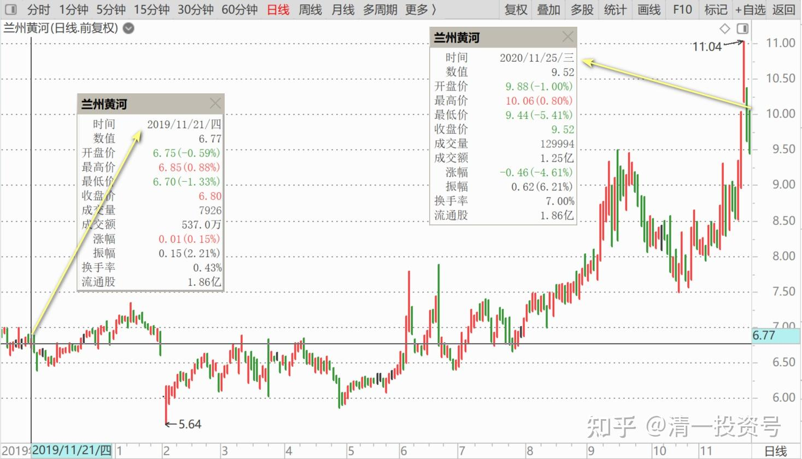

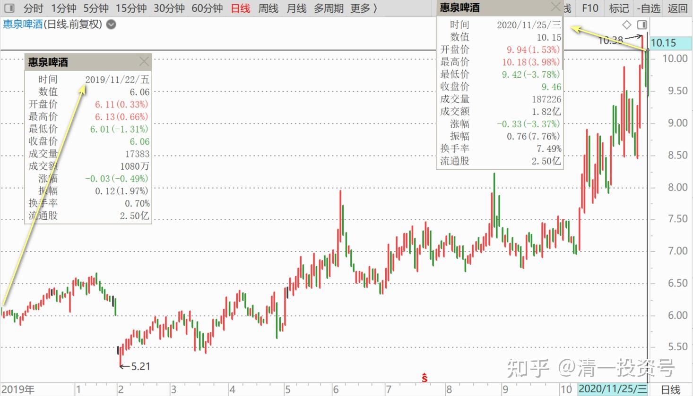

当然，黄河我最怕的就是砸在里面了。万一，**持有惠泉，还可以有理由坚持十年**。持有黄河，十年后还在不在？我不敢说！

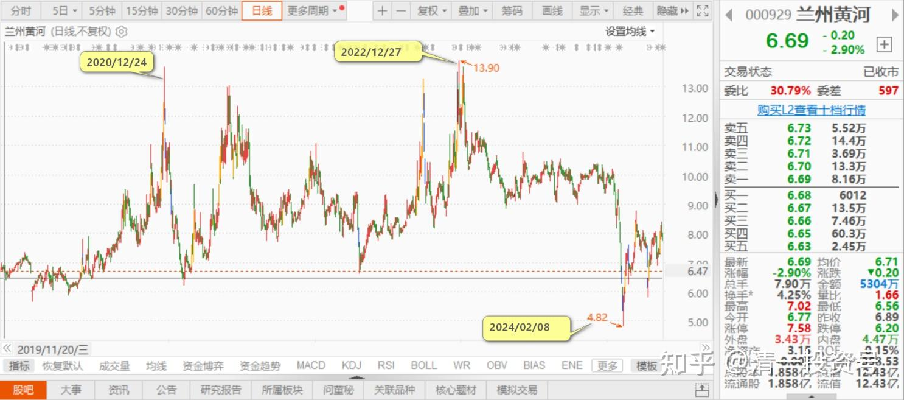

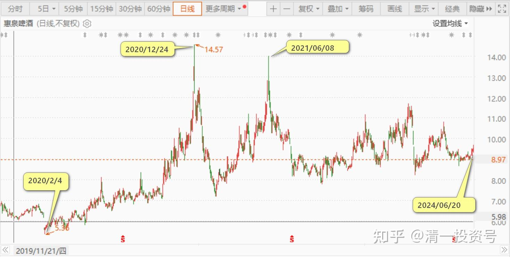

**二、中国的啤酒迟早会赚钱**

清一山长2020-11-24 14:53:51

[$海利生物(SH603718)$](http://link.zhihu.com/?target=http%3A//xueqiu.com/S/SH603718) 庄股，就是这样走的。涨没理由，不需要理由，只因相信就涨，刚买就有涨停板等你。还会一直不断的涨，涨到你三观都全改了。如果你一直没买它，就觉得自己是个超级大蠢货。为了让自己显得“正常”一点，你终于买进了。如果买入后继续涨，你觉得自己真的变聪明了。如果你每次卖出都是“错”的，你就把更多资金投进去买。甚至还借钱买这种股，想要继续涨更多。因为你看它从来就不跌，你认为这个股，就是不会跌的。可是，等你想，再涨多少，你就收手，就玩最后一把了。它就开始跌了，跌起来，你就开始补仓，你认为应该能恢复上涨的，你舍不得你账上看到的“利润”。但你每次买入，都是“错”的，让你想自己一直就是个蠢货。于是，终于你发现了：你的确就是个蠢货！[俏皮]

跟庄炒作的人，就是这样的。换了我，万一买了，什么时候卖掉，我都是开心的。跑的股票还涨怎么想？我想这就不是我的钱，不该我赚这笔钱。

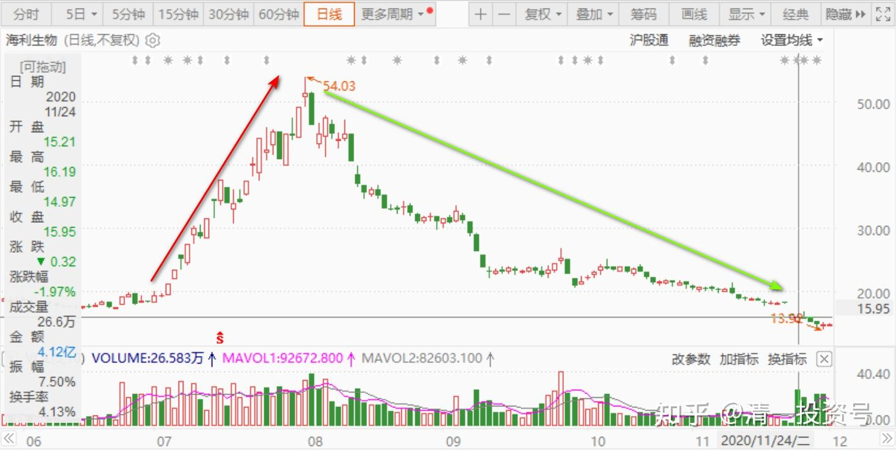

其实，这种钱，我真的赚不到。因为，**我根本就不会买这种股——看不懂的股。**你们以为我买啤酒这种市盈率高得离谱的股票是发疯，我觉得没疯。**因为我认为中国的啤酒迟早会赚钱，我用世界标准来看，中国啤酒股很便宜，**买个不会倒闭的公司就行。至于这只股，海利生物，说实话，我没信心肯定它十年后还存在。

多年前，我的大学同学开办的上市公司，前段时间公布退市了。当年多风光呀！去哪里，省长、市长捧着，抬着的，“伟大的企业家”。现在呢？不知道了。当年老同学邀我进公司一起干，我说搞不懂这个行业，婉拒了。损失了当原始股股东发大财的机会，我一直不后悔，因为我追求活得自在。老同学赚的钱多多，我相比穷一点，也没啥失落的，我的钱也够自己用的。今天，倒过来一看老同学的公司垮了，多家公司都垮了：老同学都被禁止坐高铁、飞机了[吐血]。企业破产，很多人到处围着他追债。我很同情他，也纳闷极了：当初他这么多的钱，上百亿，都跑什么地方去了？

**世事无常，守住自己，只赚自己看得懂的钱。光看别人吃肉眼红的人，也要知道别人挨打的时候的可怜。**

**另外一个教训：就是要赚这么多钱干嘛？够用就行了。赚多了，其实都不是自己的**。这些钱都弄到身边来，可能带来的还是祸害。为了一点钱，想方设法忽悠人，不讲良心捞钱的人，真是天下第一蠢！因为报应太大了。

**赚了钱，就要多做好事。**不要总想钱生钱，不断赚，恨不得把全世界的钱都赚到自己手里，这样想，自己会遭殃，子孙后代，都要倒霉的。**德不配位，赚了钱，钱越多，就越坏事。**

**三、独食庄、苦庄VS分享庄、好庄**

清一山长2020-11-24 17:04:40

[$重庆啤酒(SH600132)$](http://link.zhihu.com/?target=http%3A//xueqiu.com/S/SH600132) **终于成为坐庄超级超级成功的妖股了。**可怜的庄家！你们看重庆啤酒的庄家，觉得庄家好牛，我看这个庄家，觉得庄家好惨。都出不来,只好继续拉。反正大多数筹码都在自己手上，就使劲拉吧！爱说多少价就是多少价。有人跟就跟，没人跟自己玩。孤独的舞者。

你看8月17日，8月18日，**连续两个涨停，股价都没回头。9月14日，再涨停，冲98元的高价。但成交只有2.55亿，换手率0.43，**连惠泉这样盘子只有它25分之一的小股的成交都不如。之后，无论股价是否拉高还是跌低，成交再也无法放大。庄家可怜，被自己玩到天上去了，下都下不来。只有某天崩盘，资金链断了，才会狂跌一气吧？45倍市净率的啤酒？真开眼界，比白酒更狂热的啤酒。“超级啤茅”——重庆啤酒[很赞]

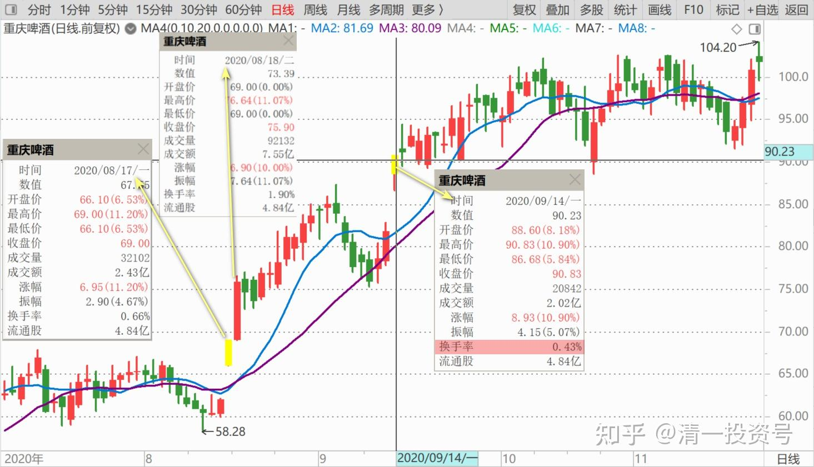

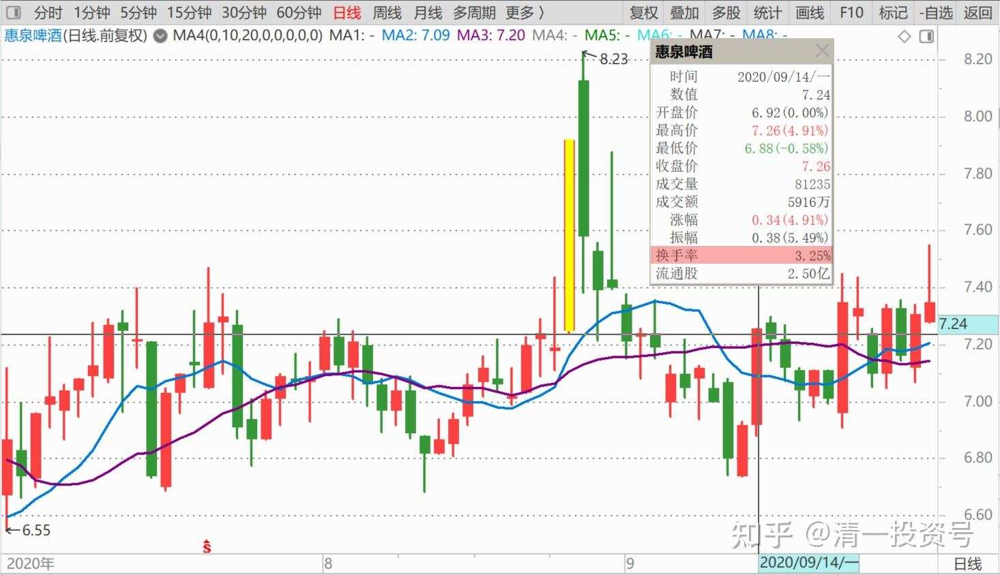

2016**～**2017年，才十几元的股，现在一百多元，实际的业绩比珠江好不到哪去，真的价值何在？这是主力的价值！就怕业绩变差，就玩完了。这主力，不会走群众路线。**聪明的庄家，是不断给群众喂食，来来回回的。这种一路涨上去的，孤独到连朋友都没有的庄，叫“独食庄”，也叫“苦庄”。**

惠泉啤酒的庄，才是真庄、好庄。总让人有机会上车的庄，“分享庄”，不吃独食！赞一个！

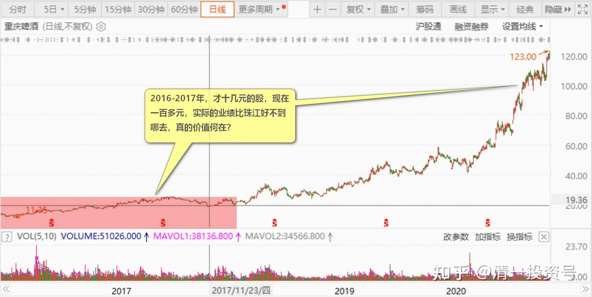

(标题、图片为编者所加)

**文章音频**：

[456篇.中国的啤酒迟早会赚钱](http://link.zhihu.com/?target=https%3A//www.ximalaya.com/sound/737492224)

**参考链接：**

[61篇.顺鑫农业记录七——机构坐庄三招：养、套、杀](https://zhuanlan.zhihu.com/p/556331421)

[62篇.看一看典型的骗线](https://zhuanlan.zhihu.com/p/698011435)

[63篇.为啥我认为是假出货](https://zhuanlan.zhihu.com/p/699291708)

[64篇.看懂长牛股的走势](https://zhuanlan.zhihu.com/p/700510263)

[65篇.多空交战依然没有完成](https://zhuanlan.zhihu.com/p/701863047)

[66篇.讲鬼故事还是真减持](https://zhuanlan.zhihu.com/p/703026413)

[67篇.开盘这十分钟，才是最重要的时刻](https://zhuanlan.zhihu.com/p/704358659)
