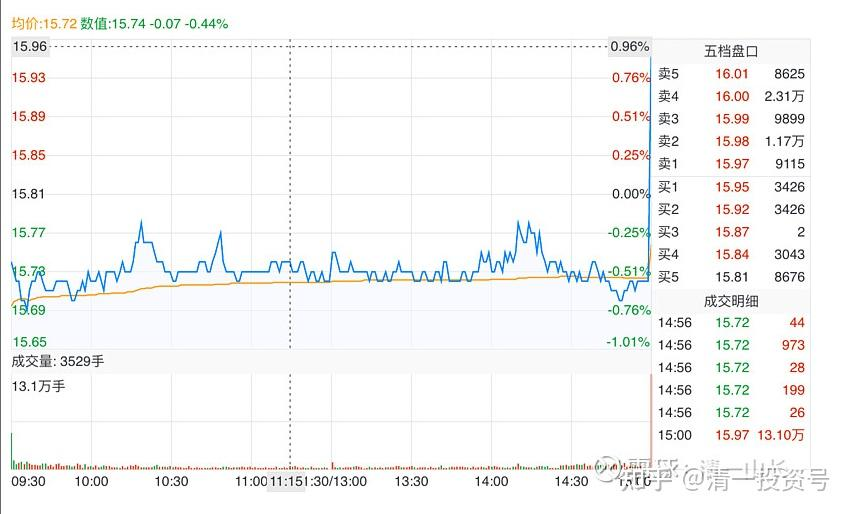
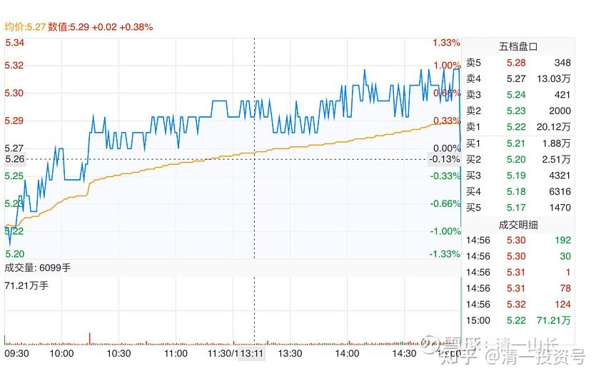
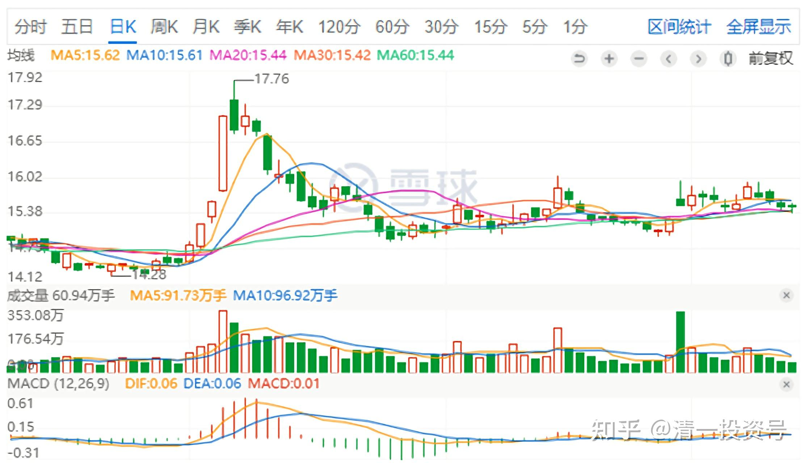
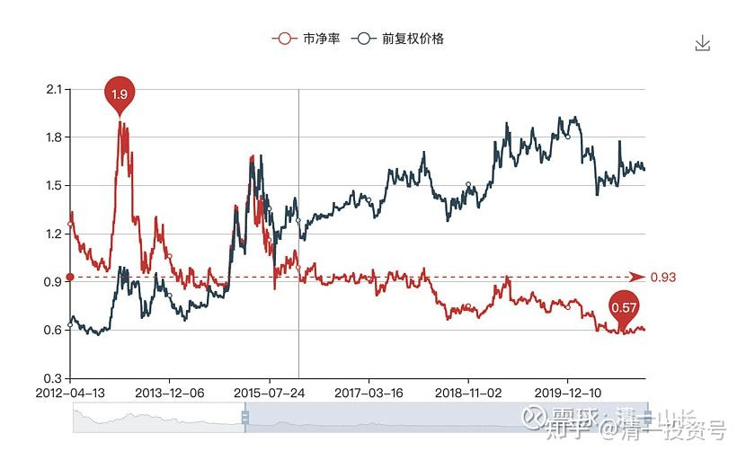
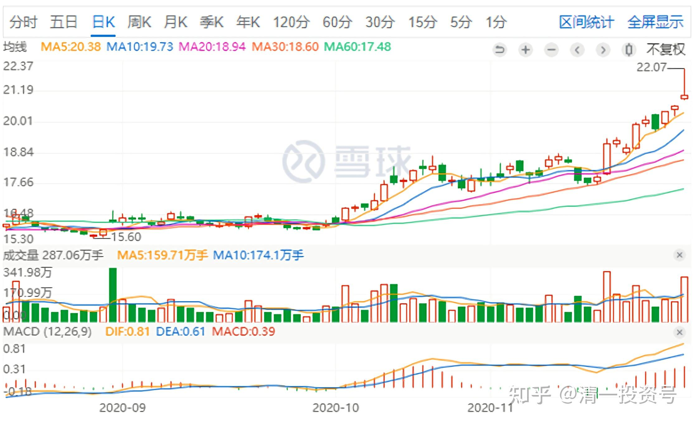
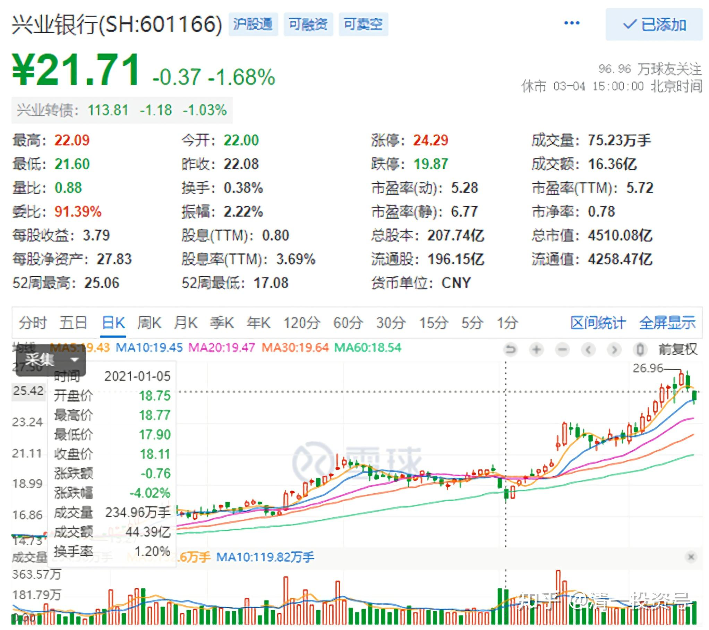
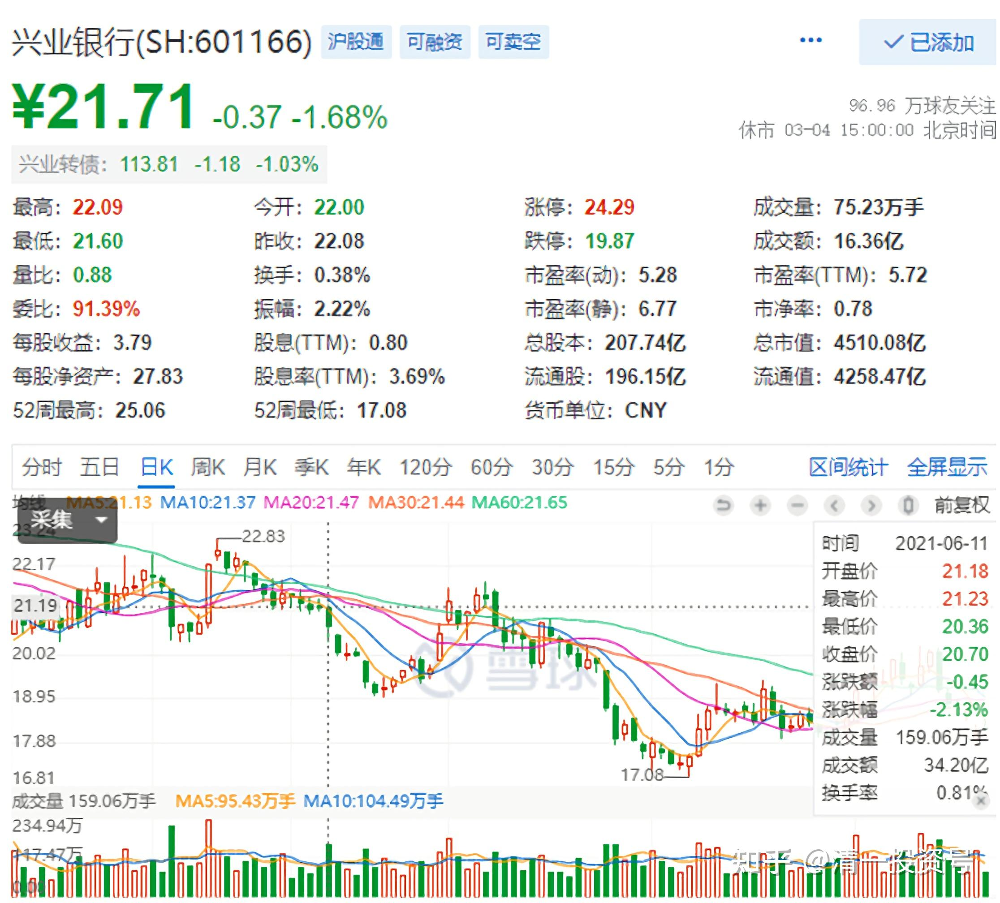
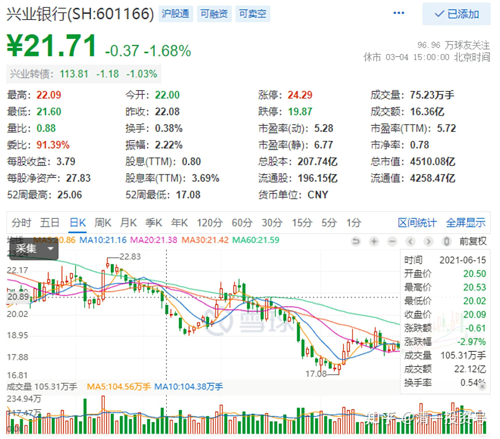
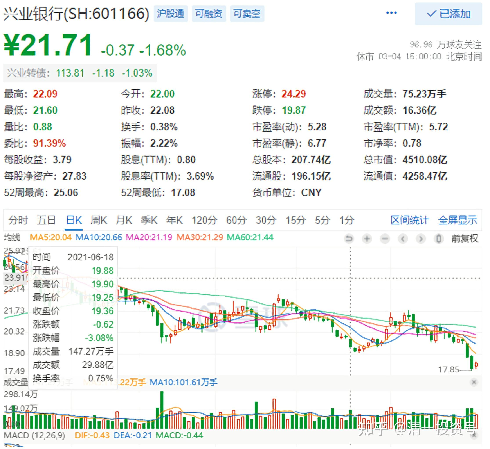
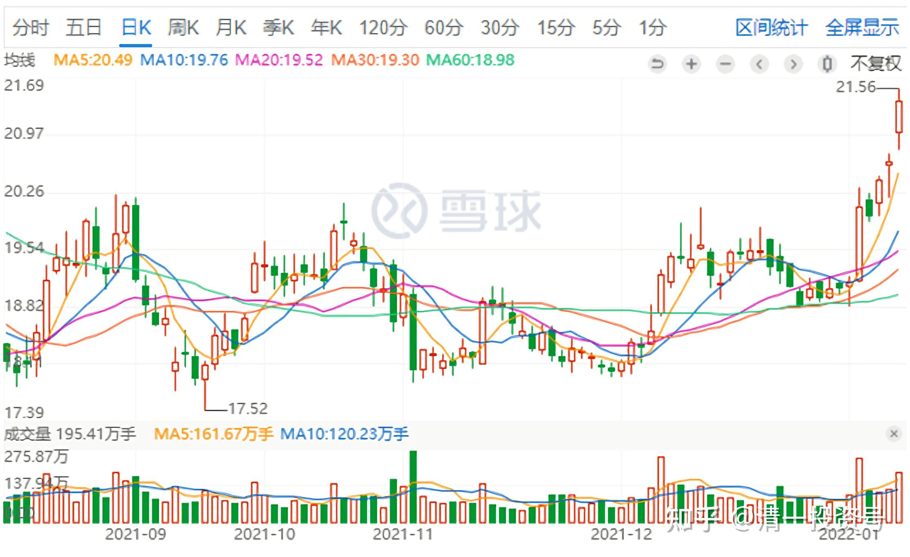

7篇.徘徊于历史最低PB估值附近的兴业银行

——时隔近四年再次买入的实操分析

清一山长2020年6月12日～2021年12月28日

**一、多事之秋，看不懂就多看，宁可错过，不可跟错**

[清一山长2020-06-12 12:40:03](http://link.zhihu.com/?target=http%3A//xueqiu.com/9310099567/151438971)

$兴业银行(SH601166)$这个价（15元多），真想买兴业。自从2018年初，19元多卖掉兴业后，就一直想拿回来，**现在价位已经回到了理想的低位**（估值只相当于20218年的10元多，因为这两年，兴业已经多赚了6元多的利润）。

如果现在我要买银行股的话，现价的兴业是首选。虽然现价的民生也不错，但就是不敢下手买，原来持有的一部分，也不想卖掉，真纠结。现在腾出来的资金，只敢大量买入中国建筑。**原因就是我担心下半年世界经济全面萧条，银行是百业之母，难免被波及。**兴业能够一枝独秀吗？能逃过未来经济萧条的打击吗？**金融一旦发生海啸，银行是受冲击最大的。**但中建这样的公司，应该业绩基本稳定，不会有太太的影响。现在，找到一个稳增长的股太难了。

还是等9月份以后吧！再考虑是否与银行握手。昨天几乎把泰国银行股卖光了，获利34%。现在静静的，拿着资金等外围的坏消息。

[清一山长 2020-06-12 15:17:17](http://link.zhihu.com/?target=http%3A//xueqiu.com/9310099567/151454211)

$兴业银行(SH601166)$银行股，一单直接拉25个价位，还真是稀奇。最后一笔成交1310万股，大约两个亿的资金买入。操盘手真牛！是不是上面有啥指令？

[清一山长2020-06-12 15:27:04](http://link.zhihu.com/?target=http%3A//xueqiu.com/9310099567/151455181)

$工商银行(SH601398)$最后一单7100万股，下杀10个价位，兴业是两个亿拉涨25个价位，的确很怪异的走势。如果看K线图，不知道今天的盘面，就是一根上吊线。今天的资金实际上是一直在买入的，但K线判断会是卖出的。难道又是想要释放什么信息？散户快走吗？留图为证吧！

肖尔克回复清一山长:

上一波兴业从十五六块涨到十九块多，看到山长抛出时的贴子了。佩服山长对市场的理解，这是多年观察市场形成的判断能力，还是基于某种性格或天赋才能做到这一点呢？

[清一山长2020-06-12 15:47:36](http://link.zhihu.com/?target=http%3A//xueqiu.com/9310099567/151456940)回复肖尔克:

是“天赋”，老天给的赏钱[大笑]。我是运气好而已。当时持有2M多的兴业，因为就它不涨，低位一直买或者换的。前一天美股大跌，全球恐慌。兴业却意外突起上涨，大涨两天，冲20元。物怪则妖，想不清楚的话，远离妖股更安全。我记得想清楚道理之后，已经是尾盘了。赶快挂单跑，一单就挂了一百万股。我认为肯定卖不掉了，没想到一单就吃掉了。说明是主力做市的，绝非正常交易。不久后就跌到13～14元。

**没想到美股可以延续牛到今天，两年之后又来一批大跌。现在依然不是追涨的时候**，兴业今天再次尾盘表现了一把。**不过是低位，风险不大。持有的可以继续持有，**今天没奖金，跑路了未必接得回来。后市涨跌不好说，我认为应该会跌。

[清一山长2020-08-20 21:35:22](http://link.zhihu.com/?target=http%3A//xueqiu.com/9310099567/157181669)

$兴业银行(SH601166)$四天前扬眉吐气的大涨，成交42亿。银粉兴奋大叫，毕竟是牛市来了……看好的慌慌张张地抢进来。结果是连跌三天，完全地跌回原地，吐出全部涨幅。感觉很怪异，似乎有一只无形的手在操控银行股，但不像是要做拉升前的准备，倒是像在吸引跟风盘，把资金吸走一样。

*（2020年8月兴业银行日K线）*

**多事之秋，看不懂就多看。我一直很喜欢兴业，“老情人”了。想重新买回来，却一直没动。原因就是没看懂未来，只能等机会了。**假如秋冬季有二次疫情，兴业，银行股会怎样？会不会跌我不知道。但我知道，这种预期不良的情况下，起码是不会涨的。所以，如果涨了我就看着，不会追的，手上假如有货，我还会卖掉一点。**宁可错过，不可跟错。**

二、越来越多人已经发现兴业的好，所以跌不下去了

[清一山长2020-10-08 10:11:22](http://link.zhihu.com/?target=http%3A//xueqiu.com/9310099567/160510963)

$兴业银行(SH601166)$**兴业银行在历史最低PB估值附近徘徊，比2013年启动之前的估值还低。**这几年，硬是靠每年的盈利勉强拉动了股价没跌。算是只有【戴维斯单杀】——杀估值。假如遭到双杀，不知道会有多惨。未来如果兴业的业绩能够维持，双击时刻应该会到来。我就等美股崩了，再介入吧！避免黑天鹅。

[清一山长2020-10-10 11:20:23](http://link.zhihu.com/?target=http%3A//xueqiu.com/9310099567/160628651)

$兴业银行(SH601166)$我看大家都在吐槽兴业不好。出来说兴业好的人邢台草帽被很多人喷。我基本赞成他的观点：**兴业的进步的确是很大的，而且很多人是看不懂兴业与其他银行的不同之处的（包括我在内）[**滴汗]。其实我认为银行要真的弄懂很难，很多支行长也未必懂银行（我的不少同学，就在各家银行当高管），他们只是按照程序在工作罢了。我很佩服草帽的研究，能够做到这个地步，发现了兴业的不同一般之处。真的很深入了。我们不提到底兴业是不是最优秀的银行这一点。有争议很正常，因为每个人的标准不一样。有人就认为股价最高的就是好银行。就像是价格最高的酒，就一定是好酒。

的确兴业走势，跟招商银行比起来，是差了不少。但是跟浦发、民生相比，原来的股份制“四大行"，兴业今年走势，已经算是很强了，没涨，但是很抗跌，比我想象的更抗跌。我认为这已经说明了一点什么的。**也许真的是越来越多人已经发现兴业的好，所以跌不下去了。**看浦发、民生，跌得都快认不出来了。

**[清一山长](http://link.zhihu.com/?target=https%3A//xueqiu.com/9310099567)**[2020-11-30 15:56](http://link.zhihu.com/?target=https%3A//xueqiu.com/9310099567/164548663)回复[HIS1963](http://link.zhihu.com/?target=http%3A//xueqiu.com/n/HIS1963):

其实，上交易日，我跟你一样的。兴业银行是我的爱股，虽然我是两年前，19元多卖掉的，但一直想重新买回来。昨天一看飞了？挺失落的。以为我的投资模型错了。只是我动作慢，没当日追进。上个交易日忙着买惠泉。今天看，更是没机会。**兴业有再度称王的迹象。**

今天下午回落了，心想：银行股，应该还会给我上车的机会的，耐心一点就行[笑]。

*（2020年11月30日兴业银行日K线）*

[HIS1963](http://link.zhihu.com/?target=http%3A//xueqiu.com/n/HIS1963)回复[清一山长](http://link.zhihu.com/?target=http%3A//xueqiu.com/n/%25E6%25B8%2585%25E4%25B8%2580%25E5%25B1%25B1%25E9%2595%25BF):

大仙这个解读到位[很赞][很赞]。

**三、三年来每股多了8-9元的盈利，居然价格没涨**

**[清一山长](http://link.zhihu.com/?target=https%3A//xueqiu.com/9310099567)**[2021-01-05 16:52](http://link.zhihu.com/?target=https%3A//xueqiu.com/9310099567/167688720)

[$兴业银行(SH601166)$](http://link.zhihu.com/?target=http%3A//xueqiu.com/S/SH601166)这两天放量下跌。有点纳闷。虽然我没有拿兴业，但真心为兴业粉感到忧伤，因为我也是兴业的老粉。真心觉得：银行股，都跌到看不懂了。跌到这估值，基本就是说：“中国不行了。不然就不会给这个估值！”

其实兴业还算是好的，四大行，几乎跌到疫情底了。这一年，白做了吗？中国难道比疫情发生恐慌的时候还差吗？

**[清一山长](http://link.zhihu.com/?target=https%3A//xueqiu.com/9310099567)**[2021-06-11 15:33](http://link.zhihu.com/?target=https%3A//xueqiu.com/9310099567/182549785)

[$兴业银行(SH601166)$](http://link.zhihu.com/?target=http%3A//xueqiu.com/S/SH601166)看这图形，我的感觉，是银行今年下半年该涨了,所以现在要先跌一跌。留贴等下半年验证吧！现在跌得真没道理。

**[清一山长](http://link.zhihu.com/?target=https%3A//xueqiu.com/9310099567)**[2021-06-15 14:47](http://link.zhihu.com/?target=https%3A//xueqiu.com/9310099567/183044120)

[$兴业银行(SH601166)$](http://link.zhihu.com/?target=http%3A//xueqiu.com/S/SH601166)兴业银行也能这样跌的？才20元出头了？我开始眼热了。

**[清一山长](http://link.zhihu.com/?target=https%3A//xueqiu.com/9310099567)**[2021-06-18 14:07](http://link.zhihu.com/?target=https%3A//xueqiu.com/9310099567/183708380)

[$兴业银行(SH601166)$](http://link.zhihu.com/?target=http%3A//xueqiu.com/S/SH601166)今天才半天多一点时间，就23亿的卖压。从走势上看，是一路向下。连个像样的盘中反弹都没有。持有的人，心情应该够沉重的。实在弄不清楚为啥会有这种强力的卖压，难道真的是五穷六绝吗？也许7月会翻身？

目前还没有买进，继续观察中。但口袋里面的钱，已经有点按捺不住的想要拥抱兴业了。**只是从趋势上看，还没有止跌的迹象。所以继续观察中。也许可以以2018年年初我抛掉的价格买回来？这样我就大赚了----赚了这三年的利润呢！每股多了8～9元的盈利，居然价格没涨。实在是感恩！**

**四、如果未来银行涨了，兴业有可能涨的最多**

清一山长2021-12-27

自2018年年初，我19元多卖出之后，今天重新买入了兴业银行。快四年来，兴业银行多赚了12元的利润，今天才卖18元多的价格，不买有点不好意思。对不起这个价。燕京啤酒不能买了，中国建筑也早买成了重仓，看看账上还有钱，就配一点兴业银行吧！我判断明天肯定涨。因为：今天是转债配债的时点。很多持有者不得不卖出兴业来配债。这两天跌就是因为这原因。估计转债上市之后，就会涨上去了。**这种确定性很强的股，买进来长期持有，是不吃亏。**

**【价值分析——有可能未来兴业银行是比招商银行更火的银行】**。它的高管认为：兴业是银行业的第一。我觉得：吹是吹了一点。但：万一是真的呢？就像今日学堂的高管，自己吹自己是新教育第一。吹是吹了一点，但万一是真的呢？[憨笑]**所以我不希望失去这个有可能第一的股票。**当年持有它超过200万股，为我赚过8位数的利润，现在起码把赚到的利润部分买回来，零成本持有吧？有钱再继续加仓。

**实际上，我已经发现：现在银行普跌，但它已经不太跌了。**你们去看看其他银行，都跌得不能看了。包括四大在内。**所以，有可能他吹的有道理。如果未来银行涨了，它有可能涨得最多。**

*（2021年12月27日兴业银行日K线）*

清一山长2021-12-28 10:33

昨天兴业银行套利成功。今天每股赚了0.29元。加起来总额“赚”到十几万元了，如果是短期投机资金，就可以找个机会卖掉走人，一天就有此收益很不错了—年化收益率超过500%了[憨笑]。**不过，由于正股很不错，买价低，我现在还不准备退出。**所以就继续跟随它随波逐流好了。

这次套利的原理：昨天配转债，很多持有者是没钱的，只能卖出正股来筹钱买转债。因为转债破发的可能并不大，所以是一笔超过5%收益空间的确定性的收益，所以如果跌一点卖出正股配配债是划算的。转债上市后，这些人大多数会卖掉转债收回正股的。正股涨了就有一定的风险了。所以，也有一些人是有钱也不配债，直接趁低价，增持正股，也算是一个短期收入。如果各位很熟悉金融市场的话，到处都是机会，每年随便找个机会稳稳的投一点机（投机需要的知识量比投资更多）。赚一点投机费，就足够生活了。感谢这个伟大的时代，可以让我可以只用动动键盘，就比很多天天动手的人赚得更多，更安全。[憨笑]

参考链接：

[清一投资号：1篇.银行股的投资逻辑](https://zhuanlan.zhihu.com/p/489850963)（整理文）

[清一投资号：3篇.2015年银行股投资回顾——“价值投机法”之示范（上）](https://zhuanlan.zhihu.com/p/502367347)（整理文）

[清一投资号：4篇.2015年银行股投资回顾——“价值投机法”之示范（下）](https://zhuanlan.zhihu.com/p/506271066)（整理文）

[清一投资号：5篇.价值投机派的投资思路与心态——兴业银行的实操分析](https://zhuanlan.zhihu.com/p/509443218)（整理文）

[清一投资号：6篇.买入农业银行（H股）、中国银行（H股）的投资逻辑](https://zhuanlan.zhihu.com/p/513108169)（整理文）

[清一投资号：7篇.“价值派”VS“价值股基础上的投机者”](https://zhuanlan.zhihu.com/p/516669132)（整理文）

