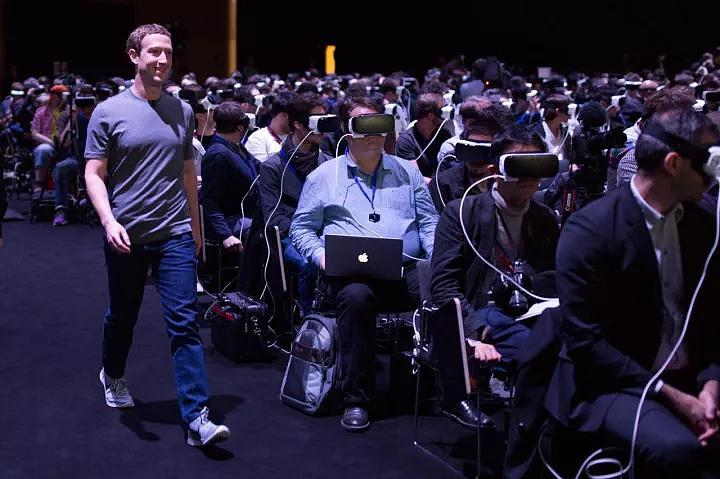
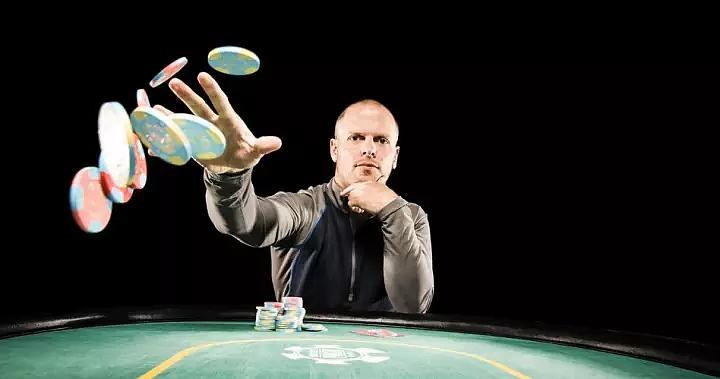
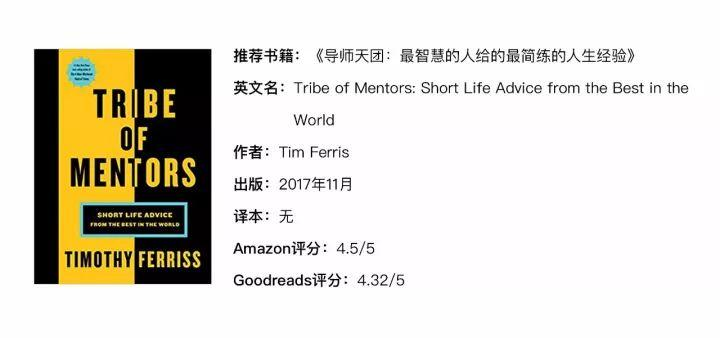
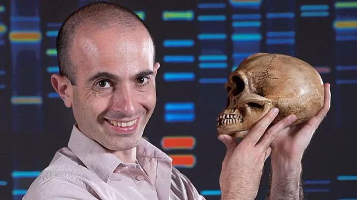
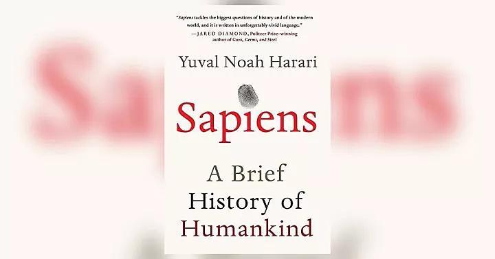
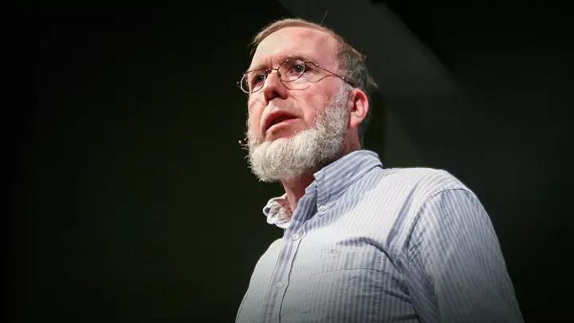
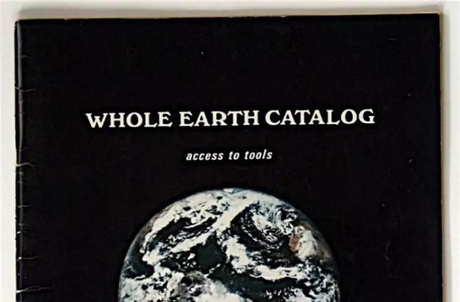
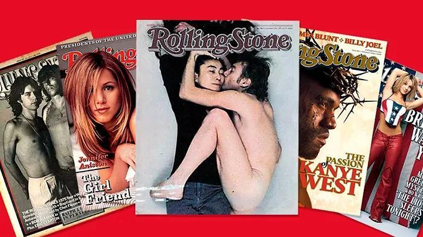

**原专栏19篇.向巨人学习——再穷也要站在富人堆里，再笨也要跟聪明人在一起！**

清一山长 2018年1月16日

**我的财富二年级的课前作业：**

我们放慢一点自己学习的脚步，继续消化今天的主题：不仅仅看中国人的思维，我们也去理解一下世界人的思维。我们试图好好去理解一下这个世界上一些不同寻常的高人，他们在想什么？请你们试图进入作者的世界，根据作者的回答，去理解他们的核心价值观，并学着去提出一个深度思考的问题。

范例：

当然，这不是看本书和听个报告就能学习的东西，现在的教育体系，是从 19 世纪的工业革命衍生而来的，早就破产了。但是不幸的是，到目前为止我们还没有创造出来一种新的选择。（**示范和例子，作者的“破产了”是什么意思？我们对此可以做点什么？**）

别太相信那些成年人。这个世界变化太快，过往的具体经验已经不太管用了。同样的，别太相信技术了，你得让技术服务于你，而不是成为技术的奴隶。（**我们不能相信上一辈人的经验，也不能相信现在的技术，那么，我们应该相信什么呢？这种观念会出现什么样的人类？**）

在 21 世纪，“了解你自己（Know yourself）”是非常必要的。我们已经不再生活在一个“入侵电脑（Hack computers）”的年代了，我们生活在一个“入侵人类（Hack humans）”的年代。想想，谷歌、脸书、亚马逊，他们声称比你自己还懂你自己。

而你只有充分了解自己，才能不受他们的摆布。**（为什么我们不了解自己，就会受到这些公司的摆布？你认为有何途径去摆脱这些控制？）**

所以，如果你还想继续这个游戏，就必须跑得比谷歌还快，加油吧！**（谷歌是全世界最聪明的人，我们凭什么比他们跑得更快？）**

你人生中做过的最值当的投资是什么？

到现在为之，我最值当的投资是参加了一个为期十天的内观冥想（Vipassana Meditation）。

我认为我通过观察自己的感觉，了解了更多有关于我自己、关于人类的事情。我不需要接受任何故事、任何理论，我只需要观察现实发生的事情即可。最重要的事情是，我发现了痛苦最深层次的来源就是我们的内心。（“**痛苦的最深层次的来源，就是我们的内心**”**，我们怎样才能避免这种痛苦？**）

没有这次冥想练习教会我的专注和清净，我不可能写出《人类简史》和《未来简史》。

如果你觉得自己有点要垮了，或者不能集中注意力，你会做什么？

我花几秒钟或者几分钟观察我的呼吸。

**上面我在括弧中写出来的问题，让大家今晚用讨论和思考的模式来回答，你也可以用文字写出来回答。**

**下面的内容，要求你学习我的模式，自己写问题，自己回答。看看你是否有思考的能力！**

**转载：[雷·达里奥、赫拉利、凯文·凯利是怎样炼成的，133 位顶尖大师的人生进阶宝典](http://link.zhihu.com/?target=https%3A//mp.weixin.qq.com/s%3F__biz%3DMzI1MDY2ODIxNg%3D%3D%26mid%3D2247484835%26idx%3D1%26sn%3Db3b8641300b5b60a368bd4be26bf2447%26chksm%3De9fff074de887962014d40bf2ec50a3e8b175303672aeb4ef5394f6bd3ff054d7c640aac89c9%26scene%3D38%2522%2520%255Cl%2520%2522wechat_redirect)[https://mp.weixin.qq.com/s?__biz=MzI1MDY2ODIxNg==&mid=2247484835&idx=1&sn=b3b8641300b5b60a368bd4be26bf2447&chksm=e9fff074de887962014d40bf2ec50a3e8b175303672aeb4ef5394f6bd3ff054d7c640aac89c9&scene=38](http://link.zhihu.com/?target=https%3A//mp.weixin.qq.com/s%3F__biz%3DMzI1MDY2ODIxNg%3D%3D%26mid%3D2247484835%26idx%3D1%26sn%3Db3b8641300b5b60a368bd4be26bf2447%26chksm%3De9fff074de887962014d40bf2ec50a3e8b175303672aeb4ef5394f6bd3ff054d7c640aac89c9%26scene%3D38)**

（吴显昆2017年11月29日）

**向巨人学习**

在这个世界上，智慧的载体有很多，书籍、演讲、视频等等。**而从本质上来说，不管哪一种学习形式，其内核都是一样的——向牛逼的人学习。**

马克·吐温曾经说过这么一句名言，**“历史不会重演，但有其韵律（History may not repeat itself, but it does rhyme）”**，这句话不仅从宏观角度告诉我们事物的发展是有规律的，而且也说明了，我们每个人所遇到的问题，虽然从细节上来说不尽相同，但往往造成困难的原因却是一致的。

因此，我们可以向“过来人”学习经验，直接了解形成问题的原因是什么，从而节省大量的时间。中国也有一句俗语，叫做“不听长者言，吃亏在眼前”，当然，年龄不能代表一切，所以，“不听智者言，吃亏在眼前”，是更正确的形式。

我常常羡慕那些可以同世界上最伟大人物对话的主持人，羡慕他们可以直接通过对话感受伟大人物的智慧，学习他们的人生经验。如果“神灯”能够满足我一个愿望，抛开“立刻成为世界上首富”这种完全不切实际的愿望，我希望能够让我挑选世界上 100 个聪明的大脑，让我跟他们每个人谈上一个小时。

但是另外一个问题接踵而至：如何问出正确的问题？

**因为面对聪明的大脑，如果你问出来是非常低级的问题，那么其实就是浪费了他们的智慧。**

比如，如果问比尔·盖茨“你认为山东煎饼和保定驴肉火烧，哪个更好吃”这种问题，那是没法从中窥见他的人生智慧的。而且就算你知道了他对于两者的评价，你也不会因此改变你的口味、喜好。

所以，“问出正确的问题”就显得尤为重要了。其实问问题这件事不比得出答案要简单，从某种意义上来说，“如何问问题”本身就是一个难倒一大批人的问题了。

不过幸好我们有**蒂姆·费里斯（Tim Ferris）**。

谁是蒂姆·费里斯？他是美国著名的畅销书作家、天使投资人、连续创业者。作为天使投资人，他是 Twitter、Facebook 等一流企业的早期投资人。作为畅销书作家，他的几部作品《巨人的工具》、《每周工作四小时》，每一本都在美国卖到脱销。包括我们今天将要介绍的这本 11 月 21 日出版的新书**《导师天团（Tribe of Mentors）》**，甚至上市前一个月就已经冲到了亚马逊商业类书籍预售的第一名。

**在这本书里，费里斯精心准备了 11 个问题，收集了 133 位世界级智者的回答。**然后把他们的答案集结成册，形成了这本《导师天团》。

我们来看看这本书里都有哪些大牛：**桥水基金的创始人雷·达里奥（Ray Dalio）、Facebook 的联合创始人达斯汀·莫斯科维兹（Dustin Moskovitz）、以太坊（Ethereum）创始人维塔利克·布特林（Vitalik Buterin）、《人类简史》作者尤瓦尔·赫拉利（Yuval Noah Harari）等等。**

这本书在美国亚马逊上的售价是 16.99 美元，大概是 110 多元人民币。这本书贵吗？我觉得一点都不贵。如果通过国内专门用来约大牛请教问题的平台“在行”的价格，请这种级别的智者跟你谈一小时，恐怕没有几十万是不行的。况且，你还约不到。

在这本《导师天团》里，费里斯不仅为你拟好了问题，并且整理好了 100 多位世界顶级聪明人的所有回答。面对这本书，我想你最明智的举动就应该是买一本来看一看。

**学会正确的提问**

**问问题是一门哲学，因为发现问题有时候比解决问题更难。**不妨我们先来看看蒂姆·费里斯所拟出的这 11 个问题：

1. 哪一（些）本是你最经常用来送人的书？为什么？对你人生影响最大的书是哪几本？

2. 最近 6 个月里，你购买的对你影响最大的 100 美元以下的商品是什么？

3. 一次失败如何影响你未来的成功的？你是否有“你最喜欢的失败经历”？

4. 如果你有一块巨大的广告牌，你会在上面写什么？

5. 你人生中最值当的投资是什么？

6. 你有什么不寻常或者奇怪的习惯吗？

7. 在最近的五年里，哪些信仰、理念、行为或者习惯改善了你的生活？

8. 对那些聪明有抱负的大学生，你有什么帮助他们进入“真实世界”的建议要给出吗？

9. 在你的专业领域里，你听到过哪些不太好的推荐？

10. 在最近的五年里，你因为拒绝了什么而让你变得更好？对你有什么启发？

11. 如果你觉得自己有点要垮了，或者不能集中注意力，你会做什么？

作者在书中说，“问问题”甚至可以说是一个非常重要的“社交手段”。如果你想建立一个有质量的社交圈，那么维持互动是必不可少的。

**如何才能维持和智者的社交关系？问问题，问有质量的问题，也许似乎是最好的方法之一。**

蒂姆·费里斯在每一个问题上都下了巨大的功夫进行调整。比如说，在第一个问题里，你也许可以看出这就是“你最喜欢的一本书”这个问题的变体，但是为什么作者的提问方式更好？因为作者提供了一个场景，送书，一个具体的场景能够帮助回答者更快地想出答案。而你愿意送给别人的书，恰恰也代表了你的价值观和人生观。

不仅如此，作者甚至在调整问题的顺序上都花了很大的功夫，**他认为，如果好问题用错误的顺序出现，仍然不能达到理想的效果。**就这些问题而言，他知道他索要答案的对象都很忙，如果把“如果你有一块巨大的告示牌，你会在上面写什么”这种需要经过大量思考的问题放在最前面，那么一开始就会把回答者吓走。所以从书籍的问题入手，能够提高这些问题获得回复的概率。

因此，正确的提问，是一种绝对不能忽视的重要能力。

**巨人的回应**

那么，接下来我们就来看看这些世界级的顶级智者是怎么样回答这些问题的。

**1. 雷·达里奥（Ray Dalio）**

雷·达里奥是世界上最大的对冲基金“桥水基金（Bridgewater Associates）”的创始人，身家超过 170 亿美元，近期出版的新书《原则》产生了全世界范围内的广泛影响。

哪一（些）本是你最经常用来送人的书？为什么？对你人生影响最大的书是哪几本？

对我影响最大的三本书分别是：《千面英雄（The Hero with a Thousand Faces）》《历史的教训（Lessons of History）》《伊甸园之河（Rive out of Eden）》。

最近 6 个月里，你购买的对你影响最大的 100 美元以下的商品是什么？

一个口袋记事本，当我有灵感有想法的时候我能随时把它记下来。

一次失败如何影响你未来的成功的？你是否有“你最喜欢的失败经历”？

**最痛苦的失败也是最好的老师，因为痛苦让我成长和改变。**我最喜欢的失败发生在 1982 年，那一年我在《一周华尔街（Wall Street Week）》节目里预言接下来一段时间会出现大萧条，结果，大牛市来了。

如果你有一块巨大的广告牌，你会在上面写什么？

“**当你的心智极度开放的时候，你才能学会独立思考**”

你人生中做过的最值当的投资是什么？

学习**冥想**。我非常诚心地练习**超越冥想**（Transcendental Meditation），偶尔也试试其它冥想方法。

你有什么不寻常或者奇怪的习惯吗？

喜欢沉浸在自己痛苦的错误中受虐，甚至我会把想到的东西都写下来。我甚至做了一个 iPad 上的应用来帮助人们反思错误，我叫它“痛苦按钮（Pain Button）”

对那些聪明有抱负的大学生，你有什么帮助他们进入“真实世界”的建议吗？

正视你所不知道的事、你的错误、你的弱点，对这些东西的理解会成就你的人生。

在你的专业领域里，你听到过哪些不太好的推荐？

投资那些市场欢迎的东西。从另一方面来说，当有的人说：“因为他们做得好，所以要投资他们”，你应该想想：“小心，他们的价格或许已经太贵了”。

如果你觉得自己有点要垮了或者不能集中注意力，你会做什么？

我冥想。

**2. 尤瓦尔·赫拉利（Yuval Noah Harari）**

尤瓦尔·赫拉利是《人类简史》和《未来简史》的作者，牛津大学博士，耶路撒冷希伯来大学教授。

哪一（些）本是你最经常用来送人的书？为什么？对你人生影响最大的书是哪几本？

阿道司·赫胥黎（Aldous Huxley）的《美丽新世界（Brave New World）》。我认为这是二十世纪最有先见性的一本书，也是在西方现代哲学体系里对于“快乐”最深入的讨论。可以说，《美丽新世界》重塑了我对历史的理解。

**我们现在的消费社会，实际上完全应验了赫胥黎的预言。**快乐成了至高无上的价值取向，我们甚至用生物科学、社会工程学去保障我们可以达到最高层次的满足和享受。如果你对此没有感到任何异常，那么你就需要去读一读这本《美丽新世界》了。

你有什么不寻常或者奇怪的习惯吗？

乘电梯或者扶梯的时候，我喜欢用脚尖站立。

一次失败如何影响你未来的成功的？你是否有“你最喜欢的失败经历”？

《人类简史》在以色列出版以后很受欢迎。然而，我在试图把这本书翻译成英文出版时，却收到了一封又一封的拒绝信。后来我试图在亚马逊用“自出版”的方式来推出英文版的《人类简史》，结果只卖出几百册，而且印刷装帧质量都很差。

结果我的丈夫（对，没错，赫拉利是 Gay）帮了我的大忙，比起我，他在商业方面要擅长得多。他先是帮我雇佣了一个出色的编辑，然后帮我找到了一个小出版社，最终我的英文版《人类简史》得以出版，然后风靡了全世界。

**如果没有最一开始的失败，我就不会认识到我能力的局限性，也不会真正知道扬长避短的意义。**

对那些聪明的、有抱负的大学生，你有什么帮助他们进入“真实世界”的建议吗？

没有任何人知道 2040 年的就业市场具体会是什么样的，也许，我们现在在学校里学的东西会与那时候的世界完全不相干。

所以，你应该专注于什么呢？**我的建议是专注于提升适应能力（Personal intelligence）和情商（Emotional Intelligence）。**

当然，这不是看本书和听个报告就能学习的东西，**现在的教育体系，是从十九世纪的工业革命衍生而来的，早就破产了。但是不幸的是，到目前为止我们还没有创造出来一种新的选择。**

别太相信那些成年人。这个世界变化太快，过往的具体经验已经不太管用了。同样的，别太相信技术了，**你得让技术服务于你，而不是成为技术的奴隶。**

在二十一世纪，“了解你自己（Know yourself）”是非常必要的。我们已经不再生活在一个“入侵电脑（Hack computers）”的年代了，我们生活在一个“入侵人类（Hack humans）”的年代。想想，谷歌、脸书、亚马逊，他们声称比你自己还懂你自己。

**而你只有充分了解自己，才能不受他们的摆布。**

所以，如果你还想继续这个游戏，就必须跑得比谷歌还快，加油吧！

你人生中做过的最值当的投资是什么？

到现在为之，我最值当的投资是参加了一个为期十天的内观冥想（Vipassana Meditation）。

我认为我通过观察自己的感觉，了解了更多有关于我自己、关于人类的事情。我不需要接受任何故事、任何理论，我只需要观察现实发生的事情即可。最重要的事情是，我发现了痛苦最深层次的来源就是我们的内心。

没有这次冥想练习教会我的专注和清净，我不可能写出《人类简史》和《未来简史》。

如果你觉得自己有点要垮了或者不能集中注意力，你会做什么？

我花几秒钟或者几分钟观察我的呼吸。

**3. 凯文·凯利（Kevin Kelly）**

凯文·凯利是世界著名的“未来学家”，《连线》杂志的主编。《失控》和《必然》等畅销书作者。

哪一（些）本是你最经常用来送人的书？为什么？对你人生影响最大的书是哪几本？

《童年的终结（Childhood’s End）》。作为一个上世纪五十年代末六十年代初长大的孩子，我没有电视和互联网，而这本科幻小说打开了我的世界，它启发了我对科学的兴趣，让我学会尊重想象力。

《全球概览（The Whole Earth Catalog）》。当我 17 岁的时候，这本书让我们明白，我可以有自己的想法，制造我自己的工具，不加掩饰地爱我所爱。我用这本书创造了我的生命。

《源泉（The Fountainhead）》。我在大学最后一年沉迷这本书，然后我辍学了，再也没回去，这可能是我生命中的最佳决定。

《草叶集（Leaves of Grass）》。读完这本书以后，我产生了不可抑制的旅行冲动。我带着这本书去了亚洲，我花了八年时间在那里漫游。可以说，这本书就是我的大学。

《我体验真理的故事（The Story of My Experiment with Truth）》。这本甘地的自传把我引向了上帝。他真诚的姿态也感染了我，启发了我，让我的精神获得觉醒。

最近 6 个月里，你购买的对你影响最大的 100 美元以下的商品是什么？

我买了一个 1Password 的家庭计划服务，这样我可以方便地与我信任的人共享密码。

你人生中做过的最值当的投资是什么？

200 美元的一次商业经历。那时候我从《滚石（Rolling Stone）》杂志的上买了一个广告位，出售我的旅行指南。但如果没有足够的订单，那么这一次团购就没办法完成，我就得把钱全都退回去。幸好，我一步步地完成了这件事。比起上一次让我负债累累的 MBA 课程，这次经历让我学到了更多。

在最近的五年里，你因为拒绝了什么而让你变得更好？对你有什么启发？

每次我判定一个邀请我应不应该接受的方法都是，我会想，如果这个事儿明天就得办，我会不会接受呢？**显而易见，你很容易答应 6 个月以后要做的事情，但是如果一件事明天就得办，你只会答应那些特别特别牛逼的邀请。**

在最近的五年里，哪些信仰、理念、行为或者习惯改善了你的生活？

我拒绝做那些其他人也能做到的事情，即使我很享受做这件事，或者报酬很高。**最终，我只干了那件只有我才能做的事情，这让我成了无价之宝。**

对那些聪明有抱负的大学生，你有什么帮助他们进入“真实世界”的建议？

不要试图找到你的激情所在，也没必要做你感兴趣的事情，而是**要熟练掌握那些别人觉得有价值的技能或者知识。你不必喜欢上它，你只需要做到最好就行。**

**一旦你在这个领域成为大师，你就会发现有很多机会转向去做你喜欢做的事情。如果你持续完善你的技能，总有一天你会发现你的激情所在。**

**反过来倒不一定能行。**

**4. 维塔利克·布特林（Vitalik Buterin）**

维塔利克·布特林，“以太坊（Ethereum）”的创始人。他拥有 55 万枚以太币（一种虚拟货币），按照以太币近期的价格，他的资产高达 16 亿人民币。

维塔利克·布特林是本文介绍的最后一个“导师”。之所以选择他，原因很简单，因为布特林是所有导师中年纪最小的一个，他 1994 年出生，今年才 23 岁。

我们从不应该以年龄判定智慧，布特林也许有其他长者所没有的视角。

在最近的五年里，哪些信仰、理念、行为或者习惯改善了你的生活？

过去五年我学到最多的是如何向别人传达自己的观点和信念。一个年轻领导者常犯的错误是，他常常会和最后一个谈话者达成一致——这意味着他的观点一直在受别人影响。

有一个简单的方法可以帮助你解决这个问题。如果有人跟你说 A 是对的，那么问问你自己，如果 A 实际上是错的，他会怎么说？如果 A 实际上是对的，他又会怎么说？如果你给自己的回答是，“他的说辞都一样”，那么他的话对你来说就毫无价值。

最近 6 个月里，你购买的对你影响最大的 100 美元以下的商品是什么？

一个舒服的大容量旅行包。我用它装下我所有必需要装的东西（差不多 10 公斤），然后背着它坐飞机，这让我的旅行变得简易了很多。

你有什么不寻常或者奇怪的习惯吗？

我经常在飞机上看电影。不过我会看那些我正在学习的语言的电影，比如法语、德语和中文。

我只吃 90% 的黑巧克力。80% 太甜了，95% 太苦了；

**撸猫。**

在你的专业领域里，你听到过哪些不太好的推荐？

我还是给一些好的推荐吧！**变成一个跨界学习者**。拿我来说，我研究计算机、密码学、经济学、政治还有其它的一些社会科学，这些科学之间的交叉影响让我受益很多。

如果你觉得自己有点要垮了或者不能集中注意力，你会做什么？

这取决于是哪种“垮了”。一般来说，我会转移一下自己的注意力，也许散散步什么的。如果是因为某种技术问题，我可能会换个环境然后找一些新的启发。最难处理的是社交场合，在这种情况下，一定要注意，你的思维不要被最后一个你交谈的人，或者你花了最多时间的人带跑。你需要公正地评估一下，也许找个圈外人聊聊会有帮助。

好了，我们今天就介绍“导师天团”中的这四位。

你会很容易发现，面对同一个问题，即使在伟大的头脑之间，也会有不同的答案。原因很简单，很多问题其实不存在一个完全正确的答案，也没有人可以全知全能。

他们虽然对问题的具体回答不同，但是也存在一些可以抽离出来的共性：**专注于你要做的这件事，勇于主导你人生的每一天，同时别在同一件事上犯两次错，这样就行了。**

作者说，**“成功的秘诀，其实就在于别那么想赢（The Secret to winning any game lies in not trying too bad）”。**

你看，不论是年轻时花费很多时间来进行“看似无用的探索”，还是日常里花费时间在冥想上，**他们既努力工作，也敢于“浪费时间”**，而短视的机会主义者却无法获得长远的胜利。

不如，从看完这篇文章开始，回到开头，记录下这 11 个问题，针对你自己的情况进行改进，然后拿着它向你心中的智者提问，也许他们的回答会给你意想不到的启发。

**站在巨人的肩膀上，你一定会看得更远！**
