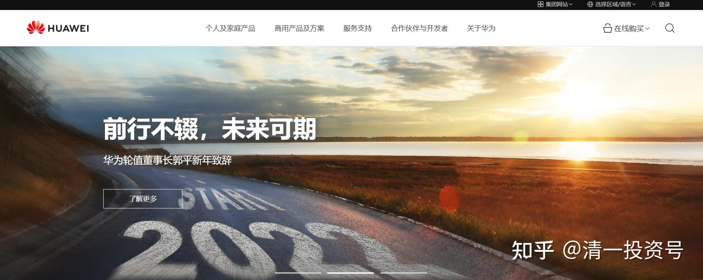

**原专栏52篇.今天大跌，源于华为被美国制裁！**

[清一山长](http://link.zhihu.com/?target=https%3A//xueqiu.com/9310099567/column)2019年5月17日

美国时间2019年4月12日，美国总统特朗普在华盛顿白宫发表“关于美国5G部署活动”的演讲。

演讲中，特朗普称：“5G竞赛已经开始，美国必须赢”。我相信他会不惜一切手段来做的。目的未必是看上去的这么“公正”。

今天，美国终于对华为出手了。中港股市应声大跌！

一年前，我就说：中美贸易战，不是简单的贸易争端问题，而是美国见不得中国的崛起！美国要打压中国，不愿意让中国超越美国，会不惜利用一切手段来打压的。别对贸易战结果有啥期待。

这种情况下，如果要选边站位，我依然只选中国赢。历史和现实，都说明中国人应该站起来了。美国人不想让位可以理解，但最终还是要让位。当然，这个过程会有一些艰苦和磨难的。最终一定是中国赢。

今天，美国宣布正式封杀华为，我觉得，这是华为的荣誉。一家企业，居然被世界最强的国家，视为心腹之患。这是企业的悲哀，更是企业的荣幸。也证明美国的虚弱----现在居然只能用这种政治手段，来强行限制企业的竞争，来跟中国对抗？说明美国的企业也太没底气了。

我很期待未来有一天，美国也会对中国的新教育“忌惮”和“封杀”，这将是今日学堂的荣誉。因为我们居然可以用三年就完成美国12年的教学内容。现在的中国，经济强了。未来的中国，需要在文化和教育上，也拥有世界级别的发言权。大家一起努力中！

下面转发海思的内部信件：十年面壁的海思。感谢有你！

华为是中国人的骄傲。我们作为一个普通的中国人，我们也不知道该做什么来帮助华为。就从身边做起，今后尽量不再买美国的产品，不买苹果，改用华为。我现在已经买了一个华为最新型号的手机（虽然很少用），外加一台笔记本电脑。

尊敬的海思全体同事们：

此刻，估计您已得知华为被列入美国商务部工业和安全局（BIS）的实体名单（entity list）。

**多年前，还是云淡风轻的季节，公司做出了极限生存的假设，预计有一天，所有美国的先进芯片和技术将不可获得，而华为仍将持续为客户服务。为了这个以为永远不会发生的假设，数千海思儿女，走上了科技史上最为悲壮的长征，为公司的生存打造“备胎”。数千个日夜中，我们星夜兼程，艰苦前行。华为的产品领域是如此广阔，所用技术与器件是如此多元，面对数以千计的科技难题，我们无数次失败过，困惑过，但是从来没有放弃过。**

**后来的年头里，当我们逐步走出迷茫，看到希望，又难免一丝丝失落和不甘，担心许多芯片永远不会被启用，成为一直压在保密柜里面的备胎。**

今天，命运的年轮转到这个极限而黑暗的时刻，超级大国毫不留情地中断全球合作的技术与产业体系，做出了最疯狂的决定，在毫无依据的条件下，把华为公司放入了实体名单。

**今天，是历史的选择，所有我们曾经打造的备胎，一夜之间全部转“正”！多年心血，在一夜之间兑现为公司对于客户持续服务的承诺。是的，这些努力，已经连成一片，挽狂澜于既**[\[1\]](https://zhuanlan.zhihu.com/write#_msocom_1) **倒，确保了公司大部分产品的战略安全，大部分产品的连续供应！今天，这个至暗的日子，是每一位海思的平凡儿女成为时代英雄的日子！**

华为立志，将数字世界带给每个人、每个家庭、每个组织，构建万物互联的智能世界，我们仍将如此。今后，为实现这一理想，我们不仅要保持开放创新，更要实现科技自立！今后的路，不会再有另一个十年来打造备胎然后再换胎了，缓冲区已经消失，每一个新产品一出生，将必须同步“科技自立”的方案。

**前路更为艰辛，我们将以勇气、智慧和毅力，在极限施压下挺直脊梁，奋力前行！滔天巨浪方显英雄本色，艰难困苦铸造诺亚方舟。**

　　何庭波

2019年5月17日凌晨
