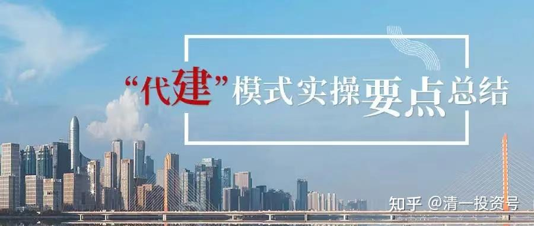

23篇.中国建筑系列之二十一：未来房地产往代建转移，中建绝对实力超群

清一山长2021年6月26日～7月8日

**导读：**

一、新模式下，国企央企优势明显

二、非洲草原旱季，活下来的央企享受丰厚利润

三、中建VS万科，谁的安全边际更高？

**正文：**

**一、新模式下，国企央企优势明显**

清一山长2021-06-26 11:04

$万科A(SZ000002)$很多人不知道：买房并不是一种最好的投资。因为变现很困难。其中一种后果，就是有价无市，你卖不出去。我十几年前买房，花了半年时间卖房，2014年4月才拿到钱，的确赚了很多倍。但是卖得真辛苦，14套房子，我以低于市场价10-15%出手，我卖了半年。不是没有人买，而是他们拿不到贷款，所以各种手续办下来，就非要半年才行。所以，后面我说：**买房投资很不靠谱。**现在，有几个人能一口气用自有资金跟你买房的？中国富人还没这么多。房地产是国家的重要财政收入。它会允许你来分一杯羹吗？才不呢！**将来万一房子难卖了，它有N多的手段，让你的房子烂在手里。**比如其中一招，就是：银行不贷款给你的二手房。这样，除非土豪，其他想买房的人，就只能去买开发商卖的新房了。这些新房，大约有70%的资金，是要流入国家的手里的。所以——你想去抢这碗饭吗？少少的还可以。卖的人多了，你看是啥结果。[大笑]

额度紧张、放款时间延长部分热点城市二手房“停贷”?

[https://www.bjnews.com.cn/detail/162462106614964.html](http://link.zhihu.com/?target=https%3A//www.bjnews.com.cn/detail/162462106614964.html)

我个人，还是把我最主要的资产，都放在股市上吧！我认为比买房产更靠谱。当然，如果我要房子，我就自己盖去。在泰国，我只要交7%的税金给政府，就可以自己盖房子了。所以，我发现我盖房子的价格，连土地费、装修费，以及房建费全部在内，还没有万科一套房子的装修费高（最近一个报道，万科在龙岗的一个楼盘，价格是8.26万元+5000元装修费/平方）。所以，**你傻才买房呢！我聪明，我就自己盖房。剩下来的钱，我买股不行吗？**[大笑]

正萁回复清一山长:（评论上贴）

看到一条信息，高层对房价最新看法：

1、地产行业将从市场经济转变成计划经济，国企央企为主，民企基本死掉；

2、地产商转变成代建商，毛利10%以下净利润1-2%；

3、逐渐收紧热点地区房贷发放直到全部停掉二手房信贷，逼大家买新房，关闭二手房流动性。

清一山长2021-06-28 22:58回复正萁:

这信息，我认为基本可靠，因为特别符合国家利益[笑]。这样玩的话，中国建筑这样的公司，优势就大了，代建绝对实力超群。

**二、非洲草原旱季，活下来的央企享受丰厚利润**

锦缎研究院2021-06-29 20:48

万科在“等鱼断气”？

原文链接：[https://xueqiu.com/6217310837/187715333](http://link.zhihu.com/?target=https%3A//xueqiu.com/6217310837/187715333)

清一山长2021-06-29 20:32评论上贴：

这个文章思路有新意，让我明白为啥不赚钱地产公司也拼命杀进去买地。

不过利好的明显是实力雄厚，银行利率超低的央企。别人拿地亏了，它拿地却可以赚。至少能活下来。

**这个相当于非洲草原的旱季，谁活下来就能享受丰厚的利润。我认为是最利好中海系的。它是原来最保守的房企，现在可能表现会最稳定。土储相对也比较多。中国建筑的保险系数更大，中建地产的竞争力，不亚于中海。**

**三、中建VS万科，谁的安全边际更高？**

清一山长2021-07-08 08:37

$万科A(SZ000002)$都在说万科低估，从34元到现在的24元，如果你34元都不肯走，现在24元当然低估了，这一点毫无疑问。

只是我一直在想：今天万科的市值2792亿元。中国建筑的总市值1954亿。两个现在肯定都是低估的。但是谁更低估呢？中建地产的实力不亚于万科，其实中建的子公司中海地产，还是万科的老师。也是王石大量挖人来做万科的主要对象。今天万科的底子，其实是中建给的。而**中国建筑拥有的各种世界第一的技术，以及中国建筑的技术投入，都是万科所不及的。未来地产的重要性降低，很多地产公司会遇到天花板。包括万科在内的不少地产公司，都在说将来要往代建方向转移，防范房地产降低市场造成的损失。---也就是，这么多企业，居然想要抢中建的饭来吃，而他们显然专做代建的话，是很难比中建更有优势的，毕竟中建就是最大的代建公司。**这不就说明：其实中建的地位比普通的房地产公司更高吗？但为何世界第一的中建，却市值低于最多只算中国第一的万科呢（很多人认为融创才是第一呢[笑]）？刚去看，融创中国居然跌惨了，跌到了2.71倍的市盈率[哭]，PB0.76。只有中国建筑的一半市值。港股的估值，似乎比A股更正常一些。万一将来A股只肯给万科的市值，是中国建筑的一半。不知道是中国建筑涨上去呢？还是万科会跌下来。但不管怎样走，我认为现价买入中国建筑，比买入万科安全边际更高一些。也许我这个逻辑是错的，请各位大侠指正。

参考链接：

[1篇.中建背后的神秘大手](https://zhuanlan.zhihu.com/p/481078141)

[2篇.赚钱王道：在低估的前提下轮动](https://zhuanlan.zhihu.com/p/509053673)

[3篇.中国建筑系列之一：就算是好股，也别谈恋爱](https://zhuanlan.zhihu.com/p/512602669)

[4篇.中国建筑系列之二：大A股的稳定器](https://zhuanlan.zhihu.com/p/519506160)

[5篇.中国建筑系列之三：发现投资机会的方法](https://zhuanlan.zhihu.com/p/565361369)

[6篇.中国建筑系列之四：只有少数人才知道正确的通道](https://zhuanlan.zhihu.com/p/522882446)

[7篇.中国建筑系列之五：投资中建的核心逻辑和理由](https://zhuanlan.zhihu.com/p/528942534)

[8篇.中国建筑系列之六：熊市布局，牛市收获](https://zhuanlan.zhihu.com/p/534585889)

[9篇.中国建筑系列之七：每个人都应有自己的投资逻辑](https://zhuanlan.zhihu.com/p/538090859)

[10篇.中国建筑系列之八：为自己的投资负完全的责任](https://zhuanlan.zhihu.com/p/549316895)

[11篇.中国建筑系列之九：如何用融资投资中国建筑？](https://zhuanlan.zhihu.com/p/559571938)

[12篇.中国建筑系列之十：综合对比下中建的长远价值](https://zhuanlan.zhihu.com/p/564749726)

[13篇.中国建筑系列之十一：多年不涨的中建，值得坚守](https://zhuanlan.zhihu.com/p/566546633)

[14篇.中国建筑系列十二：长持股的价值投机操作及未来畅想](https://zhuanlan.zhihu.com/p/568853074)

[15篇.中国建筑系列之十三：从年报的角度再次解读超低估的中建盘面](https://zhuanlan.zhihu.com/p/572007510)

[16篇.中国建筑系列之十四：买中国建筑的好处就是可以安心睡觉](https://zhuanlan.zhihu.com/p/574936145)

[17篇.中国建筑系列之十五：千万不要无原则的在股市中“赌”](https://zhuanlan.zhihu.com/p/577278058)

[18篇.中国建筑系列之十六：中建置顶文被删触动了谁的利益？](https://zhuanlan.zhihu.com/p/578823434)

[19篇.中国建筑系列之十七：通过对比发现中国建筑的价值](https://zhuanlan.zhihu.com/p/581419744)

[20篇.中国建筑系列之十八：中国建筑可能是最安全的投资标的](https://zhuanlan.zhihu.com/p/583777334)

[21篇.中国建筑系列之十九：做优质股权收集者，别对天叫穷卖惨](https://zhuanlan.zhihu.com/p/585173888)

[22篇.中国建筑系列之二十：如何超过杨百万？看到价值，坚定持有](https://zhuanlan.zhihu.com/p/589745640)

