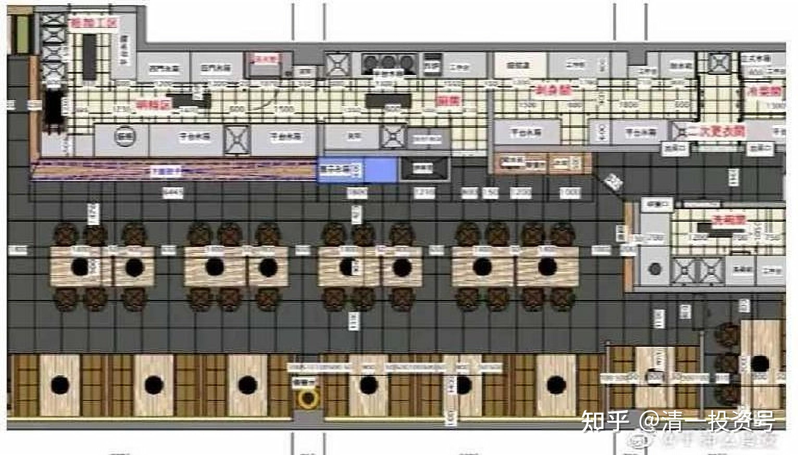
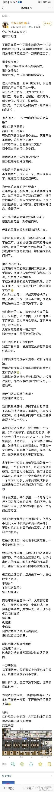

**原专栏67篇.地摊经济热火朝天？背后可能是一地鸡毛！**

[清一山长](http://link.zhihu.com/?target=https%3A//xueqiu.com/9310099567/column) 2020年6月5日

**转发内容微博“干净么食安”**

守法的成本有多高？相对于地摊

下图是在给一个高租金地段的一个小烤肉店做的设计。这里面你就能看出来我们为啥疫情防控这样一刀切的原因了。

租金有多高？一平米800元的租金不是最高的。

设计为啥难？租金太高，合法后厨的面积需求。

这么高的租金，图中可以看到，厨房的面积几乎占了餐厅的一半。
这么小店的后厨，分为七大区域：

粗加工、热厨房、出餐区、凉菜专间、刺身专间、预进间、洗碗间。这只是一个小烤肉店的要求（违法经营的除外）。

有人问了，一个小烤肉店为啥这么复杂？粗加工是不是要？热加工是不是要？

有洗碗间的企业是良心企业，碗都不洗不消毒，分餐有个屁用？

日式烤肉店，怎能没有三文鱼？切个三文鱼必须生食专间。三文鱼不让卖，寿司要一个吧？

烤肉店怎么不能没有个沙拉？做沙拉还需要冷食专间。

专间是不是要预进间？

本来要两个，设计成一个，两专间公用了，这还是市场监督局开恩。

专间还要独立的空调，两台外机挂哪里？够设计师头疼很久了。很多商场是不让挂外机的，所以只能挂吊顶上面，开的话厅里尽吹热风，很多就是装个空调摆设为了应付检查。

为什么这么高的硬件要求？

就是主管部门怕担责。“反正我要求这么高，出了问题也不是我的责任了。”没有专间卖沙拉？有人投诉罚死你。但是小店我懒得管，也不想管。你们这些商场店，我管得严。

这么高的要求对食品安全好不好？

答案是肯定的，就像戴口罩。但是这里面有很多问题和形式主义。专间看似是封闭的，但实际做不到，这不是工厂，你的出餐口的空气和外界是通的，专间的空气和外界是相通的。很多饭店审批的时候封闭，审批完成就把门拆了。

预进间不合理。

要求进专间之前在预进间二次更衣，洗手消毒。实际上大部分预进间都成了摆设，只是为了应付检查。

不成为摆设的却成为了潜在风险，你手洗干净了，是不是要拉门？门把手消毒了吗？

你在加工过程中，手部需要清洗的时候，还要出门洗，这么不方便，很多厨师就进来之后一直不洗手了。

我们推崇的日本、欧美很多牛逼的餐厅，米其林，来了中国，大部分都办不下许可证。因为不符合要求，面积不符合，专间没有。

大家看过赵薇的中餐厅吧？那种厨房在中国是要被罚死的。

那么国外是如何审批的？我查了日本的，没发现这么多复杂的硬件高要求。

日本强调的是洗手和消毒，过程保持清洁。

我国对餐厅要求的很多规定都是食品加工厂的要求。我国制定餐饮操作规范法规的人，没开过餐厅，都是标准往最严的方向写，不接地气。

餐厅的两大风险在哪里？

食材和清洁消毒。我们只重视硬件，忽略了食材和手部，工器具的清洁消毒。重审批，不重视过程控制。硬件审批多简单？过程控制多麻烦？所以一刀切。

不管你做多少菜品，哪怕就是一个沙拉，2平米就够了。但是按照要求，你必须套内使用面积5平方以上，加上建筑面积、墙体面积，一个专间要占10平米。为啥很多大的连锁企业，不敢卖一个拍黄瓜？明明客户有需求，你也不敢卖。很多职业打假人都盯着你呢！

去年帮一个知名的麻辣烫品牌处理一个索赔，一个职业打假人，以饭店提供的蒜泥、芝麻酱为冷食菜品为由，向市场监督局举报。难道为了一个芝麻酱和蒜泥做一个专间？无奈。后来我建议改名字，算到热加工的附料里解决了问题。哈哈！

切个三文鱼，做个沙拉，一个专间行不行？国外都没专间都行，我们不行，必须两个专间，想做鲜榨果汁，再来一个专间或者专区。

我们的餐厅都是硬件搞得很好，但是洗手池没人用（很多家都没有洗手池），更没有几家有消毒手部的工序。这才是风险的核心。

就是开放地摊，我们也不敢卖吃的，一个投诉都扛不住。

食品安全很重要，所以我们的法规越来越严格，严格到企业要想合规，必须付出巨大的成本。那些不合规的成本就低，劣币驱逐良币的市场就是这样。

很高租金的店铺，厨房占了一半，座位就少了很多。不翻台？不提高客单价？怎么能挣钱？

商场店和夫妻店不一样，大家都盯着你，三天两头来检查，全是形式主义。但是你还要做，成本巨大。所以现在很多品牌都在搞标准化、机械化、半成品，目的就是为了减少后厨面积，增加就餐桌位数量。所以商场店越来越难吃，就是这个原因。这也是为啥必胜客取消沙拉自助的原因。

一刀切就是我不想担责，我把形式上的要求拔得很高，具体过程繁琐我不想管。

硬件再牛逼，员工不洗手消毒，凉菜照样吃坏肚子。为啥我们的凉菜、日料很容易坏肚子？食材不新鲜一方面，不严格洗手消毒是关键。

最后，在外尽量少吃凉菜，尤其是地摊的凉菜。清洗消毒不到位的时候，高温杀菌。

**清一山长：**

严监管的结果是什么？是只让少数人获取稳定甚至超额的利润。地摊经济是啥？放水让底层人活下去。两者逻辑完全不同，适用对象也完全不同。地摊经济是一个国家的生存危机应对方案。所以政府出面大力推动，这也是为马上要开启的失业潮做准备的，淡化失业的影响。今年的大学生，保证找工作超级困难。跟1997年一样困难。说个地摊火热，给你似乎有个奋斗的方向，忘掉失业的烦恼，别去搞打砸抢。美国大骚乱的背后，肯定有失业叠加的愤怒和失落，借题发挥罢了。不是简单地打死了一个人。大众真的这么关心和在意，爱戴这个混混的死亡？

国内餐饮界如此严格的准入条款，现在突然放松，大家狂喜。但背后一定是实体经济出现了很大的问题，下岗失业问题日趋严重下出的勉强度日的招，别当什么大题材，大机会来做。原来年轻人去参与“万众创业”，把爹娘几十年的老本啃光了。现在的地摊经济。大多数参与者都是底层人，别看什么网红明星们：宣传下班后摆摊日赚千元。多吸引人。我要在国内摆摊玩，比如卖泰国蜂蜜。给我的粉丝们说一下时间地点价格，也可以日赚千元。可你模仿有效吗？大多数人热情涌入地摊经济，注定是为人做嫁衣的。**把牙缝挤出来的少量资本用来搞投入，注定多数人血本无归，但激活了市场，杀伤力也不大**。挺好的，**真正的用意，是让无条件获得保障和生存的底层得以活下去，也算是功德无量。**

股市上相关概念股火了，但一定要当心——正规实体经济的下滑，甚至超预期下滑，会对中国股市未来造成严重的冲击。可能半年报就会出现这种冲击。**我之所以拿中国建筑，就是认为大概率中建可以在后疫情时代能够稳住，稳增长，稳利润**。别的股，包括银行股，我不知道能否稳住后疫情时代，实体经济大幅萎缩的局面。消费、三产，注定是受冲击最大的领域。未来不乐观，企业业绩变脸概率大，要做好过冬的准备。

附录：原微博内容图片

