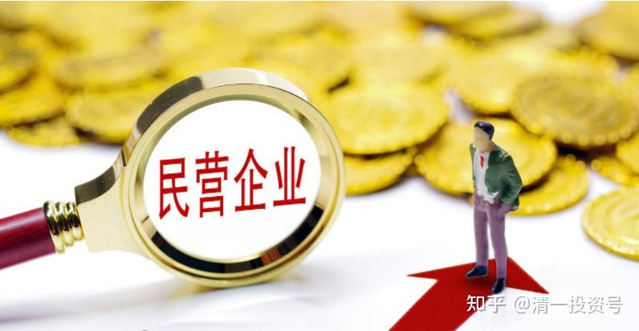

**原专栏86篇.转：中国最腐败的群体是谁（敢买他们的股票吗？）**

[清一山长](http://link.zhihu.com/?target=https%3A//xueqiu.com/9310099567/column)2020年11月20日

《一个民营老板的独白：中国最腐败的群体竟然不是吃公粮的而是……》

郭凡生 2015年8月10日

我是生在红旗下，长在新中国，经历了上山、下乡、当兵，1978年又考上人民大学的“精英”一代。1982年开始在从政做官，1987年转入国家级的研究机构工作。因为种种原因我1990年不得不下海创业，引领慧聪国际走了二十三年，由一个街边店成为了国内首批在海外上市的B2B网络企业。如今我越来越觉得马克思·韦伯的《新教伦理与资本主义精神》的深刻含义和言之有理，金元浦教授的文章就是从另一个角度的说明。

*郭凡生（聪慧国际董事局主席）*

我是一个真正白手起家的私营老板，从来没有寻租和靠官去挣过钱。因此我才敢讲下面的话，若是学者、官员写这样的文章早已被弟兄们的板儿砖拍烂了头。

敢冒天下之大不韪，谈民营企业的腐败是出于一种责任，也源于我对民企弟兄们深深的爱。我真的看到今天在大陆最腐败的群体，不是国企领导人，不是政府官员，而是我们这些民企的老板。

我知道拙作会得罪天下不少的老板，但我相信拙作也一定能够帮助那些正在迷茫中奋斗的企业家们。今天，民企腐败超过国企，甚至贪官的特征主要体现在下面几点：

**一、极度缺位，懒散无度**

2008年开始连续八年，我在钓鱼台国宾馆办了五十多期股改班。每次我都会对一百多位老板提同样的问题：“拍着良心告诉我，今天你们谁还能打卡准时上下班的请举手”？每次举手的人都不超过三成，而且几年来每次举手的人越来越少。

我总结这些老板是一三五休息，二四六放假，逢年过节国外旅游，我相信国企的老板们和官员们也绝对不敢这样。我曾很多次压抑不住自己的伤感和愤怒，在股改班上对上百位老板们呐喊：“你们当年创业的精神还有多少留存？这样下去我们怎么还能活在世上？这样的老板企业不破产天理难容！”有些老板和我解释，他这样做也是为了工作：“我的作息时间调整了，我来的晚我们也走的晚呐”。

在整个股改的体系研究中，我们把老板不准时上下班定义为老板缺位（现在许多老板时间上虽然不缺位，但是他们也没有到位，就是上班瞎管，管不该管的东西）。我们把老板缺位定义为三个阶段，**第一阶段叫职务缺位，也就是不准时上下班，不好好履行自己的老板职务。**

在职务缺位之后，因为不好好工作就会出现**能力缺位**，这是老板缺位的第二个阶段。特别是你的企业从小向大发展过程中，企业管理从小型化的老板看得见的直接管理为主向大型化发展过程中老板看不见的间接管理为主的过程中，你的缺位，肯定会使你落伍，你的能力已很难适应企业成长的要求了。在职务缺位和能力缺位之后，就是第三阶段的**心理缺位**。

工作中你发生的偏差越来越多，越来越大，这使你一到公司上班就心烦意乱、痛苦不堪，上班成为一种巨大的折磨。老板已经视做自己企业事情为最大痛苦，已经生不如死了。写到这儿，所有的老板，不管你是否同意我上面的观点，都可以判断一下，你自己处在老板缺位的哪个阶段。

我每次都对股改班的老板们大声疾呼：归位吧！找回咱们创业时那种激情和勤劳，但基本上是呼之无用。我只能对天长叹：英雄老矣，廉颇老矣！这是民企老板的第一个腐败，这个腐败肯定超过了国企和国家机关人员的腐败，因为在那里他们谁也不敢像我们这样缺位。

**二、全面“四化”，五毒俱全**

我在股改班上的总结是：全面“四化”，五毒俱全：

**家族企业政治化**，是指家族企业领袖们没有把管理企业作为头等大事，而是把跟官员打交道当做了重中之重。我曾是资深的政府官员，不少官员常请我吃饭。他们请我吃饭时，常会有一个老板坐在下手，通常话不多说，老是跟着笑，我明白他就是一个来买单的角色。

我特别为这些弟兄们感到悲哀，我们成了“大户”人家的奴才！不少企业家花巨资去买政协委员、人大代表，你们知道在那些官员的眼里你们是什么吗？你能够担任这些职务的重要原因，也就是因为你的企业还行，如果你的企业完了，明天你就会被踢出去，成为酒桌上的笑谈。

**家族企业国营化**，是指我们现在对私营企业的管理已经越来越像国企了。我问过许多民企老板：“请告诉我，现在你们的企业除了产权制度和国营企业相比还有不同以外，你们的工资制度、奖金制度、劳保福利制度等所有方面跟国营企业还有什么区别呢？”不少私营企业甚至把向国营企业学习作为一种荣耀。

黄光裕等许多著名企业家不就是一赌而败终生吗？不少老板敬关公，拜佛祖，信道教、学儒教、拜上帝、跪安拉……拜神求佛也得懂点规矩吧！连这道理都不懂你究竟信的什么呢？我想提醒一下创业起家的兄弟们。

在你很穷的时候，你拜的起神吗？那时你穷得香钱都舍不得花，你去拜谁？因为当时你没有拜神，只有相信自己，你成功了。今天你成为了富人，今天想保住你的富贵不再是靠勤劳、智慧，而想靠神鬼可能吗？我去温州帮助一个企业股改，忙里偷闲去打了一次高尔夫。让我震惊的不是球场，而是球场山中的庙。

我大概算了算，十八个洞边最少有三十六个庙，个个香火旺盛，我不禁要问那么信佛为什么还会产生“温跑跑”？如果真的烧香佛主就能保佑你，我们这些原来的穷光蛋今天谁也成不了富翁，因为前面的富翁他们天天都在不断的烧香拜神。不管你怎样拜神烧香，富不过三代的魔咒你改的了吗？

鉴古收藏，就更不要说了。我看到许多企业家的办公室里挂着所谓的名画，摆着高级的紫檀木、红木家具。第一你懂得真假吗？第二你背着那么多的银行贷款，付着高额利息，却拿钱来置办这些对你企业毫无用处的东西，这对吗？

最最可怕的是五毒不沾又能准时上下班的人，在近几期股改班上，我让他们举手的时候，已经不到一成。这让我惊叹又万分痛心。我常问苍天，这难道就是当年改天换地的创业者们？让中国脱贫致富的企业家们吗？这样的企业不破产天理难容！

**三、自大狂妄，苛员溺后**

老板们在企业里总是一个人说了算，天老大，你老二，根本听不进别人的意见。自己缺位不敬业、不努力，还不愿意听内行的意见，周围豢养着一批溜须拍马专门说好话的小人。讲到这儿，希望每一个老板把你周围的人排一下队，看看你周围有几个人还愿意跟你拍桌子争论？不少老板自大狂妄到了让别人看着都可笑、可怕又可怜的地步。

我们都有孩子，你一定希望把企业交给孩子，让企业成为百年老店，请问以后走天下富人一样的路，你怎么就能改得了“富不过三代”的规律呢？穿金戴银长大的富二代多数学习不好，大家知道孩子学习很差，多数因为在国内连三流大学都考不上，就花重金送他们去英国、美国、加拿大学习，这还成为在酒桌上和朋友炫耀的内容。

尽管你花了很多的钱让后代读书，但后代大多数都不愿意留在国外，因为一是回国要比在国外的生活好的多。另外，要在国外留下生活要靠真本事啊！他们只有回国。

香车、美女、志大才疏，已经成为富二代中极为普遍的现象，更可笑的是这帮手无缚鸡之力的“衙内”们竟还有百分之七十以上的人明确表示不愿意接班，想干更大的“事业”。我的一个朋友也是中国著名的企业家，他把儿子叫回国，在自己的企业从“基层干起”。我跟他说这简直是掩耳盗铃、自欺欺人，你根本不可能做到。

我仔细了解到的情况是，他的儿子白天在车间里当“工段长”，每天一下班就有人用高级车把他的儿子带出去吃喝玩乐。谁都知道，哄住了这个“衙内”自己就可能升官发财。

在你身边有一群跟着你奋斗了十几年甚至几十年的弟兄，他们现在还不富裕，你真的认为他们的能力比你的子女差吗？你真的认为你的子女可以领导他们吗？呸！在这儿你既无朋友情义，也缺少一个基本的理性判断，你的孩子很可能是败家子。我长在内蒙古，在鄂尔多斯有一帮好朋友。

几年前，鄂尔多斯商会的会长跟我说：“凡生啊！有几个孩子关于资本市场的问题想向郭大大求教，你可不可以见见他们？”我说：“可以呀！你的孩子，不就是我的孩子吗？让他们来书院吧！”记得有天下午他们来了，几个小伙子长得很帅，穿得也很体面，送上了他们父母带来的礼品。

但我们的谈话仅过了十几分钟后，书院的工作人员来告诉说：“郭总，外面乱套了！”我不明白怎么回事。因为我的书院在中关村最繁华的地方，是一个两进院子的关帝庙。关帝庙前几百平米的停车场，是我们专用的，怎么会乱呢？我出去一看惊呆了。

原来在慧聪书院门口停了两辆加长的奔驰和一辆巨大的悍马，人们像看车展似的，围着这些奇怪的车在揣摩观看，他们的车把天子脚下的人都震倒了。我把几个孩子叫出来跟他们说：“把你们的车马上开走，扔到哪儿我都不管。你们到这来炫什么富呢？我的慧聪书院是读书人待的地方，你们来是向我请教学问的。既然这么富，你们还搞什么资本市场，去花你们爹妈的钱就够了。滚！”我把他们骂走了。但那天我的心情非常不好，晚上我跟我的老朋友边打电话边喝酒，他在那边哭了，他跟我说：“凡生啊！我真的没有办法，我不知道该怎么教育他们。”

有人会问这是为什么？我认为这些孩子必须进入一个使他们良性成长的环境。书院是一帮高学历，出生贫寒学子组成的团队。他们有着良好的团队意识，优秀的学识和道德，他们崇尚勤劳，尊重知识，他们是良币驱逐劣币，谁在这里炫富，谁不努力谁就会被赶走。

在这样一个环境里，不管你家有多少钱都得从头干起，因为郭凡生坐在这儿，你们谁家的钱都没有我多，他们可以看到我每天在怎样工作，在这样的环境里他们真的可以学到一些东西。

如果你让他蹲在你挖煤的企业里，跟在你制鞋的工厂中，待在你开饭馆儿的老家，他们永远见到的是那些吹捧他们的“小二”。大家都在望子成龙，龙跟龙在一起才可能成为强龙啊！龙和猪、鸡圈在一个圈里，即便飞起来也难和强龙竞争，这就是环境造就人。

我在股改班和几千位企业家们不断地讲，我相信**五年、十年后你们中间的多数人已经不是老板了，因为你们的孩子接不了班，坚持代理制你又无法将企业交给跟你没有血缘关系有能力的人，您的企业肯定做不下去**。

我们这一代企业家，**绝大多数人到了老年最悲哀的事情是看着自己最心爱的子女，把最心爱的企业搞没了**。我相信只要不是从共享制的角度找出路，这是中国多数老板悲惨的共同结局。

**四、德无制、行无规、损无忌**

腐败惩戒底线是制度，在国企和机关你公开贪污甚至乱花钱是犯法的，我一个大学同学，曾是交通银行一个省行的一把手，就因为他给员工每个人多盖了一套房子就被撤职查办。所以国企和机关的腐败是有制度作为惩治底线的。

而民企老板的腐败没有制度作为底线来惩治，只能靠老板的道德和觉悟来“自律”。国企上下班有人管，私企老板不上班哪有人敢问。国企谁敢公开娶二奶，谁敢公开坐超标的高级车，虽然有人顶风作案，但那毕竟少数而且是违法的。但在私企，只要老板敢就无人管啊！我亲眼到不少老板领着二奶参加聚会，见朋友，甚至以此为荣。

很多中国人都讲仇富是不对的，但我觉得现在的仇富反而有合理性，如果再没有社会的仇富阻挡，天下不少的富人就更没有底线了，就会做出更多无耻的事情，现在的仇富似乎是制约无耻老板们无耻行为的唯一底线。**有不少做生意的老板是靠寻租和官商勾结而起家的**，我劝告这些人：

**第一，不是好来的钱，你留不住；**

**第二，不是好来的钱也教育不出好孩子，因为你的行为在天天教他们坏；**

**第三，因为你钱的来路不正，社会一定不会尊重你，虽然你有了点钱，你会天天感觉人生无味、危机四伏。**

**一些老板想作善人善事来抚慰自己的心灵。**不少人捐了善款，其实善款在多数老板的心里就是生意。我问过不少企业家，其中一个非常有名，他的捐款也很多。我说：“你捐款的活动和广告，如果不上你自己或者你企业的名字，你还会捐款吗？”他们几乎都说：“不会！”因此，他们的捐款是一种买卖，他们是**借着慈善的目的做广告，想多挣点钱，从“善”中追求更多的利润。**

有的人到台湾，美国乱发钱，感觉自己很了不起。还捐给政府一大笔资产，而他企业员工的月收入才三千多块，我有一次在会上问他，你这样苛待自己的员工，为什么还要对天下人善？员工不是天下人吗？因此，在多数老百姓的眼中，今天中国富人捐的钱不是善款是在用钱恕罪，你捐多少大家都不会认为你是在行善，**你捐得越多，大家认为你的罪孽越深**。

人们常说，一个富人三年足矣，而一个贵族却需要三代。因富而贵应是所有家族传承的目标。像福特、洛克菲勒、沃尔玛家族等等都完成了这样的飞跃。但今天大陆大多数企业家，按照现在的行为准则走下去，我认为此路不通。

**五、逐名、尚虚、误实**

今天不少老板读了“名校”，其实是花钱买的文凭，许多老板**上学不读书，把上学视为一种娱乐和交易的圈子。**

十几年前在光华管理学院EMBA的年会上，同学们编了首歌谣叫，你拍一我拍一，一直到你拍十我拍十。给我印象最深的是“你拍一我拍一，光华上学坐飞机；你拍七我拍七，光华考试不复习”。

我在他们的年会上直言不讳的对他们讲：“今天你们都是坐着高级专车来的，而我是打的来的，你们有谁打的来的？请举手！”台下没有人举手。

“自古讲‘国乱出忠臣，家贫出孝子’，你们上学都可以做着飞机的头等舱来，你们还有什么动力来学习和读书？你拍七我拍七，光华考试不复习。读书不复习还考它干什么？不考试你们还读的哪门子书呢？丢人现眼还当荣耀，有辱斯文。”我指责了他们，全场都不吱声，他们没有什么话可说，我记得王小丫也是那期的学员还兼着晚会的主持人。

更有甚者，过去几年，北大的后MBA，经常给我打电话、发短信，让我去读北大的后MBA。说那里有多少部级、局级的高官，有多少国企的大领导来参加学习，跟他们在一起将会得到资源，得到人脉的发展。能得到**什么资源？那是不要脸的资源，那是腐败的资源，那是官商勾结的资源，那是让我们企业走向灭亡的资源！**

我们是企业家，我们要有独立的人格。没有了独立的人格，我们还叫企业家吗？在人屋檐下，哪能不低头。是的抬不起头时，难道咱还不能直起腰吗？不能说真话时，一定不能讲假话，保持人格的方式是不说话！否则，我们只能是权贵的奴才。

我的这篇文章会得罪不少老板，我不是说您没进正规大学就不能成为读书人，我也是24岁才进的大学，但是我进去认真读书了。近几年那些EMBA、后EMBA去上学的人还不如不去，上学不读书，却要学腐败。

这几年MBA、EMBA的同学有一个很好的说法，是组织起来去游学。在一次股改班的课堂上，有一位学员说他得早走一天，因为他们总裁班的同学要去英国游学。我听着就笑了，调侃着对他说：“你懂ABC吗？你会说英文吗？“他脸红着说：“我不懂！”我说：“你连英文都不懂你去游什么学？不就是去玩儿吗！”许多MBA的学习是，上课睡觉、晚上胡闹、吃喝玩乐、无所不为。

我曾问过几个股改班的学员，他们都是小有成就的企业家。我调侃他们说：“如果你们EMBA的国内聚会，只有男生参加没有女生去，人员会不会少一半？如果你们出国的游学只有男生没有女生，你们还组织的起来吗？你们在**为自己的腐败，和寻欢作乐戴上无耻的光环。**

对不起，我不认为这一切可以被人尊重，这种事情正在不断地腐蚀着你们最后的勤劳和干劲，弱化着你们的企业家奋斗精神，你们离失败已经不远了。

从我看到的一切，我认真的说，今天中国大陆最腐败的人群，不是官吏，不是国企领导人，而是我们这些私企的领导人，我们才是大陆最腐败的人。我们和他们不一样，我们是穷人出身，我们是一步一步靠奋斗而走出来的，我们那点钱是用血汗换来的，我们去跟他们学得起吗？值得学吗？

今天国企倒了无所谓，他们才占GDP才百分之十几，他们容纳的就业不到百分之十。而今天的中国，如果我们这些私企出了问题，中国就完了，百分之九十的人将没有饭吃，我们将亡国灭种。而更重要的是要亡家。

在寻欢作乐、在不努力奋斗的时候，你想过你有退路吗？你们绝大多数人的贷款是签了无限责任的合同，还不起款是要卖房子、卖地、卖车来还的。

一位企业家因为还不起债，被债务人把手表都撸去了。内蒙两个企业家因为还不起债，把油泼在身上自焚以谢天下，想想他们的后代有多可怜！国企的领导不干了，还可以到机关去当官，你们可以吗？我们是没有退路的，穷变富是升天堂，富变穷是下地狱，你受的了吗？创业时我们知道我们没有退路，所以我们成功了。

现在后退一步踏伤的是自己的父母、孩子和成千上万的员工，我们真的没有退路，我们真的不能退。我知道你们会说现在难，环境不好……但现在再难也比我们创业时候好多了吧！那时候我们被称为社会经济的部分？受欺负，私营企业的所得税是55%，而外企的所得税是三免三减三减半，连续十几年国营企业从来不缴税，上市也根本没有我们的事，那个时候的股市是为国营企业开的。

今天就是再难也比当年好吧！只要你还是个男人，还挺的起腰杆，还有再创一次业的志向，不管多难你都会站起来，因为我们的家不能没有我们，中国不能没有我们。

写此文我是在美国，因为倒不过时差，我是在夜里两点钟喝着二锅头改完这篇稿子，看着华尔街耀眼的灯光，看着自由女神背后的形象，我在想着我们这些人，一、二百年以后会被后人怎么看待。夜深了，我只能听见高速公路上汽车往返的声音，但我的心还在我的祖国，还在我那些家族企业领路人弟兄们的身上，我真的希望大家觉醒，我们共同再创一次业，让中国在我们的引领下走向富强！
