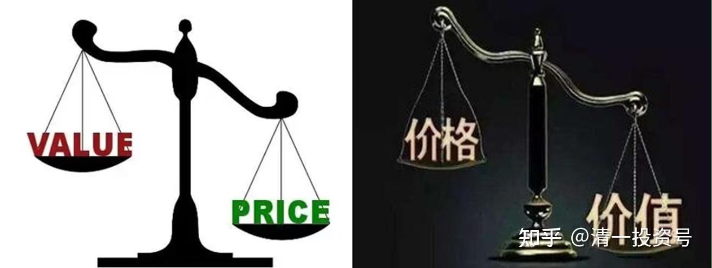

6篇.“价值派”VS“价值股基础上的投机者”

清一山长 2020年7月11日

归隐林地 回复@晕娜:

晕娜对银行的看法大有商榷余地。针对晕兄的5点，我也说5点。

1）十年后，银行业依然是全社会的支柱行业，因为间接融资的市场空间巨大，直接融资再发展，也吃不下多少份额，用直观的数据看，就是M2年年增长，而且增长慢了都不行。银行业也是难得的没有天花板的行业，特别是在如今的信用货币时代。另外目前似乎还在为银行混业经营开口子，这个就先不说了。

2）利率市场化之后，银行业依然会生龙活虎。银行业经营的基础逻辑不是利率，而是信用。信用永远是稀缺的，特别是在中国。往远处看，欧洲、日本基本上都是0利率、负利率，但银行业依然还是最强大的金融力量。（就像保险业经营的基础逻辑不是投资能力，而是中产阶级的焦虑，所以我把保险产品看成是中产阶级的智商税[大笑]。）

3）今年的疫情，肯定会传导到银行，但是到中报大家就会发现，银行业应该是受影响较小，甚至不受影响的行业。M2增速这么快，银行业会吃亏？想多了。担心利润还不如担心再融资好了。

4）银行业不是阿猫阿狗都赚钱，这几年一定会有大量兼并托管等事件发生。有人总是说银监会的监管指标是ROE大于11%，但实际上，很多农商行、城商行的ROE非常低，而不良率非常高。

5）晕娜只喜欢招行，这个没啥可讨论的。交易永远是互道傻比的过程。在目前价位下，我只喜欢兴业，而且仓位不轻（当然比中建持仓少），大家看重的东西不同。

在这5点之外，晕兄还点评了农行的分红（实际是业绩）最近几年没啥增长，在我看来，这只是一个短期问题。这几年M2增速大幅降低，宏观经济趋向走缓，不良率提升导致拨备高增，而政策面又有巴三协议提升核心资本等要求，以至于ROE连年走低。但是只要银行业还能存在，息差以及ROE就不会一路低下去。银行业的坡大概率比建筑业更长，雪也更厚。

总之，我对银行业一点都不悲观。前段时间我是从兴业、太平洋保险等金融股搬了一些资金到中建上，是因为中建跌得多，银行保险相对跌的少，我希望有机会搬回去。从这里到跟帖看，大有希望啊！

[清一山长](http://link.zhihu.com/?target=http%3A//xueqiu.com/n/%25E6%25B8%2585%25E4%25B8%2580%25E5%25B1%25B1%25E9%2595%25BF) [2020-07-11 14:2](http://link.zhihu.com/?target=http%3A//xueqiu.com/9310099567/179924902)4 回复@归隐林地:

写的挺好的，赞同。不过，我认为晕娜强调的是“不确定性”，她更注重量化一些。

**未来如果中国崛起的话，中国建筑会崛起，中国的银行也会崛起的。大国重器，都值得拥有。**

个人认为：**在银行和中建搬砖，兴业对标中建，我个人认为赢面大过死守任何一边。**当然还要看运气。目前价位，中建占优。

@晕娜回复@归隐林地:

林兄：

咱俩交流过，恕我冒昧，您还是归在交易者之列。没必要掉进养老股的坑里，没必要与股票谈婚论嫁。股价够便宜，股息率够有诱惑力，都是交易的好品种。

养老股：我的看法，成长性是个非常重要的参考因素，历年成长性低于10%的公司，原则上都不应该列入选项。就这一点，中建达到了，兴业银行达不到。

我查了一下：2014年至2019年，兴业银行：分红增长65.65%，中国建筑：分红增长81.11%。

[清一山长](http://link.zhihu.com/?target=http%3A//xueqiu.com/n/%25E6%25B8%2585%25E4%25B8%2580%25E5%25B1%25B1%25E9%2595%25BF) [2020-07-11 21:3](http://link.zhihu.com/?target=http%3A//xueqiu.com/9310099567/179924902)4 回复@晕娜:

做个交易者也挺好的[大笑]。我一向自封“价值投机者”，在价值股的基础上投机，落实在“投机，交易者”上。算是有自知之明。不敢妄称“价值派”，不好意思当巴菲特的学徒，玩擦边球，导致两边都不把我当自己人。我是老子的学徒，“名可名，非恒名。”

@晕娜:回复@柯南只爱毛利兰:

茅台：

2013年净利润同比增长13.5%，

2014年净利润同比增长1.9%，

2015年净利润同比增长1.2%，

2016年净利润同比增长9.1%，

2017年净利润同比增长62%，

2018年净利润同比增长30%，

2019年净利润同比增长17%。

五年前，我为什么不买茅台，看看茅台历史数据吧！就茅台当时那个成长性，真够烂的！中建上市11年，没有那么烂的成长性！

[清一山长](http://link.zhihu.com/?target=http%3A//xueqiu.com/n/%25E6%25B8%2585%25E4%25B8%2580%25E5%25B1%25B1%25E9%2595%25BF) [2020-07-11 23:0](http://link.zhihu.com/?target=http%3A//xueqiu.com/9310099567/179924902)6 回复@晕娜:

我可不可以逆向思维一下：如果晕娜可以不这么执着于茅台的增长不稳定，愿意在报表增长最难看的2014～2015年买入茅台（逆向投资法），收益就会比只守中建大很多倍？如果当年买进100多元的茅台，今年来卖掉一千多元的茅台。再买入5元的中建，岂不快哉！

**所以，坚持要求企业每年都必须不低于10%增长，是不是苛刻了一点？让自己失去了更多的机会？**

当然，我这是后视镜，不算数的。不过去年我用涨到56元的格力电器，换40元（38元）的万华化学，依据就是两只股一年前价格都差不多（20～30元），地位都是行业龙头。弄出这种价差，持有万华更划算。现在万华跟格力同价了，因此我等于多赚了钱。**我喜欢进行估值切换，不过指标就不能太苛刻。万华的周期性，不可能要求它每年都稳定，**大约只有中建这种可以控制成长率了。这也是我在反周期的时候，特别喜欢它的原因。

参考链接：

[清一投资号：1篇.银行股的投资逻辑](https://zhuanlan.zhihu.com/p/489850963)（整理文）

[清一投资号：3篇.2015年银行股投资回顾——“价值投机法”之示范（上）](https://zhuanlan.zhihu.com/p/502367347)（整理文）

[清一投资号：4篇.2015年银行股投资回顾——“价值投机法”之示范（下）](https://zhuanlan.zhihu.com/p/506271066)（整理文）

[清一投资号：5篇.价值投机派的投资思路与心态——兴业银行的实操分析](https://zhuanlan.zhihu.com/p/509443218)（整理文）

