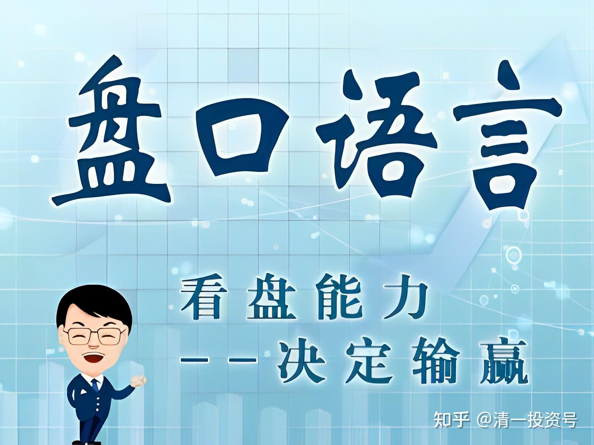
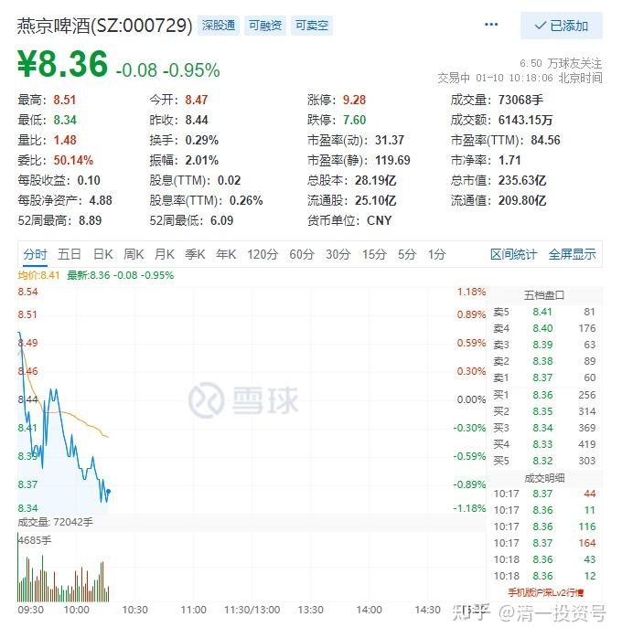
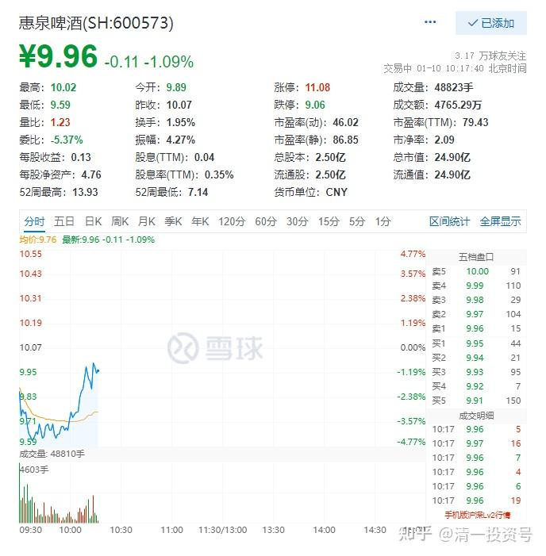
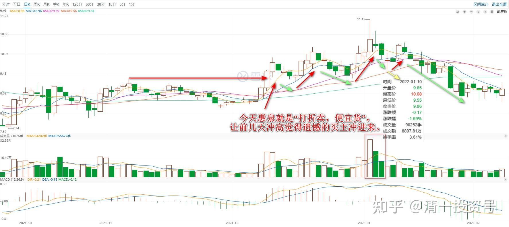
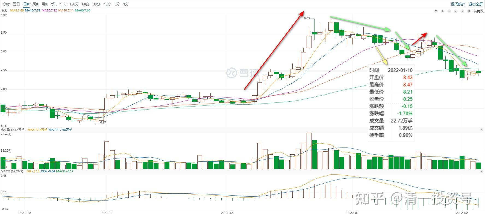

专篇19.YJ、惠泉今天盘面语言对比

清一山长 2022年1月10日

*YJPJ分时图 *

* 惠泉啤酒分时图*

今天YJ和惠泉，走的势头是完全不一样的。开盘半个多小时，两只股票的成交，都是三千多万元。

但惠泉是低开低走，盘面就是出货的走势。主力其实就是一个卖小菜的，手上拿了很多货出来想卖。喊了个高价，吆喝，到处寻找买主。如果发现开价高了，没人买，他就打折，吸引人来买。开高了买的人多，就继续涨价，设法多赚一点。不行就降价，只要不赔本都可以卖。今天惠泉就是“打折卖，便宜货”，让前几天冲高觉得遗憾的买主冲进来。

YJ是冲高回调，就是让持有的人兴奋，然后失落。心想：以后再冲高上去一定卖掉。两者的目的不一样。其实跟做生意一样的。YJ主力的意思：你们都想高价卖给我呀？我没这么傻的，我要表示不想要货，爱要不要的，急死你们。然后，我给个勉强过得去的价格，你们就出手了，指望我傻乎乎的一直买到天上去？我才不干呢！所以要洗盘。

你们别把股票想太高深了**。关键点是成交量——YJ成交量如果放大，什么图形都可能是出货的。**现在是惠泉的量更大。虽然成交的金额是差不多的，但别忘了YJ的盘子要比惠泉大十倍,一样的成交量，可以说YJ成交太少，或者是惠泉成交太高，都不正常的。

*宇2022/1/10 10:48:28

看山长的点评太爽了，和上课的感觉一样，永远都是一针见血，从不掖着藏着。量能就是关键，都是拿银子堆出来的，不容易作假。跟着山长做股票就是安心，感恩山长如此细心的解盘。

山长清一 2022/1/10 11:25:45

【[阿根廷央行上调基准利率至40%](http://link.zhihu.com/?target=https%3A//baijiahao.baidu.com/s%3Fid%3D1721268603025324893%26wfr%3Dspider%26for%3Dpc)】阿根廷中央银行6日宣布，将基准利率由38%上调至40%。这是阿根廷央行一年来首次加息。阿根廷央行在一份声明中说，新基准利率符合央行2022年的计划与目标，阿根廷政府希望通过利率政策让本币投资获得实际回报，保持货币以及外汇市场稳定，进而促进经济复苏。阿根廷政府近期与国际货币基金组织（IMF）就大约440亿美元债务问题进行谈判。IMF曾数次呼吁阿根廷调整货币政策，主张其基准利率应高于通货膨胀率。阿根廷国家统计与普查研究所预计，阿根廷今年通胀率将达52.1%。（新华社）

思考：假如有一天，媒体上这样报道中国的新闻，你会怎样？你对这一天做好了准备没有？这种日子过去有过，（二十世纪80年代末期，银行存款的保值补贴率就高达20～30%。二十世纪50年代的一次就更不得了，直接清洗了很多富人)，未来出现也一点也不稀奇，关键是：你能把这种局面对付过去吗？

**宇2022/1/10 11:49:10

这应该就是国内很多有钱人都把资金转到境外的原因吧！比如瑞士银行，比放在国内的银行安全。

山长清一 2022/1/10 12:47:29

@**宇[大笑]——如果我告诉你：将来有一天，美国也会这样贬值，你怎么办？

**丽 2022/1/10 13:09:50

@山长清一 山长曾经在雪球上说【看过去，知未来】，下面这段文字是山长2015年分享，可能山长自己都忘了，但是我们现在再看一次，可以说是站在现在验证过去，山长的眼光，以2015年为站点的【十几年】前，估计是二零零零年以前了吧，已经如此精准，20多年之后的今天，我们肯定，山长的眼光更精准。感恩您的分享，无论是几十年前，还是现在，还是未来，永远为我们示范付出、分享、创造价值。

以下为原文，加了编号，方便家人们对号入座，您想要跟随把这样的眼光放于何处——

【往前看的眼光是无价的】

1.买房的眼光——我当时还是企业的老板的时候，然后我的经济是没有问题的。熟悉我、常看我博文的人都知道，我在2013年到武汉将我在武汉的20几套房子卖掉了。房子是什么时候买的呢？十几年前买的。也就是说那时候我就是有一定经济实力的人。

2.进今日的眼光——那么办这个学校我是采取的什么态度呢？赔本办。我收的学费当年（2003年）是1万5千元一年，包吃包住包学费，一切包啰！是不是比请个保姆还便宜呢？但是因为很多人没有眼光，他不知道这是一个礼物，他们甚至认为这可能是个陷阱，很多人根本看不起，后来等他们看得起的时候，就发现花钱已经进不来了。现在就算你花进耶鲁、哈佛的学费，也未必能进今日学堂，就像有些家长突然发现这样一个事实：进今日学堂比进清华、北大还难。没错，今日学堂一年最多只招二十名学生，清华、北大每年要招几千人，这肯定是不一样的。但在当年，只要是坚定支持我们的，你就可以入学，几乎是没有门槛，而且今天我们的门槛为什么抬那么高，是因为你当初没有眼光，到今天才有眼光，那么这个眼光到底值多少钱咧？

3.教育孩子的眼光——这个眼光如果用在你的教育上用在孩子身上，你永远往前多看几步，看五年，看十年，那你的眼光是无价的。你值得用你全部的资产来购买它，如果你能够有这样的机会。用在其它方面，它的代价也是极其高昂的。

4.股市的眼光——请大家想一想，我前年年底（2013年底），去年年初、年中，是不是一直都在告诉大家一件事情：中国金融市场是一个非常好的投资机会，现在要见底了，然后告诉大家无风险投资可获千万。当我做这样的事的时候你瞧不起，你轻视这样的事实，而这是公开的，一分钱不要教给你。而你不相信，现在的结果就是：你没赚到钱。很轻松的，中国这个时代送给我们大大的礼物，这个礼物只有少数人赚到了。这部分少数人，当然也不算少也有几百人，而这几百人成为了去年（2014年）全中国最赚钱，赚得最轻松的一批人，那么我们再想一想，在座的各位，我想你们一定在想，现在能不能重新回到2014年，你一定会想如果重新回到2014年，我一定砸锅卖钱去干这样一件事情，一定把自己房子卖掉，对吗？

5.进今日的眼光——好了，我们再想想，如果你重新回到2003年、2005年，重新回到今日学堂刚刚创办的时候，你如果知道今日学堂1万5千元钱就可以来上一年的学，你会怎么说：你居然不送孩子来那是不是犯傻。你都不能原谅自己，对吗？这就是古人说的一句话：千金难买真知，万金难买早知道！

6.投资的眼光——如果你明白了这个道理，那么今天我给大家的分享，给大家讲的课题就是这样一个千金难买、万金难买的机会，我们将观察这个时代的变迁，我们将去研究，判断、去看清楚未来的10年、20年这个世界会发生什么？而且我们需要在今天就为它做好准备，而不是到10年、20年后再去告诉它我想要重来一遍。今年你说你想要买去年两块伍一股的中国中铁，还有机会吗？没有了，以今天的价格算已经20多块多钱了。去年我告诉大家，去年我在武汉还讲过一次财富课的辅助课，其中说了中国高铁的机会，也特别强调了这一点的，而听懂的人收益特别大，没听懂的人今天也没机会了，没有了。

7.事业的眼光——所以呢，你不要等事件已经发生了，你周围所有的人都知道了你再来做，等所有人都知道的时候就没有你的机会了。要在大家都不知道的时候你知道，这才是你要做的一件事情。中国的教育、未来的教育，中国的生活、未来的生活，以及你在中国的事业平台都会在未来10到20年时间发生你完全想像不到的变化，甚至是你不敢适应的变化。

8.选地址的眼光——十几年前，我在会场外这条路上，原来关山是我的一个经营点，是我公司在这边的经营重点，当年这条街上的车是很少的，外面的民族大道，也就在仅仅10年前都不是今天这样的。那么这十几年的时间，武汉现在这里堵车堵得不得了，一个红绿灯要闪十次你才过得去。但如果十年前你能布局知道今天这个变迁，你随便买一处房子，它的增值空间有多大？我在十几前买的房子，每套房子都增值了10倍以上，而且我当时还是用20%～30%按揭买的。所以我的资金回报率来说是不是很高。

——那么这就是你的眼光。

**伟2022/1/10 13:22:34

疫情导致实体经济下行，全球印货币放水救市。钱放银行肯定贬值。放水能救实体，但第一受益的应该是银行。所以钱借给银行，不如直接买低位的银行。听山长的话，坚决持有兴业银行！

**宇2022/1/10 14:36:47

现在买兴业还来得及吗？

**超 2022/1/10 15:47:14

@**宇 怎么还这样问呢？

**华2022/1/10 15:49:46

@**宇 这个问题山长前面已经回复过了，其它同学也有解释过，你看看前面的讨论。

山长清一2022/1/10 16:06:33

[霍英东家族争产案2022年1月11日开庭 涉广州南沙22平方公里地皮](http://link.zhihu.com/?target=https%3A//www.guandian.cn/article/20220109/280983.html)

看你们这些家长还拼命挣钱，挣了钱有啥好处？你一死，子女反目就因为你钱多。老百姓钱少，也没人争。子女就反而和睦了。大家知道为啥我不留钱给后代了吗？这是为了他们好。

**霞2022/1/10 16:16:00

谢谢山长不时地提醒，给孩子留钱是最蠢的，家族传承最要的是家风，是思想和精神的传递和承接。

**学2022/1/10 16:29:53

很多家长上半辈子穷怕了，现在有钱了，都不想让自己的儿子、孙子重复他们的穷，要让他们守着金山，过像样的日子。仿佛今天多留一些钱给他们，他们的日子就能增加一些甘甜与色彩。

林则徐的一段话发人深省：

子孙若如我，留钱做什么？贤而多财，财损其志；

子孙不如我，留钱做什么？愚而多财，益增其过。

若是细想：金钱真的是孩子喜欢的吗？金钱真的能给孩子带来好处吗？孩子能够驾驭金钱的能量吗？

时移世易，物是人非，若要家族延续而愈发繁盛，除去不可抗拒的大环境因素，良好家风与严格家教，比金钱更重要。

**宇2022/1/10 16:47:51

培养孩子创造价值的能力和驾驭财富的能力重要得多。

**荣2022/1/10 16:49:15

山长的搏客也有分享过：人格是支撑人最重要的东西，厚德载物，如果没有这些，有了财物反而会伤害你，我们留给子孙的应该传承财富观念，留财富思维，经营思维，有了符合财富走向的思维就可以创造财富，所以我们应该传虚不传实，传实害死人，留财更愚蠢，真正的财富不是实物。人最大的财富就是有符合财富走向的财富思维，人的价值是什么，不是你拥有什么，而是你能创造什么给别人，是经营者思维，不是消费者。经营者思维的人，越花钱越有钱，消费者思维越花钱越没钱。我们生活中大部分都是是消费者思维，穷人的思维。

**宇2022/1/10 17:03:19

@**荣 大赞，传虚不传实，传实害死人，留财更愚蠢，真正的财富不是实物，是思维和价值观。

**东2022/1/10 17:23:46

有志于投资的看看山长这段话，山长在不同场合都说过。“财富心理行为学第三讲《巴菲特的投资和人生智慧》，山长2021年5月4日回复李华丽女士：所以，你们就只看题目，别想答案了。不如把时间用来好好读《巴菲特之道》100遍，也许就懂了。摘自《财富思维与标的分析》一书P146页。”

**东2022/1/11 8:06:08

这几天一直在思考山长解盘时，对YJ和惠泉的比较。怎么从盘面上看是拉升洗盘，还是假拉升真出货。在财富二年级上，我问过为什么山长最后一次十元多卖出珠江，判定的是在出货？感觉答案就在山长解读的现下惠泉的走势中，量价配合的形态。

**参考链接：**

专篇1 [306篇.前缘1.雪球的最后一贴--胜利曙光都已经出现](http://link.zhihu.com/?target=https%3A//xueqiu.com/2017773236/247159187)

专篇2 [307篇.被特别关照的股--前缘2](http://link.zhihu.com/?target=https%3A//xueqiu.com/2017773236/247387457)

专篇3 [308篇.立此存照--前缘3](http://link.zhihu.com/?target=https%3A//xueqiu.com/2017773236/247580614)

专篇4 [309篇.见识传说中的拖拉机账户](http://link.zhihu.com/?target=https%3A//xueqiu.com/2017773236/247973779)

专篇5 [310篇. 拉升在即](http://link.zhihu.com/?target=https%3A//xueqiu.com/2017773236/248351982)

专篇6 [311篇. 进入右侧投资时代](http://link.zhihu.com/?target=https%3A//xueqiu.com/2017773236/248658236)

专篇7 [313篇. 小主力进货的阶段](http://link.zhihu.com/?target=https%3A//xueqiu.com/2017773236/249221851)

专篇8 [316篇.两轮回调对比](http://link.zhihu.com/?target=https%3A//xueqiu.com/2017773236/249675370)

[专篇9.主力的水军](https://zhuanlan.zhihu.com/p/619400004)

[专篇10.主力完成筹码收集](https://zhuanlan.zhihu.com/p/629948708)

[专篇11.主力、游资、右侧投机客纷纷进场](https://zhuanlan.zhihu.com/p/631628731)

[专篇12.进入震荡期](https://zhuanlan.zhihu.com/p/633057526)

[专篇13.永远回避风险，不亏损第一](https://zhuanlan.zhihu.com/p/635191087)

[专篇14.高位十字星缩量及主力操作的三个阶段](https://zhuanlan.zhihu.com/p/635191930)

[专篇15.准备起跳](https://zhuanlan.zhihu.com/p/636886203)

[专篇16.大幅回调，老手加高手](https://zhuanlan.zhihu.com/p/638552635)

[专篇17.股东数所传递的信息](https://zhuanlan.zhihu.com/p/639002631)

[专篇18.突破9元是燕京的基本目标](https://zhuanlan.zhihu.com/p/640000051)

