原雪球专栏29篇.我的“室内游泳池”免费对外开放——清一书院麦登校区

清一山长 2018年8月3日

春节后，我邀请了国内的今日学堂和新教育学堂表现优秀的学生。总共65名，免费来参加“泰国冬日温暖阳光体验营”，为期一个月。

学生是免费参加的，对于我来说可是要实实在在掏钱出来补贴的。不仅仅是吃住玩，统统免费提供。可以利用我从大英帝国国民手上接收到的战利品房子和几个管家来应付招待，光游泳池就有三个，两个室外的，一个室内的。仅仅是维持费用，每个月都是好几万泰铢。

除了这些，这一个月，仅仅是支付国内来的冬令营教师的工资，就需要支付出去相当于泰国人标准工资的20倍以上，加上采购各种学生们需要的生活设施，床具等等，已经开支出去上百万泰铢了。我的负担很重的,所以，我还是少开一点“泰国免费营”为妙。今年最多再开一个学生的夏令营，就算了。

**对于优秀的人，我的大门永远是开放的。我喜欢拥抱卓越，平庸的就算了。自己玩自己的就好。**

[泰国温暖冬令营：麦登校区周记播报](http://link.zhihu.com/?target=https%3A//mp.weixin.qq.com/s%3F__biz%3DMzAxNzk5NjIzOA%3D%3D%26mid%3D2247486471%26idx%3D1%26sn%3Dbb8174a289356d5c8bebdec935d14ed6%26chksm%3D9bdc4ca6acabc5b03b29ed96fb4e76e346f11bd512d34dbad37693a2809eeb43ea585d3c31ae%26mpshare%3D1%26scene%3D23%26srcid%3D0303WJRxtCfykjtUCgSYzJBL%23rd) [网页链接](http://link.zhihu.com/?target=http%3A//url.cn/5zpcxHt)

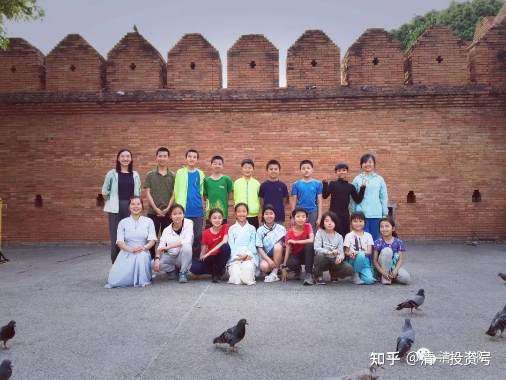

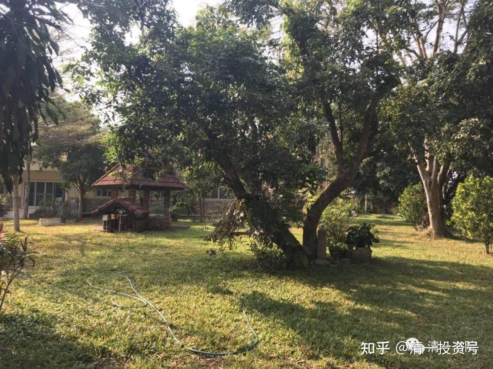

*图为户外校区所在地，原英国房主建造的花园洋房*

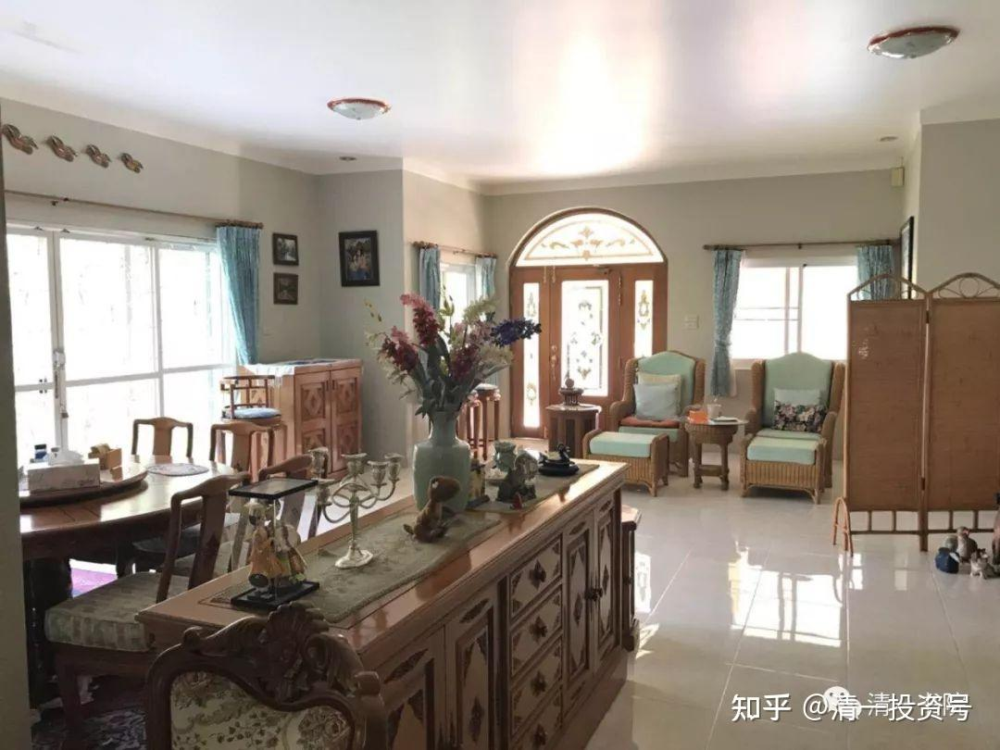

*花园洋房内的客厅一角*

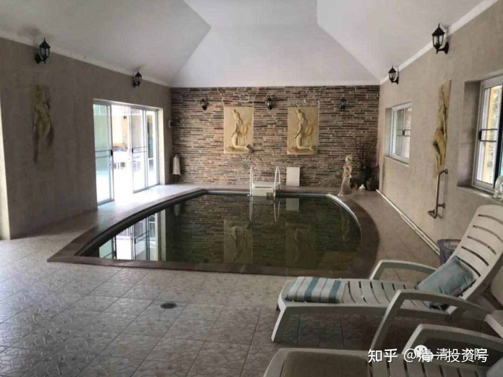

*室内游泳池*

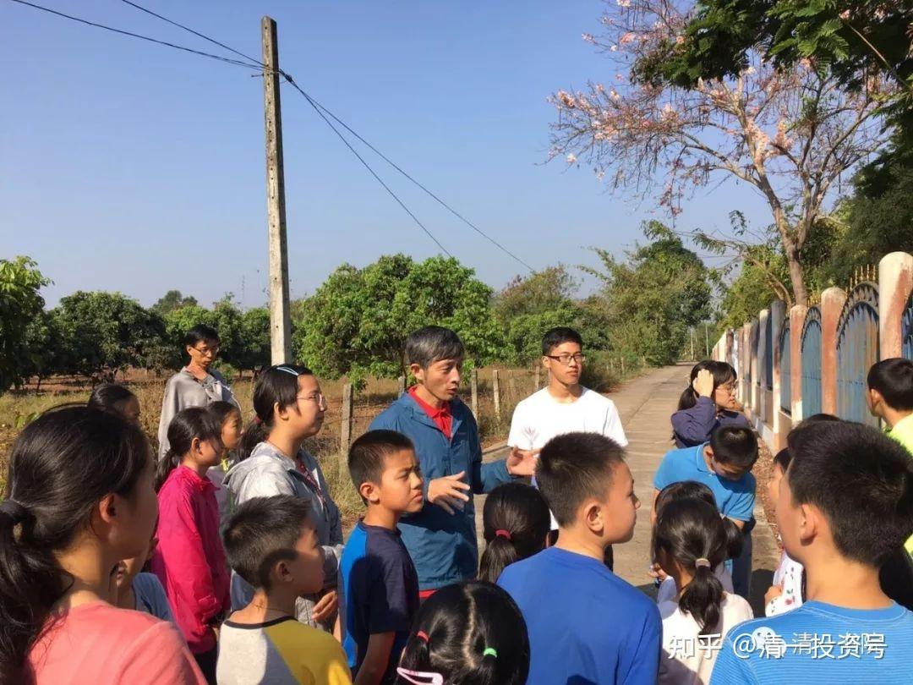

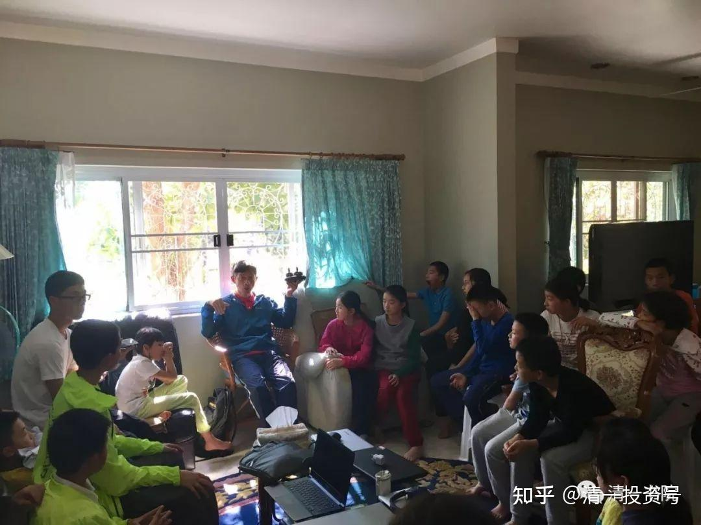

*山长带领孩子们用“侦探式眼光”观察分析前房主一家人的心理个性和生活状态*

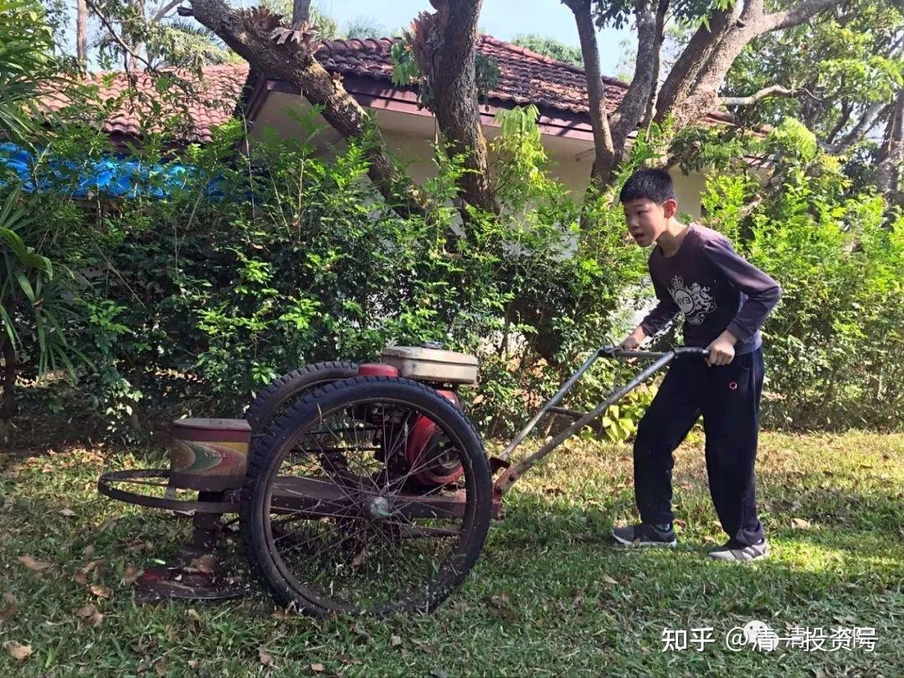

*学会在花园里修剪草坪*

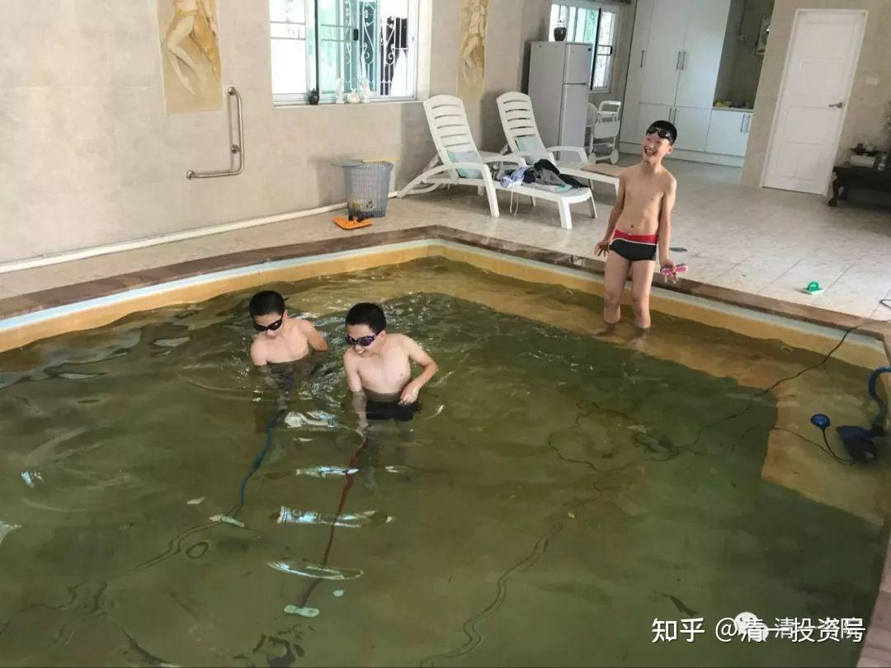

*清理泳池*

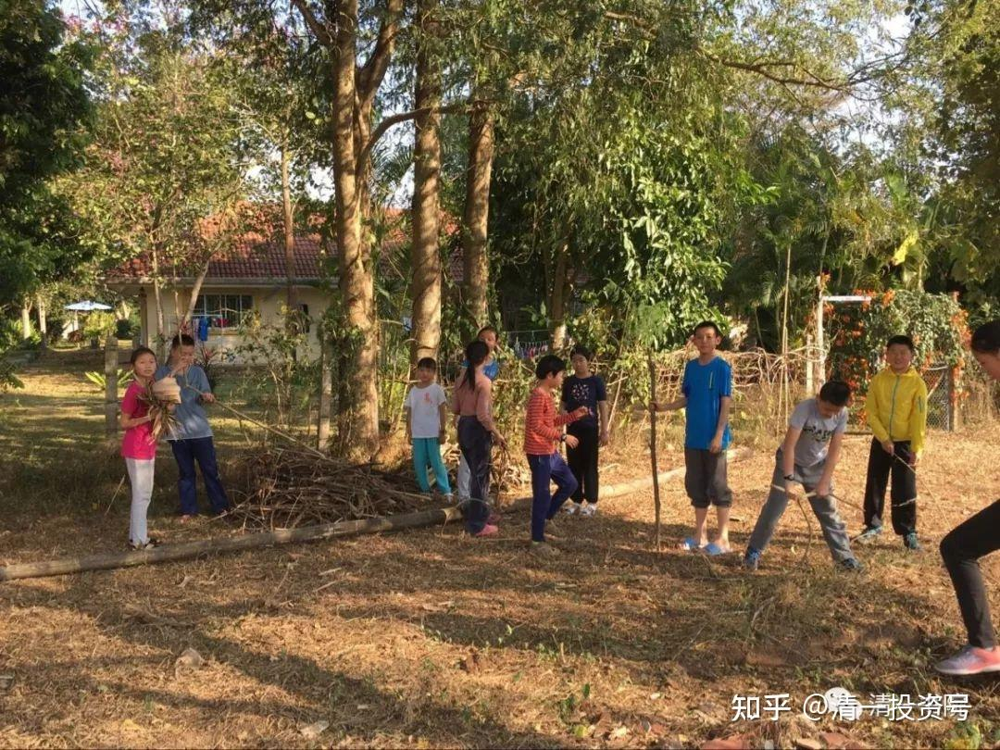

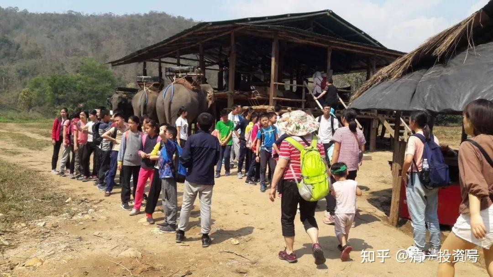

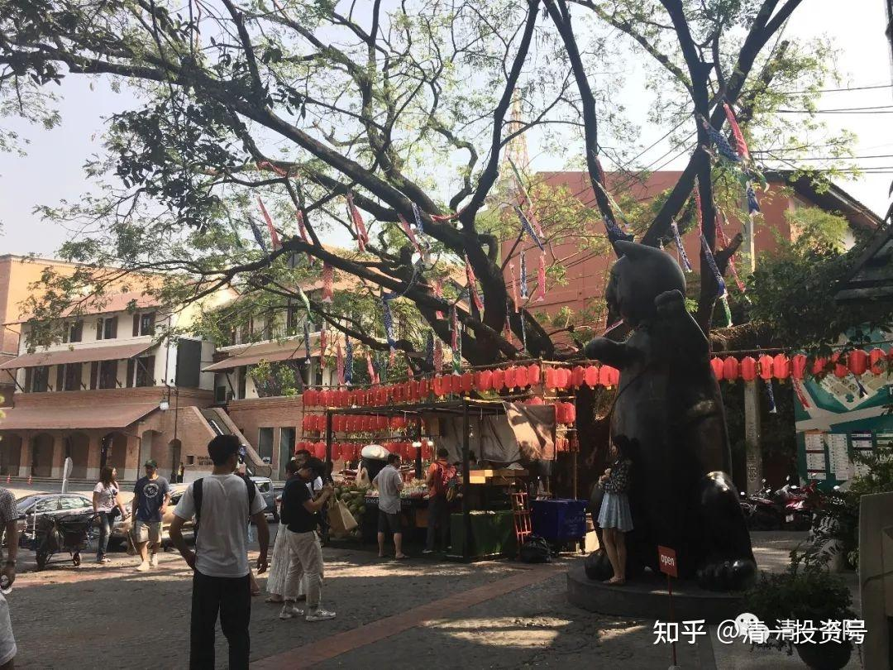

*清迈古城边的宁曼路街景*
