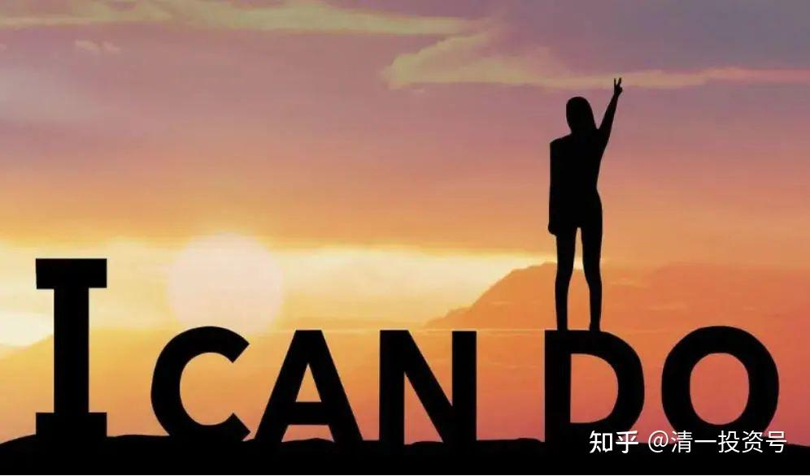
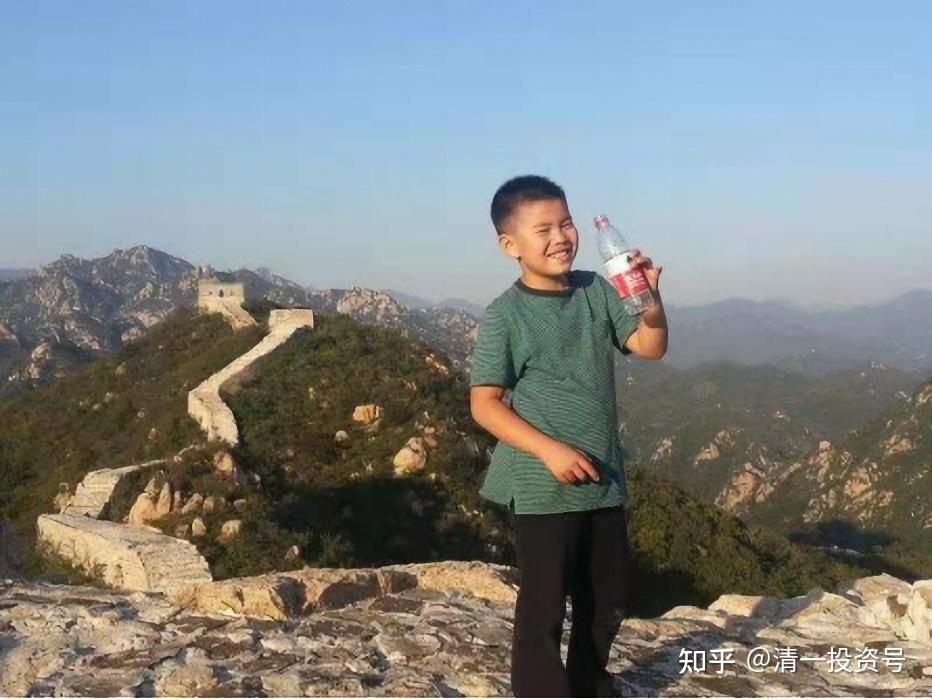
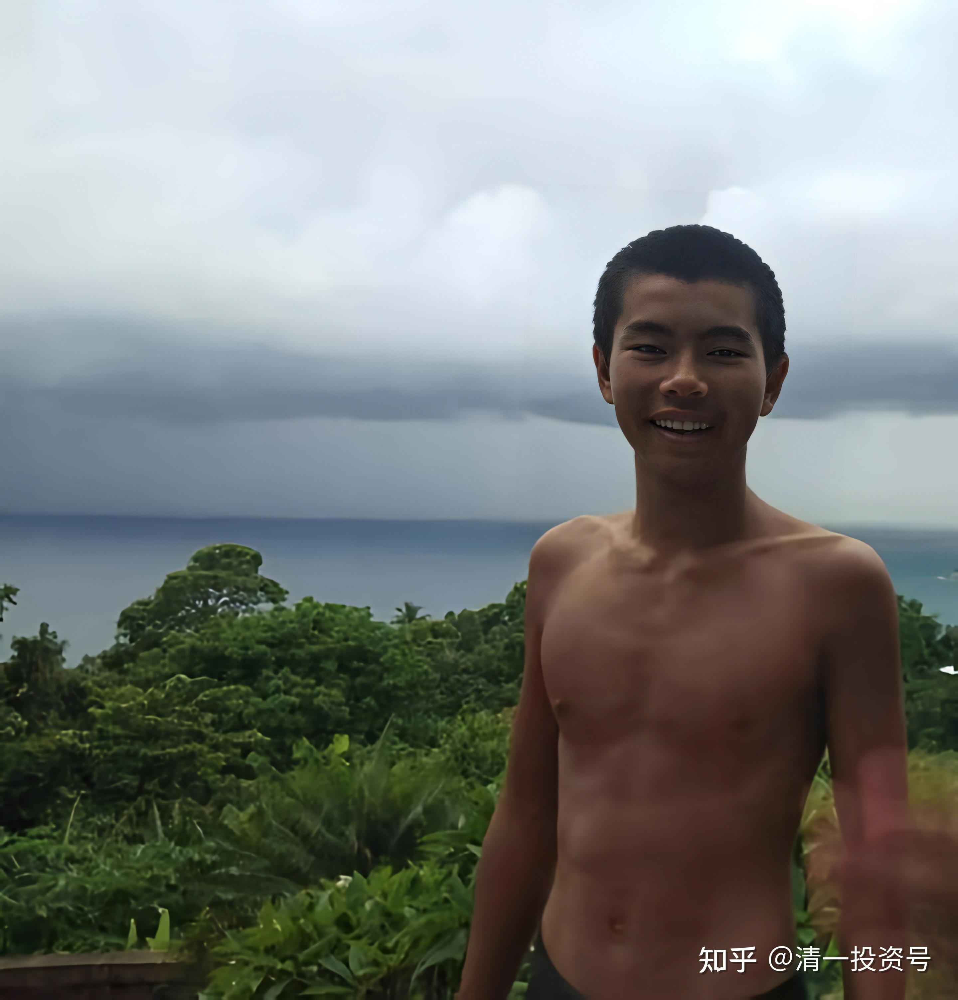
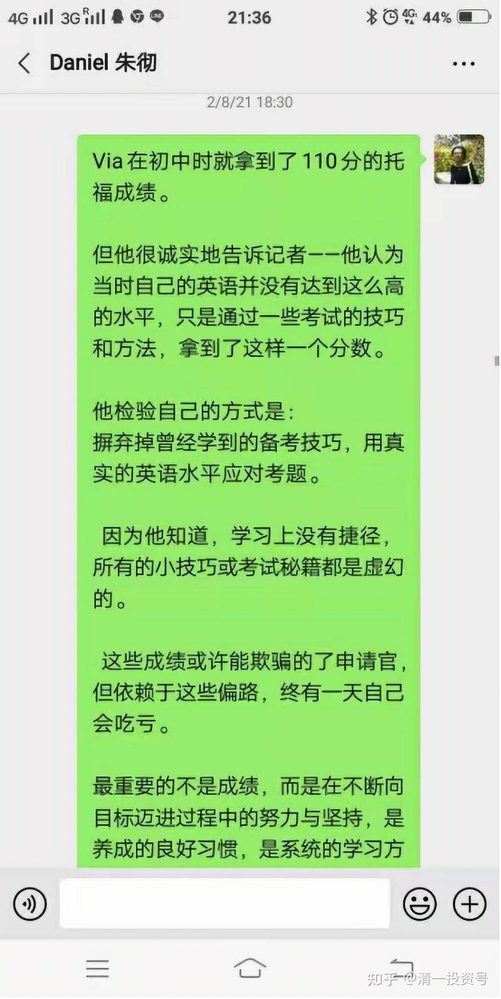
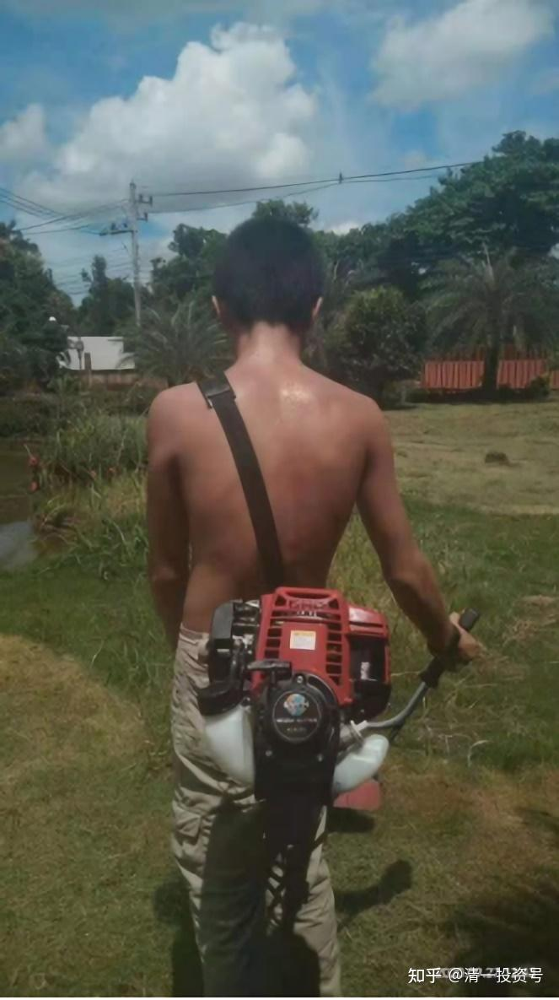
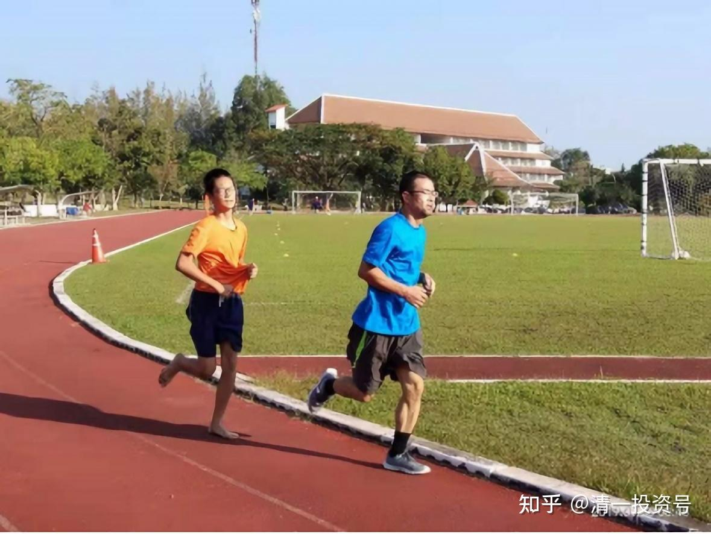
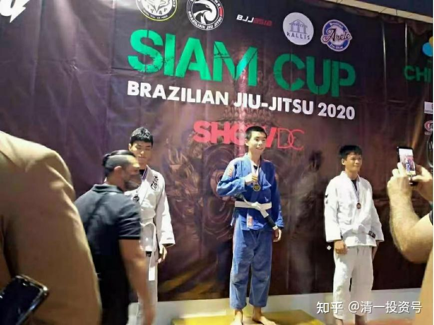
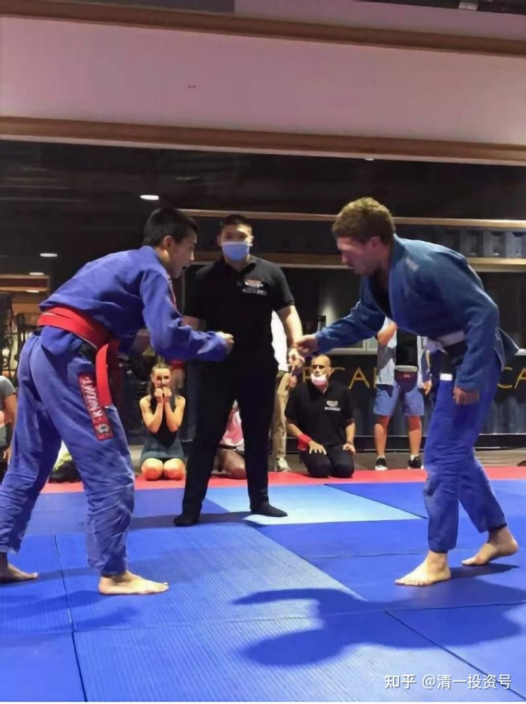

原雪球专栏[185副篇.分流后的逆袭](http://link.zhihu.com/?target=https%3A//mp.weixin.qq.com/s/Uzjna_y4vLAl9TRMExV5Zg)

英语零突破 三语高中 王莉玲 2021年3月30日

[https://mp.weixin.qq.com/s/w7cbUZPxVO3Sv5S92pxJUQ](http://link.zhihu.com/?target=https%3A//mp.weixin.qq.com/s/Uzjna_y4vLAl9TRMExV5Zg)

·朱彻于14岁的最后一个月，在泰国清莱参加了SAT考试。成绩1410分。

·考试前的三个月，他以半马长跑为泰北孤儿参加武术训练发起了募捐活动，半马成绩1小时35分，募集捐款35,000泰铢。

·备考SAT全程“自驾”——没有学习伙伴，没有培训机构，没有应试指导老师，没有普林斯顿、巴朗北美亚太试卷什么的各种刷题。

·没有网络限制，没有电子游戏限制，时间完全自我管理。

作为他的“在家上学”的家长兼老师，在一个多月的备考期间，我们基本没有参与具体学习的内容，只是做一些心理支持。在他沮丧时开开玩笑打打气；在他烦躁的时候陪他看看他喜欢的巴西柔术比赛。

四年前，朱彻从今日英语突破班一期结业，落选晋级名单。

当时考入突破班，他是入选名单比较靠后的。开学第一个月，全班16人，他的伙伴价值排倒数第三；毕业时伙伴价值排第八名，落选分流，作为家长，不可能没有失望，但也是意料之中。

当年，还没有三语高中的影子，孩子唯一能回归今日的机会就是参加半年后挑战夏令营的考评选拔，成为中级班的学生。如果错过这次回归，下次机会在哪里，什么时候，都不知道。

朱彻9岁前，因为我们夫妻俩忙于职场打拼，基本上都是丢给姥姥、姥爷带的，他们几乎把孩子当宠物养。大多数时候，我们下班到家，基本上都是孩子准备刷牙上床读故事的时候了。

我们当然很想让孩子能够半年内逆袭，但理性告诉我们，孩子的问题是从他出生起到至今11岁，长期以来错误的养育方式造成的，半年怎么可能就把整个心理行为模式升级换代、改版重装呢？

*备考一期突破班前的朱彻*

*现在的朱彻*

记得在突破班一期结束前后半年期间，“清黑”发难攻击新教育。一期的同学，我知道的来自北京的有三个，一个有望入选中级班，但中途就退学回到原北京某重点学校；一个完成突破班后来去了国际学校。

朱彻的学籍还在北京三环内的某重点实验小学。孩子从突破班回家后，经常路过，赶上下午自由活动期间，校园里人声鼎沸，孩子们在上网球课、足球课和游泳课等等。但我知道，我们不会让11岁的他再回去，那不是我想要的教育，也不是适合我的孩子的教育，看到突破班优秀的老师和孩子们后，我很清楚未来的教育方向在哪里。

那时我和中途退学的家长妈妈曾有过一次通话，她告诉我她正在考察北京的一所顶级私立国际学校，打算把女儿送到那里。问我怎么考虑孩子的未来，我很明确地说：“我还是**选择新教育**，因为我认为，**如果把每个孩子的18岁以前的人生比作待启航的船舰，那么新教育的核心就是帮助他们建立一套高级的动力和导航系统。**（那时候还没有信念系统这个说法）这是别的教育做不到，也做不了的，因为别的教育重点是往船上装货物——各种知识。”

知识不是不重要，但是在当今的网络时代，只要你有心，到处都可以找到系统学习知识的资源。但是如果你还是蒸汽机动力的船，甚至没有动力的船，能装多少货？能跑多远？又跑向哪里呢？

所以，即使没有回归的机会，作为父母，我们也会继续带着孩子走新教育的路，边学边走。我不认为只有进了今日学堂，才算成功地走上新教育之路。被分流，让我们更清楚地看到自己的不足和未来提升的方向。

走到今天，回头看，总结下来，能够实现逆袭，顺利“回归”，有三个方面我们认为做得比较好：

**一、心理上接受了不确定性，行动上老老实实的补课。**

**新教育只提供动力和导航系统及安装指导，操作必须由父母和孩子来共同完成。**在孩子成年以前，父母这个角色本质上就是无限责任公司的唯一股东。是不是一定会安装成功，我们也不知道。就像当年我28岁，厌倦小城市的天空，只身一人来到北京，只有一个10公斤的手提箱。在向北京和上海的全球500强公司发出上百份杳无音讯的求职简历后，不知道自己能不能留下。

我决定换个求职方法，不走寻常的路，用我能找到的信息直接找到高层。结果我得到了面试机会。然后，我一文科生进入了IT公司；10年后，我成为全球500强公司一个事业部的全国销售总监。当时向我汇报的部门经理，毕业的院校比我的响亮，常春藤康奈尔、北大等等，有的岁数也比我还大。

**方向对了，加上努力和机遇，你才有可能实现目标。**但理性的人会知道，**不是所有的努力都有等值的回报，教育尤其复杂。**

人类本能地厌恶不确定性，源自在百万年前的狩猎采集时代，不确定性意味着生存繁衍的机会无法预测，不能保障。

**人们依赖和迷恋体制，是因为那里的确定性，尽管对大多数普通人来说，那个确定性带来的更多的是一眼都望得到头的人生和大概率成为少数成功者底下的无数分母之一，但人多的路安全啊！**

我的职业生涯让我知道，这个世界唯一不变的是变化，百万金额的合同，签字盖章执行了，中途被推翻；欣欣向荣的公司，突然因为母公司现金流困难而被出售了；才登台准备大展身手的CEO得癌症了……

我喜欢万维钢老师的新书《你有你的计划，世界另有计划》，看名字就知道：你无法掌控，只有适应不确定性。

因为**能够接受不确定性，我们对孩子的教育成果没有那么执着。精英也好，平凡的人也好，只要价值观正，身体好，有终生学习的习惯，作为“股东”，我们就算赚了**。**如果能成为飞机中的战斗机、轮船中的巡洋舰，那我们就大赚了。**

**新教育已经给我们的人生打开了一扇门，山长的引领、突破班的示范、今日家长的分享，太多值得学习的东西了，跟住了，只要自己中间不掉队，不走岔路，大赚有很多不确定性，但实现“赚了”的目标并不难。**

**执行新教育理念，先从运动开始抓起。身体先行，身体调整到位了，心灵也会有相应的变化。**那就先从跑步开始。

原来跑10公里很费劲的朱彻，突然速度提升很快，后来发现他和别的同学串通好，两人轮流换着拿跑步记程手机。一人跑，另外一个人休息，隔段时间再换。

运动不合格，没有饭吃；偷泰国邻居家的椰子被社区保安发现；偷拿超市的东西，被我们发现零食包装纸，承认多次拿了多家超市的东西。

问喜欢做什么，答：“喜欢偷打游戏。”给他充分体验的自由，他则一口气打了35天，足不出户，夜以继日，不眠不休。

原来，他觉得从初级突破班被淘汰了，反正我也努力了，没晋级不是我的错。我应该恢复早先的那种舒舒服服的爽日子了。

各种问题，此起彼伏。

因为接受了不确定性，所以问题出现，我们也能接受，问题越早暴露，越有可能矫正。我们甚至庆幸自己选择了新教育，否则孩子已经被体制学校当成学渣处理了。

因为能接受，所以也没有急吼吼地到处去抓求灵丹妙药，“回归”今日，那是别人家孩子的事。

记得山长谈新教育出路：**“如果孩子15岁没有明确的读书意愿，就进入社会吧！学个技能，养活自己。等18岁醒悟了，愿意学习也不见得就晚。”**这个思路我们很认同。他若不醒悟，我们是无法唤醒他的。**每个人的人生，都要自我负责。**

11岁还学不了专业谋生技能。家里的保洁辞退，先从保洁干起，作为学习和体验吧！以他的工作质量，综合保洁的市场工资给他结算。但在家的吃、住、用都按实际生活费用扣款。

不到一周他就苦不堪言。因为忙乎5个小时，扣掉工作不合格的钱，他只能顿顿吃馒头，睡在北京夜间零摄氏度以下的阳台，持续了一个多月。

说不喜欢做家庭保洁，喜欢户外，那就去珠峰无人区体验，高山反应严重，他两周掉了10斤肉。

珠峰下来，就直接徒步每天近30公里，背着七、八公斤的衣物电脑，从昆明徒步到今日挑战夏令营。

12岁后所有零花钱自己挣，短裤、袜子都是自己买。步行10公里去清迈古城找工作，找不到工作没有饭吃。因为不能雇佣外国人，更不能雇佣外国孩子，所以被拒绝了无数次。终于找到了工作，辛苦一天，还得走路10公里回家，除非他以前有运动积分可以兑换接车券。

因为打电子游戏，再次去长满荒草，只有蝉鸣陪伴的院子割草一个月。

总之各种苦日子，他不提学习，就绝不给他学。提了却不好好学，再“回炉炼”。

期间我们成立了清迈新教育学堂，类似这样的日子，断断续续近两年。

这个过程中，他肯定觉得自己过去的选择只是让日子越过越苦。直到他看到一个铁人三项赛的宣传视频，自己主动提出要挑战成人铁人三项赛。他成为学堂唯一完成全程的人后（别的同学游泳1.5公里未完成），自信和成就感油然而生，清迈巴西柔术公开赛，他在同带位组有了全胜成绩，这个时候好胜心和目标感慢慢地就起来了。

在此期间，我们适时地给到他有效的心理引导，帮助他重新确立自我的“身份”认同——我是强者。

然后半马、全马，陆续就跑下来了，他感受到自我超越的极致体验。

打工的饭店，开始说好只管饭的，但两周后，老板给了他两千泰铢，口头承诺：“任何时候都欢迎你来工作。”离开的时候给了他一封推荐信。

新冠爆发前13岁再次打工，他很快就找到一个高级律师开办的墨西哥餐厅的服务生工作。原因是：我直接找到了大老板。被拒绝那么多次，我知道怎么搞定老板了。两周后离开，老板说：“你任何时候回来，我都给你正式员工的工资。”

自尊尊人不是说说那么容易。

**自尊是自己行动“挣”出来的，不是父母的爱“给”出来的；尊人，先得把原来自卑又自大的自我ego给打掉。**

**不过这个过程中，我们始终给到他足够的心理安全感——他知道：尽管我做了那么多蠢事，父母都坚信，我是“好”的，我是“行”的。我被狠狠地教训，是因为我做了傻事。**

适时的电影课，让他看到不同的人生和选择以及背后的模式；当年突破班晋级的优秀同学的成长分享，激发他清晰自己的目标。

基本上到了13岁左右的时候，他的心态有了明显的变化，心沉下来，踏实、耐劳，逃避、钻空子的事慢慢少了。

因为疫情，同学进不了清迈，他感觉很孤单。那时候我们给他两个选择：一，回体制学校，那里有的是同学。二，争取考入今日，那里有你喜爱的老师和更优秀的同学。

他很明确：“打死也不回体制。”小学四年的体制学校，他自己感觉是个噩梦。

没有退路，心性调整上一个台阶了，再学习，进展就很快。

快14岁时开始在可汗上自学数学，碰上问题找我们。不会告诉他方法和思路，爸爸高考数学差一分满分，从来不给他主动讲课。除非他自己用心琢磨，如果就是卡在某个点上了，适当给点拨一下，走通只能靠自己。

基本上是自我驱动、自己啃，一年的时间完成了美国12年的数学。（平均每天学习数学不超过三个小时）。

记得挑战全马的时候，清早开跑，到35公里的时候，那天是个大晴天，清迈地面气温已经超过37摄氏度。作为保障人员，我感觉这样下去会脱水严重，劝他到此为止，没想到我被拒绝了三次，他坚持跑完了。

完成SAT数学学习，对他来说，是和全马差不多的面对心态——咬住目标不放弃。

那一年读了十几本英文原著，每本都是百页以上的。其中《终生成长》对他触动较大。浮躁的时候，只做《沉思录》英文版的翻译。

实际上他到12岁为止，自己读了几本历史主题的漫画书以外，基本上没有阅读兴趣，更别说纯文字的书了。

关于如何引导孩子喜欢上阅读，成为终生阅读者，为SAT考试打好基础，我会再写一篇文章在学堂公众号，专门做个总结和分享。

因为能够接受不确定性，愿意自我负责，整个学习过程，**我们始终更关注孩子的学习目的和过程而非结果**：**是为了通过SAT考试进入名校而学，还是为了成为真正厉害的人而学，前者是表现型目标，后者是成长型目标。**

在SAT考试前一个多月，他停下了持续一年的读书，开始备考。第一次模考数学满分，但阅读失分较多，因为阅读速度不够，语法失分更多。因为从他开始学习英语，所有语法学习加起来不到两个小时。

这个时候，他开始自己找备考攻略，发现有培训机构承诺：1个月提分100分，达不到退款。费用也不算太高，不到600美金。

他提出来要我们付费，用培训机构来帮助备考。那时候我们在外面办事，只给他回了一个信息：

“朱彻，Via在初中时就拿到了110分的托福成绩。但他很诚实地告诉记者——他认为当时自己的英语并没有达到这么高的水平，只是通过一些考试的技巧和方法，拿到了这样一个分数。

他检验自己的方式是：摒弃掉曾经学到的备考技巧，用真实的英语水平应对考题。因为他知道，学习上没有捷径，所有的小技巧或考试秘籍都是虚幻的。这些成绩或许能欺骗得了申请官，但依赖于这些偏路，终有一天自己会吃亏。
最重要的不是成绩，而是在不断地向目标迈进的时候，过程中的努力与坚持，是养成的良好习惯，是系统的学习方法。”

回到家，爸爸对他说：“凡遇大事，碰到困难，自己还没有尽最大努力，就到处找捷径，有依赖心理，那么即使你侥幸SAT过关考入今日，你的未来大概率不会改变，有这个心理模式，谁也改变不了你的命运；但反之，如果你勇于面对，把这个当作锻炼自己、提升解决问题能力、成长自己的机会，即使因为分数憾失今日，你依然拥有了主动把握自己命运的强者思维模式和行动力。”

自尊尊人，相信自己，敢于面对努力之后的失败——如果只是课上讲得好，而不是落实到实处，孩子知道你只是在讲道理。

结果是，他自己全搞定。

期间我试图给他补语法，因为他连什么是主语、谓语都搞不清楚，可无论是我讲还是看新东方老师视频，他一听“主谓宾定状补”就犯晕，决定自己用自己的方法摸索，据他说，可汗学院的讲解对他帮助很大。

即使在备考的最后一周，运动和家务、劳动都和平时一样。

**学习是自己的事，作为家庭的成员，每个人都有该尽的责任**。模考一次三个多小时，轮到他做饭，他就提前焖上蔬菜饭，定好时间提醒，半小时后，闹钟一响冲出来关火，再回去接着考试。

自我负责的意识，在他备考的点滴日常中，没有被松掉。

在我们的理解中，新教育的思想需要落实在日常点滴，SAT考试只是个载体。

我们相信，这个学习过程，他会收获很多考试成绩以外的东西。

**二、夫妻同心协力，以身作则**

因为何光宇老师，我得以知道新教育，在学习过程中得到了他的不少指导。孩子爸爸工作忙，只是听我唠叨的多，没想到他比我更快地接受了新教育理念。在共同学习和实践的过程中，他给我全然的支持和配合，也有引领。

他不擅言谈，但做事时，理工男的严谨、踏实、周密的特点很突出。他没有高远的梦想，但对当下总是投入专注；对未知较少恐惧，所以对不确定性我们三观一致，配合比较默契，有观点分歧的时候，会有争执，但不影响互相信任。

因为关注当下，他对孩子未来没有那么多期望和幻想，因为较少恐惧，他比较能接纳孩子真实的样子。

**实践新教育以来，他有一个清晰的行为准则：我做不到的，也不强求孩子做到。我做到了，他也可以选择不做，但是不做有不做需要承担的后果。**

刚开始学习新教育的时候，他还未离职，身高1米75，体重近170斤。因为小的时候从高处跌落，他的膝盖受伤严重，曾因此休学1年，成年后怕旧伤复发，运动较少。

现在体重不到140斤。从10公里，到半马，到4小时内跑完全马，他都是要求自己先做到，再引导孩子们去做。

先是跑步，后来开始练武。清迈没有教授太极的老师，所以我们选择巴西柔术。

巴西柔术的原则是“以弱克强，以柔制刚”，作为全馆年龄最大、身体最僵硬的学员，实战习惯用蛮力，结果自己很容易受伤，体能消耗更大。有一段时间，全身关节没有不伤的，领悟也很慢，对手都不爱跟他练，练习一年半，学一个新动作还慢到老师有时候都对他失去了耐心，当众说他是“僵硬的中国人”。

他曾经为此一度很难过，但他从来没说要放弃。伤稍微好一点就接着练。

他认为，天天给孩子说练武好，这么好的东西，自己都不想要，那谁会相信是真的好。

每次训练，他都会出汗到重达2.5公斤的训练道服全部湿透，他想提升训练量，增加体能，累到淋巴结发炎肿成大块，整夜发烧。

而且，他一练就真投入，每次从馆里回来我问他：“孩子练得怎么样？”他最常的回答就是：“没注意，我就专心练我自己的。”后来我干脆不问了。

现在，有些动作，他能比年轻人学得快，老师会让他给大家做示范。

**身教大于言传；潜移默化，润物无声，我想这就是父亲带给孩子的影响，用行动，让孩子知道什么是坚韧，什么是成长型思维——不在意外在评价，专注自己的提升。**

我喜欢运动，练习瑜伽有九年，每个月只有一天休息，出差期间也保持。爱读书，曾经有乘坐地铁时读书过于专注，到站自己下车，全然忘记7岁孩子还在车厢里的经历。遗憾的是，那时候读的闲书多，走入新教育后，才真正读了些好书。

因为我们对新教育的理念共同认可，方向一致，孩子在调整期没有空子可钻。双方老人对我们教养孩子的方式有异议，但经过争取，也能完全尊重并支持我们的做法。

总之，我们比较幸运，双方的原生家庭都属于相对正常健康的那一类，学习践行的过程中，障碍、干扰和阻力比起周围的很多人要少。

孩子因此受益，不纠结、不分裂，能量可以更好地用在成长自己上。

**三、练武**

关于练武对人的精气神的影响，我就不用多说了，山长已经讲得很清楚了。

朱彻到清迈后开始练习巴西柔术，至今三年。期间断断续续，不好好练就会被剥夺，去打扫卫生，或者做一些更加枯燥的运动。

相比之下他觉得练武还有趣点，至少道馆里有来自世界各地的人，还不用面对爹妈的“臭脸”。

他自己说，能坚持下来，在今日突破班和夏令营的那段时间，老师的熏陶也有很大的影响，他因此知道练武可以让自己变得更强大。

同时，孩子也很幸运，教过他的教练个个对巴西柔术满怀热爱，精进、自律，重视武德，喜欢帮助别人成长。圣诞期间，教练还安排他见到了来泰国旅游的巴西柔术蝉联世界冠军Felipe（费利佩），冠军耐心地回答了他所有的问题。

青春期的男孩需要英雄偶像，他们通过认同厉害的英雄来找寻自己的目标，通过观察和追随“师傅”来找到自己的内驱力量。

青春期的男孩需要某种活动来释放自己骤增的睾酮激素，巴西柔术实战，代替了电子游戏战场帮助朱彻释放了自己的压力和攻击性。

巴西柔术被称为“人体象棋”，实战和比赛中，逃避就会被动，犹豫就会挨打，情绪波动就会让对手更快地找到破绽，鲁莽就会钻入对方的圈套，不认输就可能被卸掉关节。整个过程，怎么可能不专注。

持续的训练很好地锻炼和提升了他的专注、果断、情绪控制和行动力。

原来除非打游戏，否则半个小时坐着都不容易的他，突破数学的时候，一两个小时都不觉得乏，SAT模考一次三个多小时，他也没觉得有什么累的。

现在，他已经喜欢上练武。

*泰国Siam（暹罗）杯巴西柔术全国公开赛*

*主动在公开赛挑战成人*

我们一家都很幸运，孩子起步较晚，但在后来转折的关键时期，走上了新教育之路，期间得到了很多人的帮助，何光宇老师，原突破班老师张明善，自立学堂堂主盛静美、靳老师等等，都在我们需要的时候给到了宝贵的指点。感谢山长成立了今日三语高中，让孩子有了明确的努力目标，感谢所有曾经帮助过我们的人！
