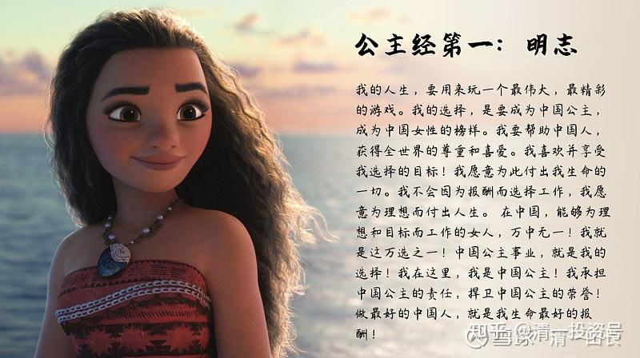

原雪球专栏[186篇.你在同龄人中的竞争力，将自动与社会层级和收入匹配！](http://link.zhihu.com/?target=https%3A//xueqiu.com/9310099567/188060663)

清一山长 2021年7月1日

潍柴动力的股东会议报道：“车间的一线工人收入在五千到一万之间。而研发人员的工资水平，本科生一万，硕士一万五。博士一个个谈，五十万安家费。不管是本科还是硕士，都只要211和985的。”

两个关键词：

第一是：工人的收入与大学本科生其实差不多。高级技工不亚于大学本科生。这些企业里面的所谓研发人员、技术人员本质上也只是一个流水线上的工人，还不是真正的白领——管理人员。

第二个要点是：就算是只去当一个技术员，你原来上的大学也是很重要的。批量招收的本科生和硕士生，都只要211/985毕业的。勉强像样一点的企业，其实都这个要求。符合这个要求的毕业生，每年大约50万人左右。我上大学的这一年（1980年），全国的大学生总共也只有28万人。但我出生的这一年，是2934万人口降生。我一出生，就要和比现在多一倍多的人口竞争。当年，就算只考上一个普通的大学，就等于战胜了99%的同龄人。所以，当年的确考上大学，工作不愁。但现在，每年就出生1500万左右。去年的出生人口，才1200万人。而最近几年，其中的700～900万人，都可以考上大学，说明大学的入学人数，兑水很严重！

其实，上述的企业招工要求，可发现：文凭并没有贬值，社会依然给现在3%左右的优胜者很好的就业机会。是你没法用上优质的大学，来证明自己是3%的人选。**只有211、985才可以算是真正的“上了大学”。**别以为去拿个渣渣大学的文凭出来骗人，也可以冒充中产，没用的。特别是未来内卷化，中国不再高速发展，而是存量博弈。这种情况下，需要的大学毕业生就更少。普通大学毕业生，真没机会。所以，国家限制高中入学，推职业教育，其实就是保护你不要被渣渣大学收割了青春和金钱。

中国家长对此情况，最好心中有数。如果你孩子不是属于同龄人中5%以上的优胜者的话，未来就做好准备，别去想啥中级管理，白领工作，好好地当蓝领去吧！能自食其力就不错了。读书改变命运是不错，但你先证明自己在什么级别。别以为拿个大学文凭就出来骗人？社会没这么傻的！蓝领技术工人的收入，其实不会比普通大学生更少的。甚至民工的收入，都很可能超过大学生。

**今天上午我给公主夏令营的学生上课。第一课就是：幸福的秘密。**

答案很简单：**人生幸福的秘密，就是要去找到一个比你更重要的对象（不一定是男人），然后用你全部的生命去浇灌它！你的这一生，就可以过得充实和快乐。**

当然，**道理很简单，做出来很难**。这一周，孩子们的任务，就是去**找到“比自己更重要”，而且自己愿意用一生去服务的人和事情**是什么？会有大量的交流和互动，来帮助孩子们完成自己的塑造。

其实，聪明人知道：这种讲法，就是《公主经》第一讲——明志！

**人，没有志向，是无法立起来做个“大人”的。**在这个普遍没有追求和理想的时代，你能够有追求，有理想，你就很容易成为3%的优胜者。甚至是万分之一的优胜者！**《公主经》的要求，就是培养万分之一的优胜者。**

小公主们，将从电影角色中，人们的一生生活中，找到自己最喜欢的角色和位置。

如果她们能找到愿意为之付出生命的理想，她们的人生就是成功的、灿烂的。如果她们能找到愿意为之付出生命的人，她们就是有爱的、幸福的女人。

马斯克不创造和发明新的东西就会死！乔布斯不能改变世界就会死！乔丹不能打球就会死！《摔跤吧！爸爸》里面真实人物的堂妹，拿不到世界冠军就会死（真死了，前段时间[比赛失败自杀了](http://link.zhihu.com/?target=https%3A//www.sohu.com/a/459083486_220299)）。这些人，正在创造奇迹。活着的每一天都很充实和幸福。

所以——**去找到比你生命更重要的事物吧！没找到，你真的白活了一生。**

这一切，从**“明志”**开始！有三个班的学生，选了“莫阿娜班”——明志班；一个班的学生，选了花木兰班——勇气班；还有白雪公主班——温柔可爱班、兔朱迪班——挑战自我班、灰姑娘班——善良正直班等可以选。

**《公主经》第一：明志**

**我的人生，要用来玩一个最伟大，最精彩的游戏。我的选择，是要成为中国公主，成为中国女性的榜样。我要帮助中国人，获得全世界的尊重和喜爱。我喜欢并享受我选择的目标！我愿意为此付出我生命的一切。我不会因为报酬而选择工作，我愿意为理想而付出人生。在中国，能够为理想和目标而工作的女人，万中无一！我就是这万选之一！中国公主事业，就是我的选择！我在这里，我是中国公主！我承担中国公主的责任，捍卫中国公主的荣誉！做最好的中国人，就是我生命最好的报酬！**

**参考链接：**

[【清一大学少年班】走进我们的日常生活](http://link.zhihu.com/?target=https%3A//www.bilibili.com/video/BV1Hr4y1K769)

[这就是今日学堂](http://link.zhihu.com/?target=https%3A//space.bilibili.com/487498588/channel/detail%3Fcid%3D149241)

[今日明师荟](http://link.zhihu.com/?target=https%3A//space.bilibili.com/487498588/channel/collectiondetail%3Fsid%3D55359)

[清一大学武医学院](https://www.zhihu.com/people/mkaga)

[明仪：美国大学破产潮 与未来教育原型车：清一大学](https://zhuanlan.zhihu.com/p/355549755)

[67篇.一生的教育规划：用稀缺性原理成为人生赢家！](https://zhuanlan.zhihu.com/p/555240782)

[68篇.我以为考上了985，就不愁找工作！](https://zhuanlan.zhihu.com/p/555244021)

[敬请查阅：比欧三语首届毕业生成绩单](http://link.zhihu.com/?target=https%3A//mp.weixin.qq.com/s/RoyjFZVfB4ybK6NL2-PYjQ)

[85篇.未来世界需要跨国际，跨文化，跨专业的综合人才](https://zhuanlan.zhihu.com/p/563658774)

[104篇.踩着别人的尸骨入坑，还是踩着自己的血泪前进？](https://zhuanlan.zhihu.com/p/570447582)

[121篇.千万大礼，送给穷人会是啥结果？](https://zhuanlan.zhihu.com/p/577842173)
