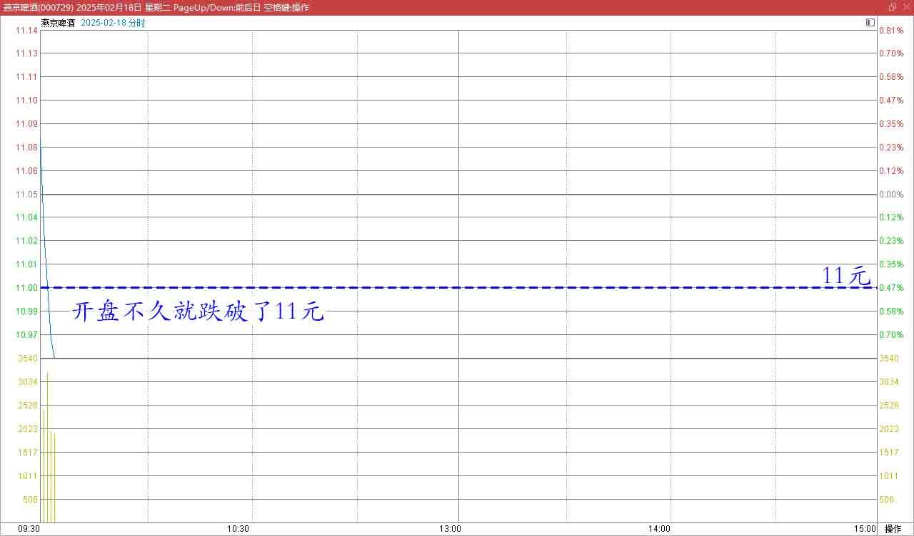
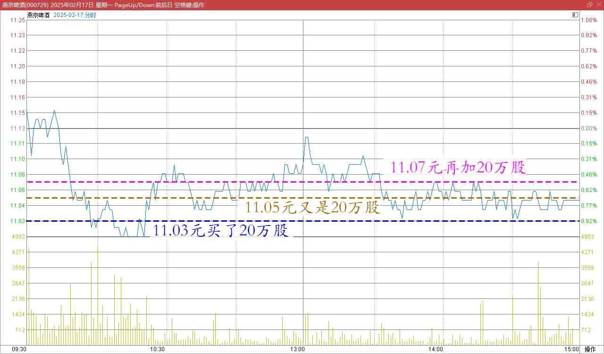
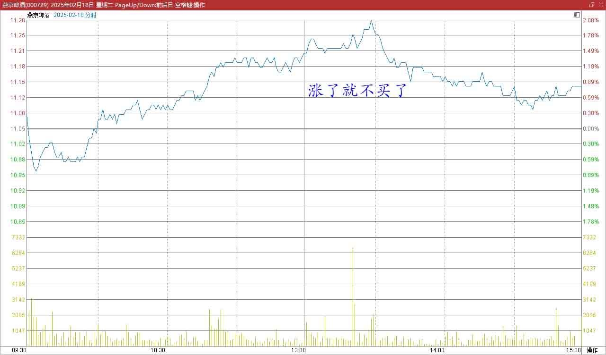
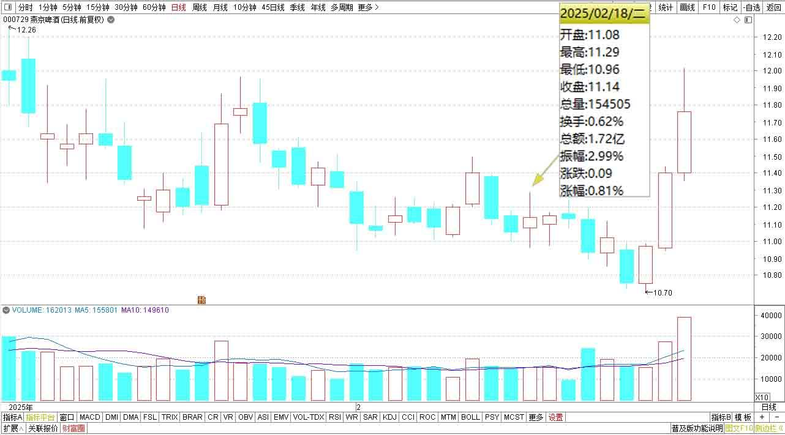

133篇.燕京跌了又涨，我没买也没卖

[清一山长2025年2月18日13:36](https://www.zhihu.com/pin/1875176886625263616)

今天一早，看到燕京开盘不久就跌破了11元。

燕京啤酒2025年2月18日开盘3分钟的分时图

我有点发楞：昨天几乎把子弹都打光了，账上多买了60万股燕京。分别是11.03元买了20万股，11.05元又是20万股，11.07元再加20万股。

燕京啤酒2025年2月17日分时图

现在居然直接破11元？玩得有点大了。正在想哪里去弄点钱来再买一点，还没等我弄到钱，现在就涨了——涨了就不买了，但我也不卖。现在刚买入的这60万股，我也没想多赚钱。只要市场先生给个一块八毛的，我就走。剩下的陪着主力慢慢熬。

燕京啤酒2025年2月18日分时图

燕京啤酒2025年1月～2月日线图

（标题、图片为编者所加）
**文章音频**：

[541篇. 燕京跌了又涨，我没买也没卖](http://link.zhihu.com/?target=https%3A//www.ximalaya.com/sound/817063880)

**参考链接：**
[125篇.卖出燕京、珠江，买入百威亚太](https://zhuanlan.zhihu.com/p/13640234438)

[126篇.卖出快涨的燕京，买入惠泉和百威](https://zhuanlan.zhihu.com/p/14007881655)

[127篇.差价1.7元，惠泉换珠江](https://zhuanlan.zhihu.com/p/15010761184)

[128篇.大多数散户都出局了！](https://zhuanlan.zhihu.com/p/19370680113)

[129篇.啤酒切换——买跌不买涨，卖涨不卖跌](https://zhuanlan.zhihu.com/p/20437542120)

[130篇.无意中发现原来证券系统还有这个功能](https://zhuanlan.zhihu.com/p/23675222317)

[131篇.跌破11元买燕京，差价两元换珠江](https://zhuanlan.zhihu.com/p/24939243244)

[132篇.盈亏数百万都是假的，啤酒切换才是真的](https://zhuanlan.zhihu.com/p/26380209616)

