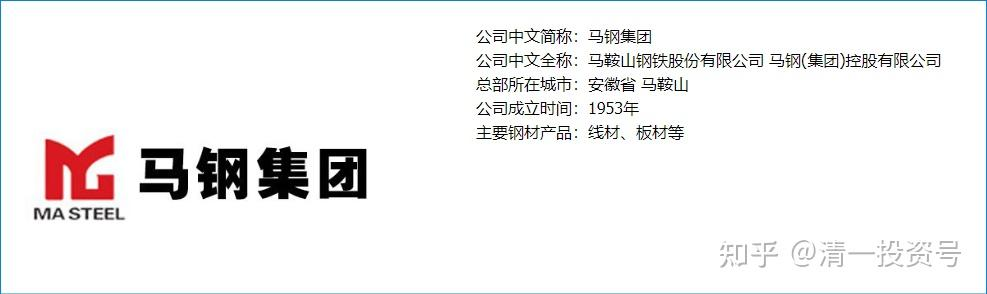
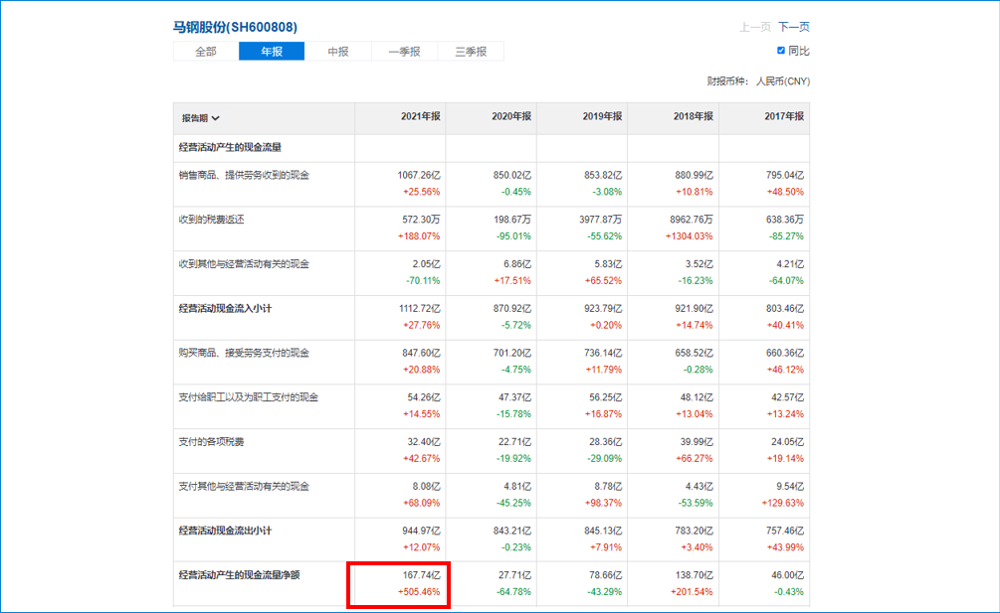
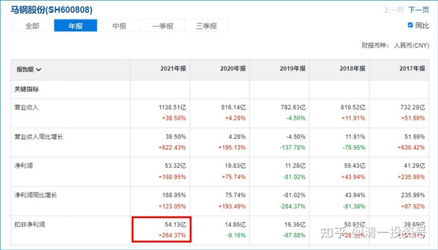
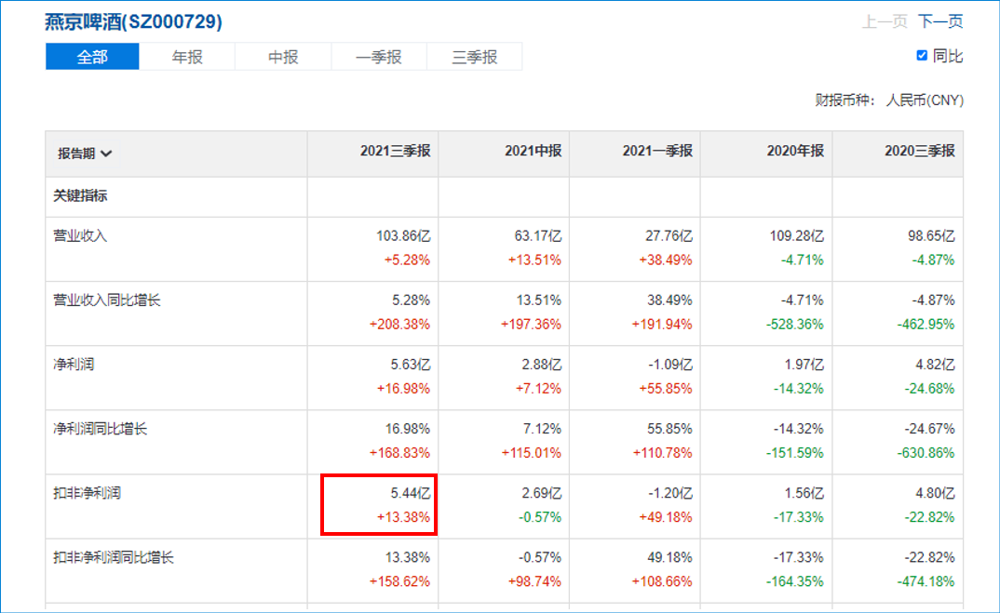
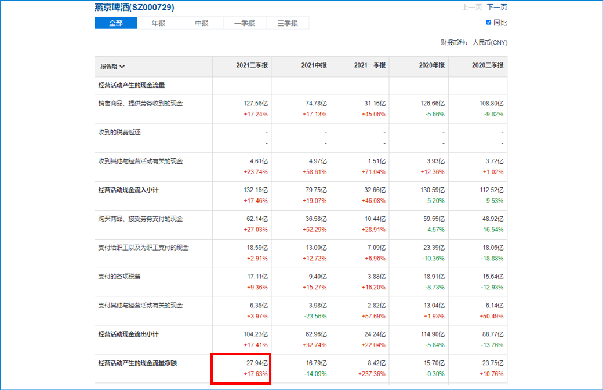

13篇. 马钢的现金流涨了5倍

清一山长 2022年3月29日

马钢2021年报——现金流167亿，太夸张了……只能说为了股权激励，利润藏的太猛了……利润54亿，涨幅2.6倍，而现金流涨了5倍……去年现金流才27亿，今年167亿……

点评：去年一年的现金流入差不多相当于市值。利润可以做表，但现金流才是核心收入。怎么算成本的问题。燕京的利润不高，但现金流很大，这种基本上就是藏利润。未来股价涨了，利润释放，看起来利润暴增，反而是走的时候了。藏利润的时候，就是进货的时候，长持品种。

*（马钢2021年报现金流）*

*（马钢2021年报利润）*

*（燕京啤酒2021三季报利润）*

*（燕京啤酒2021年三季报现金流）*

