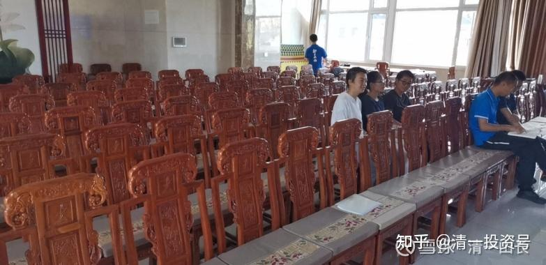

[原雪球专栏](https://zhuanlan.zhihu.com/p/584680330/edit)[193篇.【美国高中国际证书班】10月份正式开启](http://link.zhihu.com/?target=https%3A//xueqiu.com/9310099567/190493738)

2021年7月15日

新教育由于教学方式特别，不跟随国内体制教育的工业化流水线模式走，虽然大大节约了教学时间，提高了学习的效率。但由于小学阶段我们不关心学籍，也不发小学文凭。也给一些家长造成了——“新教育就是没有文凭和学籍的教育”的错误印象，简单粗暴而行弱智的判断。加上我们有一些毕业生不愿意去上大学，直接就业了。家长们会以为是我们的学生上不了大学——这是大笑话的。完全不同的等次，我们新教育的高中毕业生，985大学都不是对手的。

清一新教育，只是不需要每年按部就班的一年级、二年级的走流程，把孩子变成机器。等您到了高中阶段，我们会自动帮您处理好学籍和文凭问题的。根本就不需要从幼儿园、小学一路跟上来。您完全可以获得比体制学校更全面，更优胜，更有权威的文凭和学籍。说实话，你们花时间，费精力，甚至费大钱，一定要去拿个体制内的初中文凭、小学文凭，有啥用？更关键的是——**如果最宝贵的基础教育阶段没教好的话，孩子就全废掉了，以后再好的老师也教不出来的。就像是烧废掉的瓷器，您想回炉烧吗？只能打碎了当废物，连做回炉材料的机会都没有。错误的体制教育，往往固化了孩子的思维，而且培养了厌学思维，除非家长特别辅导，家庭教育做得好，三观比较正，否则大量的孩子15岁前后就出问题了。所以，越早进入新教育，对家长价值越高。**

**进入新教育的方式，不一定要去某学堂，家长可以在家里按照示范班的公开网络课程，按照新教育的模式来自己教，不需要文凭和学历，到了15岁再来找我们，我们全都补给您——中外学校，以及国际高中的文凭和学历，统统都给您。甚至您不来上学，只要来申请和登记，就可以送给您学籍！**别纠结学历问题了。

一、**中国高中学籍和文凭**。如果您想要得到中国教育部正式批准的高中学籍和成绩，您只要在家上学，跟学示范班课程，15岁您就可以来找清一新教育基金会申请，得到教育部正式批准的高中学籍和学历，以及高中毕业证书。但这是新教育要求最严格的证书，要求您15岁就必须正式入学，要求您SAT考试分数达到1400分以上，取得官方考试成绩，半马跑步合格，来申请，您就可以获得全免费的入学资格。入学三年后，您就取得正规的中国高中毕业文凭，可以拿去考全世界任何国家的大学，也可以直接在新教育圈内就业。**今日高中的学历和文凭，价值在新教育圈内，是高于中国甚至世界名牌大学文凭价值的。**

二、**国际文凭证书**。如果您嫌弃中国高中的文凭，不够“洋气”，您想要获得国际化的“**国际高中证书**”，我们将提供“**美国高中国际文凭证书班**”给您选择。更大的好处是：获得这个文凭，标准比获得今日高中的要求低得多，几乎没有啥门槛。年龄门槛也不严格，只要您16岁以上，25岁以下，只要您是跟学示范班课程的学生，成绩就算差一点，比不过我们的示范班学生，我们都给您颁发这个“**美国高中国际文凭证书**”。由于美国标准就是国际教育标准，也可以说，这个文凭是国际承认的通用高中文凭。所有的新教育学生，只要外语学习基本过关，就可以找我们申请这个美国的国际高中学历证书。申请条件很简单——只要认真跟学示范班的学生，认真学习了三年以上的学生，就是符合学业的要求，您就可以找我们申请，通过我们帮您组织和安排的正式国际考试之后，就获得美国权威教育部门颁发的“美国高中国际学历资格证书”。这是一份得到了美国、加拿大以及世界很多国家都承认的高中毕业文凭国际认证资格证书。是经过美国教育部门备案和认证的权威学历证书，并获得美国雇主和大学接受。在美国，您可以凭借此证书去直接找雇主要求高中毕业才能承担的工作，获得与正规的高中毕业生完全相同的资格和待遇条件（当然，前提是您是美国籍）。对于美国是外国的学生来说，这个证书的主要使用方式，不是直接就业，而是用来申请包括美国大学在内的、世界上很多国家大学的入学资格。当然，要申请上大学，您还要提交一份SAT（相当于美国高考）的成绩，外加该“美国高中毕业资格证书”，作为自己的学籍学历证明。因为美国是不承认其他国家的高中文凭的。所以您到美国的话，有必要有一个证明您已经达到美国高中毕业要求的“美国高中国际学历资格证书”。

要拿到这个证书，比拿到今日高中的中国证书要容易得多。只要您年满16岁以上，25岁以下，您就可以找我们正式申请这个“美国高中国际学历资格证书”。我们将组织您学习和参加美国高中考试，学习期最短半年，最长五年。您只要通过考试，您就可以拿到这个高中毕业证了（时间长短，取决于您的学习基础，不是固定要求）。就算是您16岁才开始用示范班的方式学习英语，我们相信您三年后，就能达到美国高中毕业的要求了。只要您是真的跟随学习就好！如果您怎么都学不过，连这么容易的课程您都跟不上，就证明您不是读书的料，将来还是去送外卖吧！就别来读书，考大学了。

如果您来找我们申请的时候，您已经拿到了SAT 1200分以上的官考成绩，您就只需参加我们组织的，一个月的短训班，针对性的学习之后，就可以拿到这个“美国高中国际学历资格证书”了（由于需要出国参加正式的考试，所以，疫情期间是不可能实现这个任务的）。我们不需要您提供任何中学和小学的学历和学籍资格，只要拿学习的成绩来证明就行。而且成绩要求并不高，您难道还有什么不放心的吗？

第三、**东南亚国际学校K12证书。**如果您嫌弃美国国际高中的档次，还不符合您的要求。您希望从幼儿园开始就有学籍和学历，以及证书。您还可以找我们申请泰国以及东南亚国家的国际学校的学籍和文凭——如果您有这个需要，就联系我们好了，我们有求必应。泰国正规学校的学籍和成绩，中国的国家教育部，也是承认的。另外，清一新教育，已经在东南亚国家获得正式的批准，正式举办了“**今日国际学校**”。从幼儿园到小学，到高中K12的学籍和文凭，全都可以发，您想要就来拿吧！我们欢迎。2022年，海外的今日国际学校，将开始首届的正式招生，寄宿制或者走读制均可以。不过——需要有今日的学位证才能入读，比上美国高中要麻烦一些。对您来说，最简单的还是“**美国高中国际文凭证书班**”。

所以，作为新教育的参与者，您的学籍和文凭的选择，是极其广泛的。千万别傻到为了追求一个根本就不具备权威价值的小学和初中的中国文凭，而丢掉了真正的教育机会。您拿到的那张文凭，无论在中国还是外国，都是一钱不值的，没人会用这种文凭去做什么要求。真正的价值，我们看来就是负数。干嘛不轻松愉快地找我们直接申请国际文凭呢？当然，如果您就是一颗中国心，我们也给您颁发中国高中文凭，您这样就需要证明您是最优秀的中国学生才行。

首期清一新教育的“**美国高中国际教育资格班**”，将在今年10～11月份举行，为期一个月。请符合年龄的学生（16岁以上）9月份开始找我们报名，同时登记高中学籍。如果今年没有足够的申请人，这个班就取消，等明年再说。因为根本不用着急，只要您水平到了美国高中毕业的程度，考试认证成绩后，您就可以拿到美国高中毕业证书。不用担心超龄的问题。

照片中，是新教育的国内高中以上的学员教学基地。“**美国高中国际文凭资格班**”，计划是将在这里举行。您认为这个地方的档次还过得去吗？所有的椅子都是红木的，这个教室可以容纳150人同时上课和学习。目前是“**婚恋心理行为学课程**”的学员正在使用中。

**评论回复：**

ellhll李华丽回复清一山长：

记得在三语高中成立之前，我受朋友委托查询澳洲大学接受国内新教育学生条件，得到的反馈是

1、SAT或中国高考成绩

2、雅思

3、【国内高中或相当程度的学习成绩单和毕业证】。

条件1、2对于新教育学生来说是完全没有问题的，但是条件3却无法满足。澳洲各个州前几名的大学找遍了，都不能免除这个条件。

如果是拿澳洲的高中毕业证或相等证书，也要至少在澳洲读1年半的相关课程学习，不能线上学习，这样在时间和费用都是不小的付出。当时问得很灰心，想着这样就不能和澳洲这边的大学接轨了。其他英美国家的大学情况应该也差不多。

后来三语高中建立，山长在新教育圈宣布：三语高中可以为所有雅思成绩6分的学生提供三语高中的毕业证书，不管是否入读新教育学堂。不要任何额外时间花费，不用任何挂科的学习，不用受限呆在哪里。这简直是走新教育之路学生和家长的福音。

再后来，山长又宣布，泰国的国际今日也可以提供小学到高中的证书。有了第二个选择。

最近，山长发布新消息，还可以拿美国高中毕业证。第三个选择。

真的非常感谢山长，总是知人所想，急人所需，解人之困。不断尝试，不断探索，为走新教育的家庭把路铺得更平，更宽，更光明。

真正走进新教育的人，越走越安心，越学越入心，满怀感恩，心无旁骛。

清一山长[2021-07-16 14:1](http://link.zhihu.com/?target=https%3A//xueqiu.com/9310099567/190687839)1回复@ellhll李华丽：

你们真是太傻了——有真本事，想要啥文凭，都可以想法去弄的。高档的、低档的、一流的、二流的。市场经济时代，一张纸，值多少钱？会买不来的吗？精明一点，完全可以以低价买来真文凭；蠢一点，高价去买真文凭（假文凭就不说了）。

没有真本事，有啥文凭拿来都只能放在家里给人看，基本上是没用的。

想要文凭，大学文凭别人都等着要送给您，只要给钱就行。全是真大学的文凭，都有很多方法去混的（现代的克莱顿大学，都可以获得国家教育部的认证了）。想要中学文凭，更是容易至极，有一千种方法去得到，不是只有查网上的一条路。

**为文凭而放弃学真本事，用孩子的身体和心灵的牺牲去换一张文凭的家长，是天底下最愚蠢的家长。**

我的大孩子没有文凭，不是弄不到，而是根本不需要，如果需要，随时会去弄一份的。

参考链接：

[【清一大学少年班】走进我们的日常生活](http://link.zhihu.com/?target=https%3A//www.bilibili.com/video/BV1Hr4y1K769)

[这就是今日学堂](http://link.zhihu.com/?target=https%3A//space.bilibili.com/487498588/channel/detail%3Fcid%3D149241)

[今日明师荟](http://link.zhihu.com/?target=https%3A//space.bilibili.com/487498588/channel/collectiondetail%3Fsid%3D55359)

[清一大学武医学院](https://www.zhihu.com/people/mkaga)

[清一投资号：5篇.即将到来的“社会分层”如何面对和解决？](https://zhuanlan.zhihu.com/p/535106255)

[清一投资号：36篇.15岁上名牌大学 VS 99%的大学都不值得上！](https://zhuanlan.zhihu.com/p/545439129)

[清一投资号：39篇.值得所有家长看的纪录片：反省吧，家长们！](https://zhuanlan.zhihu.com/p/545526875)

[清一投资号：68篇.我以为考上了985，就不愁找工作！](https://zhuanlan.zhihu.com/p/555244021)

[清一投资号：99篇.你家孩子，是第几等人？要用几等的教育适配？](https://zhuanlan.zhihu.com/p/569930721)

[清一投资号：106篇.借用外脑，是最低成本的改错方式！](https://zhuanlan.zhihu.com/p/571033703)

[清一投资号：111篇.做事一定要有规划：嫁女也一样！](https://zhuanlan.zhihu.com/p/573549252)

[清一投资号：130篇.凯利的生日礼物：你给别人的越多，你得到的也就越多](https://zhuanlan.zhihu.com/p/580335132)

[清一投资号：133篇.你在同龄人中的竞争力，将自动与社会层级和收入匹配！](https://zhuanlan.zhihu.com/p/580521227)

[清一投资号：134篇.37岁博士回家养老，会是你家孩子的未来吗？](https://zhuanlan.zhihu.com/p/580530679)

[清一投资号：135篇.同样年龄：人跟人差距怎么会这么大？](https://zhuanlan.zhihu.com/p/580535422)
