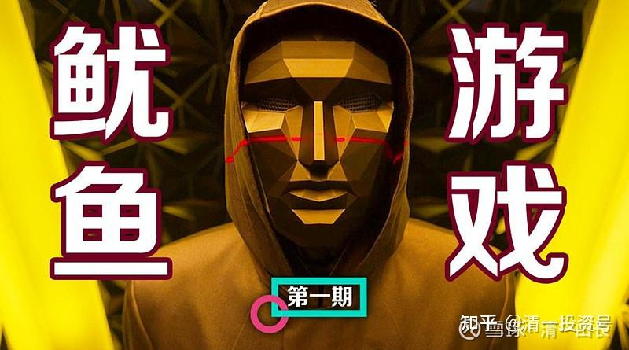

原雪球专栏[220篇.我们也来玩一个“鱿鱼游戏”吧？](http://link.zhihu.com/?target=https%3A//xueqiu.com/9310099567/200415268)

清一山长 2021年10月18日

如果把“鱿鱼游戏”，看成一种比喻，它是一种高度艺术化了的生活的折射，我们能否通过我们的慧眼，看出我们自己玩的游戏，就是就是鱿鱼游戏？

我本期给清一大学的作业题目是：

如果把“鱿鱼游戏”定义为

**一：“参与者所做的事情，并不创造真正的价值，只代表判定输赢的标志和结果，所以只是游戏”。**

二：**“参与者为了得到钱，而不惜牺牲生命和尊严的游戏”**。请你举出身边一个现实中的职业案例，符合上述的定义（可以只符合其中一种定义），请详细说明为什么你认为这个行业、职业，就是现实版的“鱿鱼游戏”？

你们要不跟帖玩一下，看你们是否看透了这个节目的心酸之处？我先示范两段：

**回答一：**

**我的案例一，是说：现在的学校，就是鱿鱼游戏。以及证明，但内容被系统认为违规，不能发，就算了。**

**回答二：股市就是一个真实版的“鱿鱼游戏”！**

**判断标准一：**股市本身并不创造价值，虽然企业是创造价值的。但股市本身，并不创造价值，它只是分配价值。这个游戏，是用参与人的互猜涨跌，来判断赢家和输家的。猜对的，就拿走钱；猜输掉的，就输掉钱。但赢家和输家，都没有创造任何真正的价值。股市就只是一个筛选赢家和输家的游戏罢了。

**判断标准二**：参与者目的就是为了赚钱。这个目标，似乎已经再明白不过了。虽然有些超级虚伪的人，假装自己来股市是“为国家做贡献，为中国经济做奉献”的。实际上，买卖双方，真实的目的，都是为了从别人手里把钱赚过来。被散户骂的“狗庄”们，坐庄当然是为了赚钱。但散户们骂归骂，却都专注于发现庄家的痕迹，一旦发现，都很兴奋，跟庄跟得最有劲。只是跟不对节奏，万一赔了钱，就大骂狗庄一顿，出气罢了。另外，股市是不是属于“拿命换钱”，其实是的。每个参与者，都把每天自己的生命投注其中，专注地盯一天的盘，这一天就死去了。只是由于我们每天都在死，第二天又似乎“生”了，所以这种慢性的人生死亡，导致我们没有发现：我们参与的就是“鱿鱼游戏”，本质是，生死还是一样的。

好的，我示范的案例说完了。该你们跟帖说了。你们谁想发现自己身边的荒谬游戏？谁想看透这个世界？为啥这个“游戏节目”，居然成为全球热点的剧集？因为他打动了我们的内心。你的心，都在替你焦虑：其实你正在玩的，就是“鱿鱼游戏”！别自欺欺人了。

（以下内容为编者收录）

**评论回复：**

**清一山长[2021-10-19 14:19](http://link.zhihu.com/?target=https%3A//xueqiu.com/9310099567/200508731)回复：**

黄金行业，就是**“鱿鱼游戏”**。

第一、每年花费巨大的投资开采黄金，开采出来的黄金，最基本的出路，就是放在严密看守的库房里面，花费巨大的成本去保护。少量做成金饰品，被老百姓买回家藏起来，也没有实际使用的价值。只是作为一种所有权标志。整个开采和使用的过程，并不产生实际的社会价值。只是获得了黄金的人，算是游戏的赢家，拥有某种“权利”。

第二、参与黄金的开采、储存、销售、使用的人，目标都是因为“黄金值钱”。工人冒着被严重的毒害和危险用化学品提炼黄金；使用者用命（工作、生命）换黄金；强盗、小偷，冒着生命危险抢这些金属，都是属于拿命换黄金，都是为了钱而进行的行动。如果黄金不值钱，就没有人来玩这种游戏了。

结论：**黄金行业，就是一个投资消耗巨大，却对人类的生活品质没有改善和提高，反而严重地拉低了人类生活品质的行业！属于典型的“鱿鱼游戏”**。

**[清一山长](http://link.zhihu.com/?target=http%3A//xueqiu.com/n/%25E6%25B8%2585%25E4%25B8%2580%25E5%25B1%25B1%25E9%2595%25BF)[2021-10-21 15:36](http://link.zhihu.com/?target=https%3A//xueqiu.com/9310099567/200738691)回复：**

财金新闻：海域金矿黄金储量212吨，品位4.2克/吨。2022年投产，2024年达产，建成投产后归属公司权益矿产金产品10吨。

思考：你们认为，为了得到一吨矿石里面的4.2克金，我们值得消耗这么多的技术和能源，来换取这么一点点金子，其实对人类基本没啥用途的金属，值吗？

这种**“鱿鱼游戏”**，太亏了。所有的参与者，全都是输家。我的儿女要结婚，要出嫁，我是一克金子都不买给他们的。也希望对方的家长，不要买这些无用的，消耗人类资源的东西。我相信她们自己也不会买——因为**我从小给他们的教育。就是“视黄金、钻石如粪土”。希望我的儿女，能够去做一个“简单生活，让别人活下去”的富二代。**

**[RJ60y](http://link.zhihu.com/?target=http%3A//xueqiu.com/n/RJ60y)回复[清一山长](http://link.zhihu.com/?target=http%3A//xueqiu.com/n/%25E6%25B8%2585%25E4%25B8%2580%25E5%25B1%25B1%25E9%2595%25BF)：**

所以美元从金本位到信用货币是人类历史巨大的进步。

**清一山长[2021-10-19 15:09](http://link.zhihu.com/?target=https%3A//xueqiu.com/9310099567/200515430)回复[RJ60y](http://link.zhihu.com/?target=http%3A//xueqiu.com/n/RJ60y)：**

对，这个“巨大的进步”，就是去印刷纸票子，起码比开采黄金，要环保得多，浪费的人力、物力要少得多。至于其他的内容，与黄金的本质也是一样，依然是**“鱿鱼游戏”**。只是花费少一点的**“鱿鱼游戏”**。现在电子货币就更简单了，更环保了，印刷起来就更简单了。一点点电子信号就可以合成货币了。所以“历史进步”很快的。只是各位拿着这些宝贝，如果到了荒岛上面，你才会发现都是废品，还不如一个椰子有用[大笑]。

据说，中国还有一只“黄金部队”，专门负责开采金矿的。这些子弟兵，估计和**“鱿鱼游戏”**里面的方块人一样，都只是工具罢了。你们买卖黄金、美元的人，就跟游戏里面的游戏参与者一样，身不由己！
