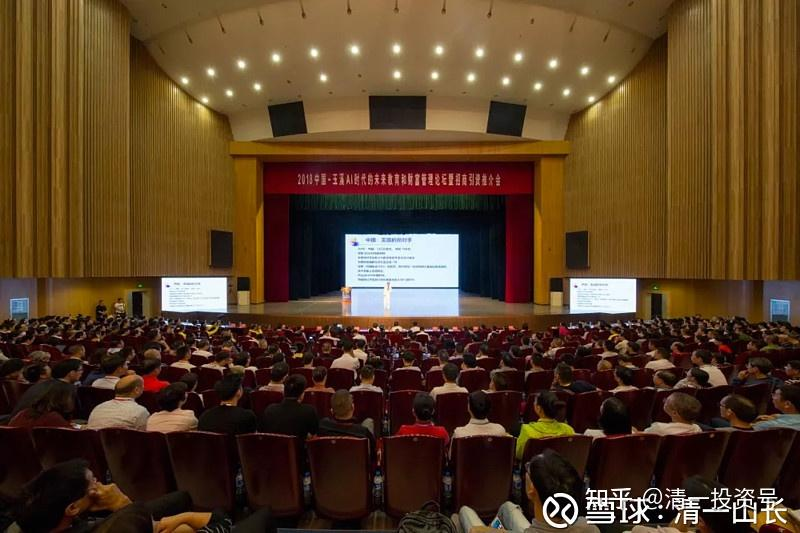
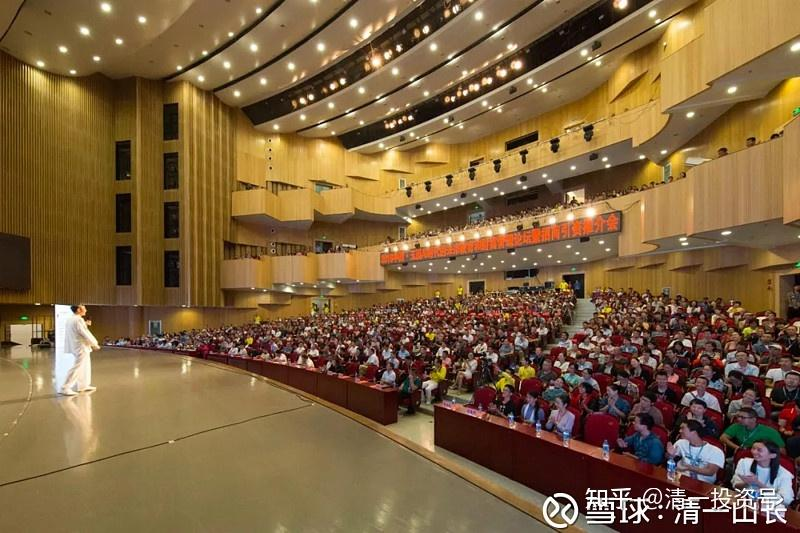
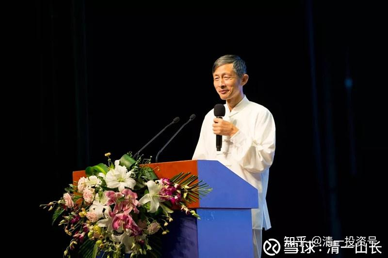
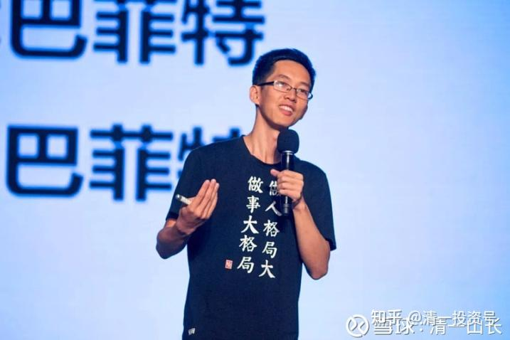
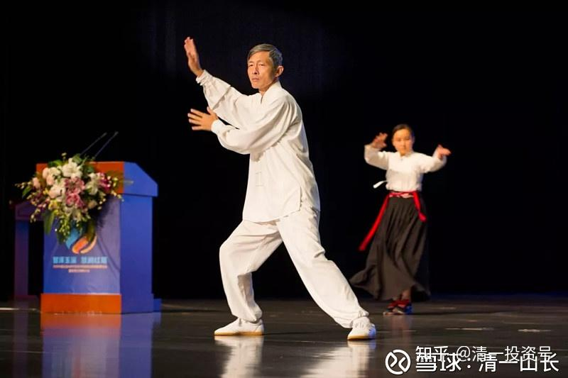

原雪球专栏42篇.千人生日财富演讲圆满结束

清一山长 2018年8月30日

我这一次应朋友们的要求而回国，正好在我的生日期间，就改变生日的传统过法，变成一次“送礼上门服务”的千人演讲。日前已经顺利结束论坛，忙到今天才刚刚回家，短暂休息一下（原来预告的链接自行搜索吧）。

本次友情演讲的内容是：“十年十倍不是梦”——似梦非梦。另外一个主题是“教育与财富的前世今生”，还分享了中美贸易战的核心原因，以及未来我国应对方案的最大可能，以及我们现在能够为适应未来需要做的事情。由于讲题结合现实问题，在股市低迷的今天，也受到了热捧。结果报名人数太多，居然达到了2800人。只好租下了本地最大的会场，单场可容纳1200人的大剧院，而且原定的只是一天，只好临时决定多租用一天，尽可能满足更多人的需要。即使如此，报名靠后的申请者，也只好放弃了。

具体效果和内容如何？由于当地政府领导积极介入，多家媒体已经报道了，我就不多说了。我希望参加了现场会的球友们，把你们本次参与现场论坛的收获、个人心得记录下来，发在这里跟帖，作为一个对自己的永久纪念吧！

下面我上图，作为“有图有真相”的见证吧！免得总有人说我骗人，空口说白话。（当然，喷子们依然可以说：这些图片，都是我找人PS的）

以上是剧场的全景和近景，是全国知名摄影家的“即兴之作”。

还邀请了雪球大V——“U兄万亿之路”友情出场，共同主讲本次财富盛会。U兄认真解析了世界财富的增值模式，解说了“万亿财富”为什么是很可能的，他的演讲受到了朋友们的热情欢迎。

演练太极照片：为了让来的朋友们不打瞌睡，本人特练太极助兴，让大家笑一把。

本次义工团队特别给力，阵容特别豪华，甚至有多位企业高管，以及亿万富翁现场当义工，帮助引导远道而来的朋友们入座。会场给我开车的司机，居然是前刑警大队的大队长——现亿万富翁，他也是义工的一员，主要责任是站在剧场大门口，防止意外事故。

别的不多说了。欢迎来过现场的朋友跟帖，发布您的现场感受和体验。

参考链接：

[张山长：十年十倍-财富之梦的实现_哔哩哔哩_bilibili](http://link.zhihu.com/?target=https%3A//www.bilibili.com/video/BV1ei4y1N7BY)
