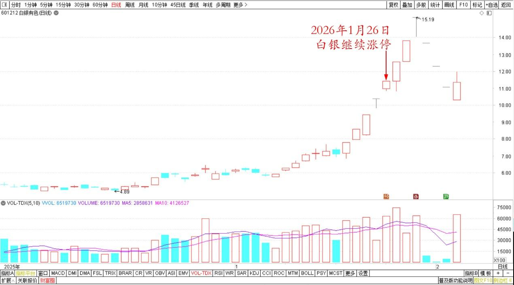
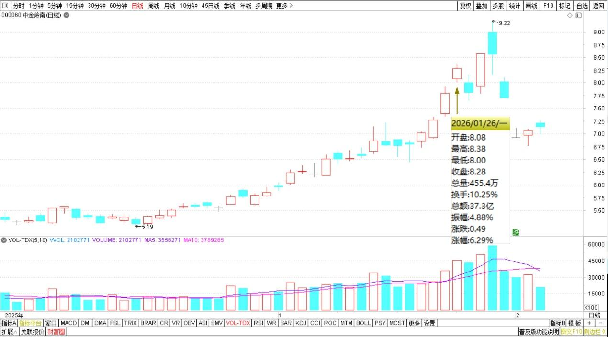
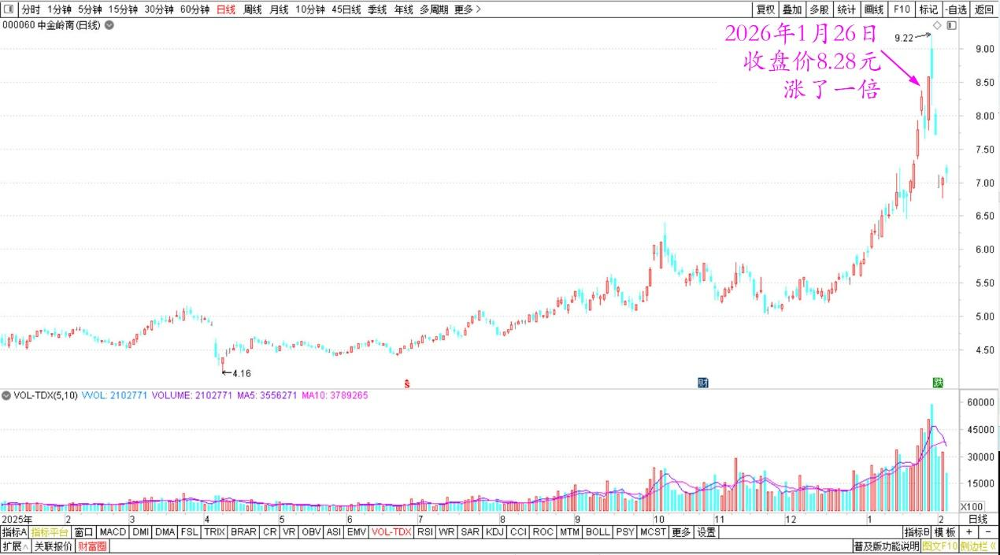

230篇.白银继续涨停，中金岭南涨一倍

清一山长**[2026年1月27日00:10](https://www.zhihu.com/pin/1999171725418587889)**

今天又涨了。

上午，我的账户创了新高，一天赚到了历史上最多的钱。因为我重仓的有色都在大涨、特涨！

我都有点惶恐——咋这样涨？也没多想。周末正好是我上课的关键期，我忙着上好公社二期的课程，对得起学员是第一位的。

我刚刚才突然发现：今天是周一，就想去看看今天行情如何。我上午给学生们上课，中午休息，下午自己玩，都忘了今天开市了。

今天居然是大涨。刚才打开账户看了一下：我比周五赚得更多了。这两天，赚了不少人一年也赚不到的总收益，太不可思议了。**金融市场真的是抢钱！**

白银今天继续涨停，**市场先生真的疯了！**

白银有色2025年12月～2026年2月日线图

重仓的中金岭南，也涨了一倍了！居然还没涨停！

中金岭南2025年12月～2026年2月日线图

中金岭南2025～2026年日线图

这让我不淡定了——**明天，我要不要卖一点？给有色降降温？真纠结！**

**（标题、图片为编者所加）**

文章音频：

[647篇.白银继续涨停，中金岭南涨一倍](http://link.zhihu.com/?target=https%3A//www.ximalaya.com/sound/955650982)

**参考链接：**

[225篇.燕京的猜想](https://zhuanlan.zhihu.com/p/2001294008115287766)

[226篇. 设定“止赚线”](https://zhuanlan.zhihu.com/p/2001908287390650417)

[227篇.昨天补仓的铜陵今天涨停](https://zhuanlan.zhihu.com/p/2002022964682568534)

[228篇.白银第四个涨停，铜业第一个涨停](https://zhuanlan.zhihu.com/p/2002506915129880752)

[链接汇总（截止2026年1月24日）](https://zhuanlan.zhihu.com/p/621215591?utm_psn=1967007144831350474)

