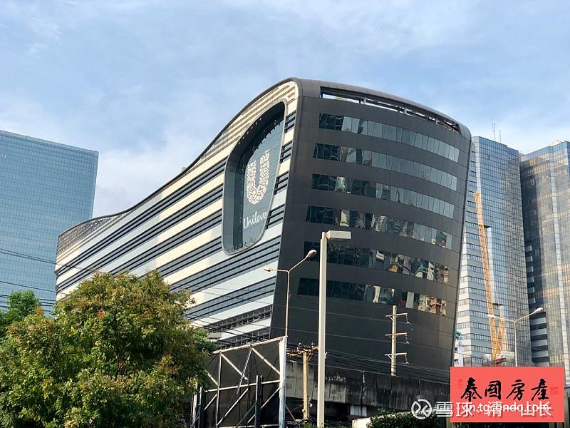
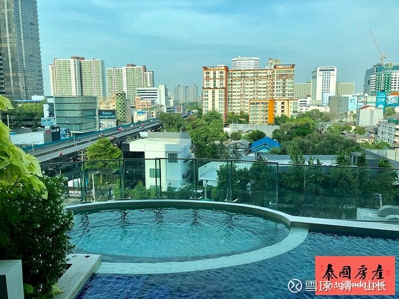

*泰国曼谷新CBD区Rama9，拉玛九区*

原专栏62篇.我在泰国做房地产商

[清一山长](http://link.zhihu.com/?target=https%3A//xueqiu.com/9310099567/column)2020年4月10日

这是我公司开发的楼盘，地点——泰国曼谷，拉玛九区。准确地说，是我当股东的，泰国排名第一的地产商做的楼盘，您有兴趣没？我先介绍一下：

高层楼盘Condolette Midst Rama9所处的区域是曼谷热门的新CBD区Rama9，大多数曼谷的企业总部与商业行为都已搬移至此（G Land，联合利华，证交所等等），Condolette Midst Rama9旁边就是拉玛九区目前单价最高的Ashton Asoke Rama 9，每平米单价达30万泰铢。

距楼盘最近的商场包括有：Central Plaza百货、大型超市乐购莲花、IT购物中心商场、办公楼：G Land，联合利华亚太区总部，证券所、AIA ……

售价：3,290,000泰铢（单间公寓方，每套22平方）

今天继续买入泰国股票，主要是泰国的房地产股。今天共买入了一千多万泰铢的股票，涵盖了泰国前五大房地产公司，也就是说：中国人来泰国买房的话，大概率都是找我的公司买的。欢迎大家积极购房。

与半年多前相比，泰国房地产公司的价格跌了50～70%。已经快残废了。目前的股息率都超过10%了，市盈率在4到5倍的样子，所以我很幸运。其实这两年我在泰国的资金，都在银行睡大觉，让银行人员觉得我很傻气，建议我买理财和保险……其实我在等美股崩溃，泰国肯定跟着崩——果然！崩得比美股更惨。

还买了泰国的金融股，泰国几家大银行都跌了一半了，市盈率4～6倍。分红率6%左右。挺好的。泰国最大的保险公司，跌到4倍市盈率了。从高点相比跌了七成，也买了进来。看样子，泰国人炒股也挺疯狂的。我相信疫情会让人寿保险更好卖的，难道怕死人太多，导致保险公司破产吗？怎么都疯狂抛售保险股呢？

对了，除了买入这些泰国有竞争力的公司股票外，我还开办了泰国的实体公司，是跟泰国朋友合伙的企业。一家是教育培训类的，另一家是建筑公司，我正在用自己的公司来建自己的学校和社区。如果你们不想买房，想自己建房，也可以找我的公司给你们干活。

在中国，我这点资本，开地产公司就是个笑话。但在泰国，做个小社区是足够了。国内地产公司买个两亩地的钱，在清迈周边城区，可以盖十栋别墅了——连十亩地的花园在内，还是永久产权。所以，建议大家自己盖房子，比去买地产公司的更划算！

目前我盖的新楼快要竣工了。一栋仿中国四合院的新楼，是我自行设计的建筑结构，泰国独家风格。该建筑面积2000平方，两层楼结构，共28套一室一厅，每套房子70平方左右，中间有100多平方的活动区域。比上面地产公司22平方的房子要好住得多，价格更便宜。（我自己盖的房子比地产商的更俏销，早就内部订购完了，不对外销售的。别误会我在雪球做广告推销房产）。以后有机会，你们会看到照片的，很漂亮！
