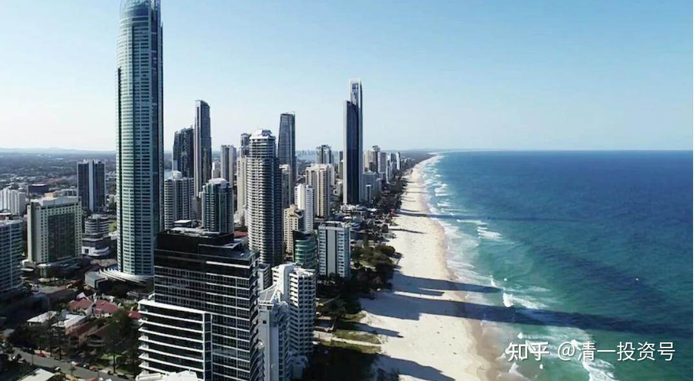

**原专栏68篇.又见售楼部被砸！真的是钱多，人傻！**

[清一山长](http://link.zhihu.com/?target=https%3A//xueqiu.com/9310099567/column) 2020年6月10日

看新闻的标题：【玻璃碎了一地！又见售楼部被砸，这次不止是购房者，连中介也动手了】，我猜想是不是房价下跌导致买房人怒了。看完文章才发现：原来是没有买到房子而发的怒。[https://finance.ifeng.com/c/7xAInp9Ghcm](http://link.zhihu.com/?target=https%3A//finance.ifeng.com/c/7xAInp9Ghcm)

中国人钱多，干嘛不买处于低位的股票？偏要买高高在上的房子。我知道很多人买房，不是为了住，而是为了“会涨”。如果您这么看好房地产行业，而且还一定要“会涨”的股，干嘛不买中国建筑？又有房子，还好变现。还有比租金更高的分红。这么好的事情不要，偏要买房，抢房，抢不到还砸售楼部，一定是脑子进水了！
