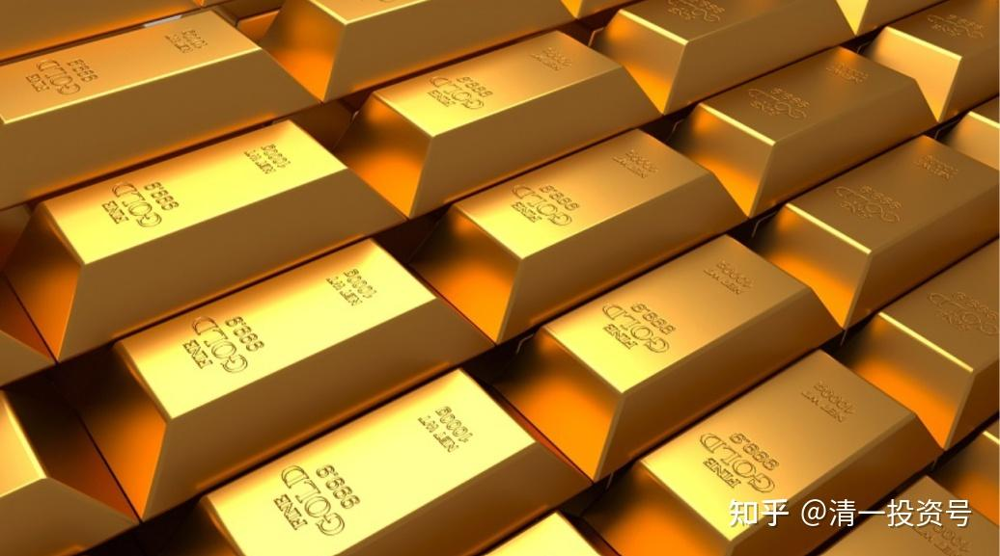

32篇.将来只有实物才值钱

清一山长 2022年8月19日

**[上个月中国从瑞士运走80吨黄金，是6月份的两倍](http://link.zhihu.com/?target=https%3A//user.guancha.cn/main/content%3Fid%3D831807)**

[https://user.guancha.cn/main/content?id=831807](http://link.zhihu.com/?target=https%3A//user.guancha.cn/main/content%3Fid%3D831807)

中国正在做与西方“脱钩”的准备。原来放在海外的大量资产，正在弄回国内。因为美国的一个政令，就会被发达国家封杀资产。在这些资产清理完之前。中国是不会打台湾的，会尽量避免开战的。但清理完之后干啥？俄罗斯花了8年时候。来准备今年的这一仗。美国给中国的时间，恐怕不会有8年。希望不少于三年吧！至少能够有解放战争的时间来做好脱钩准备。一旦脱钩开启，生活质量就别谈了。活下去就成为唯一的任务了，就像现在俄乌战争中，谁还啥奢求？

为什么是黄金？为什么美债不断降低？瑞士是干啥的？其实——中国应该是用外汇换黄金，然后运回国。高价值的东西——古人说“乱世黄金，盛世珠宝、古玩”。将来，我认为只有实物才值钱，钱不值钱的。国家也是这个观点，只能换黄金，我认为还会换白银，比白银更重要的资源应该是铜，信息时代的石油。这些储备，我认为国家的金钱资源，会投放在这些地方。赚了钱，花钱买美债，是把刀把子递给美帝。用赚到的钱去买黄金，就是变成实物，谁都抢不走了。不过不建议各位买黄金，买了你是卖不掉的，没人相信你的黄金。买黄铜还有人收购，黄金没人敢要你的。不过——可以通过买黄金股来避险。一样的效果。比如中金黄金这样的。我已经买了M级持股。

“盛世珠宝、古玩”——这些东西，是泡沫。一旦乱世，一钱不值。就像LV包包、名牌手表等一样。经济大好的时候，到处抢购，用来炫耀消费的。但经济差了，这些东西不值钱的。如果俄乌战争起来了，你手上有这些东西有啥用？当然钱也没用。不如粮食、能源这些傻大黑粗的东西更靠谱。

我在泰国，买了上千亩土地。不求赚钱，只求不赔钱。反正钱是赚来的纸张，有一天就有可能一钱不值了。股市买啥？其实我准备股市归零，我都能顺利地活下去。天知道股市最终会怎样。只能聊胜于无。做一点能做的事情。但我不会把所有资产都放在股市上的。

参考链接：

[22篇.未来什么东西最有价值——资源](https://zhuanlan.zhihu.com/p/526512816)

[25篇.存钱不如存铜存铝](https://zhuanlan.zhihu.com/p/534377433)

[26篇.新能源产业链投资规划（重要）](https://zhuanlan.zhihu.com/p/534678751)

