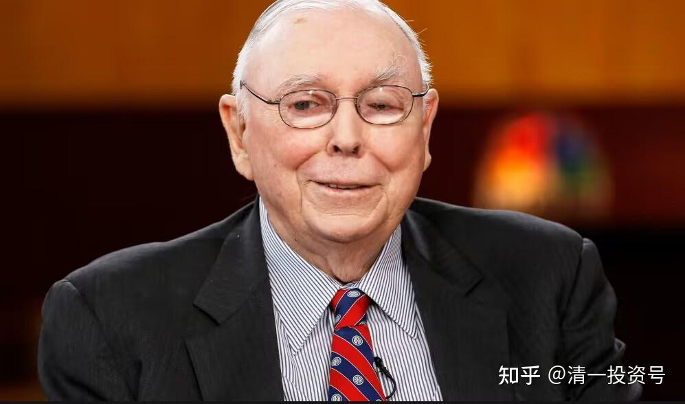

43篇.今日网校课程：查理·芒格的成功秘诀3——理性（1）

清一山长 2018年

**理性是不是一种思维方式？也就是说他这种思维方式最重要，同时也呈现了他的价值观。**他的价值观就是认为思维方式更重要，这其实也是一种价值观。

**一、师生对话剖析人生支撑点**

你们会认为什么东西对你最重要呢？**只用一句话来描述你的人生，或者你的追求，你在追求什么呢？**不允许用理性这个词。

**（学生1），你用什么来描述？你一辈子只允许追求一个东西，你去追求什么东西去？

学生1：至上。

张老师：至上是一个信念。你立足在哪里，你只能去追求一种东西？这词对你来说是虚的。找吧！那个词不是你的，不是你内心深处的东西。

不允许用熟悉的词汇，用你自己的词。至上你不理解。你们还没有完全理解至上。

**（学生2），你的人生追求是什么？只允许追一个东西，你去追什么？

学生2：……

张老师：都是听来的，学来的，不是你的内在，你的内在到底是什么？你呢，你有吗？

你没有很正常，因为你不喜欢去追求，你不喜欢去想。你会告诉他们：告诉我，我追着你走。你是一个跟随者。

其实你也一样，你有吗？

学生3：无悔。

张老师：看见没有，这句话也是虚的。什么东西才能让你无悔？所以虚不拉几的。因为这东西不存在概念对吧？

是什么才能让你无悔？那东西才是支撑你的东西。无悔就像说至上一样，都虚不拉几的，没有！

因此，如果你们无法考上大学，其实这就是你们考不上大学的原因——你们没有支撑点。人生一定要有支撑点！

你呢？只允许人生追求一种东西，你追求什么？

学生4：目标。

张老师：什么目标？你又拿不出来了。

学生5：如果只能选一个，选思维。

张老师：嗯。

学生6：智慧。

张老师：两个男生选什么？

学生7：我想选的是自尊。

张老师：为什么？

学生7：因为我感觉只有自尊，才能无悔，才能感觉对得起自己。

张老师：那你怎么样会死呢？因为什么原因你会死？如果没有什么东西你会死？

我打了你一巴掌，你没有尊严了，你要不要去自杀？

学生7：如果可以挽回的话，就不会。

张老师：那我打了你一巴掌，你还就是打不赢我，有可能一辈子也打不赢我。

学生7：那我只能尽力地去胜过你。

张老师：挺好的，不以结果论英雄，只要你尽力了。

知道我为什么会死吗？你们应该知道吧？那就是我的人生支撑点。我说过的，**我的人生支撑点就是自强。**

**当我对社会没有价值的时候，我觉得我会自杀，或者当我失去价值的时候，甚至当我无法对这个世界做贡献的时候。甚至我失去能力的时候，我觉得我要躺在床上，需要大家服侍我才能活下去的时候，我就对世界是没用的。**

你看我想的东西，不用复杂的词汇来说，我觉得我没用了，没用了我就不能接受我自己，所以我就说，我还不如死了算了。所以，我觉得我的死法有可能会很壮烈。这代表我的最大的价值观，就是要活得有价值。

那么活得有价值，如果只能用一个词来描述，不就是自强吗？而自强恰好就是符合天道的东西，“君子以自强不息”。但这种东西，**我是自动做出来的，我根本不说这个词**。你们说这个词，反而不懂。你不要用各种自尊、至上、自强这些东西来描述，我就问你到底懂不懂？

那么，我从十几岁，像你们这么大时，我用的就是这个词。如果我对世界没有价值，我还不如死了——一直在想这件事情。我今天能走到现在，就因为我一直秉承我的信念，所以我就比一般人更强了。你们看到的我就是强者，对不对？因为我总在强、强、强、强、强！

但是，我现在强了之后，我还学会了弱。但是弱又不是真正的软弱，而是不要去跟人比、跟人拼，不要一天到晚去打倒别人，去显示自己强。我不需要去显示自己的强，因为我是自强，我自己要强，我自己要超越我自己。因此就变成了一种自我超越，而不是比较。

原来这种自强在不明确、比较愚蠢的时候，或者比较年轻的时候，会变成我要跟你比，我是不是班上第一名啊之类的。如果发现不是，我就很着急，我就会非常努力。你们一些人无法出色，就是因为你没有人生支撑点。

**二、查理·芒格的“理性之光”**

但是，查理·芒格他的那个理性，我觉得比我更高。你现在一听，山长说的君子以自强不息不是已经做到了中国古代文人当中最高级的追求了吗？为什么比我更高？因为他这个理性，他追求的理性，他对理性要求很高，他身上绝对有自强。

你们在他身上看得到跟我类似的东西，就是不允许自己是废物——努力地提升自己。但是他对理性更追求的是一种态度上的超然的宁静和更卓越的思维的超越，他不允许自己思想上犯错误。因此他绝对有自强，所以他的理性涵盖了自强。

而我，没有去特别强调理性这一点。因此，我觉得我没有他有涵养。事实上，观察他的个人传记，包括后面说他的，他一直都是一个gentleman，非常非常地绅士。因为他追求的就是“我绝对不能不绅士”，即使面临生死。

我呢？我追求的只是我要自强。因此，包括我们要推出的五个月或一个学期的英语突破计划，是不是也是我们自强的表现？我们不会满足我十几年前推出的方法，它的实施方案的有效性方面，我们现在不停地超越。这些全是自强。

但是他追求的是理性，他会更平稳，甚至看起来更平淡地完成他的目标，而且他也的确是很平淡的人。所以他这种理性，我觉得我很佩服。所以，我不认为我比他高。但是我们有很多相通的地方，内在相通。

不是词汇，挖他词汇没用。因为他这种理性从他其它行为表现出来**是一种超强的自尊和自律。**包括跟人约会一定早到1个小时之类的，是不是也是他超强的自尊和自律？以及他迟到了，他会跟你使劲道歉。为什么？因为他的内在不允许自己出现失误、不允许自己出现一些缺陷，是不是也是自强？这种人他就是值得我们尊重的。

今天我到的时候迟到了6分钟，不够自强。我迟到6分钟，恰好是因为我很自强。你们说，这家伙，迟到了还给自己找理由。因为我迟到的理由很特别，因为今天教完你们练拳，我知道晚上要给你们上课，所以我有两件事情。因为动嘛，那时候心态比较浮躁，然后要静，所以跑回去躺着，静静地思考，静静地想晚上的课该怎么讲。等起来的时候发现，哇！已经7点了。正好7点，我7点钟出发，赶到这里6分钟。

那我也可以说，嘻嘻哈哈，然后跟你们一起过来，吃吃饭干啥的。我没吃饭，其它什么都没做，就是静静地去想今天晚上怎样把这个线条重新理一遍，理得更清楚。我出题的时候就理过一遍，现在又理一遍，是不是自强？没吹牛吧！

我想我随便糊弄你们当然也可以糊弄得很好，但我希望我保持最佳的状态。所以，我把自己一个人关在房间里面，静静地躺在那儿、静静地思考今天讲什么。然后，让自己保持最好的精神，并且让自己的情绪平复，因为我知道自己的责任。

所以，你自己好好去找找，要做我的弟子，特别是你们两个，你找到支撑点没有？就是这个支撑点一旦被剥夺，你甚至觉得应该去死的东西。一旦剥夺了把我变成了一个废物，我真的觉得不想活着了。这就是人性的高贵。这种人不太可能成为一个废物，他只会成为真的很自强的人。

刘老师原来知道我有这个心结，她总在说，因为我需要你，你就应该活着。我愿意一辈子好好服侍你，就算你没有一点儿能力，就算你瘫痪了，等等。我说你可以这样想，但是我不能这样想。如果关心你、我爱你，我就不能成为你的负担。

**这方面我们在《百万宝贝》里面也看得到这种自强。**这个影片看过吗？那个女子的选择是不是“如果你爱我就让我走，我已经瘫痪，我无法活下去，你尊重我就让我走”。所以，她的教练最后帮助了她，对不对？但她的教练很难过。这一点我觉得他没有那个博迪做得好一些，就是那个《极盗者》里面的那一个人。

**三、具备与成功者类似的思维模式**

我们在卓越者身上可以发现非常相似的性格，一点都不稀奇。所以，我们如果要让自己成功，我们就要**具备他们类似的思维模式。这就是我教你们的一种成功模式**。很简单，就是**进入成功者的状态，跟他一致**。

你们在我身边做我的学生那么多年，如果你们没有学到我这种思维方式，就像刚才我给你们讲过的故事，我因为什么会死，你们听过就当个我的故事而已。但**如果你想成为我，真想学到我的东西，你就得复制我这种思维模式。**你就会想什么东西？你能不能做到这一条？你绝对不能接受自己的无能。因为你不能接受自己的无能，你当然会学会很多很多本事了。因为你能接受自己的无能，所以你才会平庸！就那么简单！

我不能接受无能，又不是情绪不能接受，我是用行动去不能接受。高手们打我可以把我打得很惨，但是我没有去埋怨说我怎么那么差劲，我只说，他打得真棒！他怎么打那么漂亮啊！把我打得那么惨！抱这种欣赏的态度、拥抱的态度，并且说我怎样才能掌握这一点？**这就是自强。而不是说他真强、真强，算了，我做他的小跟班，我跟他的小屁股，跟在他后面爬——你就是奴仆，你就没有自强。**

所以，**这也是我看到的第二个我觉得很能呼应的东西，对他的理性，我如果抓第二条我会抓到自强，他身上绝对有自强。他不喜欢别人帮助他，不喜欢去显现自己的身份，不喜欢把自己搞得好像多么高大上。**

但是他为了他的妻子他愿意给他妻子更好的条件，他自己出行坐普通舱，妻子出行买头等舱，甚至坐私人飞机。因为**他觉得他想对自己的妻子和儿女好一些，也代表他的爱心。同时也代表他自己的自强，但他自己从来不要这些东西。**

**参考链接：**

[39篇.今日网校课程：查理•芒格的成功秘诀1——逆向思维](https://zhuanlan.zhihu.com/p/641398367)

[41篇.今日网校课程：查理·芒格的成功秘诀2——清一派成功学思维模式](https://zhuanlan.zhihu.com/p/642327054)

