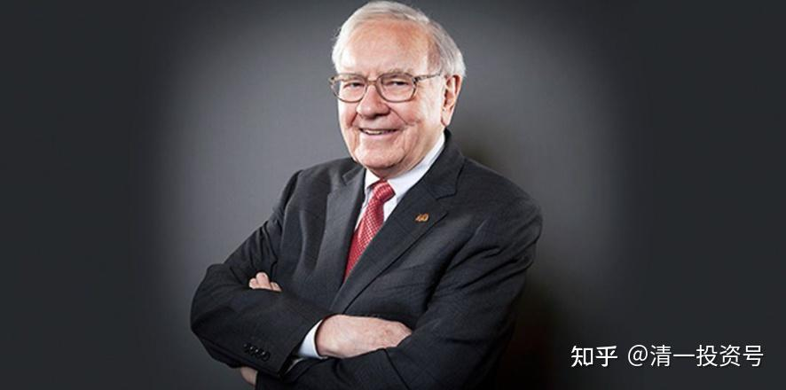
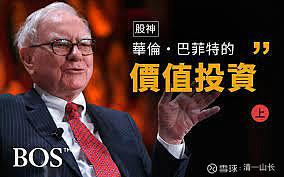

原专栏**136.股神课，应该怎样上？**

清一山长 2021年4月2日

如果我要上投资课，要上股票的课程，会怎样上呢？我会用下面的视频来给学生们上的，我不会拿我的K线投机技术教他们的，我觉得教技术，几乎就是教犯罪。

不过，由于今日的学生们一直不太爱钱，学生从来就没有要求我上股神课，所以我也没有机会上。也许以后会上的，比如下面这个9分钟的访谈视频，我会上两三天，然后，学生们就“懂巴菲特”了，不然你看了白看的。因为据我所知，大多数人，根本看不懂巴菲特在说什么。他们看了是一头雾水，到处找自己认为的“赚钱机密”。但巴菲特说出来了，你却不知道这就是赚钱机密，很搞笑！巴菲特真的说出了他认为的核心机密，是你们在“等他说出符合你们心中标准的机密”，以为他保守罢了，其实真不是的。

幸运的是，我知道巴菲特在说什么，业绩作证：最近20多年我的收益率，是跑赢了巴菲特的。这不是我比他更聪明，是因为我的对手盘比他的对手盘更疯狂，更愚蠢，所以我更幸运。我生在中国，这个过去20多年全世界发展最快的国家，快到一大批根本不懂股票是什么的人，拿着大把的钱冲进股市，让你想不赚都不行！

[【“股神”巴菲特】全网最全合集(共24集)强烈推荐、受益匪浅！](http://link.zhihu.com/?target=https%3A//www.bilibili.com/video/BV1qK4y1p7wG/)

（哔哩哔哩[网页链接](http://link.zhihu.com/?target=https%3A//www.bilibili.com/video/BV1qK4y1p7wG/%3Fspm_id_from%3D333.788.recommend_more_video.0)：[https://www.bilibili.com/video/BV1qK4y1p7wG/](http://link.zhihu.com/?target=https%3A//www.bilibili.com/video/BV1qK4y1p7wG/)）

