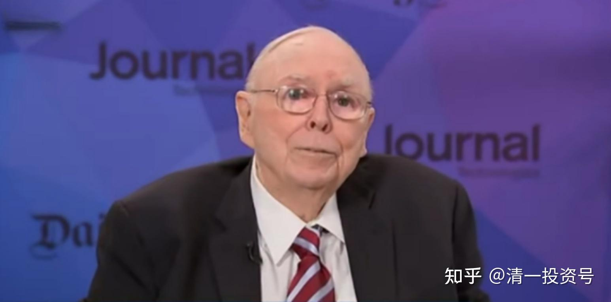

45篇.今日网校课程：查理•芒格的成功秘诀4——理性（2）

清一山长 2018年

**一、投资者的思维模式**

**“我手里只要有一本书，就不会觉得在浪费时间。”这句话又代表芒格身上的自强特质。**

看到了没有？人生永远不是拿来浪费的，因此，**我们要做的就是，每一天、每一分钟、每一秒钟，都不要浪费。**我对你们说的就是这句话，你的今天只要做一件让你觉得没有浪费、觉得有价值的事情，你今天就会很快乐、很充实。当你做了这件事，你没说自强这个词，其实你就是自强的人。而当你觉得今天跟昨天一样——昨天吃了个好菜，今天也继续吃个好菜，你就很快乐；今天吃个更好的菜，你就很快乐；今天吃个更贵的菜，你就很快乐。那你显然就是另外一种人，你就是一个消费者。而我们需要的是能力。

他天天在阅读，为什么？他想提升自己的理性。所以他这个理性不是乱说的，他真的是这样想的。

那么，这个理性还可以从什么地方观察出来呢？我们看到这句话：你有私人飞机，为什么不去坐飞机？**“我一个人坐专机太浪费油了。”第一个价值观就出来了，代表他的价值观是投资者思维模式。因为投资者思维模式永远是要用最小的成本，去实现最大的收益。**

当我要去做一件事情，同样是做这件事情，就算我能够去赚一个亿，我可以用1000块钱去赚一个亿，用1000块钱投入，也可以用几十万的投入去赚一个亿。1000块钱就是普通飞机、公务飞机吗？对不对？那几十万甚至上百万可能就是专机的一次飞行费用。

我不会去认为，哇！我反正赚了一千万或者赚了一个亿，所以我值得坐私人飞机。**我只会想用最小的成本去做事，这就叫价值投资者思维模式。****（学生1），你妈妈说你很爱赚钱，你就要学会这种思维模式。第一句话，**永远用最小的成本去做相同的收益**,所以他是价值投资者。

你如果没有这个思维模式，而是说：“没关系，我可以多花点钱，只要我赚的钱比我花的钱多，我就满意了。少赚就算我运气不好，我已经享福了。”那么你就是投机者，或者说你骨子里面就不适合做投资者。

**二、思维模式中的特质**

**第二条是什么？第二条折射了他的思维方式当中是什么样的特质？“我觉得坐商用飞机更安全。”他表面上说的是安全，其实不是安全问题。他考虑的是一种比较，第一是经济，第二种方式是理性的比较。就是说，安全对我来说，它是很好的。**

因此，我们坐飞机外出，我们追求的最高价值是安全，生命当然是最重要的，对还是不对？既然我们追求的是安全度的话，安全度当然是越高越好，而坐商务飞机显然比坐私人飞机更安全。因为商务飞机的飞行员都是非常熟练的飞行员，而且经过了很多训练，而且做过各种课程的飞行员。而私人飞机的飞行员，他们的训练之类的飞行次数，恐怕一般比不上正宗的商业飞机的飞行员，对不对？所以从这个理论上来说，他说的太对了！这是不是反映了他的理性？并不是说他怕死。

就像我，其实**我不怕死，但是让我去选，我宁肯选择少动。包括现在我不愿意外出。我就想，外出多，风险就多一点。**出去干什么？我能得到什么？好像得不到什么东西。除非特别有必要，不然我越来越不愿意外出。其实这也是一种安全。但是如果需要我外出，安不安全就不用考虑了，坐车去也行、坐飞机去也行、坐什么都行。包括我们更喜欢走高速公路，为什么？也是因为安全。所以他的理性是不是很强烈？一下子找到几个理由——经济、安全。

经济是他的价值思维模式，第二种是他的思考。很少有人会去想。**私人飞机代表什么？面子。代表尊贵、代表浪费、代表我很高贵。他完全忘掉自己的身份，完全忘记自己的身家，以一个普通人的身份、一个理性的——高度理性的人，就像计算机一样的，在判断各种可能性当中对他最佳的可能性，这就叫完全的理性。**你们做得到吗？

对于你们来说，你们做一个决定的时候，会掺杂很多情绪，而他不掺杂情绪，他里面的评价，没有一项是情绪。比如说尊贵，就是一种情绪——好有面子！可以让我心情特别爽。当然，这种情绪就会严重地破坏你的理性的身份。

赵刚，你观察到的武人当中，很多人的情绪很重，因为他们不太相信理性。他们为什么不相信理性？因为他们没得到良好的文科的训练。**文科的训练是训练理性的**，而武术的训练，按道理，训练的最高的也可以把理性训练出来。很可惜，我们看到的这些武人，他们很难训练出来理性。所以你们要好好学习理性，包括我们天天给你们的这些培训，现在给你们的策论和方案，像今天这个东西其实就是培养你们的理性的。

还有，他拿着书，不愿意浪费时间，珍惜生命，其实也是他理性的表现。所以，他说他人生追求的是理性，突然在这些所有后面的采访和他一个个小故事当中，我们看到，哇！理性！理性！……

**做什么事情都要有理由。**有时候我会这样说，你干什么事情都要有一个理由。其实有没有代表我也很重视理性啊？没有理由的事情就不要去做。为什么要这样做？你给我一个理由。你为什么浪费我的时间？给我一个理由；为什么要去吃饭？给我一个理由。我连吃饭都去研究，为什么要去吃饭？怎样吃饭？当我去研究这些东西，研究得越透的时候。我自然发现我的理性就越来越强了。甚至于为什么要找小蜜？

你们发现我得出了很多分析结果，你们发现是不是也是理性的结果？包括我开玩笑说的，现在一堆小蜜看起来千娇百媚，几十年以后看到一大堆老太婆，气死你！是不是也是一种理性？但是，很少有人会这样思考问题。他们说：“嗯，你怎么会这样想？”我经常拿过问题来：“你怎么会这样认为？”其实都是理性。

所以，对查理•芒格先生，有时候有一种惺惺相惜之感，他跟我的价值观很像。不过有时候我觉得我执行得没有他透彻，我希望以后执行得更透彻一些。但是方向是对的，卓越的人都相似，没什么稀奇。再看看你自己！我们在这里很少看到他关注自己的身体，**就算他视力损失90%，他也没关注自己**。为什么这样啊？你的情绪就起来了。**他关注的是——我怎样在眼睛全瞎的情况之下，用盲文能够坚持阅读。**

太棒了！对我来说，我也是关注眼睛的问题，比如我经常让你们注意保护眼睛。对我来说，我觉得没有眼睛是很恐怖的事情，因为我就不能读书了，我不能看东西了。当然那个时候，我真想看书，我估计你们会给我配个机器。到时候拜托你们帮我整个这样的机器，帮我念书的机器。给它下个命令，把书读一遍，它就自动设置好，帮我找到书，然后把书读一遍。实在不行的话，我就配一个工人，让他帮我找哪本书或者帮我说说这些书的介绍。我说这本书有趣，好吧！你把它放在机器里面读给我听。我需要一个这样的助手，用他的眼睛来代替我的眼睛等等。你看我会想这样的事情，不过我想这样的事情，我突然想到查理•芒格先生比我更自尊一些。因为他总想靠自己，我更愿意借助他人。

我可能更机灵一些，但我可以找个很好的理由。我可以解决一个就业的机会！好了，这是不是又代表我的理性？我一定要给自己找个理由，而且这个理由必须是合理的，必须是我能够接受的，符合我的价值观的。如果这个不符合我的价值观，我就不要用了。

**参考链接：**

[39篇.今日网校课程：查理•芒格的成功秘诀1——逆向思维](https://zhuanlan.zhihu.com/p/641398367)

[41篇.今日网校课程：查理·芒格的成功秘诀2——清一派成功学思维模式](https://zhuanlan.zhihu.com/p/642327054)

[43篇.今日网校课程：查理·芒格的成功秘诀3——理性（1）](https://zhuanlan.zhihu.com/p/642327095)

