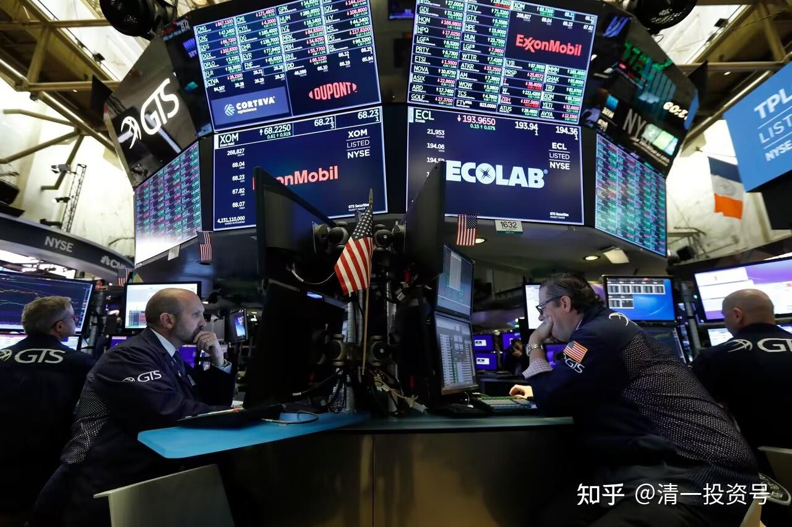

51篇.今日网校课程：华尔街金融专员赚钱之道（1）西方金融业的本质

清一山长 2016年9月6日

张钟瑞的作业正好有商学院的专题，就给大家讲一下让大家了解美国社会运作的奥秘。张钟瑞的作业在商学院的学生当中做得还算好的，他注意用数据来说明问题。比如说，几月几日到几月几日是因为什么样的东西，他就去查了。做研究员就要有这种精神，下面你们有几个商学院的研究就是写了个大概，你做研究员就不能搞个大概。做策略分析师，像我，我就可以做个大概，你不能做个大概，你做研究员必须拿出一个真实的数据来。

张钟瑞的作业中写了道琼斯指数从11月的10023点到2015年的17000多点，震荡幅度78%的数据说明了以下特征：股市大涨大多数基金没有达到应有的水准。这家大名鼎鼎的公司叫罗塞特基金，只有 55%的收益率。为什么会是55%的收益率呢？这里面有个最大的奥秘就是：它应该是跟随了市场成长，但是基金有一个任务，它是来收管理费的。

基金有两种管理费的收法：一种是按照基金总额，不管我赚还是亏，我每年收2%。这是一种收法。另外一种就是按业绩收，按业绩收就是我赚了钱，我收20%，还有些时候会约定收30%。

当然还有一种基金会收得更多一些，如果赔了，我负责帮你赔钱，也就是说你是包赚不赔。前面这种赔赚随意，你赚了钱我拿钱，但你赔了我不管。比如，你赔了钱我照样收2%。你现在给我1000万，你赔得只剩500万了，那我对500万收2%就是收10万块钱。如果是1000万我就收20万块钱，大概就是这种收法。你说公不公平呀？旱涝保收，所以本质上我是旱涝保收，你赔钱我都要收钱——收你的管理费。但后面一种方法就是你1000万赚到1500万，我就根据500万收20%。；但是赔钱了，我就收不到钱。

还有一种方法，若不赚钱，你白打工。如果客户的真金白银损失了，客户不干了。客户说，你一定要保本。保本分得的就多一些，赚了钱我分一半，赔了钱，赔多少，我就付多少。

山长：你们说哪种压力最大？

学生1：第三种。

山长：对。张钟瑞以后你们要做的是第三种基金——私募基金。因为第三种你才能够获得信誉，第二种就是反正赔了钱我了不起不要钱，我一点没损失，但是客户损失了。第三种就是客户赚钱了，你也赚钱了，你跟客户一起赚。客户赔钱了，你赔给客户，这是最牛的。

但是很少有人敢实行第三种基金，因为第三种基金你们赔不起。所以商学院要做第三种基金的话，那只好我来给你们做背书，但是我会很小心地告诉你们怎样投资，而且必须在合适的时间进行投资。但是这种选择，你必须选择超级有把握的、超级不能赔的。超级不能赔的话就是像你（张钟瑞）看到的账户——你外公的账户，它就是属于超级稳健的账户，就是属于不太赔的。然后我的冒险账户收益更高，但是因为赔了你要把客户的钱赔上，所以你就不敢去冒险，这个冒险对于你来说是很大的损失，所以就必须稳健。

罗塞特基金我不知道是什么基金，但肯定不是最后一种基金。所以，它在这个过程当中，不断地收管理费，所以本来你什么都不做，你都可以有78%，但它把你的钱收了，所以它就只有55%的回报给你。

现在再告诉大家美国华尔街是干什么的，**美国华尔街的人就是拔羊毛的，他们根本不是去替你获取利益，他们就是不断地从客户身上赚钱。**

我有一个账户是瑞士银行的账户，不过我看了它的文本，看了这个银行曾经的记录，我再也不愿意在里面存钱了，所以我这个瑞士银行的账户净额是0。之前我觉得瑞士银行服务应该很好，而且它要求还很高，必须是高净值客户，必须证明你有多少资产。因为我有这些资产，我才拿给它的。一般它要求500万美金以上，后来我一看它的东西我就发现，天哪，吓死了！

在瑞士银行你可以自己买股票，但是你买股票每交易一次，你就要给它付100美金——最低是100美金。所以我买个1万股，甚至10万股，然后按照正常交易费比例都满足不了这个要求。所以我说这真的是超级大客户，他动不动就买100万股，而且买小股还买不了，因为有些小股我一次只买几万股，买几万股它也要收你100美金。但如果是在别的证券公司，只要10港元、20港元就够了。知道吧？这就是交易费，我是不是被它吃死了？

另外，我的港股交易费是万分之八的手续费。它是多少呢？它是千分之五的手续费。你们知道这比例有多大了！而且如果我愿意找，港股我再换一家公司，我可以找到万分之三的手续费，不过那家公司太小了，是新公司。我现在找的是很大的国际大公司，给我才这个数字。而我找的这家瑞士银行，它收我的手续费差不多是我正常的手续费的8倍，也就是说我要付8倍的手续费给它。所以你就知道为什么**有些客户他自己很少交易了，他交易起来全是给别人打工了。**

还有这个账户每个月都要给它付两三千块钱的账户管理费，后来我一算，我**要启用这个账户就意味着我什么都不干，但我每年都要给它交10万块钱以上，还要加上它的账户服务费、什么什么费**。你们觉得我划算吗？我会觉得，天哪！它真的很划不来吔！

还有更要命的就是你让我把钱存在里面，你有什么好处给我吗？没有，它是负利息。你的钱存在它的账户上，它不给你利息，然后你存的钱越多，你给它付的负利息就越高。然后你有什么感觉？但是这些人，一个个穿得西装笔挺的，一个个好像很专业、很职业的样子。我这个人喜欢算账，所以我就不像其他人那样傻傻的。刚开始我也觉得瑞士银行挺好的，然后我还准备帮它介绍客户呢！后来我一看我在里面做事全是薅我羊毛的，然后如果我再稀里糊涂地做几个错误的决策，我就全完了。而我赚了钱，里面相当一部分要分给它。这就是西方金融业的本质。

山长：西方金融业的本质是什么？

学生2：从客户身上赚钱。

山长：对，从客户身上赚钱。

还有一个例子就更凄惨了。北京的一个暴发户，他就没有我这个脑子，大概也是在瑞士银行存了一笔钱，这笔钱是3000万。存进银行后，银行告诉他，现在有个产品，这个产品特别好，你可以以比市场价还打折20%-30%的价格买下一个股票来，这个东西几乎是包赚不赔的，特别划算，这是一个理财产品，是瑞士银行给高净值客户专门提供的理财服务。他一听，诶！钱存在这边还有这样一个好处——赚钱几乎是稳赚不赔，还可以比市场价低打折买股票，而且是理财，他就高高兴兴地买了。

好了，告诉你们结果是什么呢？结果就是一年之后，这个银行给他来了一封信，然后说，你的账户余额亏欠我们公司几百万元。他说我不是存了3000万吗？我是存款吔！我存在那里有3000万元，怎么会亏欠你们几百万元呢？银行就告诉他，他买的那个理财产品是给他用杠杆买的，最后下跌当然就跌得一塌糊涂。

那个产品是什么呢？后来我仔细研究了一下，那个产品就是上涨了之后你才有可能得到每年10%的收益，比存银行高得多。比如说，这个股票上涨了100%，客户能拿走多少？拿走10%。上涨是封顶的，往上涨剩下的钱是它赚的。下跌呢？下跌所有的钱是你来赔的。这就是欧美银行的理财产品。感觉如何？所以为什么那些华尔街金融人员一个个肥得流油，而那些客户一个个被他们吃得要死。现在知道我为什么不信任这些华尔街商业银行、这些所谓的投资者了吧？因为他们都是一帮骗子，美国就靠这批人在全世界吸血，把这些愚蠢的富人的钱全部吸光了。

你们知不知道财富是这样运行的，觉得好奇怪，对吧？这是因为世界上有很多人是土财主，而它就专门吃土财主。可惜我没那么土，我去研究它这些东西，我就不肯往里面打款，不肯入金。但是不肯入金的话，他还每个月都给我寄东西。昨天看到他给我寄了本厚厚的书过来，都是英文的我看不懂。张钟瑞帮我看一下，送给你。

因为我觉得我进去就是给他吃，就相当于我知道这是个陷阱，我就不可能跳。但是这个陷阱每次都给你劝话，这好好、这好好啊！你看我们服务多周到啊！很殷勤的服务。Oh， My God，算了!不过我不知道我会不会被列入它的缺乏信用名单，因为申请了账户居然不入金。不过不入金好像不能讲没信用，是吧？反正管你有没有信用，反正我也不要它的服务，这种服务太恐怖了。

所以现在觉得瑞士银行像你想象的那么优美吗？瑞士银行的确提供保密服务，保密服务的意思就是：保密，然后你突然死了，你还没来得及把秘密告诉别人，哦，这笔钱是它的了。（学生：笑）有些巨富就是为了保密、保密、保密，然后他的家人也不知道有这笔钱，他把钱藏起来了，结果他自己来个意外。他们经常利用这种意外赚到钱。

还有包括一些独裁者在国外存钱，国内被推翻，可能被不小心杀死了。他这笔钱，无主。无主，OK!他说我帮你存在那，其实把钱存在那，就是它拥有，给它了，那是它的资产了，因为从来不会有人找它要这笔钱了。对不对？

**参考链接：**

[39篇.今日网校课程：查理•芒格的成功秘诀1——逆向思维](https://zhuanlan.zhihu.com/p/641398367)

[41篇.今日网校课程：查理·芒格的成功秘诀2——清一派成功学思维模式](https://zhuanlan.zhihu.com/p/642327054)

[43篇.今日网校课程：查理·芒格的成功秘诀3——理性（1）](https://zhuanlan.zhihu.com/p/642327095)

[45篇.今日网校课程：查理•芒格的成功秘诀4——理性（2）](https://zhuanlan.zhihu.com/p/643847923)

[47篇.今日网校课程：查理•芒格的成功秘诀5——自尊](https://zhuanlan.zhihu.com/p/643859353)

[50篇.今日网校课程：华尔街金融专员赚钱之道——朴海娜课题课前作业](https://zhuanlan.zhihu.com/p/650492818)

