原专栏**156篇.第六讲：查理·芒格的财富思维和行为讲座PPT**

清一山长2021年5月8日

**文字版本——**

**芒格规则一：“要得到你想要的某样东西，最可靠的办法是让你自己配得上它。这是一个十分简单的道理，是黄金法则。”**

思考问题一：是否只要你配得上，就一定能得到你要的东西？如果还是得不到，你会怎么办？

思考问题二：“有时，你们会发现有些彻头彻尾的恶棍死的时候既富裕又有名”。查理讲这个故事，是要说明什么道理？难道名利双收的混蛋，也配得上这个名利吗？

**芒格规则二：“正确的爱应该以仰慕为基础，我们应该去爱那些对我们有教育意义的先贤。”**

问题三：他指的不正确的爱，是啥样的？“爱的方式，和爱的对象”。

问题四：我们为什么会爱先贤？一般人更愿意爱什么对象？

**芒格法则二：“获得智慧是一种道德责任。”**

问题五：获得智慧，为何是一种道德责任？变得聪明，难道不是为了更好的生活吗？

问题六：“巴菲特不得不成为一架不断学习的机器”。难道巴菲特是被迫学习的吗？

问题七：他每天工作17个小时，每周工作七天，整整坚持了一年。写出一本书。这也算是休假啊？你认为这算休假吗？他为啥不把这些当做工作来做？而要占用自己的休假时间？

**芒格法则三：跨学科学习**

问题八：为啥芒格不说自己要学习98%的内容，只满足于95%？他这个学习方式有何核心奥秘？

问题九：“如果你们的正确，让有身份、有地位的人觉得没面子，可能会引发极大的报复心理。”此时，你应该怎样办？芒格真的没有找到方法吗？

**问题十：**“我要向你解释一些事情，你的工作和职责是让客户认为他是房间里最聪明的人。如果你完成了这项任务之后还有多余的精力，应该用它来让你的高级合伙人显得像是房间里第二聪明的人。只有履行了这两条义务之后，你才可以表现你自己。”**如果你遇到这样的上司和领导，你应该如何处理？**

问题十一：不发展跨学科学习，“ 你们中的许多最聪明的人只会取得中等成就，甚至生活在阴影中”，请解释为何会是这种结果?

**芒格法则四：逆向思考**

问题十二：你如何应用逆向法则来处理你身边的事情？“ 如果要帮助印度,不如去设想要如何损害印度？”

比如：要让今日学堂更强大，就要去想：今日怎样就会被搞垮?

问题十三：请根据这个法则：“要知道我会死在哪里就好啦！我将永远不去那个地方”，制定出你的投资模式和原则！

问题十四：请列出，会让你在生活和事业中失败的一些可能性。并竭力避免这些事情(请教师们用一天时间，帮助学生写完本讲作业,并用一周时间，帮助学生真正的发现并解决这个问题)。

请用：我绝对不能去的N个地方！我绝对不能犯的N个错误！作为自己的提醒工具！

**芒格法则五：避免陷入极端的意识形态！避免精神控制！**

问题十五：**“ 我觉得我没资格拥有一种观点，除非我能比我的对手更好地反驳我的立场”**。请用具体的操作使用方式，用举例的方式，来说明这个原则的运用！

问题十六：**“ 年轻人特别容易陷入强烈而愚蠢的意识形态中，类似邪教团体的忠实成员”**。请问：是什么样的心理和行为，导致年轻人容易出现这种极端思想和行为?

**芒格法则六：避免负面情绪！“自我服务偏好”的心理因素经常导致人们做傻事。**

问题十七：**“ 嫉妒、怨憎、仇恨和自怜都是灾难性的思想状态。过度自怜可以让人近乎偏执，偏执是最难逆转的东西之一”**。

请找出两种切实可行的方法，来切除自己的负面情绪！

问题十八：芒格对于“ 自我服务”的要求，对人，对己有何区别？你作为班主任，请从芒格提供的信息里面，找到一种切实可行的方法，来帮助班级的学生，避免受到负面情绪的影响！

**芒格法则七：说服别人，要诉之利益，而非理性。**

问题十九：如果我们有创建中国顶尖教育，让中国人击败美国的理想，我们应该怎样去说服他人？比如让学生、家长来拥护你的理想？请设想场景，并说服对象！提出你的案例！

**芒格法则八：不要被变态的激励机制所驱动！**

避免陷入【你们表现得越愚蠢或者越糟糕，它就提供越多回报的，变态激励系统之中】

问题二十：请列举真实的股市案例，来说明芒格的这个道理：“你越愚蠢，你就得到越高的回报！”

(不懂股市的人，就用生活中的案例来说明芒格的这个道理)

**芒格法则九：在尊敬的人手下工作！**

问题二十一：你认为：做到这一点有啥现实的好处？你怎样才能做到这一点？

**芒格法则十：将不平等最大化很有利**

问题二十二：**“在他采用非平等主义的方法时，伍登比从前赢得了更多的比赛”。**五个和七个的比例，说明什么？你如何使用这种方式对待周围的人和事？

问题二十三：芒格提出有两种知识**“普朗克知识”**，和**“司机知识”**，这有啥区别？为啥说我们这一代对不起你们？内涵有何深意？你如何去改变这一切？

**芒格法则十：如何看待政客？**

问题二十四：**“现在立法机构里面大多数议员是左派的傻瓜和右派的傻瓜。”请问：这说明了什么样的现实问题？你认为这种严重的问题，最终会如何解决？**

**奥巴马和特朗普的竞争以及互相的打压！在对待中国问题上，让中国获得了良好的机会！**

**芒格法则十一：卓越来自于热爱**

问题二十五：你能找到你热爱的事情吗？你能否区分你“热爱的事情”和你“想要”的事情？

爱意味着付出——你愿意不要钱、不要命、不要脸去做的事情，就是热爱。

想要意味着：名利之心！功名利禄！

两者可以合一，让你创造了卓越。否则只是你的虚妄之心！

**芒格法则十二：一定要非常勤奋**

**“我这辈子遇到的合伙人都极其勤奋。”**

问题二十六：为什么聪明，并不是成功的必要条件？

**芒格法则十三：期待麻烦，面对不公平。**

**“在这漫长的一生中，我一直都在期待麻烦的到来”**

问题二十七：内心期待麻烦的到来，是不是找抽个性？这是否符合秘密法则？

老子：“祸莫大于无敌。”

孟子：“生于忧患死于安乐！”

只有愚蠢的父母,才会告诉孩子：“你活在天堂里面！什么都不用担心。只管找乐子！”

**芒格法则十四：信任之网**

问题二十八：你如何才能在生活中，编织出你的无缝信任之网？

问题二十九：婚前协议书是否有必要？请创建一个讨论或辩论！

“信者吾信之，不信者，吾也信之。”

**芒格法则十五：我的剑，传给能挥舞它的人！**

问题三十：“ 我的剑传给能挥舞它的人”，这代表了芒格什么样的心胸和态度？

**爱比克泰德简朴清静的人生**

**去改变能改变的，并坦然接受不可改变的！**

我必须被流放，谁又能阻止我带着微笑、愉快和满足上路呢？

“我要把你关进牢房”。你关住的只是我的肉体。

我必须死，那我必须呻吟着去死吗？

**爱比克泰德的道德观：**

控制你的情欲，以免它们报复你。

别根据你的愿望来要求现实，应该依据现实来确定你的愿望。

说话之前，先理解你要说的话。

智者不为他缺少的东西悲哀，而为他所拥有的东西高兴。

如果你想要进步，别在意别人觉得你很愚蠢。

自以为什么都懂的人不可能开始学习。

你遇到什么事并不重要，重要的是你做出了什么反应。

凡事尽力而为，别计较结果。

人若控制不了自己，自由便无从谈起。

唯有受过教育的人是自由的。

困扰人们的并非事物，而是他们对事物的看法。

要和那些比你优秀的人为伴，他们能促使你做到最好。

富裕并非拥有许多财产，而是拥有很少需求。

**图片版本——**

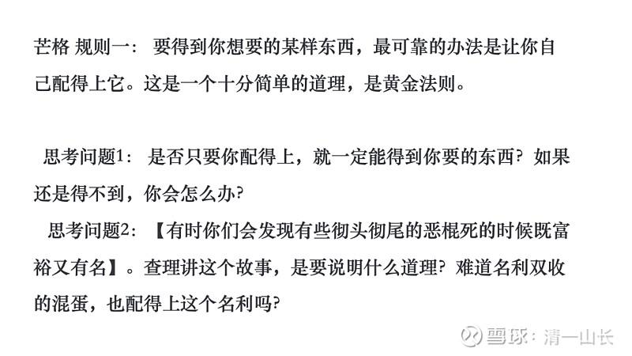

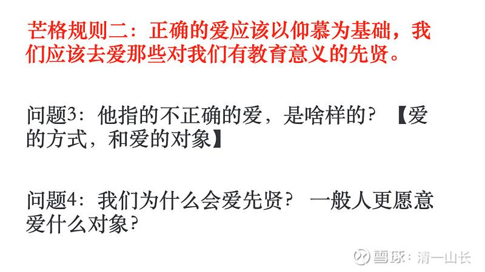

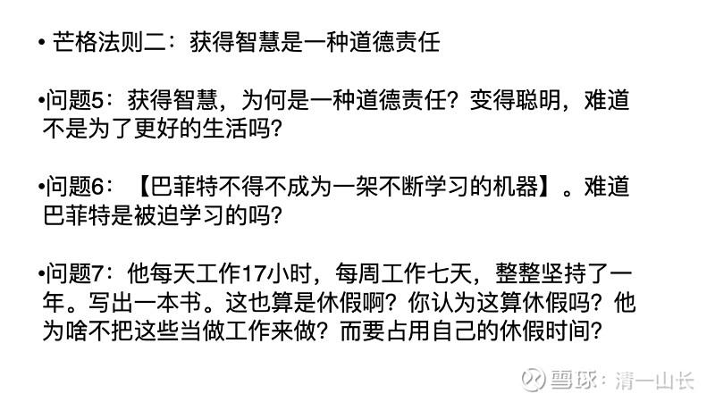

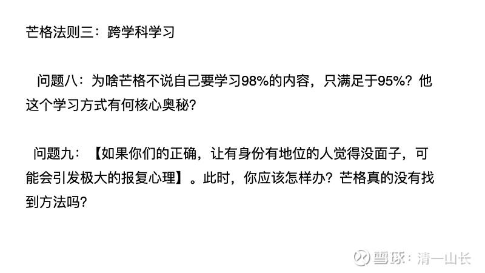

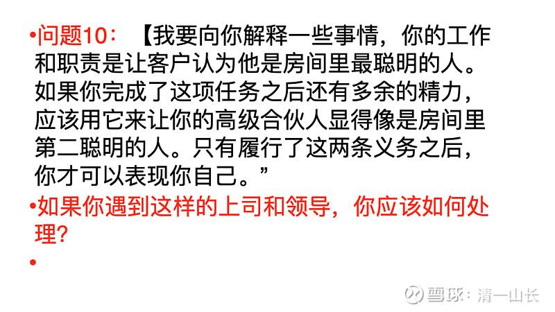

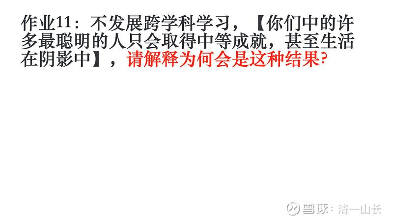

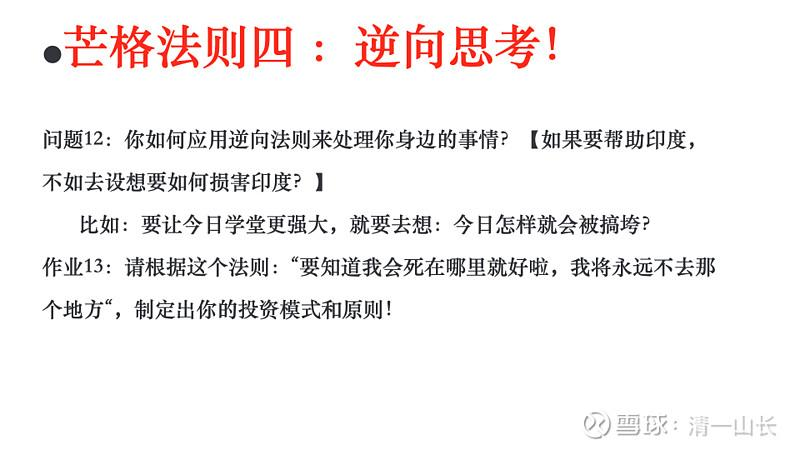

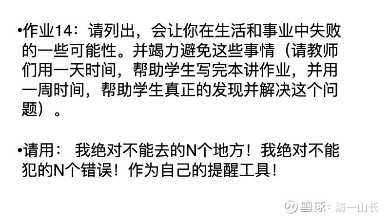

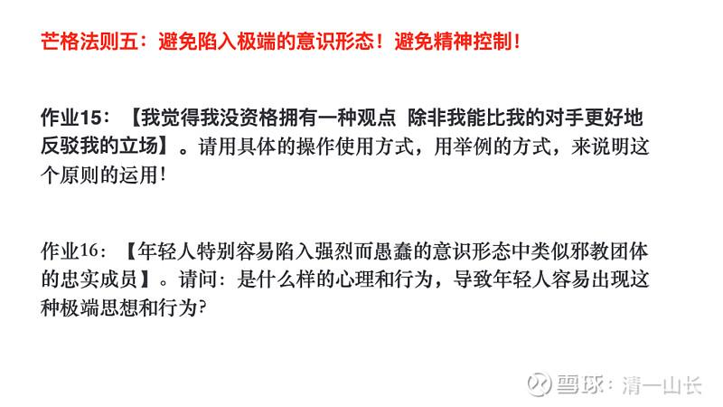

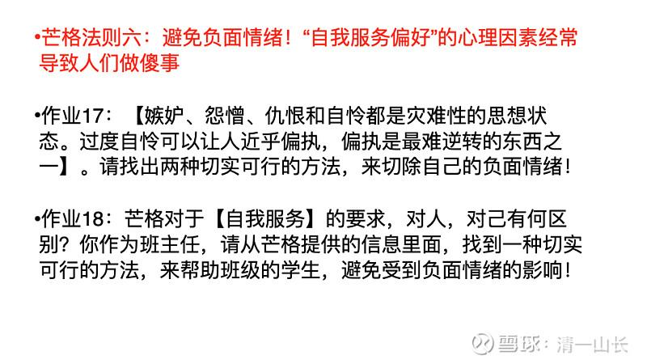

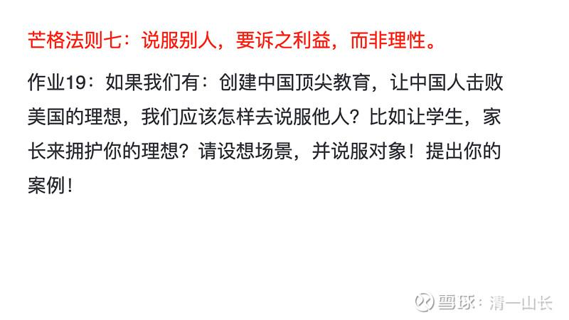

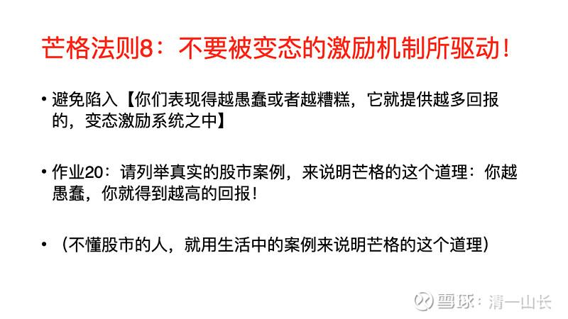

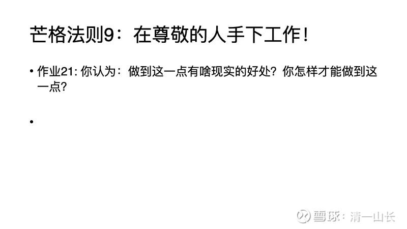

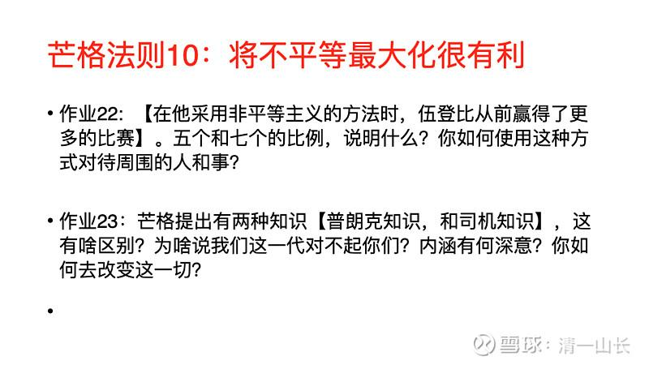

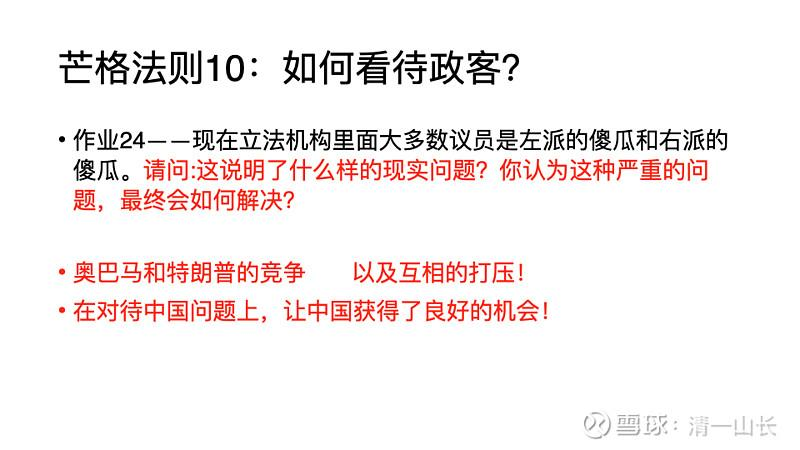

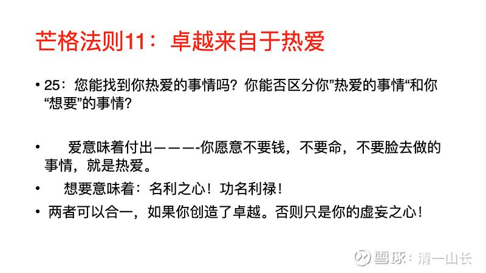

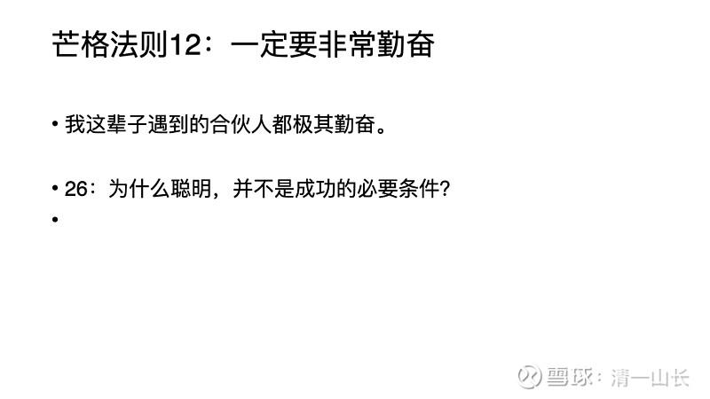

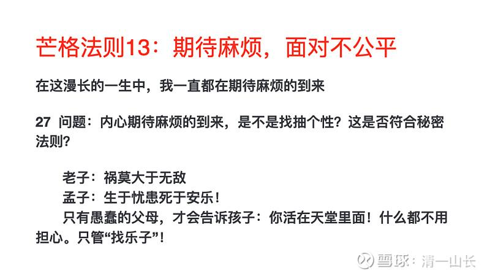

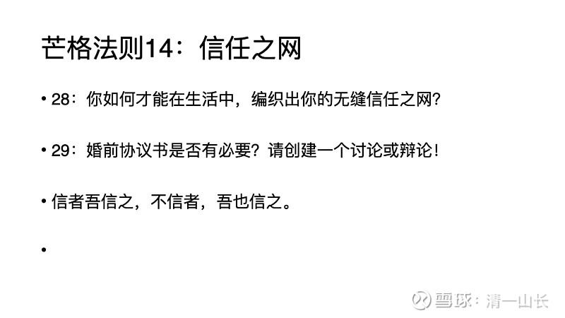

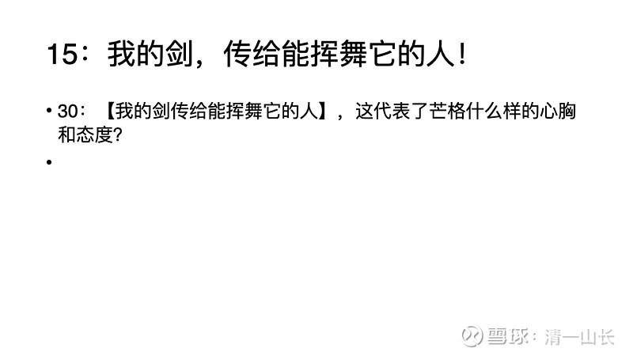

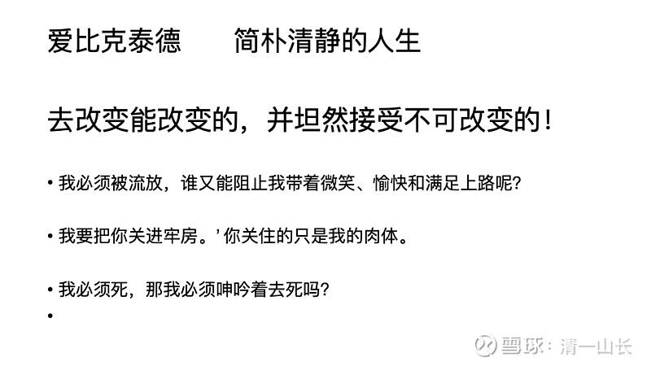

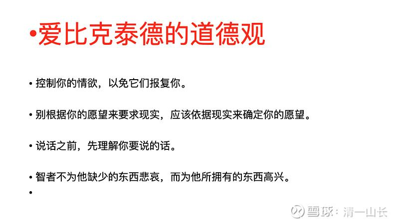

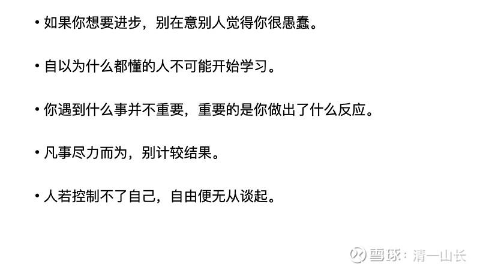

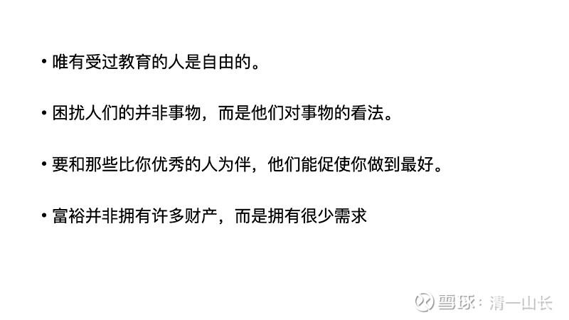
