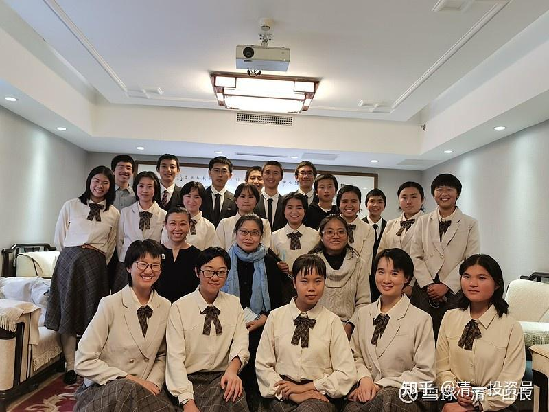

原雪球专栏**[89篇.拿千万入职金的未来教师，正在做什么？](http://link.zhihu.com/?target=https%3A//xueqiu.com/9310099567/163892894)**

[清一山长](http://link.zhihu.com/?target=https%3A//xueqiu.com/9310099567/column) 2020年11月22日

千万入职金，预期要授予的3.0教师长什么样？这个是她们最近的训练视频：

哔哩哔哩[网页链接](http://link.zhihu.com/?target=https%3A//www.bilibili.com/video/BV1v54y1z7M8%3Ffrom%3Dsearch%26seid%3D1101669863567493270)：

[https://www.bilibili.com/video/BV1v54y1z7M8](http://link.zhihu.com/?target=https%3A//www.bilibili.com/video/BV1v54y1z7M8)

我的入职奖金，是定点给这个班学生的，不是漫天丢钱。大约会是3～10名学生以内得到这个奖项，不会是所有人。这个班的学生，未来的职业理想都是要当教师。所以，我当然要全力支持她们了。

还有这两位，她们因为是这个师范预备班的。两三年后，这个班的所有学生，就要正式入读清一大学师范学院，学习怎样“为人师表”了。

哔哩哔哩网页链接：

[https://www.bilibili.com/video/BV1Ez4y1y7CH/](http://link.zhihu.com/?target=https%3A//www.bilibili.com/video/BV1Ez4y1y7CH/)

我们学堂的师资待遇如何？**现在的带班教师的工资，是年薪20多万。这是净收入，教师的吃住全包，通勤费用都没有**。我在清迈，还给所有的教师们盖花园别墅，免费赠送。因此，教师们的这笔薪水，其实超过了很多拿30万薪水的职员的实际收入。现在，有很多人，都想来我的学堂当教师，不过应该不是因为这点薪水而来。我担保您用翻倍的年薪，你用50万元、60万元的薪水，是拉不走这些教师的。不信您就试试看！我的教师是教育界的“热销品”，每年都有人来我的学校挖角，但都铩羽而归。因为这些教师不是因为钱而教学的。当然，我估计马云砸个十个亿下来，估计还是挖得动的（别怪教师们，如果他砸壹佰亿给我，连我都心动了）。

各位想申请入职，我欢迎。不过我们的**教师上岗的原则，是要通过学生的投票选择，才有机会入职。**也就是说：学生们会用你们看到的，我们学堂的教师标准来要求您的。如果觉得有实力，跟您看到的示范班明师荟的教师，是彼此相当的水平，您就可以来申请入职，欢迎。你们看到的示范班(哔哩哔哩[网页链接](http://link.zhihu.com/?target=https%3A//www.bilibili.com/video/BV1v54y1z7M8%3Ffrom%3Dsearch%26seid%3D1101669863567493270)：[https://space.bilibili.com/487498588](http://link.zhihu.com/?target=https%3A//space.bilibili.com/487498588))明师荟的教师讲课实况在这里。可以自行比较。

不过，我认为体制内的大学，985、211，根本就培养不出来我需要的教师。对外招聘新教师教学生？我根本就没指望。所以，我只能自己去培养未来的教师，这样才符合我的要求。

这不！现在我就新推出了一个“千万大奖计划”，奖励未来的3.0版本的教师。1.0教师，就是我原来在武汉大学培养的第一代教师：如示范班的钱校长、陈校长、赵老师等；2.0教师，就是从小在今日学堂学习的学生，长大了留校当教师的：如示范班讲课的明仪、明颖这些教师；3.0教师，是未来的教师。目前还没有出现，但正在规划和培养中。我计划中的第一批3.0教师，现在才12～13岁。她们两三年后，15岁就可以就读我的私人大学，专心学习师范专业，教育学专业。她们18岁的时候，就可以选择毕业，直接进入新教育学堂当老师。这就是去当3.0教师。

更有雄心壮志的学生，想要当3.0教师的学生，要求就不一样了。难度要高了很多。同样清一大学毕业，18岁了，不能毕业后直接去当教师，而是必须要去海外大学游学和工作。必须完成规定的任务，去海外各国，磨练四年后，才能回校上任，成为“3.0版本的教师”。

给她们指定的任务，是必须完成三个任务：

**第一个：文化课要求。**进入海外某国排名最顶尖大学的相关专业学习，并成为该大学的明星学生。要与其他大学新生，同步开启学习一个新的，自己没学过的专业。学业成绩必须是第一，而且要与成绩第二名的学生，远远地拉开距离，不具有可比性，让其他学生望尘莫及。

**第二个：社交要求。**必须成为该国上流社会人物的座上宾，成为该国的各大学校长、院长，以及省长、部长、市长、商界要员们都欢迎的重要客人，赢得他们的尊重和喜爱，并在大学毕业的时候，得到多家知名企业的OFFER。

**第三个：社区服务要求。**在海外大学学习的四年期间，必须以家国天下的心怀，为该国和该大学提供社区服务。要求做到该大学的学生无法做到的，优质、高端，上档次的服务。从而成为该校最受欢迎的荣誉学生，成为刻在该校教师记忆深处的“中国公主”。

如果清一大学师范班的学生们，未来实现了这三条任务，就实现了她们的“入职考试”，可以回归清一母校工作了，以全新一代3.0版本的教师身份开始亮相职场。她们的未来大学生活，是丰富多彩的。她们的成果是丰厚的，表现绝对属于世界优秀级的。所以，优秀人才，当然是应该特别奖励的。我的奖励，就是给这些回归母校的荣誉学生，每一届学生，都给1000万元的入职金作为特别奖金！预期来分这笔入职奖金的学生，大约是3～10人（不是平均分配，根据三项任务实现的成果评估来授予。估计前三名，可以拿走70～80%的奖金）。每一届清一师范的学生，都有另外的一千万元入职金等着授予。

这笔入职金，是中国90%的人，可能一辈子都没挣到的钱。可这些年轻的学生们，刚刚大学毕业，就可以得到超过其他普通学生一生的收入。对比：“我父亲大学毕业，工作一辈子，一生勤俭，总共才攒下了近30万元的存款，还有一套卖不出多少钱的房子”。刚毕业，就获得了财富自由。她们**终身都不需要为了金钱而工作**。她们大学毕业后，**唯一需要做的事情，就是去捍卫自己的教育理想，成为全世界最优秀的教师，去教出全世界最棒的人才。**

我现在要规划去做这一个3.0未来教师培养计划。我的理想就是：**通过这些优秀的学生，去海外最顶尖的大学，用最优秀的表现，让中国人赢得全世界的尊重。让中国教育，中国文化走向世界。让这些未来的3.0教师们，作为文化和教育大使，用她们的全新文化魅力，征服全世界！[献花花]**

图中为清一大学西班牙语专业学生，在北京考试期间，与北京大学外国语学院的西语系教授，西班牙孔子学院的院长吕老师等，合影留念！吕教授对学生们赞扬有加，建议是：语言学习关同学们已经过了，以后要把西方的文化和专业课程学习，作为重点学习目标。

**评论回复：**

**清一山长2020-11-22 17:14回复：**

关于3.0教师：“**你们最应该思考的，是能够培养出这种优秀学生的学校，价值是多少？如果这样的3.0教师，来做您孩子的教师，您应该支付多少学费？**” [笑]。这个问题很现实。

另外，这三个目标，肯定会实现的。我唯一不能确定的，就是谁去实现的。我手上，目前大约有30名人选，每一届。所以，我得加油挣入职金[加油]！

给未来3.0指定的任务，是必须完成三个任务：第一个：文化课要求：进入海外某国排名最顶尖大学的相关专业学习，并成为该大学的明星学生。要与其他大学新生，同步开启学习一个新的，自己没学过的专业。学业成绩必须是第一，而且要与成绩第二名的学生，远远地拉开距离，不具有可比性，让其他学生们望尘莫及。

第二个：社交要求：必须成为该国上流社会人物的座上宾，成为该国的各大学校长、院长，以及省长、部长、市长们、商界要员都欢迎的重要客人，赢得他们的尊重和喜爱，并在大学毕业的时候，得到多家知名企业的OFFER。

第三个： 社区服务要求：在海外大学学习的四年期间，必须以家国天下的心怀，为该国和该大学提供社区服务。要求做到该大学的学生无法做到的，优质、高端，上档次的服务。从而成为该校最受欢迎的名誉学生。

**降心归道回复清一山长**：

这样“吓人[哭泣]和变态[吐血]”的要求，估计只有山长这种千年老怪才提得出来！对于凡俗的平庸之辈，任何一条都可以要了N次小命都搞不定，更何况三条都要漂亮的达成，还有时间限制，心不到，境界不到，智慧不够，思维不凶猛的话，花千年万年都奈何不了[哭泣][吐血]对于学堂学生，我相信山长的自信判断：肯定行，凭什么不行？

**清一山长[2020-11-23 16:48](http://link.zhihu.com/?target=https%3A//xueqiu.com/9310099567/163978074)回复降心归道：**

[献花花]。你能理解到“超级变态的要求”就对了。我这三条要求，要比考清华、北大，考耶鲁、哈佛都要难多了。我相信：除了我的学校，没有任何学校，能够培养出这样的人来了。但我的学生，可以批量培养符合三条要求的人才出来，绝不是“孤品”，我预期每一届是3～10个，也有可能超过预期，10个以上。她们会源源不绝的出现！

我是宁缺毋滥，3.0教师，有一个，就算一个。没有我就等，等十年、二十年都行。这些孩子，一旦实现这三条，她们自己，就已经跻身上流社会了。将来她们的婚姻对象，家庭背景，肯定都是在这种上层社会的家庭范围里面去选人了。所以，女生们，以及家长们，都很支持这个计划，都很努力，要夺取这个3.0国际名校教师的制高点。

但为了达到这个效果，这个公主班的日常训练，以及淘汰，也是“残酷”的。你们看到了公主班训练项目中，这个[凤凰涅槃计划](http://link.zhihu.com/?target=https%3A//www.bilibili.com/video/BV1v54y1z7M8)，你们看到其中有七个学生，坚持不下去，宣布退出训练吗？这些学生，当众自己撕掉了自己训练前写的“入伍承诺书”，她们没有维护自己团队的荣誉，当然也放弃了自己的个人荣誉。只会叫叫口号，在我们学校是不被接受的。说到，就要做到。做不到，结果是什么？是退学！没错，这个班，是两个精英学校（今日/清一塾，其中选出来的，最优秀的前十名学生，才有资格进入的。但因为没有实现自己的承诺，怕苦怕累，昨天被劝退回家了。不是回原来的学校继续学习，而是直接退训回家去了。

我不会把时间和精力，以及金钱，用在供养没有团队合作之心，没有克服自己，超越自己的人身上。**公主班，必须是最强悍的学生，最想赢的学生**。**退缩的学生，没有资格留在这里的。**这些被退学的七个学生中，还有今日学堂年级曾经的学业综合评定第一名的学生。这说明：这个公主班，只是成绩好，是没用的。当然，连成绩都不好，就更没用了[俏皮]。

这个班的全体孩子，其实全都是学霸。她们全部熟练背诵会一部完整的新电影的外语台词，仅需20天不到。比较一下；我们学校的天使班学生，已经学习一年半了，现在才刚刚学完两部电影的台词，还不够熟练。您可以知道两种学生的差距，有多大！

仅仅有这些学霸的本领还不够，她们还需要更强大，才有资格成为6年后，我们打入世界上流社会的精英人选，才有资格成为大学校长、部长、省长的座上宾。这就是要求不一样。

而昨天被开除的学生，她们将来依然会是学霸。她们全都可以考上国家级一流大学。但她们，看样子就只能去世界五百强，做做打工仔了。她们不能做世界的主人。因为，她们没有这种做“中国公主”的骨气！我们就只能放弃了。

**勇于放弃，甚至放弃学习成绩第一名的学生，就是我们成功的奥秘！**

**小明真的相群众回复清一山长：**

满足3.0版的，估计要1000万美刀吧？

**清一山长2020-11-22 20:16回复小明真的相群众： **

别吹了，好像真有1000万美刀，你就可以找来这种3.0教师。这种品种，地球上还不存在[俏皮]！如果您能找来3-10个这样的3.0版教师入职，我给您1000万欧元[俏皮]。绝不食言。

因为这些3.0，是我亲手培养出来的弟子。他们是11岁就开始“定向培养”的专门品种。海外毕业后，不要入职金，她们也愿意来清一大学工作。我就打个折，用人民币来支付入职金了。肯定不是泰铢[大笑]。

**德明弘毅回复清一山长：**

看了孩子们的训练视频，超燃！[很赞][很赞]男生怎么那么少？看来想做新教育教师的还是女生居多。还有孩子们每天训练强度那么大，每餐只吃那么一点会不会没法补充体能？

**清一山长2020-11-23 09:01回复德明弘毅: **

男生为什么这么少？原因是：其实学堂的男生不少，跟女生差不多的。只是男生们大多数，都只想去跟别人打工，进什么世界五百强企业去当个职员。从底层慢慢的往上爬。而这些女生们，更愿意当主人，更愿意为自己而活。让自己大学毕业就进入上流社会，跟高管们平起平坐。还让世界五百强的高级管理人员们，必须恭恭敬敬地称呼自己为老师。[笑]志向不一样，选择的结果，自然不一样！

**参考链接：**

**[公主成长记 Vlog#1：锄地](http://link.zhihu.com/?target=https%3A//www.bilibili.com/video/BV14A411j7cd)**

**[公主成长记 Vlog#2：“极品女神训练计划”](http://link.zhihu.com/?target=https%3A//www.bilibili.com/video/BV1TV41117aH)**

**[公主成长记 Vlog#3：“凤凰涅槃计划”](http://link.zhihu.com/?target=https%3A//www.bilibili.com/video/BV1v54y1z7M8)**

**[公主成长记 Vlog#4：日常运动展示（清一学塾）](http://link.zhihu.com/?target=https%3A//www.bilibili.com/video/BV1nV411h73M)**

**[公主成长记 Vlog#4：日常运动展示（国际今日）](http://link.zhihu.com/?target=https%3A//www.bilibili.com/video/BV16T4y1M7A4)**

**[公主成长记 Vlog#5：为全校师生供餐](http://link.zhihu.com/?target=https%3A//www.bilibili.com/video/BV1LU4y1W7vi)**

**[公主成长记之公主音乐厅——Vlog#6：迪士尼泰语歌曲连唱](http://link.zhihu.com/?target=https%3A//www.bilibili.com/video/BV1z5411N7gX)**

**[公主运动场: Princess Insanity](http://link.zhihu.com/?target=https%3A//www.bilibili.com/video/BV1Vp4y1H74q)**

**[公主预备班：致山长的感谢信](http://link.zhihu.com/?target=https%3A//www.bilibili.com/video/BV1GU4y1W7aX)**

**[新明德女塾公主班](http://link.zhihu.com/?target=https%3A//space.bilibili.com/644593579)**

[清一投资号：46篇.新教育送给中国人的礼物——中国公主](https://zhuanlan.zhihu.com/p/553173076)

[新春辟谷体验](http://link.zhihu.com/?target=https%3A//mp.weixin.qq.com/s/Xv5K-lDGMXHTGnV0X9qh_w)

[走进公主预备班1：运动、餐厅、学习管理、信念检查](http://link.zhihu.com/?target=https%3A//mp.weixin.qq.com/s/SlMB3hErwEWbISDLvtnV9g)

[亿万身价的企业家太太走进公主预备班](http://link.zhihu.com/?target=https%3A//mp.weixin.qq.com/s/SlMB3hErwEWbISDLvtnV9g)

[走进公主预备班2：搬砖、零食节、辟谷后跑半马](http://link.zhihu.com/?target=https%3A//mp.weixin.qq.com/s/j4hHzlbO0-lELLyc00s6ig)

[走进公主预备班3：军训、山顶演讲、泰语学习、信念检查和引导](http://link.zhihu.com/?target=https%3A//mp.weixin.qq.com/s/RCTlgYIfgHVo0m6GXRMzPw)

[走进公主预备班4](http://link.zhihu.com/?target=https%3A//mp.weixin.qq.com/s/YGxXpzaJMyFLSmaIkeC8GA)

[走进公主预备班5](http://link.zhihu.com/?target=https%3A//mp.weixin.qq.com/s/zL3KhunYMapSF1PaDpuPQQ)

[走进公主预备班6：如何成为目标型人](http://link.zhihu.com/?target=https%3A//mp.weixin.qq.com/s/_w9-QSYVVEhLFeF-8CH_Cg)

[13岁的年龄拥有40岁的人生思考——这些学生是如何做到的？](http://link.zhihu.com/?target=https%3A//mp.weixin.qq.com/s/LVXYhv3OnrkSy9QO3yab0g)

[走进公主预备班7：和两位大咖座谈的精彩节选（一）](http://link.zhihu.com/?target=https%3A//mp.weixin.qq.com/s/4LUTLh21u28ufQJwkSsoOg)

[走进公主预备班8：海燕姐姐两个月的感悟](http://link.zhihu.com/?target=https%3A//mp.weixin.qq.com/s/tFURvGqhhgO-cFbuYfgamw)

[“做最好的自己”深入到孩子内心是什么样的状态？](http://link.zhihu.com/?target=https%3A//mp.weixin.qq.com/s/mS5kBVO_31sEoHW9sk7CjQ)

[走进公主预备班9：大咖对话（二）](http://link.zhihu.com/?target=https%3A//mp.weixin.qq.com/s/JjdWpi1jogDR0zv8W0s-5A)

[走进公主预备班10：什么是真正的老师？](http://link.zhihu.com/?target=https%3A//mp.weixin.qq.com/s/5Yhwj5Jph6-5h1SH-bAWlw)

[走进公主预备班11：看破人间游戏的本质](http://link.zhihu.com/?target=https%3A//mp.weixin.qq.com/s/pSNUnwngbiRHErQ1id7q0Q)

[走进公主预备班12：怎样做知心姐姐？](http://link.zhihu.com/?target=https%3A//mp.weixin.qq.com/s/y9l4xnwMFrnSiF23qKAywg)

[公主夏令营总结——即将开启的新教育3.0时代](http://link.zhihu.com/?target=https%3A//mp.weixin.qq.com/s/5WPT0lmKCLT_EAUQnGd9rg)

[公主营学生大总结](http://link.zhihu.com/?target=https%3A//mp.weixin.qq.com/s/rh8-vFNkn84q3aeBROtYbQ)
