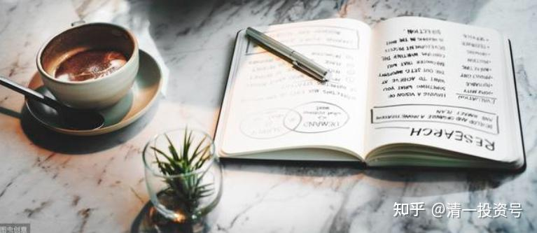
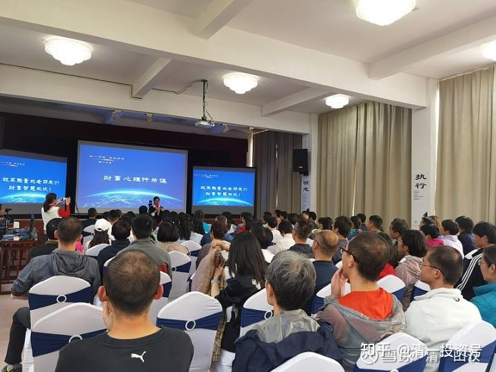

原专栏**158篇.财富最终讲：课程日记和反省！**

清一山长2021年5月11日

我的五一财富课，只分享了作业，没分享课程内容和总结，有人总想多知道一点细节，下面就提供一份最终讲的日记记录，供大家一窥细节和内容。学生们还自己制作了一个视频表达感谢，过几天看有无机会传上来。

李卫贞 第九天，财富最终讲课程日记

一个人的行为跟他的核心信念系统有着直接的关系，当我们的信念认为钱是最重要的时候，那么相对应对于金钱的观点和行为就会逐一呈现。比如我国2019年在海外购物的奢侈品消费金额在1万亿，这些数据足以说我国人们金钱观念的信念强到了惊人的地步：为了购买所谓的奢侈品不惜一掷千金，面不改色；为世界、为其他国家贡献了巨大的经济利益，而没有丝毫的愧疚，反而到了引以为豪的极度的地步。由此可以看得出，真正对金钱有敬畏之心的国人应该像今日学堂一样，像山长一样，**把金钱用在帮助国民提升人的素质教育上，不惜一掷万金的豪壮之举，才算是真正的有钱人**，因为**他们是一群内心富足，一群有识之士，是懂得金钱，有驾驭金钱的能力的一群爱世界，爱国，爱家，爱自己，拥有富足之心的人。山长愿意花费毕生的金钱和精力为社会打造和构建真正的素质教育学校，自掏腰包供养和布施学生和学员，还要非常用心和耐心的教导，要是一般人会认为山长真的吃撑了没事干**。可是，恰恰就是无知的人才会这样认为，而高级的人想的跟我们完全不一样，他是**带着慈悲和无私的大爱——就像佛陀当年教化众生一样教导我们，把他的智慧传给我们。他的信念就是为这个世界传播他的智慧，弘扬道家文化，帮助更多的人脱离世俗之苦，把无知转化到清明的状态，让我们的社会变得更加身心自在，有能力之人可以为世界、为我们国家做一些更加有意义的事情。**这就是卓越的信念主导了大格局和长远的眼光。而很多富豪却关注我如何可以获得更多的金钱，就算像何鸿燊那么有钱又如何？最后还是需要走向一个方向——死后留下的是什么？一堆金钱和赌场，让子孙后代为了金钱不断的争夺。究竟是钱还是我们的信念决定了我们的未来和存在的价值。
财富故事：金钱能够带来尊重和敬仰吗？富人怎样才能得到穷人的尊敬？
富人说：“我富你穷，你为啥一直不尊敬我？”
穷人：“你有钱，你又没给我，我凭啥尊敬你。”
富人：“我给你一些钱，你可以尊敬我了吗？”
穷人：“我还是比你穷，跟你还是不平等，我凭啥要尊敬你？”
富人：“我把我的财产分你一半，你总该尊敬我了吧？”
穷人：“我们俩现在一样有钱，是平等的，我凭啥要尊敬你？”
富人咬牙说：“我把我的钱，全都给你，你总应该尊重我的吧？”
穷人：“现在我比你有钱，你比我穷，我干嘛要尊敬你？”

这个故事我早上跟我先生和伙伴分享了，最后大家忽然意识到了，自己一直追求的金钱居然能够换来的东西都是一场虚幻的，换来的名和尊贵以及地位，都只是虚假的，真正的名和尊重是别人发自内心的，而不是金钱所能换得来的，就像山长和刘老师得到清粉圈得尊敬和尊重，不是他们花钱买来的，而是他们用心经营和付出所得到的。我们都是发自内心地敬爱老师，也不容许他人诋毁我们的老师。但是老师却不在意，因为他们的大爱对我们都是一样的，你愿意成长他们愿意无私地用智慧来布施我们，我们都得到了很大的提升，家庭生活、事业都得到了不同程度改变和提升。这不是金钱可以换来的。当然金钱或许在很多地方都有一定的作用，但是真正帮到我们的是智慧，真正有用的是找到那颗清净无染的心，而不是外在物质。

我相信天道，所以天道轮回，如果我们不懂得珍惜生命，不懂也不愿意去学习探索宇宙和生命的奥秘，不愿意努力修正提升自己的智慧，那么注定我们将一生毁掉，甚至毁掉子孙后代，严重的毁掉人类文明。我相信因果轮回，如果我没有做好事，我一定无法得到好的报果；如果没有存钱到“宇宙银行”，那么我一定无法提取出来用，那么注定我后世必定是无法获得更多的机会与资源，反复轮回或沉沦，那是生生世世无法解脱。有些人在“宇宙银行”也存了不少钱的，由于不懂得如何使用，结果胡乱支取、透支，反而导致被扣了利息和部分本金，出现亏损。

上财富课，潜意识里我们都有一颗渴望富足之心，都想赚更多的钱，想要更多的金钱来填充我们匮乏的心。之所以匮乏是因为我们不知道我们其实真的不需要太多，几千元的衣服和几百元的衣服没有太大的区别；一万元的饭菜和10元的饭菜本质上没有多大的区别；别墅和套间功能都是一样的，我们就可以天然地认为重要的是我们只需要很少的东西，我们只是想要的比较多，需要的其实很少。

记得山长说过：**人生最大的意义就是这辈子就是为了下一辈子做准备的！**可是很遗憾，我们绝大数人都在这趟人生旅途上，走着走着就忘记了自己原本是要来干嘛的，所以迷路的迷路，岔道的岔道，流连忘返更是误以为自己找到了自己想要的，而把自己留在了路上，最后忘记了要回家。山长说，学不好就不要回家了，就像今日和清一的孩子一样，学不好就要接受走路回去的结果。如果我们这辈子还是学不好，那只能回归到原来的起步点，或许不一定有机会重新再来了。

这节课让我看到了自己以前的很多愚昧，同时也看到了山长其实就是一个慈悲的智者，在普渡我们这些无明的众生，不厌其烦的循循教导，还手把手地教我们，最后还把“尚方宝剑”传给我们，至于我们能否用好他的智慧宝剑，他一点都不挂碍，很潇洒地转身离去。这就是真正的智者，一个值得我终生敬仰的智者（我需要敬仰的智者）。感恩之心时刻铭记......

