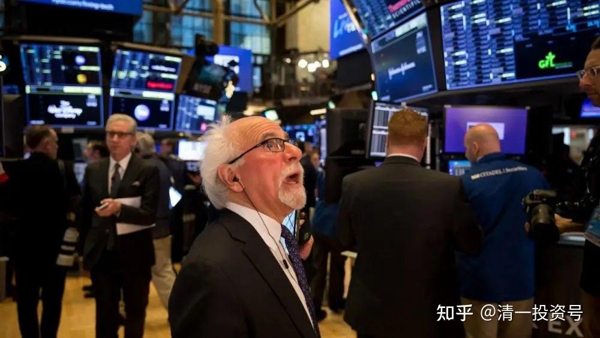

**55篇.今日网校课程：华尔街金融专员赚钱之道（5）华尔街金融公司及员工到底靠什么本事赚钱？**

清一山长 2016年9月6日

**一、点破华尔街“赚钱之道”**

好，我们再看**(学生1）的作业。这个人在华尔街做了十年的金融从业人员，到底靠什么本事来拿工资呢？现在**（学生1）的回答应该很简单了吧？**她靠忽悠人来赚钱的，她根本靠的不是真正的投资、不是真正的交易、不是她真正的判断力，她靠的是骗人。**但是原来是公司集体骗人，现在她一个人骗人就会露馅。公司骗人有公司为她做背书，对不对？而且公司还有各种各样的风控——风险防范通道，不至于造成那么大的困局。

现在告诉你们公司到底怎么骗钱的，她骗钱是把客户的钱输掉90%几，是吧？那么，你们知道传统的一些公司骗钱，为什么没有遭人投诉呢？因为私募基金有一个规则——如果亏损超过20%或30%就清盘了。一般是在资金剩80%，就是只要剩下的资金8折就清盘；去年中国有一大批——几千只私募基金被清盘。

山长：**（学生1），我们想象你有1000万元，那你交给**（学生2）去帮你投资，然后1000万元最后只剩了几十万元，那你会怎么想？

**（学生1）：我要投诉他。

山长：你一定说他：你是个大骗子。然后公布出来，他就是个大骗子，是不是？

山长：**（学生3）想不想这样对付他，也一样地干，但是也让他没法投诉你？

**（学生3）：……

山长：说得再好，你把它亏到70%，你的名声也臭死了，对还是不对？

**（学生3）：对

山长：为什么还在骗人呢？

所以**（学生1）拿1000万给你，你应该告诉他，我是一个非常守规矩的、严格按照规则做事的基金管理员。现在既然亏损了百分之七十，那我们就清盘，证明我能力不行，这个市场不好，我要清盘。所以**（学生1）的钱，拿在你手上变成700万的时候，你通知他，市场不好，现在到了清盘线，所以现在请把你的700万拿回去，当然你的钱我也没赚到，然后规规矩矩地把钱还给他。

山长：**（学生1）你还说他的信用不好吗？

**(学生1)：不可以。

山长：**对，他很守信用。你看他虽然亏了，但是你看看他的账户记录之类的，有一整套的程序表示他没有把客户的钱打到他的信用卡里面去，只要他不干这件事情就够了。他拿的工资是管理费，1000万，一年他拿2%，那就是20万的管理费。他这一年他得了20万的工资，但那20万工资是他该得的，对还是不对？所以这一年他赚了20万，但是你赔了300万，但是你怪不了他吧？但如果他是通过你的账户，把这20万偷偷地转到他的账户里面，他是偷窃。偷20万是偷，偷200万也是偷，但是这300万是叫损失，是市场带来的损失。所以不是他偷的钱，所以他是有信用的，他也是光荣的华尔街金融人员，没脾气吧？**

山长：现在你剩700万，你怎么办？

学生1：我拿走。

山长：对，你拿走，你说：哼，这家公司投资能力不好，我再找一家更有名气的，就找卢**投资公司。卢**公司也是很有信誉的，跟你签了这样的协议。

当然你是一家公司行为，你不是个人行为，你是个人就涉嫌欺骗。但你是个公司的话，就是公司行为，所以700万给他，七七四十九，下一次你只剩490万。那卢**公司一定就规规矩矩的把490万还给你，然后说，到了清盘线。你把这个东西再重复十遍，你只剩下几万块钱了。你去投诉谁？你只能投诉你的大脑有问题。好，这就是华尔街金融机构的游戏方式。

然后，你对我有意见，你再换一家公司，所以华尔街同时有很多家公司，而且这些人也在这几家公司换来换去，然后再忽悠你进去。你觉得这家公司不好，你觉得是换一家公司就好了。其实不一定。但是他运气好，总有运气好的时候，是不是？

比如说你拿给卢**公司，卢**公司可能碰到一个大牛市，你给他的700万又变成1000万了。然后这一千万当中，卢**公司要拿奖金，他拿20%的奖金走。然后你现在剩九百多万，你还是很开心，因为你会觉得卢**公司很好。

然后，不仅这900万，可能你还会重新再拿1000万再交给他。他拿了去之后，再过一年他告诉你，碰到了大熊市，2000万又只剩下1500万了。其实你看你又被市场吃掉了500万，你亏掉的部分一定有人赚走了，是谁赚走了，不知道。另外一些人赚走了，对还是不对？赚走了，他就拿一大笔奖金，没赚走，他还你钱，这就维持了信用，在这个维持信用的过程中他就赚到了钱。所以这就是朴海娜为什么吃亏的原因。她要跟公司在一起这样做，而且要设定一个严格的亏损线、严格的清盘线的话，她可以不断地吃你，吃10年、20年。她还可以冒充专业人员，尽管她可能没帮客户赚到1分钱利益——总体上全是亏损的，但是她依然可以体面地活着。但如果她用个人行为做这件事情她就是诈骗。

山长：这个很好理解，因为我是一个医生，我在医院里面，我把人治死了。知道这叫什么吗？

学生4：医疗事故。

山长：**对，我的程序是对的，是你对不上我的程序，就是你有问题，你能不能找我投诉？如果是在家里面，你把这人送过来了，这套程序就不起作用了。这时，你一定会找我算账。所以为什么你们要治死人，一定要到医院去治，不能自己在家里面治，家里面治，绝对不能把人治死。**懂了吗？

你们想学医的，知道怎样治人了吧？治死人只能在医院里治死人。你觉得有可能把人治死，一定把他推到医院去，你绝对不能自己在家治疗。在家治，你治好了，别人给你个感谢。**（学生2），你真有本事。如果你治死了，**（学生2），你是个恶魔，你害死了我的亲人，然后我要把你碎尸万段。

所以，机构或单位就是保护你的一张皮，然后客户没办法去攻击这些机构。你在医院里工作，你把人治死了，你说我是严格按照程序来治的，程序上这样是可以的。比如说你投资，我是严格地按照投资程序来做的，所以你的钱死了跟我没关系，对还是不对？但是奖金我照拿。我把你治死了，你还是要给我工资、还是要给我奖金，对还是不对？这就是企业、单位这个皮的价值。若是个人你必须为此承担一切责任，所以你只能做好，不能做坏。

正因如此，所以前几天，阿姨说他们那一个人得了什么病，好像是宫颈癌之类的病，问刘老师该怎么办？当时正好是我接电话，我说：“阿姨，不要给我们打这种电话、不要去做这种好人。我们没有医疗资格，我们不能给病人提供医疗建议。”

哦，好像说要开刀，问刘老师该怎么办？我说，不开刀。比如他去医院，但是在我看来根本完全就是去找死的，对不对？但是他不去医院，他有两种可能性，一种是生，一种是死。生了，他觉得，哇，感谢你。死了呢？他说是刘老师让我不去医院，所以我才死的。他会把它建立这种逻辑关系，所以刘老师就变成了他死亡的直接祸首，对还是不对？

报纸上采访也会说，因为这个人的要求，他鼓动病人不去医院，病人相信了他，结果就死了。所以，你能不能做这种决定？你不能做的。他有脑子，他自己做决定。因为人本来就只有两条路，生和死；只不过他去的那一条路几乎全是死路，我觉得他不应该去。所以你看我说的什么，我说：**“我死都不去医院，我宁可死在家里面。为什么不去？因为我觉得去了就是找死，我不去是等死，我宁肯等死，我不要去找死。”但是我不能说我不会死，对不对？**

我不能说我不去医院我一定活，因为自己造了业，自己做了那么多的事情，身体不好，所以在家也会死。但是很多人都不会理解这一点，所以你做医生的一定要理解这一点。**你们以后做基金也要把合同拟得清清楚楚的，这些东西都是你的护身符。**

**然后，你不要把它亏光，但是我们不要去做帮助人赔钱的，那是最危险的。所以你们必须有足够的本事才敢接这种单子，没有本事不敢去接这种单子。但其实我不怕这种单子的，你看我的投资业绩，张钟瑞也看得到我的账户，看出来一部分，那些业绩是很真实地摆在那，是不是？**那样赚钱是赚到你想象不到的。

然后，你（张钟瑞）基本上没看到过我投资亏损的单子吧？所以，我敢接这种单，为什么？我知道我肯定赚钱，但是一般人不敢接。所以你们要达到我这种本事，你就可以接这种单子了。

这种单子是对客户最负责的，但我既然对你最负责、我承担了更大的风险，我也必须有更高的利润，所以我给你对半分已经不错了，对不对？有些人说我要拿70%，客户只拿30%的，我觉得那太过头了。有这种基金，我给你保底，赚到的钱我要拿70%走，因为我要承担最大的风险——亏损的部分我要拿自己的钱垫上，但这个拿过来的钱真的是风险基金。所以他真要拿出一笔钱来做担保基金的，甚至跟客户的钱放在一起。比如说你拿一千万，我也拿一千万，两个基金全部放在一起，亏的钱，我就用我的钱直接补给你，保证我会补给你钱，这就叫做合作基金。但合作基金我要为你承担保底收益，如果亏下去，客户的钱拿回去的时候，你可能就亏光了。所以以后你们要做，有可能做这种基金，但是你要注意，如果你投资失误，可能你原来赚到的钱会全部亏进去，所以你们必须要有非常稳健的投资方式。

现在知道华尔街怎么赚钱了？华尔街赚钱就是靠忽悠人来赚钱——大多数都是忽悠人。为什么是忽悠人？你们想象一下，一个商学院毕业的人，凭什么刚刚毕业你就会投资了？

你们相不相信？**在我们学堂有可能，我们学堂其实是实战型的。如果你们现在进行企业研究、现在进行实战，等你实战了四年，等于你模拟和工作了十年。**他们没有这种模拟的，他们就是学习这种理论、那种理论，这种模型、那种模型，很多理论模型全是一些狗屁逻辑的，他们其实不会投资——大多数人都不会。

你们去问问这些商学院毕业的，到底有几个真正会投资的？不会的，你问教授会不会？教授也不会。我们学校（武大）那帮经济学教授没一个赚钱的。但他们讲课很赚钱，他们利用讲课到外面去讲MBA，到处去忽悠人。

另外哈佛大学的毕业生，他们很多人还去咨询公司，叫商务类咨询公司，像麦肯锡这样的机构工作。这些人他会做企业吗？不会的，但是他学了一大套企业理论，他就用这些企业理论来包装你。

有一家中国公司生生被他包装死了，**这**家公司曾非常成功，公司叫什么电脑，我都忘了那个名字。当时很牛的一家电脑公司，赚了很多钱，但他总觉得自己土。所以，就找麦肯锡公司给他们搞了一套包装程序。这些衣着光鲜、穿着神气的年轻人就过来了，给他们做了一套工作程序。最后这个公司一做下来，他们就把一家赚钱的公司变成了亏损的公司，最后这个公司垮掉了。但是垮掉了归垮掉，他们还是收到了几百万的咨询费。怎么样？知道他们怎样赚钱了吧？

有可能你觉得他来帮你包装，你就赚到了钱。你赚到的钱是你自己赚到的钱，其实可能就是市场给你的机会，可能也是你自己的本事。但是很可能他根本不熟悉你怎么做的，所以当时针对“洋管理适不适合中国的国情”还大讨论了一通，基本上是花了几百万把公司买破产了。因为他不懂你、他也不懂研究，他就是一帮夸夸其谈的年轻人。

而你们知道哈佛的年轻人，绝对是聪明绝顶的年轻人。所以他们最会骗人，因此将来以后碰到这些人，要看看他到底是真懂还是假懂，商业和金融业都不是开玩笑的地方，但是他们偏偏拿来开玩笑。所以我们将来培养的商学院的人不能干这种事情，太损了！

二、**坦荡做事勿隐藏**

**“**作业二，他在社交网上表现说明他心理个性及行为特点？“他在社交网络上根本没有信息，代表他不愿意展示他自己，对吗？不管是真的假的，他不愿意展现，因此他是一个隐蔽者。简单来说这就是骗子的特征，杀手的特征也不愿意展示自己，杀手也不愿把自己弄出来，对不对？

**杀手或骗子他们都喜欢藏住自己、低调，他们不愿意展示自己，甚至连照片都不愿意出现。所以他是隐藏型的人，他在隐藏什么不知道。如果是杀手，他不想让你知道他是杀手，很正常，对不对？如果是高人，他不想出来让人膜拜也很正常。但如果是骗子，他不想让你了解他更多的东西，他在藏住他的一切。你就知道了，这里面也要求大家看人该怎么看。**

我觉得杨**的博客做得不错，你们可以学习她。杨**有什么东西愿意分享到博客上面去，那么其实代表她是一个愿意展现自己的人，或者说这种人更加光明磊落一些。但是一个人总不愿意打理自己的博客，总是藏藏掖掖，有好的、坏的都不愿意说，这种人要么是懒，但是更多的是他有很多分裂的东西，这就叫隐藏。

还有一种人就是好好歹歹，反正我让你看，我丑我也让你看。有些人总想打扮得更好一点才给你看，他觉得不够好，所以他不给你看。所以你们去分析，他有可能是自卑型人格，要不就是有点自卑，反正不是坦荡之人，要不他想骗人。所以那些不愿意展现自己的人，我建议你们远离他。他不愿意让你看他的业绩，比如说我的账户如果从来不敢给人看，那肯定我的业绩就是假的，可能是吹出来的。如果你的成绩、你的作业从来不给人看，你的作业是对不起人的，你自己都知道你在骗你自己。

商学院的学生现在比较倒霉，你们的作业都必须发出来，而且你爸妈都在群里面，你爸妈都可以看你的作业，写的好好歹歹的，是骡子是马都必须拿出来溜。我把你爸妈请进来，这是我们第一次这样干，真实原因，是让他们看看商学院到底在学什么，到底在做什么。第一是我们有足够的自信，我们才教你真正的本事；第二，你也要足够认真、要对得起你爸妈的学费，毕竟付的是国外学费。但是国外很多人也不给他爸妈看他自己的作业的，你们可以。

所以看到了这种表现，**你们就要知道你要做跟他们相反的人，要坦荡一点，商学院的学生必须学会坦荡，所以必须让你们处于透明的地位。你不要藏，没什么好藏的。因为只要商学院的学生，你们做金融的喜欢藏起来、喜欢躲起来，将来你一定会亏损、一定是失败。**

**你面对自己的愚痴、面对自己的不足，同时改进它，这是一个基本行为。同样这个行为也适合于其他教育学院和医学院的所有人，除非你想做个骗子老师，否则你必须真诚；除非你想做骗子医生，否则你一定要真诚。所以正直、善良，我很看重这一点，只要你是想骗人的人，我是很讨厌的，你也没资格留在我身边。因为你不会去做一个真正的教育家，你喜欢掩饰，包括你喜欢化妆，你都是有问题的。**

我不反对你们这些女孩子化点淡妆啊！但**你喜欢打扮、喜欢臭美、喜欢把衣服穿得花里胡哨的，这些情况，我告诉你，你是不对劲的，你不适合做一个真正的教师、不适合做一个真正的医生、更不适合做一个真正的投资者。你看巴菲特，他就很实在。所以你们必须了解，道家做真人这样一个习惯很重要。**

**朴海娜最典型的表现就是她是假人——她伪装、她假装，她如果踏踏实实、真真诚诚地做，她可能会成为真正投资成功的人。她总想骗人，最后，骗人害到了自己。**

**文章音频链接：**

[374篇.今日网校课程：华尔街金融专员赚钱之道（5）_清一投资号文章同步音频_免费在线阅读收听下载 - 喜马拉雅](http://link.zhihu.com/?target=https%3A//www.ximalaya.com/sound/667966169)

**参考链接：**

[39篇.今日网校课程：查理•芒格的成功秘诀1——逆向思维](https://zhuanlan.zhihu.com/p/641398367)

[41篇.今日网校课程：查理·芒格的成功秘诀2——清一派成功学思维模式](https://zhuanlan.zhihu.com/p/642327054)

[43篇.今日网校课程：查理·芒格的成功秘诀3——理性（1）](https://zhuanlan.zhihu.com/p/642327095)

[45篇.今日网校课程：查理•芒格的成功秘诀4——理性（2）](https://zhuanlan.zhihu.com/p/643847923)

[47篇.今日网校课程：查理•芒格的成功秘诀5——自尊](https://zhuanlan.zhihu.com/p/643859353)

[50篇.今日网校课程：华尔街金融专员赚钱之道——朴海娜课题课前作业](https://zhuanlan.zhihu.com/p/650492818)

[51篇.今日网校课程：华尔街金融专员赚钱之道（1）西方金融业的本质](https://zhuanlan.zhihu.com/p/651194732)

[52篇.今日网校课程：华尔街金融专员赚钱之道（2）西方金融业的游戏规则及应对之策](https://zhuanlan.zhihu.com/p/653593258)

[53篇.今日网校课程：华尔街金融专员赚钱之道（3）中美的投资环境有什么差异？](https://zhuanlan.zhihu.com/p/654959008)

[54篇.今日网校课程：华尔街金融专员赚钱之道（4）中美金融行业未来的趋势发展](https://zhuanlan.zhihu.com/p/656346276)

