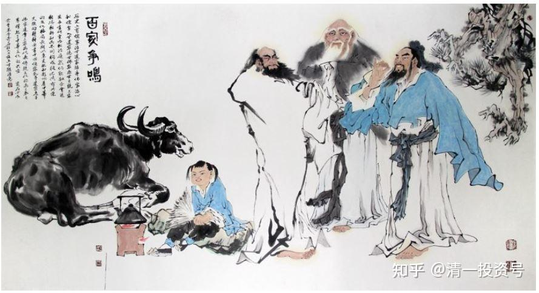

5篇.神仙、老虎和狗，导游、旅客、景点

清一山长 2021年2月26日

清一山长雪球非专栏帖子整理文章 第5篇《神仙、老虎和狗，导游、旅客、景点》

此文整理自山长专栏文章《[真大学，就是“神仙，老虎，狗”的大学](http://link.zhihu.com/?target=https%3A//www.bilibili.com/audio/au2667925)》[https://xueqiu.com/9310099567/172849293](http://link.zhihu.com/?target=https%3A//xueqiu.com/9310099567/172849293)跟帖评论

**[ellhll李华丽](http://link.zhihu.com/?target=http%3A//xueqiu.com/n/ellhll%25E6%259D%258E%25E5%258D%258E%25E4%25B8%25BD)回复[清一山长](http://link.zhihu.com/?target=http%3A//xueqiu.com/n/%25E6%25B8%2585%25E4%25B8%2580%25E5%25B1%25B1%25E9%2595%25BF):**

虽然山长所说的“老师是神仙、学生是老虎、行政是狗”的真正大学课堂，我没有接受过，但是从常识推理，也知道这是最佳的老师、学生、学校的摆位。

**学生是教育的主体，当然由他们来决定确认老师讲的东西自己是否喜欢。**

就像商品的创造和购买，老师是商品的创造者，学生是消费者，而行政管理就是服务于制造者和消费者的后勤人员。

制造者根据消费者的需求创造更好的产品，消费者根据体验决定自己喜欢什么，后勤人员只是提供条件让生产和消费更方便进行。

乔布斯如果受制于后勤人员，后勤人员拿着指挥棒，指挥乔布斯的创造团队该怎么样制造手机，那这个世界就没有苹果手机的存在了。即使苹果公司现在是世界第一的手机引领者，一旦这种后勤凌驾于制作团队和消费者的情况出现，苹果公司一定会被市场抛弃。

**大学如果一直是这样角色颠倒的现象，被时代抛弃也只是时间问题。**

**雪球（论坛）虽然不是大学，但其实更像一个真正的大学。**有独立见解的人在这里分享自己的投资经验、人生经验；球友在其中选择自己最欣赏、最敬佩的人跟随学习；雪球的运行团队就是服务于分享者和学习者的后勤人员。自由加入，自由离开，自由分享，自由选择，自由提升。在这里，很多人找到了导师，找到了同伴，找到了知己，获得了成长。良性发展下去，或许，雪球真可能成为未来世界的大学。谢谢“方丈”的雪球，让我们有机会在这里找到老师、遇见同伴，学习提升。[不明真相的群众](http://link.zhihu.com/?target=http%3A//xueqiu.com/n/%25E4%25B8%258D%25E6%2598%258E%25E7%259C%259F%25E7%259B%25B8%25E7%259A%2584%25E7%25BE%25A4%25E4%25BC%2597)

刚看到了这位 火侯的评论，粉丝数为0，雪球发帖的最早记录是2021.02.08，在雪球里算是新手吧！哪里来的狂妄底气？只能说，世上一直都有这样的人：不看事实，没有依据，用自己狭隘的价值观，用一些大众不喜欢的帽子胡乱扣在别人的头上，他以为，用上了这些帽子，他就会有支持者，不曾想大部人都眼睛亮堂。

山长在雪球上反复说，他接受不同的意见，只要你有理有据，可以说出来大家讨论，他尊重有理性独立思考的人，不会因为别人有不同意见而拉黑，但是，没有理性还喜欢攻击人，那还是请走开，还这里一方清静。

[清一山长](http://link.zhihu.com/?target=https%3A//xueqiu.com/9310099567) [02-26 16:00](http://link.zhihu.com/?target=https%3A//xueqiu.com/9310099567/172896481)回复[ellhll李华丽](http://link.zhihu.com/?target=http%3A//xueqiu.com/n/ellhll%25E6%259D%258E%25E5%258D%258E%25E4%25B8%25BD):

你的**“雪球大学”**概念很好，的确很新颖。

新教育的神仙、老虎、狗是谁呢？

**传统大学的教授，当然是“神仙”。**他们负责提供知识产品。但新教育，其实没有这样的一个角色，这个角色，拿给互联网了。网上有各种“神仙”，你喜欢谁，就拜谁，就入谁的门。喜欢什么内容，就学什么内容。所以，只要有网络，你就能上全世界的大学，就能读全世界的所有专业。关键是你要啥的问题了，不是能不能的问题。一切均可自选！

**新教育学堂的“神仙”是谁呢？其实是学生！**想学就学，不想学就拉倒。想学什么内容，就给老师提要求。不想学，老师们马上放弃教学。学校里面，没谁会强迫学生学习的。学生自由度很高，当然是“神仙”。

**体制教育的学生是什么角色呢？不是狗，是牛马。**因为好的体制学校，一定要出成绩。教师的工资、奖金、以及职称，都跟学生的升学率啥的挂钩了。所以，教师们像工头一样，拼命地逼孩子们学习。校长们为了名利，也拼命地压迫教师们出成绩。家长们也压孩子们考高分，一分压千人。所有的压力，都让孩子承当了。所以中学阶段，孩子们都是做牛做马的，要给爹爹妈妈、班主任、带班老师挣工钱。等终于考上了大学，孩子们放飞自己，也当“神仙”去了！就不再学了。

**新教育学堂的“老虎”是谁呢？是家长。**没看见，今日的老师和我，都最怕家长吗？不敢跟家长走得太近。伴家长如伴虎呀！我原来一直说，今日学堂是弱势群体，你们都不相信。因为你们认为：今日是名校，想申请入学很不容易，所以我们像老虎一样。家长都要求今日，才能来上学。其实，是你们求错了对象，你的孩子如果拼命想上今日学堂，他一定能考上。如果你孩子不合要求，你求今日也没用的。所以，今日不能拿入学标准来卡家长的。但家长对今日可以想粉就粉，想黑就黑。我们拿家长一点办法也没有。你粉今日，学生不符合要求，我们也没法收您的孩子；你黑今日，就要把孩子带走，我们再喜欢，也毫无办法。所以：家长是不是“老虎”？

**聪明的“老虎”家长，是不咬学堂，不咬老师的。咬谁？咬孩子。**如果孩子在家，天天看着一个凶猛的“老虎”，惹不起的“老虎”，伴君如伴虎的家长，您认为：他不哭着喊着都要考今日才怪呢！家长在家里不当老虎，当奴才。送来学堂，指望老师当老虎管教孩子，可新教育的老师都是“神仙”，不是“老虎”，您的孩子就废了。

清黑倒是蛮狠的，比老虎还狠毒，咬人很凶猛，还怎么都不松口，有点像鳄鱼一样。如果用这种毒辣的本事来“咬”自己的孩子，孩子一定只敢好好读书，不敢懈怠玩游戏了，一定会成为优等生的。

所以，**优秀孩子的家长，可能像“老虎”；游戏孩子的家长，一定像“神仙”！**这就完了！

没见过（有名的关于）哈佛的书（《虎妈战歌》），就是**“虎妈”**吗？这蔡教授（Amy Lynn Chua），虎气十足，把两个女儿都送进了哈佛。这就是学会了我教你们的这种心法——家长当“老虎”！

**新教育的教师，当不了“老虎”，也不敢当“老虎”。我们几乎就是绵羊一样，真的是弱势群体**。**新教育教师，并不是知识的提供者，而是学生的辅导者，是您孩子的伙伴**。所以，我们一旦失去服务的能力和愿望，就会被家长们、孩子们果断抛弃。一个提供不了专业知识，还无法去帮助和指导学生的新教育教师，谁要？

您想想，这道理对不对？

**[ellhll李华丽](http://link.zhihu.com/?target=http%3A//xueqiu.com/n/ellhll%25E6%259D%258E%25E5%258D%258E%25E4%25B8%25BD)回复[清一山长](http://link.zhihu.com/?target=http%3A//xueqiu.com/n/%25E6%25B8%2585%25E4%25B8%2580%25E5%25B1%25B1%25E9%2595%25BF)：**

谢谢山长，您说的很有道理。

但是很抱歉，我有不同的看法。如有不对，请山长棍子打下来。

**我认为在真正的新教育里面，老师、学生、家长都是一样的双重身份：“神仙”和“老虎”同存于一身。新教育没有狗，没有羊。**

1. 老师

虽然有网络资源任老师和学生选择，但这些资源就像是“神仙”眼中的素材，没有好坏，只看怎样使用。老师是“神仙”，可以有足够自由的空间，选择如何使用素材，如何化枯朽为神奇，可以把反面的教材变成促使学生思考的东西。老师是“神仙”，因为老师的心是自由的，他们可以自由选择学生和家长，对不合适的人说不，对不属于这个教育的人说不，甚至对您说不。

相反的，如果老师觉得这个方法对学生好，只是一时没有通，那老师会化身“老虎”，会有一定的方式，促使学生奋力前行，当然前提是，学生和家长是真新教育人。比如跑步学堂。

2. 学生

学生是新教育的“神仙”，他们决定老师队伍，有权力去投票评价老师是否胜任，决定选择谁来做他们的老师。他们决定学习的内容，除了老师提供的海量资料他们可以选择之外，他们甚至可以选择更大的方向，比如您说的如果他们想，或许他们有一天会选择玩转理工科。

学生是“老虎”，对于不能真给自己帮助和智慧的老师，他们就是“老虎”，让你下课就下课，那可不是“老虎”吗？老师岂能不实实在在提高自己别被学生给挑剔了。

3. 家长

家长是“神仙”啊！看到孩子学得这样开心、这样好，活得这样自在，真是快乐似神仙。他啥都不用管。

但如果他知道孩子短期内出问题了，他知道变成“老虎”能让孩子冲破这样的短期问题，他真的会是最凶的“老虎”。就像您对自己的三个孩子一样，就像鸟爸爸、鸟妈妈逼迫小鸟学飞一样。

**新教育的真老师、真学生、真家长，是“神仙”，解脱食欲、物欲、世俗的束缚，活得健康自在；不受名利的牵绊，自在地做真教育，学习传播真智慧。**

新教育的真老师、真学生、真家长，是“老虎”，对迫害和攻击新教育的行为，他们勇而有谋，不会死磕，打得过的打，打不过的会有智慧地避开继续前行，因为，**他们的目标不是成为最能打的“老虎”，而是活得足够长，去实现理想。**

[清一山长](http://link.zhihu.com/?target=https%3A//xueqiu.com/9310099567)[20221-02-26 18:23](http://link.zhihu.com/?target=https%3A//xueqiu.com/9310099567/172915605)回复[ellhll李华丽](http://link.zhihu.com/?target=http%3A//xueqiu.com/n/ellhll%25E6%259D%258E%25E5%258D%258E%25E4%25B8%25BD):

呵呵。您作为“准家长”，很给我们面子。我知道您正在准备儿子的清一大学入学申请，SAT官考分数线已经过了，年龄也符合要求。可以说，您是我们未来的家长。所以，您很给我们老师和学堂面子，给我们都授予了“神仙”和“老虎”的荣誉学位。这是您尊师，不是我们有多神气。

我真的不觉得我们的老师可以当“神仙”，更不是“老虎”。别说老师们了。就说我自己：被教育局驱赶，被别有用心的人栽赃，被清黑们污蔑，谁把我当“神仙”了？我能逍遥得像“神仙”吗？我能发威像老虎吗？我倒是蛮像个兔子的，见不对劲，就溜了。还挖了不止三个窟，躲起来不出头。哪有一点点的虎威呀？更别说我的教师们，还有啥虎威了。我有时会想：我的前世，会这样窝囊吗？这辈子怎么这么没出息，一点也不像个叱咤风云的人物。

就算是在拥护我的家长面前，我也不是“神仙”，肯定也不是“老虎”。我知道家长抬举我，所谓的拥护我，只是让我好好地教好他们的孩子，做好家长的服务生罢了。所以，粉我也好，黑我也好，我都不像“神仙”的，更不像“老虎”。相反，就算对清黑，我也只能忍气吞声的，气死我了，都不敢放开来骂（2016年，清黑们把小明慧都扯进来，唧唧歪歪的乱说话，我真的很生气，太过分了）。我要生气了，若说了几句过头的话，更多的人会反过来开始骂我了：看你一个做教育的人，怎么连点修养都没有！

所以，您看我们哪里有“老虎”的相？除非是“清黑”敢跑我家里来闹事，为了家人，我只好发一点虎威。所以，估计我在家里面，勉强算是一只虎吧？要不，还是老兔子一只？因为兔子急了，也咬人？

我对我们的教师团队，对老师们的教育培训，不断地强调我们的身份定位：我们不是“老虎”，不是“兔子”，不是“神仙”，也不是“狗”。是什么呢？**我的原话是：我们从事的是教育服务行业，我们必须要让家长们满意，服务于家长的需求。**我们与别的教育机构不同之处，无非是我们是卖精品，卖高端品牌的。但我们的服务本质并没有变。所以，家长需要什么，学生喜欢什么，我们就给什么。学生不想学的话，老师们也别强迫学生去学，就及时的通知家长：他们家孩子不需要我们的教育服务，为了保障家长们的教育投资不至于浪费，请及时接回家。

您看，我们就是服务业的，不说是“狗”，是客气话。这样说我们有点太没面子了。再怎么服务，起码是服务教育的——读书人，偷书不算偷——教育人，服务也不是“狗”。

不过，说真话：**新教育的教师，其实很像是“导游”**。我们不负责景点（专业学科）的建设，所以入门成本很低，不需要啥博士、硕士的重资产。十几岁的小孩子就能胜任。

而**顾客（学生和家长）想要游任何景点，我们都可以带着一起玩**，介绍景点特色啥的，老师们边学、边练。在互联网提供教育之源的知识海洋中，我们可以自在地游玩。这就是我们与体制教育最大的不同。也许我们**今日学堂，是教育游轮中最高端的船只**，这是我们的追求，但本质上还是服务业，服务于家长的需求，目标是家长想去的地方。我们只是精通教育行业玩家攻略罢了。

**老子、庄子、鬼谷子，都是“神仙”景点**。家长想去看，我们可以带路一起去。如果路上遇上了小鬼、妖怪，家长得变脸，当“老虎”，做护法。“老虎”别来咬我们，我们是同路人。去咬拦路的小鬼、妖怪才对。我们当导游的，才可以顺利带你们家长到达目的地。**家长如果要取经，就要当悟空，当护法，来保佑我们这些唐僧们过关。**不然我们被妖怪吃掉了，经也取不回来了，就这个理儿！

“清黑”家长不明白这个理儿，老以为我们是摇钱罐，想要砸开了就有好处拿。所以，吓得我们的老师，全当兔子了。躲的多，都跑开了。我跑得最远，都跑出国了。真羡慕“老虎”呀！可惜真不是！你们才是。

比如您作为家长：9月份申请入学，如果年龄符合要求，考分符合要求，合群符合要求，体能符合要求，没谁敢拦你不许入学的。你虎威一发，网上自媒体公示出来，证明清一大学违反了公开的招生承诺。有人对你搞潜规则阻止你申请入学。我们不就成为过街老鼠吗？发现了这点没有？**互联网时代，信誉很重要，真诚很重要，承诺也很重要**。对人玩潜规则，实行不通的。我喜欢互联网时代。要是在明朝，我这种人，不倒大霉才怪。你看王阳明被尊为圣人，也是九死一生，郁闷而死！我想：他要是活在今天，会开心得多！起码可以出国了。

祝福您和儿子！

PS:

您提到了跑步学堂：没错，这是一个“老虎”专门来对付问题儿童的地方。但，这个学堂可不是今日学堂的正式机构，不归今日学堂管。它是家长来亲自管理的非正式机构，还不对外招生。

您的朋友马女士，在负责这个学堂，以家长的身份来当“老虎”。我们的老师，都不敢当的。我只是她的老师，指导她如何从原来的女仆、以及女奴角色，慢慢变成了孩子现在眼中的母老虎。一年多之前，她的孩子手上拿着东西，还敢直接砸她。她当场就哭了，说这孩子以后长大了，拿刀杀她都可能的。我教她，在13岁之前赶快扳回来，别再当女奴了。结果，一年多，她现在已经翻身做主人了。

所以，跑步学堂，是家长的跑步学堂，不是我们的！我们知道该怎样做“老虎”，但不敢做“老虎”。你们才可以。

**[ellhll李华丽](http://link.zhihu.com/?target=http%3A//xueqiu.com/n/ellhll%25E6%259D%258E%25E5%258D%258E%25E4%25B8%25BD)回复[清一山长](http://link.zhihu.com/?target=http%3A//xueqiu.com/n/%25E6%25B8%2585%25E4%25B8%2580%25E5%25B1%25B1%25E9%2595%25BF)：**

山长总是那么谦虚，明明是狮子，却把自己比成兔子。开溜，挖窟，是您的智慧，因为目标明确，不是为了做能打的“老虎”，而是要做更大的理想——世界第一的华人大学。

**“神仙”是一种心态，一种境界，就像新教育一直倡导的：自由、自尊地行走在这个星球上。**能自在活，自在死，难道不是神仙的心态吗？

**“老虎”是一种气势，一种态度，不屈于强权，该怒时怒，该有王者的尊严时即为王者。“**清黑”能让新教育的老师屈服吗？权威能让新教育老师放弃吗？没有。这就是王者之气。

山长说得越谦虚，我们看得越心酸，**是我们这个环境，没给智者一个公平、合理的空间。**这也不独于这个时代，您看老子，在世时只能骑着青牛离去，只有一个尹喜知道他；庄子、孔子的智慧在世时也不见得得到世人的认识。只能说世人颠倒，总是重死轻生，重难轻易。山长慈悲，请相信，我们有看到您的良苦用心、您的家国胸怀。

另外，我是澳大利亚墨尔本的李华丽，我的女儿9岁，儿子6岁，我和他们在努力成为新教育的准家长、准学生。您说的儿子要申报清一大学的女士在悉尼，她和两个孩子也在认真跟学您的东西。您看，澳洲和中国泰国相隔万里，都有新教育的受益者。

新教育是真智慧、真教育，一定会被看见，走进越来越多的国家，惠及越来越多的人。

**[清一山长](http://link.zhihu.com/?target=https%3A//xueqiu.com/9310099567)[02-26 19:25](http://link.zhihu.com/?target=https%3A//xueqiu.com/9310099567/172921132)回复[ellhll李华丽](http://link.zhihu.com/?target=http%3A//xueqiu.com/n/ellhll%25E6%259D%258E%25E5%258D%258E%25E4%25B8%25BD)：**

我把你们俩搞混了。真不好意思，都姓李，以为是一家。谢谢您的理解和支持。孩子还这么小，您对新教育的理解和思维就很清晰，对我们了解比不少国内的家长更深入。你的孩子很有福气，你要办新教育学堂，做新教育教师，都会是很好的选择。因为你很用心。祝福您和家人，元宵吉祥如意！

[ellhll李华丽](http://link.zhihu.com/?target=http%3A//xueqiu.com/n/ellhll%25E6%259D%258E%25E5%258D%258E%25E4%25B8%25BD)回复[清一山长](http://link.zhihu.com/?target=http%3A//xueqiu.com/n/%25E6%25B8%2585%25E4%25B8%2580%25E5%25B1%25B1%25E9%2595%25BF)：

非常非常感谢山长，这是您第二次说我可以当新教育教师，这是元宵最好的祝福！感谢您！向您，向老师们、家长们学习，做新教育的经营者，只有提升自己才能担当得起新教育家人的身份。今晚8:00，刘老师又给我们送大礼了，每年正月十五的祈福冥想。我去准备好听刘老师的引领。祝福您和家人吉祥安康！

附录：

[115篇 真大学，就是“神仙，老虎，狗”的大学！](http://link.zhihu.com/?target=https%3A//www.ximalaya.com/sound/496790689)（音频）

[哔哩哔哩：真大学，就是“神仙，老虎，狗”的大学！](http://link.zhihu.com/?target=https%3A//www.bilibili.com/audio/au2667925)（音频）

[哔哩哔哩：你家孩子是第几等人？要用几等教育适配？](http://link.zhihu.com/?target=https%3A//www.bilibili.com/audio/au2526693)（音频）
