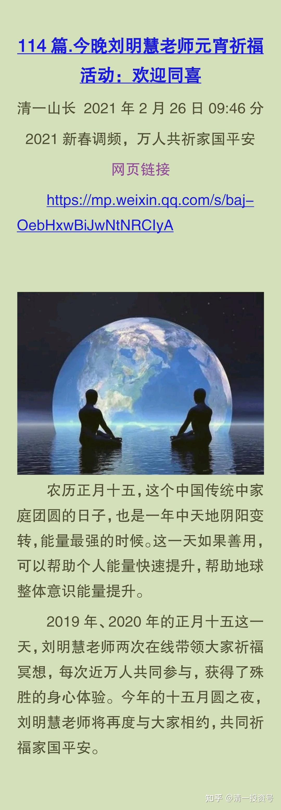

原雪球专栏114篇.今晚刘明慧老师元宵祈福活动：欢迎同喜

参考链接：

[慧心清迈家园](http://link.zhihu.com/?target=https%3A//www.ximalaya.com/zhubo/267435610)

[刘老师的原声分享](http://link.zhihu.com/?target=https%3A//www.bilibili.com/audio/am33157770)

[《当生命觉醒》朗读版](http://link.zhihu.com/?target=https%3A//www.bilibili.com/audio/am33343626)（B站）

[慧心慧语_全集 （喜马拉雅](http://link.zhihu.com/?target=https%3A//www.ximalaya.com/album/47455286)）
