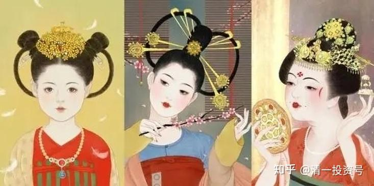
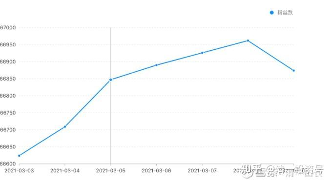

原雪球专栏[122篇.为何东亚文化圈为以白为美？以胖为福？以懒为贵？以无能为尊？](http://link.zhihu.com/?target=https%3A//xueqiu.com/9310099567/173913840)

清一山长 2021年3月10

其实，这不是啥审美的问题,这是阶层的标志，跟美学没关系，跟哲学更没关系。**这些指标，代表社会层级，代表上流社会**，所以才美！这四个指标，曾经都代表我们这个**儒家文化圈下，过去的“上层社会”的标志**。所以，就成为了现在社会上“美”的标志。其实“美”这个字，就代表了核心——羊大了，就“美”了，为啥？可以吃了。显然，小羊到底美还是不美，跟审美的艺术细胞没有关系，跟实际的“价值”有很大关系。

**一：为啥以白为美？**

古代的男子，是必须“闯天下”的。贵族家的孩子，从小要“富练武”。上流社会的男人，黑一点、壮一点，很有“英雄气”才美。英雄就要配佳人，美人就应该嫁武松，这才是古代社会正常的搭配。您能想象武松长得像个现代涂脂抹粉的小鲜肉吗？

但是，贵族女子，就完全不一样了。儒家思维中的贵族女子，好女人，是“大门不出，二门不迈”的，从小不用谋生计，所以不用干活。生在大户人家，几层院落，女子生活在最后面的“内院”，也不出来应酬（这都是男人的事情）。所以，不需要有能力，娇滴滴的才美。外面的普通男人，是绝对看不到她们的。偶尔出来，也保护得严严实实。坐在轿子里面，别人看不见她，她可以通过纱窗，模模糊糊地看看外面。这些女子，平时是连“逛街”都没有的，甚至连看戏都不能去看的（《叶问》电影中，他特别宠老婆，有一个镜头，就是带老婆去戏园子看戏，遭到别人的白眼，就是这种文化传统——富贵人家的好女人是不出门的）。正经的贵族女人，就只在自己的家中转转，是不能外出的。最高级的，就是红楼梦里面的样子，大院子像个公园，但也不能出去的。女子们所谓的社交，就是和自己的亲戚在一起，在自家后院里面玩玩，不能“抛头露面”。常年不见阳光，所以，肯定长得就白白嫩嫩的样子。只有穷人家的女孩，迫于生计，不得不出面干活，外出较多。所以自然就黑一些。所以，假如看到一个长得白白净净的女生，肯定是上流社会，家世良好的女子，当然就“美极了”。“君子好逑”，都想追回家去。所以，这种审美观，就这样成为中国人心中的“固定情节”。林黛玉，就成了“美女”的代表。

现在社会，这种成天呆在家里的人，就是毫无价值的“宅女”吧？跟上流社会一点都没关系。真正上流社会的女子，反而是社交活跃份子，各种才艺，各种锻炼。所以，西方的社会，强调上流社会的社交属性。这个社会，并不“以白为美”，而是以户外活动较多的“铜色”为美。

因此，现在这个社会，白白净净的样子，就是没见过阳光的样子。要么是懒人一个，不喜欢户外活动；要么是笨人一个，没人跟她玩的，也不会玩的人，没朋友，肯定不可能是上层社会的人。所以，现在家里继续培养“白美人”，不如叫培养“白傻人”更好。没有人会因为你很白，就说你是上层社会的。今日的公主班，就因为户外活动比其他班更多，所以女孩们可能更黑一些。但气质、举止、态度，都更接近西方精神，还都很强的公主形象，跟中国古代娇滴滴的无能公主形象，的确不太像！

**二：以肥为福，以胖为美！**

我儿子一直长不胖。他外婆，小时候就成天想，怎样才能让这孩子长胖一点。想方设法地喂他吃东西，甚至用鸡汤来冲奶粉给他喝。十几岁都依然胖不起来，瘦精精的，个子也不大，比同龄的女生都小一圈（现在一切都已正常了）。他外婆就说：如果小外孙能够喂养得像小猪一样胖，她马上死了都很开心。可见国人心中对“胖”的执念有多深。中国的父母，普遍就是要孩子“多吃点”，基本上都把孩子当猪来养，孩子又白又胖的，家长就很高兴。一旦家长发现：孩子上今日学堂，原来浮肿的白胖孩子变精神了，变瘦了，劲长大了。觉得一定是学堂虐待了孩子，这学千万不能上，吃亏了。家长就变“清黑”了，原因是啥？为啥白白胖胖的，就算孩子精神不好，家长也依然很高兴？为啥孩子变瘦了，尽管精神十足，体能超过原来十倍。原来刚进校，跑个两千米都跑不下来，现在跑个半马轻轻松的，家长还担心“身体不好”。家长为啥只喜欢白胖小子？其实就是中国古代，胖人一定是贵族阶层、上流社会。这也是一个阶级判断的指标。黑瘦之人，一定是下层阶级。家长骨子里面，是担心孩子被社会“降级”了。

我儿子16岁的时候，还没有到1.7米。他年龄是班上最大的，但身高却是班上最矮的（可见我家的孩子真是另类，极其少见的没用激素来催长的，现在身高正常，比我略高）。我的一个老同学见他，就呵呵大笑，说他儿子才12岁就超过1.7米了，笑话我不会养儿子，16岁了才长这么点。骂我就是舍不得给孩子吃肉、喝奶（孩子五岁多跟随我就以素食为主了，也不喝牛奶）。我就弱弱地抗议说：你这样比不公平，怎么能拿洋鸡来跟土鸡比。12～13岁，长到跟父母一样的身高，真不是啥好事。就像洋鸡，3个月比9个月的土鸡都大。但对鸡来说，难道是好事吗？除非你家儿子是当肉鸡来养的，否则真的别把体重、身高当指标。这是养猪、养鸡的指标，不是养孩子的。孩子到了年龄，该长的时候，自然就会长了。用动物激素催长的，都是要命的勾当。

古代的中国和世界，特别是东亚文化区，一直都是缺乏食物的。历朝历代王朝的崩溃，说是各种原因，其实核心原因，就是人口增长，土地无法产出足够的食物，因此要打仗。等死了很多人后，社会恢复平静，重新开始。中国近两千年来，有十几次人口灭杀90%的事件发生。

这种情况，一直到清朝才解决中国的人口瓶颈问题，因为引进了原产于美洲等地的“洋芋”——土豆，还有“番薯”——外国的薯类——红薯，以及最重要的谷物“玉米”。这样才解决了问题，山地农田也可以生产作物，而且产量很高。大清这次坐稳了江山，没有发生大规模的人口灭杀事件，即使是改朝换代，从明朝——清朝——民国——抗日战争——解放战争——新中国，但人口并未明显的下降，这就是食物相对充足的关系。

不过，这时代，虽然人饿不死了，但也没有多少东西可以吃。大多数人，也就是饿不死罢了，更谈不上吃肉了。饥肠辘辘，是大多数穷人的常态。所以，中国人一向很关心吃，见面就问“吃了吗”？其实是担心你会不会饿死。所以，中国人特别爱吃，一见到吃的，就会马上露出饿死鬼的原型。去什么地方，都吃个不停，吃得也特别多。这一点，跟外国人很不一样。外国人见面，就问：HOW DO YOU DO？你干得怎么样？外国人更关心你做事成不成功，中国人只关心你会不会饿死，自然国民性就不一样了。这个时候，只有富人家，上流社会的人，才不用担心会饿死。他们想吃就吃，吃什么都弄得到。特别是肉食稀少的古代，只有贵族人家，才能经常吃肉，长胖才有条件。所以，一旦您发现一个长得胖乎乎的人在您面前，您的潜意识马上告诉您：这是一个贵族，上流社会的贵人！自然，他再胖，您看来都是“美”的，越胖，说明吃得越多、越好，自然就越美！

可是现在，由于农业的现代化，化肥的发明，农产品以及肉食都变得异常的丰富。秉持“饿死鬼信念系统”的国人们，最穷的穷人，都可以像古代的富人一样大吃大喝。所以——现在胖人到处都是，您见到胖子，我相信内心升起的概念，一定不是啥“他身份高贵”，而是“他肯定有三高”。

因为，**真正的富人，在您还忙于大吃大喝的时候，他们已经开始研究什么才是最有利于身体的食物。开始吃素，开始玩辟谷，开始“消灭脂肪”了。因此，现在真正的富人们，反而瘦瘦的，精精神神的。只有穷人们，才胖乎乎的，超可爱的猪样儿！一些人有钱，但是依然很肥胖，是因为，虽然有钱了，但信念系统、生活方式，还是穷人一个。所以，身体的肥胖，就暴露了自己的“真实等级身份”。**

**三：至于东亚文化，为何以懒为贵，以无能为尊？**

这跟上面一样，也是东亚上层社会的标志。儒家文化，从孔子开始，就鄙视劳动人民。比如，樊迟问稼，怎样做劳动，生产农产品。孔子很不高兴，说我不知道，这学生就走了。学生走后，孔子还很生气，对其他学生点评了一下，说这学生真没出息。樊迟出。子曰：“小人哉，樊须也！”。直接骂这学生是小人——其实就是说：我教你们的东西，是上层社会的东西，你们不问这些东西，找我问怎样当下层社会的人，这个需要我来教吗？当然该骂！

孔子说的其实是对的。他教种庄稼，有啥价值？就像各位让我教怎样考个文凭去打工？让我学体制发个文凭？我觉得就是浪费我的时间。我会让这些学生直接去考发文凭的大学，学个理工科，将来好找工作，就不要再找我学习了。**只有不想找工作的人，才可以继续留下，跟我学中国的古代文科课程。**

所以，**我并不反对学生去打工**，甚至**我支持大多数学生，就是要去打工的。**我相信孔子也是一样的意思，但是，儒家的儒生们，就把孔子的话听错了，以为，一定要啥事都不会做，也不去做，才是“贵人”的样子。于是“四体不勤，五谷不分”，啥事都不会做，除了读书，啥都不懂，就成了东亚社会的“上流社会标配”。不过呢，过去时代，这样做也没问题。过去的时代，是“血缘传统”时代，只要父母是贵人，子女也是贵人。不用干活，也一样活得好好的，周围很多仆人会把你照顾得好好的，只要维持住贵族头衔不掉，就没问题。而维持贵族身份的，除了血缘、世袭贵族，还有就是科举，所以只要会读书、会考试，就一切OK。当了官，啥事都由别人来做的，自己只管当官，发布命令就行了。

很不幸，现在时代已经变化了。父母所有的一切地位和条件，包括财富，都无法正常地交给孩子接手。可家长们，居然还是傻乎乎地依照过去几千年的规矩来做事，不是找抽吗？家长们以为：只要让孩子装得像贵人一样，长得白、长得胖，而且孩子啥事都不会做，只要会读书，这个社会就会自动把您“当贵人”，您就能得到一切服务。所以，家长们自己当仆人，帮孩子做好一切事情，连生活都代办了。

我知道最出奇的一个案例，是女儿都18岁了，还不会擦屁股，拉完大便，妈妈就赶快来帮忙，这女儿一天都离不开妈妈。至于上大学后，无法生活，连鸡蛋都不知道咋剥开的案例，就更多了。

这就是学古人学错了。各位家长真要学，我建议学学印度的首富。这家人一家六口，但是却请了600个仆人来做家庭服务。他们真的可以做到：自己啥都不用想，啥都不用做。屁股都不需要自己擦，可以专人帮擦屁股。这种家庭，绝对是真正的“上流社会”。

您想把孩子培养成这样的老式贵族、传统高级人，就学像样一点，别你们老爹老妈来给孩子亲自当奴仆，培养出来的是假贵族。爹妈都是奴仆，孩子怎么可能是贵人一个？您的示范就很不好，您最好家里请上百十个家仆，您是大爷、主人，孩子是少爷、小姐，啥都需不要做，您只管每个月付钱给仆人就行了。至于这种人美不美？肯定很美。只要听说是有钱的人家，很多美女才不管你儿子长得是不是像猪，都愿意嫁的。如果您愿意给上一个亿的彩礼钱，我相信让她们嫁个真猪，都有人抢着嫁的。您就只管当首富，把财富委托精英打理，像诺贝尔奖金一样，世世代代的不断，您的孩子、后代子孙，就可以又白、又肥、又懒、又蠢的，舒舒服服地过一生了！

西方的文化，一向崇尚健康、强悍。所以，**现在的美感，是晒得黑亮的皮肤，代表大量的户外运动、休闲生活，这才是真正贵族的标志。**相反，像香港的白领一样，每天从家里去办公室，一路地铁，一天到晚，从来就见不到阳光，皮肤当然白了。自然——档次就出来了——奴工级别，所谓的社畜一个，哪里比得上天天晒太阳的您。

上面这张网红脸？真的很美吗？可我怎么看，都觉得她像是有病的样子，病歪歪的气质，有气无力。假如我儿子娶这种女孩回家，会被我认为就是找抽的，会不会生孩子都难说。最后把两人都一起赶走，起码别住在我家，免得心里烦！

网友问答：记录下来供参考。

网友问：楼主，为什么现代人寿命长？吃得好是不是主要原因？

山长答：现代人寿命长？您真会睁眼说瞎话。中国这几十年“现代”之后，病越来越多，人命越来越短，居然说现代人寿命长。成年人就该多吃肉？爱吃您就吃去，吃死也不干我事。别说您懂科学，您懂自杀才对。严格说来，现代人是最善于慢性自杀的一种怪人。

现在50岁的人，身体比70～80岁的老人更好吗？还是相反？您自己去看看。50岁的人，跟上了改革开放的好日子，从小吃得好、喝的好，从来不缺吃喝。但这批人的身体往往很差，比他们的父母辈差得多。因为比他们大20来岁的父母辈，从小是缺吃少穿的，家庭富裕后，习惯也比较清淡，相对身体的健康质量更好。我家就很典型：更现代一点的，我弟弟妹妹的身体，都不如我父母，就我例外，原因也最特别。

**我家的故事：拿命买来的故事。爱听就听，不听拉倒！**

我是我们家最不会吃东西的人，不贪吃，从小就这样。我有零花钱，一定节省下来买书看。家里给早餐的钱，一天两毛钱，我都会节省下来，攒够一个星期，去买一本《十万个为什么》。上了大学，也一样。省下伙食费去买书，一天就只吃白饭加咸菜，一个月只花5元钱伙食费。不是因为我懂——不能吃，而是我更爱书。因为穷，就只能省下吃的去买书。无意中，逃过了吃菜、吃肉多，损害身体的毛病。

我弟弟妹妹，都比我会吃，小时候有零花钱，一定拿来买东西吃。长大后，更是吃了各种好东西，肉蛋奶天天不断，但身体远远不如我，我弟弟体重比我重几十斤，但他47岁就死了，说是急病，其实就是吃多了、吃错了。

但我的身体，还没有我老妈好。她老人家，现在眼睛都不花，为啥？80多岁了，每天锻炼身体，做家务，忙个不停。为啥？因为年轻时一直穷，吃不了啥肉蛋奶，口味清淡，另外习惯好。

我是40岁才改的饮食习惯，已经中了一些毒。当年做老板，啥东西我吃不起？都吃，结果身体越来越差。我当年发现：我还不到40岁，居然还没有60多岁的老人身体好。以后怎么得了？马上研究，彻底改变了原来的饮食习惯，不再乱吃东西。改掉后，就一年比一年健康了。

我妈现在都说我，这一辈子特别可怜，干得最多，吃，没吃啥好东西；玩，没玩啥好东西，苦命人一个！每次回家，都要弄牛肉给我吃。害得我每次都是“突袭”，不提前告诉她我会回家（她自己也不太吃，平时不买牛肉）。

她每次这样说，我就说，妈，您不是希望我像弟弟一样过“好日子”吧？吃好喝好玩好？她马上就不说了，就是叹口气。就算用人命买来的教训，她还是不能理解，总觉得要把好吃的让她的孩子们多吃点，看你没吃就着急，但她自己不多吃。

自然，我也不能指望你们理解。各位：你们想吃就吃，想死就死。这是你们的选择，我不在意！

（以下内容为编者收录）

**评论回复：**

**清一山长[2021-03-09 14:53](http://link.zhihu.com/?target=https%3A//xueqiu.com/9310099567/173923143)回复**

我儿子16岁的时候，还没有到1.7米。他年龄是班上最大的，但身高却是班上最矮的（可见我家的孩子真是另类，极其少见的没用激素来催长的，现在身高正常，比我略高）。当时我的一个老同学见他，就呵呵大笑，说他儿子才12岁就超过1.7米了，笑话我不会养儿子，16岁了才长这么点。骂我就是舍不得给孩子吃肉，喝奶（孩子五岁多跟随我就以素食为主了，也不喝牛奶）。我就弱弱地抗议说：你这样比不公平，怎么能拿洋鸡来跟土鸡比[捂脸]。12～13岁，长到跟父母一样的身高，真不是啥好事。就像洋鸡，3个月比9个月的土鸡都大。但，对鸡来说，难道是好事吗？除非你家儿子是当肉鸡来养的，否则真的别把体重、身高当指标。这是养猪、养鸡的指标，不是养孩子的。孩子到了年龄，该长的时候，自然就会长了。用动物激素催长的，就是要命的勾当。

**[Fighter2011](http://link.zhihu.com/?target=http%3A//xueqiu.com/n/Fighter2011)回复[清一山长](http://link.zhihu.com/?target=http%3A//xueqiu.com/n/%25E6%25B8%2585%25E4%25B8%2580%25E5%25B1%25B1%25E9%2595%25BF)：**

山长方便说说日常饮食习惯吗？

**清一山长[2021-03-09 15:22](http://link.zhihu.com/?target=https%3A//xueqiu.com/9310099567/173928437)回复[Fighter2011](http://link.zhihu.com/?target=http%3A//xueqiu.com/n/Fighter2011)：**

看孙思邈的书去。古人咋过的，我们就咋过！起码尽量模仿。

[裸奔de瓶子](http://link.zhihu.com/?target=http%3A//xueqiu.com/n/%25E8%25A3%25B8%25E5%25A5%2594de%25E7%2593%25B6%25E5%25AD%2590)回复[清一山长](http://link.zhihu.com/?target=http%3A//xueqiu.com/n/%25E6%25B8%2585%25E4%25B8%2580%25E5%25B1%25B1%25E9%2595%25BF)：

我们这有个较出名的儿童中医，不管多小多大孩子去看病，告诉所有家长不要吃奶粉，不要喝牛奶，让把什么鱼肝油、钙片这些都甩了，家长们都是惊掉下巴。

**清一山长[2021-03-09 16:04](http://link.zhihu.com/?target=https%3A//xueqiu.com/9310099567/173934560)回复[裸奔de瓶子](http://link.zhihu.com/?target=http%3A//xueqiu.com/n/%25E8%25A3%25B8%25E5%25A5%2594de%25E7%2593%25B6%25E5%25AD%2590)：**

好人一个，良心人。不知道会不会被领导批评，开除？

[裸奔de瓶子](http://link.zhihu.com/?target=http%3A//xueqiu.com/n/%25E8%25A3%25B8%25E5%25A5%2594de%25E7%2593%25B6%25E5%25AD%2590)回复[清一山长](http://link.zhihu.com/?target=http%3A//xueqiu.com/n/%25E6%25B8%2585%25E4%25B8%2580%25E5%25B1%25B1%25E9%2595%25BF)：

不会，是自己的诊所，并且告诉我终生不吃牛奶、鱼肝油、钙片。

**清一山长[2021-03-09 16:38](http://link.zhihu.com/?target=https%3A//xueqiu.com/9310099567/173938761)回复[裸奔de瓶子](http://link.zhihu.com/?target=http%3A//xueqiu.com/n/%25E8%25A3%25B8%25E5%25A5%2594de%25E7%2593%25B6%25E5%25AD%2590)：**

我的观点：**西药可以外用，不能内服。啥西药都不能吃。保健品更不能吃。喝粥，就是最好的保健品。**病了咋办？慢性病？（急病抢救。西医还可以用。）想办法找中医，找不到，就等死算了。因为反正要死，等死，总比找死强吧？[俏皮]

**双一流回复清一山长：**

楼主，为什么现代人寿命长？吃得好不是主要原因？

**清一山长[2021-03-09 16:33](http://link.zhihu.com/?target=https%3A//xueqiu.com/9310099567/173938230)回复双一流：**

现代人寿命长？您真会睁眼说瞎话。中国这几十年“现代”之后，病越来越多，人命越来越短，居然说现代人寿命长。成年人就该多吃肉？爱吃您就吃去，吃死也不干我事。别说您懂科学，您懂自杀才对[俏皮]。严格说来，现代人是最善于慢性自杀的一种怪人。

现在50岁的人，身体比70～80岁的老人更好吗？还是相反？您自己去看看。50岁的人，跟上了改革开放的好日子，从小吃得好、喝的好，从来不缺吃喝。但这批人的身体往往很差，比他们的父母辈差得多。因为比他们大20来岁的父母辈，从小是缺吃少穿的，家庭富裕后，习惯也比较清淡，相对身体的健康质量更好。我家就很典型：更现代一点的，我弟弟妹妹的身体，都不如我父母，就我例外，原因也最特别。

**我家的故事：拿命买来的故事。爱听就听，不听拉倒！**

我是我们家最不会吃东西的人，不贪吃，从小就这样。我有零花钱，一定节省下来买书看。家里给早餐的钱，一天两毛钱，我都会节省下来，攒够一个星期，去买一本《十万个为什么》。上了大学，也一样。省下伙食费去买书，一天就只吃白饭加咸菜，一个月只花5元钱伙食费。不是因为我懂——不能吃，而是我更爱书。因为穷，就只能省下吃的去买书。无意中，逃过了吃菜、吃肉多，损害身体的毛病。

我弟弟妹妹，都比我会吃，小时候有零花钱，一定拿来买东西吃。长大后，更是吃了各种好东西，肉蛋奶天天不断，但身体远远不如我，我弟弟体重比我重几十斤，但他47岁就死了，说是急病，其实就是吃多了、吃错了。

但我的身体，还没有我老妈好。她老人家，现在眼睛都不花，为啥？80多岁了，每天锻炼身体，做家务，忙个不停。为啥？因为年轻时一直穷，吃不了啥肉蛋奶，口味清淡，另外习惯好。

我是40岁才改的饮食习惯，已经中了一些毒。当年做老板，啥东西我吃不起？都吃，结果身体越来越差。我当年发现：我还不到40岁，居然还没有60多岁的老人身体好。以后怎么得了？马上研究，彻底改变了原来的饮食习惯，不再乱吃东西。改掉后，就一年比一年健康了。

我妈现在都说我，这一辈子特别可怜，干得最多，吃，没吃啥好东西；玩，没玩啥好东西，苦命人一个！每次回家，都要弄牛肉给我吃。害得我每次都是“突袭”，不提前告诉她我会回家（她自己也不太吃，平时不买牛肉）。

她每次这样说，我就说，妈，您不是希望我像弟弟一样过“好日子”吧？吃好喝好玩好？她马上就不说了，就是叹口气。就算用人命买来的教训，她还是不能理解，总觉得要把好吃的让她的孩子们多吃点，看你没吃就着急，但她自己不多吃。

自然，我也不能指望你们理解。各位：你们想吃就吃，想死就死。这是你们的选择，我不在意！[俏皮]

无为而治09回复清一山长：原来是个神棍啊。

**清一山长[2021-03-09 16:57](http://link.zhihu.com/?target=https%3A//xueqiu.com/9310099567/173940978)回复无为而治09：**

你就是个“他妈的”[大笑]。给我滚远点。祝福您：您喜欢，就多吃点西药！多吃点肉，多喝点茅台，爱咋吃就咋吃！中国人骂人“他妈的”，就是说，你这种人，有娘生，没妈教！所以，想骂你也没必要，根子不在你身上。要骂你妈才对，不骂你！也祝福其他爱吃药的人，你们都取关吧！不然来乱说话我直接拉黑。不如你们拉黑我更有面子。你们爱吃啥，我都支持。我买的有医疗公司，赚了医疗的几百万了。[大笑]也欢迎你们喝酒，白酒、红酒、啤酒都行。我赚了几千万酒钱了。[干杯]

**[舒缓](http://link.zhihu.com/?target=http%3A//xueqiu.com/n/%25E8%2588%2592%25E7%25BC%2593)回复[清一山长](http://link.zhihu.com/?target=http%3A//xueqiu.com/n/%25E6%25B8%2585%25E4%25B8%2580%25E5%25B1%25B1%25E9%2595%25BF)：**

有些急救我是心有余悸的。稍微懂了一点佛学知识后，我在心里老是想起一个镜头：有一次我去省二院急救室，躺在床上的一个六十多岁的妇女，干瘦，全身已经瘫软，惨白惨黄的，基本没了人气。两个医生过几分钟就用两个点击器（有手把，下面是二十厘米直径圆的铁板，不专业呀），来几下，身体剧烈抖动，人一点反应也没有，半个多小时，我走时还没见停。

**清一山长[2021-03-09 17:40](http://link.zhihu.com/?target=https%3A//xueqiu.com/9310099567/173946169)回复[舒缓](http://link.zhihu.com/?target=http%3A//xueqiu.com/n/%25E8%2588%2592%25E7%25BC%2593)：**

能理解你的心情。我弟弟死的时候，我去ICU陪护了几天。回来就跟老婆和孩子们说，将来我如果像我弟弟一样，出了啥事，意识不清了，千万不要送我进医院。让我在家里等死好了，死在家里更好些，大家都不麻烦，我也可以宁静地离开。我看到的**ICU，真不是个救人的地方。就是让你“不得好死”的地方。做了很多让你求死不能，求生不得的事情**。不如让我在家里安安静静的死去！[捂脸]

**[陌上听涛](http://link.zhihu.com/?target=http%3A//xueqiu.com/n/%25E9%2599%258C%25E4%25B8%258A%25E5%2590%25AC%25E6%25B6%259B)回复[清一山长](http://link.zhihu.com/?target=http%3A//xueqiu.com/n/%25E6%25B8%2585%25E4%25B8%2580%25E5%25B1%25B1%25E9%2595%25BF)：**

尊敬的道长，拿我们国家来说，现代人的平均寿命70岁的多普遍，比1949年时候35岁要长是个不争的事实。《黄帝内经》记载的古人长寿数字已无从考证，即使有也是个案了。从历史资料统计汉朝时平均寿命20多岁，全国总人口也就6000多万，随着医疗卫生的发达现代人的出生死亡率比古时候要低，寿命也长很多啊！这个有疑问吗？

**清一山长[2021-03-09 17:53](http://link.zhihu.com/?target=https%3A//xueqiu.com/9310099567/173947654)回复[陌上听涛](http://link.zhihu.com/?target=http%3A//xueqiu.com/n/%25E9%2599%258C%25E4%25B8%258A%25E5%2590%25AC%25E6%25B6%259B)：**

数据倒是真的。但，这是战乱导致的问题，还是西医的功劳？扯到现代医学帮助人类长寿，恐怕不靠谱。我说了我家的案例了。

汉朝死了多少人？开国之年，连四匹同色的马给皇帝拉车，都找不出来。汉武帝穷兵黩武，又死了多少人？两汉更替，又死了多少？不看这些，不懂这些，只懂几个数字？投资上，这叫呆会计！

西医，在我看来，就是一个笑话。十年之后，清一医学院，将证明这个笑话给你看。我会培养出一批年轻的学生出来，实实在在的证明：西医真的不会治病。双方可以面对面地打擂台！拿出100个疑难杂症，随机挑选病人，各50个病人自己去治疗。半年后比疗效！西医注定惨败！哈佛医学院、普林斯顿医学院，这些世界顶尖医学院，都会败在清一医学院的学生手上的。今年9月，我就开招第一届医学生。

就像现在比教育：清一大学绝对完胜现在的大学一样！（下周孩子们的擂台就摆出来了）不信你们来比，赢了，拿一千万走。将来你们的医学院来比清一医学院医疗打擂台。比赢了，你们拿一个亿走[俏皮]。

**适度分散拥抱XX回复[清一山长](http://link.zhihu.com/?target=http%3A//xueqiu.com/n/%25E6%25B8%2585%25E4%25B8%2580%25E5%25B1%25B1%25E9%2595%25BF)：**

请问清一医学院用CT、彩超、血压计、温度计、健康码、口罩、纱布......等西医设备吗？对了，建议前台用珠算，别用电脑。

**清一山长[2021-03-09 18:29](http://link.zhihu.com/?target=https%3A//xueqiu.com/9310099567/173950782)回复适度分散拥抱XX：**

第一：这些CT、彩超，是西医用来检查病人的，您觉得很高级，很了不起。我们看来都是破铜烂铁，不会去用的。我们治疗病人，靠实在的本事，不靠这些电器、电脑，仪器、仪表。

第二：我们不用电脑看病。电脑会看个鬼的病，人工智能也不会治疗的。当然，更不用珠算。这跟看病治疗，有啥关系？难道用算术、微积分来治病，才算高级吗？我们的学生，懂小学数学，就足够击败哈佛医学院了（指治疗效果）。

第三：您不相信也没问题，等十年再看结果也不急。就像当年不相信今日学堂的人一样，我让他们十年后看结果。现在不都看到了？不服，就来拿1000万元！

第四：您就是个杠精！不是来好好讨论问题的。我这里不欢迎脑残杠精，我也没啥可以教你的。您可以滚了。好好去享受你的西医吧！祝福您一切如意！[大笑]

**[ellhll李华丽](http://link.zhihu.com/?target=http%3A//xueqiu.com/n/ellhll%25E6%259D%258E%25E5%258D%258E%25E4%25B8%25BD)回复[清一山长](http://link.zhihu.com/?target=http%3A//xueqiu.com/n/%25E6%25B8%2585%25E4%25B8%2580%25E5%25B1%25B1%25E9%2595%25BF)：**

2009年我第一次来澳洲旅游，导游说，在澳洲有两种多：苍蝇多，胖子多。事实确是如此。

澳洲不冷的时候，苍蝇真的挺多的，很大只，一开门就飞进来，进来之后即使开着门、开着窗也飞不出去，不多久就死了。导游说，环境太好，所以吃得胖；不需要防着被驱赶、被捕杀，不用脑子求生存，所以笨，飞进家里飞不出去都是笨死的。

澳洲肥胖症很严重，只要出门一定看到胖子，而且比例很高。喜欢肉食、甜食是一个原因，国家福利好是另一个原因，不干活有福利养着，就像美国一样，他的工资可能还没有拿政府福利的补贴多。但是，每天早上六点跑步遇到的人，跑步的、走路的、骑车的，极少极少有胖的，身材都很健硕。想来也是，能摸黑出来运动的人，怎么可能是懒人。

还有另一个现象，导游没说，在澳洲住了7年我看出来的：**澳洲的男士很多胸部特别大，在游泳馆看到有些甚至比女性的还要大，不看脸，你会以为他是女的**。我觉得两个原因：**爱吃肉，常喝牛奶**。澳洲的牛奶品质国内的妈妈们趋之若鹜，代购生意很大一部分就是澳洲婴儿奶粉。但**在澳洲超市，水比牛奶还贵**。为什么？

以前看过一篇20年前澳洲的房价、物价和现在的对比，房子和其他都涨了不知道多少倍，但牛奶不单没涨，还降了。原因何在？大量的现代工业化喂食和刺激奶牛产奶的现代化手段，促成了牛奶成本的降低和产量的大大提高。什么现代化喂养和现代化手段？能没有激素吗？这些肉类和牛奶的激素最后去了哪里，去了人的身体里。澳洲的食物质量世界有名，尚且如此，国内会怎么样？

我的两个孩子，女儿母乳到2岁5个月，儿子母乳到差不多3岁。两个人都没喝过奶粉，鲜奶也很少，学习新教育就更不喝了。所以他们在班上基本都是最小个的，和同龄华人的孩子比也是如此，同龄的孩子很早掉牙齿，女儿是到差不多7岁才掉的第一个牙，按《黄帝内经》，女子以7为单位，7岁掉牙，14岁发育。

我国内朋友的女儿，从小吃了很多鸡翅膀和猪肉，6、7岁开始胸部发育，去医院检查，提早发育了，医生给打抑制早发育的一个药。先是激素催长，然后是另一个什么素抑制生长。孩子的身体不是捏泥人，不是捏不好可以重捏，一旦伤害，就是完全不可逆的。

**清一山长[2021-03-09 20:09](http://link.zhihu.com/?target=https%3A//xueqiu.com/9310099567/173959199)回复[ellhll李华丽](http://link.zhihu.com/?target=http%3A//xueqiu.com/n/ellhll%25E6%259D%258E%25E5%258D%258E%25E4%25B8%25BD)：**

**“澳洲的男士很多胸部特别大，在游泳馆看到有些甚至比女性的还要大，不看脸，你会以为他是女的。”**

泰国这种人也蛮多了。看脸都看不出来的。我们律师介绍她儿子给我们认识，刚上大学，我怎么看都是一大胖子女生，说话的声音也像女的，个性也像。我再三确认了——的确是儿子！

原因是**牛奶、肉食吃多了。这些东西，全都含有雌性激素。导致男生个性上、身体上都像女的。乳房也会发育，胡子也不长了，生育率也大大降低。**

这些**激素带来的“好处”，就是小时候长得特别快**。像我说的，我同学的儿子，12岁就超过1.7米了。但是后来也不长了，这孩子最终也就1.8米左右吧！跟我儿子比高一点，高得不多。但是当初的差距巨大，家长得意，感觉自己养儿子养得好，笑话我的儿子很小个。我家里人也不断地担忧——比不过别人就骂我没给孩子吃好东西。我说：“我小时候也没吃啥，照样1.76米。这孩子，理论上不会比我低。现在小，是没到时候。”家人不相信，孩子也着急——怎么还是最矮个的？女生都瞧不起——直到后来——大家都不说了，觉得蛮正常的，就该这样。

**你要被家人质疑、反对、羞辱十年以上，才有可能“解放”。很多人过不了这关的。**

**[郭穗儿](http://link.zhihu.com/?target=http%3A//xueqiu.com/n/%25E9%2583%25AD%25E7%25A9%2597%25E5%2584%25BF)回复[清一山长](http://link.zhihu.com/?target=http%3A//xueqiu.com/n/%25E6%25B8%2585%25E4%25B8%2580%25E5%25B1%25B1%25E9%2595%25BF)：**

前天晚上十点，到昨天晚上两点，38℃烧了28小时，坚信山长博文里说的身体好才发高烧，打抗生素最危险，采用了傻瓜治疗法：挺尸，不吃，喝了一杯蜂蜜水，其余时间只喝白水。上午不烧了，有点头晕，现在神清气爽，感谢山长！[献花花][献花花][献花花]

**清一山长[2021-03-09 20:16](http://link.zhihu.com/?target=https%3A//xueqiu.com/9310099567/173959707)回复[郭穗儿](http://link.zhihu.com/?target=http%3A//xueqiu.com/n/%25E9%2583%25AD%25E7%25A9%2597%25E5%2584%25BF)：**

别谢我，都不关我的事情。好了是你的自愈力好；坏了是你的命不好。都不关我事[笑]。**我不建议你们做任何事情，不建议你们去医院，也不建议你们不去医院。就像我不建议你们买股一样。我只是买我自己的股。**

**[yuanfuxiansheng](http://link.zhihu.com/?target=http%3A//xueqiu.com/n/yuanfuxiansheng):回复[清一山长](http://link.zhihu.com/?target=http%3A//xueqiu.com/n/%25E6%25B8%2585%25E4%25B8%2580%25E5%25B1%25B1%25E9%2595%25BF)：**

最近网上一篇“素食幼儿园“的贴子，引起很大争议，清一山长老师如何看？[笑]

**清一山长[2021-03-09 23:42](http://link.zhihu.com/?target=https%3A//xueqiu.com/9310099567/173976505)回复[yuanfuxiansheng](http://link.zhihu.com/?target=http%3A//xueqiu.com/n/yuanfuxiansheng)：**

清一武道馆还是全素食武馆呢！估计是全世界唯一的素食武馆。有啥奇怪的？支持的人多，就是对的吗？武馆，来比试功、体能，才知道真假。

**般若蜜回复清一山长：**

为什么有的和尚、尼姑吃素也有各种营养不良，是否和练功有关。我们不给孩子喝牛奶，老人家说现在连大米，菜里面都是激素，吃什么没有激素[哭泣]！

**清一山长[2021-03-10 09:15](http://link.zhihu.com/?target=https%3A//xueqiu.com/9310099567/173994542)回复[般若蜜](http://link.zhihu.com/?target=http%3A//xueqiu.com/n/%25E8%2588%25AC%25E8%258B%25A5%25E8%259C%259C)：**

**和尚、尼姑吃素，营养不良**，是犯了一个大忌：**第一是吃很多的菜**。觉得多吃蔬菜才好，其实蔬菜基本没营养，而且现在的蔬菜很多有毒，特别是大棚蔬菜。可能不比肉类的毒素少；**第二就是怕营养不够，使劲吃，吃撑了。伤了胃气，导致糖尿病等等富贵病**。其实，**如果不懂吃素的方法，只喝粥就最好。清粥、杂粮粥。**

**兽医初一plus回复清一山长：**

不支持全素，长期全素的人因为缺少动物蛋白会造成贫血、胆结石啊这样的共性问题。我是从事营养专业的。

**清一山长**[2021-03-10 09:21](http://link.zhihu.com/?target=https%3A//xueqiu.com/9310099567/173995238)回复[兽医初一plus](http://link.zhihu.com/?target=http%3A//xueqiu.com/n/%25E5%2585%25BD%25E5%258C%25BB%25E5%2588%259D%25E4%25B8%2580plus)：

营养专业的就懂营养了？[大笑][大笑][大笑]。如果这样，为啥北京外国语言大学，专业人员，教学各种语言，就比不赢我们这个山寨大学？中国这么多的专业武术专业人才，就培养不出清一武道馆这样的传武格斗选手？牛吃草，牛身上这么多的动物蛋白怎么来的？没见过牛吃肉吧？您吃牛蛋白，身上长的就是牛蛋白吗？[俏皮]中国的专家，还是砖家？只会搬砖——搬书上的砖头拿来砍人？

**[ellhll李华丽](http://link.zhihu.com/?target=http%3A//xueqiu.com/n/ellhll%25E6%259D%258E%25E5%258D%258E%25E4%25B8%25BD)回复[清一山长](http://link.zhihu.com/?target=http%3A//xueqiu.com/n/%25E6%25B8%2585%25E4%25B8%2580%25E5%25B1%25B1%25E9%2595%25BF)：**

谢谢山长的分享。2018年2月去泰国参加清心课，是我第一次到泰国，从机场到学堂的一路所见，我的印象是：清迈的发展程度像20、30年前我所在的小城镇。每天下午上完课，我在外面的小路跑步，有机会看到更多的当地居民和他们的生活状态，有一次，跑完步在放松，一个农民大叔，拿了一袋的黄瓜，意思要送给我，我忙推辞，他热情地坚持要送，脸色的淳朴、简单、善良，和我印象中的小时候村民的一样。另外就是山长分享过的泰国人的各种印象，还有山长说过的泰国人不种转基因的食物。

这些综合起来，我是认为，泰国的食物是和20、30年前的中国乡村小镇一样，是没有过多的现代技术和化学毒品的（小时候农村种植物的肥料就是稻草烧成的灰还有各种粪便、尿液）。

所以，现在看到山长描述的，泰国人也因为肉食和奶制品而摄入激素，有些困惑。

**清一山长[2021-03-10 09:27](https://zhuanlan.zhihu.com/p/563607298/h%3C/b%3Et%3Cb%3Etps://xueqiu.com/%3C/b%3E9310099567/173996279)回复[ellhll李华丽](http://link.zhihu.com/?target=http%3A//xueqiu.com/n/ellhll%25E6%259D%258E%25E5%258D%258E%25E4%25B8%25BD)：**

泰国的农村很干净，像是中国的别墅区一样，除了房子破一点。因为他们不养动物。除了狗，中国农村，猪、羊、鸡鸭，是少不了的经济动物。

原因是泰国的各种食物，特别是猪肉、鱼肉都很便宜，排骨大约60～70泰铢一公斤。这些肯定都是西方现代食品集团的产物了——您忘了中国的饲料业，是从泰国的正大集团开始的吗？新希望的模仿原型版。

另外，很多泰国人很喜欢吃肉、奶，以及糖，还有冰，还喜欢吹冷气。这些都是健康杀手。**我们家的空调，一年也开不了一两次，虽然在泰国。**

**清一山长[2021-03-10 09:53](http://link.zhihu.com/?target=https%3A//xueqiu.com/9310099567/174001733)回复**

昨天我写本文出来，大量掉粉。两百多人取关[大笑]。是我看到记录上唯一的净关注减少的日期。说明：**要增粉，要当专家、大腕，就要黑中医，黑传武，要吃肉。敢黑西医，敢吃素，不吃肉蛋奶，注定是被人侧目而视的**[大笑]。这个国家，的确好玩。本人脾气依然不会改。想说就说！想骂就骂！你敢来打我，我就打回去。我又不想卖粉丝。粉不粉我，是你的事情，不干我事。**太阳不会因为有人赞颂它而多照耀几个小时，也不会因为有很多人躲阳光，想美白，就躲起来不出面。付出是自己的本性，收益是自己的福报。**

**[ellhll李华丽](http://link.zhihu.com/?target=http%3A//xueqiu.com/n/ellhll%25E6%259D%258E%25E5%258D%258E%25E4%25B8%25BD)回复[清一山长](http://link.zhihu.com/?target=http%3A//xueqiu.com/n/%25E6%25B8%2585%25E4%25B8%2580%25E5%25B1%25B1%25E9%2595%25BF)：**

1、泰国农村不养动物；2、泰国食物尤其肉类异常便宜是西方现代食品集团的产物；3、泰国人爱吃肉奶糖冰爱用冷气。这三点我原来并不知道。感谢山长分享。[献花花]

**清一山长[2021-03-10 10:02](http://link.zhihu.com/?target=https%3A//xueqiu.com/9310099567/174003753)回复[ellhll李华丽](http://link.zhihu.com/?target=http%3A//xueqiu.com/n/ellhll%25E6%259D%258E%25E5%258D%258E%25E4%25B8%25BD)：**

另外，泰国是中产家庭，特别娘，受害最深。因为更有钱一些，买到的垃圾食品更多。你来的地方，周围看到的泰国人，是农村的穷人。相对正常的人更多一些，肥胖度也更好一些，黑瘦人多。中产泰国人，白胖的人最多。成天躲着阳光，不干活，屋内天天享受冷气。常常吃西方的精细食物。结果还不如泰国的穷人更自在。泰国普通人吃的饭菜，我买过，5～10泰铢一份饭，10泰铢一份菜。就够了。比较正常的传统泰国菜，用煮的多。富裕人家，往往去超市，高级一点的餐馆买吃的。烧烤、油炸很多，冰激凌天天吃。所以——有钱更容易受害。

**清一山长[2021-03-10 10:08](http://link.zhihu.com/?target=https%3A//xueqiu.com/9310099567/174005005)回复：**

瞧，粉丝狂跌[大笑]。怪不得爱吃西药的唐大师粉丝多。可能都去粉他了[俏皮]。

**[JustDoitmh0](http://link.zhihu.com/?target=http%3A//xueqiu.com/n/JustDoitmh0)回复[清一山长](http://link.zhihu.com/?target=http%3A//xueqiu.com/n/%25E6%25B8%2585%25E4%25B8%2580%25E5%25B1%25B1%25E9%2595%25BF)：**

吃的问题，养生的问题，医疗的问题，**社会舆论全部为商业利益共同体所绑架**，谁要是敢动他们的奶酪，就要招到联合绞杀。拉筋拍打这么好的道医，就是这样被死死地按在地板上的。人间正道是沧桑啊！

**清一山长[2021-03-10 11:10](http://link.zhihu.com/?target=https%3A//xueqiu.com/9310099567/174016488)回复[JustDoitmh0](http://link.zhihu.com/?target=http%3A//xueqiu.com/n/JustDoitmh0)：**

**拉筋拍打**，真的是好东西，我不舒服就打打，效果一级棒。可惜——没钱赚，另外，皮肉有受点苦。**一般人喜欢舒舒服服的，吃点药，等着别人伺候。所以，注定只有极少数人才会用。**

**这方法动了利益集团的奶酪，所以联合封杀。一切不要钱的，都不能存在。中医也一样，真中医，啥药都不要就治好了。**

刘老师今天告诉我：前段时间治疗的一个偏瘫病人，家属又来找她了，要再捐款一万元给基金会，希望刘老师再帮忙做一次疗愈。因为上次神志不清，糊里糊涂的偏瘫病人，经过刘老师的语言治疗，居然慢慢清醒过来了，现在还要给家人帮忙做事，各方面好了很多。家里人很惊喜，原来是死马当活马医的。刘老师其实也没指望——说连脑子都不清楚了，还找她干嘛？没想到效果还不错。

不过刘老师直接拒了这案子，说，病人已经在好转，就行了。这不是治病，只是调整能量。好转就是调顺了，不用继续看病，不像医院一样要“坚持治疗”。如果有其他问题要解决再说。

如果医院。都像刘老师这样子，咋赚钱？还有——刘老师此举，让病人省了多少到处求医的开销？完全是断人的财路。所以，这种事情，还是少做为妙。道家说的：**救人也别多救，闲事尽量少管。“吹毛用了急需磨”，本领不能乱用。宝剑就算吹毛立断，用了马上要磨。刘老师用来陪这些家人磨时间玩，不如用来自己修炼提升能量，以备下次。这才是道医。**

[天天健身83](http://link.zhihu.com/?target=http%3A//xueqiu.com/n/%25E5%25A4%25A9%25E5%25A4%25A9%25E5%2581%25A5%25E8%25BA%25AB83):回复[清一山长](http://link.zhihu.com/?target=http%3A//xueqiu.com/n/%25E6%25B8%2585%25E4%25B8%2580%25E5%25B1%25B1%25E9%2595%25BF)：

运动对人身体最有好处，对慢性疾病的治疗效果远远超过中药西药。吃不吃肉对身体健康影响不大，关键是吃肉对大脑有影响，大脑反应有可能变慢，让人养成懒惰和不想运动的习惯。很多人不想黑中医、黑传武，但国内很多中医是骗子，骗人钱财，骗人一直吃药，没病都要吃出病来，感觉传销进入了中医大本营，但中医管理机构却无所作为。传武也一样，小时候觉得传武很厉害，长大才知道传武骗子太多，没几个能打的。应该是大家对中医、传武都失望了。

**清一山长[2021-03-10 11:15](http://link.zhihu.com/?target=https%3A//xueqiu.com/9310099567/174017200)回复[天天健身83](http://link.zhihu.com/?target=http%3A//xueqiu.com/n/%25E5%25A4%25A9%25E5%25A4%25A9%25E5%2581%25A5%25E8%25BA%25AB83)：**

中医、传武，一旦跟利益挂钩，也一样是利益集团的[大笑]。跟西医一样，都成了骗子。中医骗子也是一大堆。传武大师骗子，也到处都是。用祖宗的东西装点门面，卖祖宗过日子的不肖子孙。

**[水木清华076](http://link.zhihu.com/?target=http%3A//xueqiu.com/n/%25E6%25B0%25B4%25E6%259C%25A8%25E6%25B8%2585%25E5%258D%258E076)回复[清一山长](http://link.zhihu.com/?target=http%3A//xueqiu.com/n/%25E6%25B8%2585%25E4%25B8%2580%25E5%25B1%25B1%25E9%2595%25BF)：**

营养的问题关键是要多样化，就是各种食材都要吃一些，而且不能全部吃熟食，因为高温会破坏许多人体必需的营养元素。人体营养绝不是蛋白质、维生素这么简单的，有很多我们不了解的领域。只不过这些已知领域对人体影响更大，研究更早，也更容易出成果。有很多营养元素是我们并不知道的。比如冬虫夏草、灵芝等对人体确有功效，但是具体怎么起作用并不十分清楚，不过并不妨碍我们的身体自己有识别营养元素和利用的能力。比如很多中药配方只能根据病人一人一方搭配，却很难通过提纯达到理想的效果，也说明其中有我们不知道的营养素或合成营养素在不同的靶点起作用。

**清一山长[2021-03-10 11:37](http://link.zhihu.com/?target=https%3A//xueqiu.com/9310099567/174020407)回复[水木清华076](http://link.zhihu.com/?target=http%3A//xueqiu.com/n/%25E6%25B0%25B4%25E6%259C%25A8%25E6%25B8%2585%25E5%258D%258E076)：**

瞎说一气[捂脸]。弄得好像蛮懂了，都是搬来的专家话吧？被清华洗的脑，就是高级脑？您干吗不去看牛？食物很单一，天天吃草，不比你更壮实？你去看狮子，天天单一吃肉，不比你更强健？

什么多样化食物，就是西方所谓医学害人的鬼话！完全违背常识。

不信你们拿人来做对照：你去五星级宾馆，天天吃588元的自助餐。我天天吃一碗稀饭，啥都不加。就这样吃一年，你看是你好还是我好！

**任何食物、食材，全都有性、味。性味相触，就是大毒。乱吃多样化食物，就是找死之道，找病之道！**

虫草有啥稀奇的？我也称斤的买过。跟其他中草药，本质没啥区别。价格高，原因不是它性能好，而是跟茅台一样，是国人有钱了，追捧稀有的东西，炒高的。是你们“认为”它高大上。茅台酒，本质上跟其他酒，真没原则区别。

**志西回复水木清华076：**

[河南95岁高龄老人长寿秘诀](http://link.zhihu.com/?target=https%3A//v.qq.com/x/page/r3147di3p0n.html)：吃小米饭，吃馒头，喝白开水，别的都不吃。[网页链接](http://link.zhihu.com/?target=https%3A//v.qq.com/x/page/r3147di3p0n.html)

**清一山长[2021-03-10 16:57](https://zhuanlan.zhihu.com/p/563607298/h%3C/b%3Et%3Cb%3Etps://xueq%3C/b%3Eiu.com/9310099567/174056400)回复志西：**

你转的链接，我在国外都打开了，也看了视频，挺清晰的。偏有人就是打不开，有点好玩。一个访谈，内容很惊人，居然跟我说的一样——人，**只要吃点粥，吃主食，就够了，其他啥也不吃，人就只需要这个。**不好意思，我自己倒是知道，这样做就够了，但真没做到，会吃点“好吃”的东西。在泰国最喜欢买水果，承认自己是馋，不是身体需要。老实一点。别吃啥肉蛋奶、虫草、茅台，等等，啥的，你就是不安分，却非说是自己的身体需要这，是科学，还说不吃还不行。都是大骗子，骗自己，骗别人。“河南95岁高龄老人长寿秘诀：吃小米饭，吃馒头，喝白开水，别的都不吃。不吃肉，不吃鸡蛋，不吃菜，不吃水果。一辈子没生过病，没吃过药”这老人，儿孙让他吃饺子，居然就吐了。说明身体其实不需要吃菜。我家小女，如果吃不好的东西也会吐。现在吃肉就吐。说明身体会告诉你，它不需要这些东西。身体很干净（小时候6岁左右，在学堂还吃过一点肉）。小女馋垃圾食品，就会让她尽量多吃，很灵，刚开始很喜欢，但多吃一点就会吐。饼干、蛋糕啥的。用这种方式，她吃的垃圾食品越来越少。就水果例外，吃很多都高高兴兴的。一次买20斤橘子给她吃。身体反应，是老天给的探测仪，别忽略了身体语言。肉吃多了，其实很难受。我们学堂想吃肉的学生，会让他们好好的去吃一顿大餐，自助餐。结果很多人会吐。

**建芸回复清一山长：**

山长，西医黑中医都是系统化，专业化的。原来看到一个叫丁香医生的公号，5000多万的粉丝啊！每一篇文章都是有目标的黑各种不要钱的健康好方法！还常常苦口婆心，一幅为了你好的豪言状语。我感叹吃惊了一下，迅速取关，我怕我看多了也被洗脑了！

**清一山长[2021-03-10 21:12](https://zhuanlan.zhihu.com/p/563607298/h%3C/b%3Et%3Cb%3Etps://xueq%3C/b%3Eiu.com/9310099567/174076995)回复建芸：**

这些人，背后都是有人养的[捂脸]。背景实力雄厚，特别善于迎合民众。不像我，直来直去，光得罪人了。

**[TwenD](http://link.zhihu.com/?target=http%3A//xueqiu.com/n/TwenD)回复清一山长：**

清一山长山长您好，我和我的家庭接触新教育已经2年了，弟弟目前在外围学堂就读，自从接触了小教育的理念之后，我们家的生活方式、理念都有很大改善，尤其是在饮食上，自从接触素食后自己身体的改变是实实在在的，比如：从以前的在体制内跑个1km就气喘到现在可以跑完半马。真的非常感谢新教育给我、我的家庭带来的改变[牛]，不过关于饮食依旧有一些问题，望山长解惑[跪了]。

1：目前身体状况的改变主要是因为自己的生活作息、合理锻炼带来的，还是说主要归功于素食。

2：目前身体状况的改变主要是因为自己之前往身体里塞的“垃圾”太多了（劣质肉类垃圾食品）、现在开始停止塞“垃圾”而带来的，还是说主要是素食特别的好、对身体特别有益而让我的身体状况改变了。

3：目前生活中大部分接触到的肉类都是“毒物”,这一点我非常坚信劣，但是正常的肉类、蛋奶制品是否依旧是不适合进食的。我相信素食的饮食习惯对身体肯定是有好处的，但是比较想了解的是少量的、正常的肉类制是不是完全不能吃，如果适量、合理进食会不会让自己身体状况更加好？（像有关于蛋白质等问题在肉食和素食之间一直存在争议）

**清一山长[2021-03-10 21:52](https://zhuanlan.zhihu.com/p/563607298/h%3C/b%3Et%3Cb%3Etps://xueqiu.%3C/b%3Ecom/9310099567/174080130)回复[TwenD](http://link.zhihu.com/?target=http%3A//xueqiu.com/n/TwenD)：**

在身体健康这个问题上，**第一重要的是心理和思维状态。**心态良好，正能量，其他条件差点没问题。而**要心态好，就要“修道”，提升自己的精神级别。这是一切的源头。**

**第二重要的健康因素，就是正确的体育运动。**不然，就算你吃得再好，不运动，身体都会坏掉。就像机器不动，时间长久就坏掉。不是用坏的，是放坏的。人不运动，比机器更容易坏。（西方运动，竞技体育，对身体没好处。游泳等对身体损害更大，不多说了。别说我酸你们有条件，我的家里，有三个游泳池，两个室外的，还有一个室内的。不会用来当体育设施，只是孩子们用来玩水的地方。室内的调温游泳池，密封环境，对身体不好，已经关闭了。都是英国人建的，老外的思路，笨！[大笑]）。

**第三重要的才是食物，以及食用的方法。**素食、肉食，对身体肯定有一定的影响。但影响都不如上面的两个重要。**在前面两个能够保障的前提下，谈第三个因素才有价值，否则毫无意义。心坏了，吃得再好也照样得病。**巴菲特喝可乐，吃汉堡。几十年如此。他却很高寿，健康良好，90岁了脑子也很清醒。很多中国老人，60岁就老糊涂了。我如果学他一样饮食，可能人早死了。他的健康，不是因为天天吃汉堡、可乐。而是因为他的心态最好，能量级超高（大约400级别——600级之间），**心态是最好的解毒剂**，这些因素对他的影响就不太大。**他赚了几百亿美金，自己非常的节俭。最后的钱也没给儿女，都送给基金会做教育和医疗了，他的一切，都特别符合天道的要求，符合富贵修道的要求。所以他当然健康长寿了**。**中国人因为是“饿死鬼哲学和心理模式”，评价什么东西，都把吃放在第一位，以为讲究吃就一切都好。这是荒谬的逻辑。实话说：连动物都不如。动物都没中国人这么贪吃的。**

据我所知，中国人是全世界最贪吃的国民，没有第二。泰国美食多，但泰国人其实吃的很简单，量也少。中国人普遍的一餐饭量，是泰国人的两三倍。我刚来泰国。也要吃两份才够。现在已经适应了，一份足够了。其实。吃多了，身体负担重，更累人，70%都是排泄掉的，身体根本无法吸收。所以，我认为中国人骨子里面似乎都是饿死鬼，过去世代的记忆？一代代传下来的。

泰国朋友对中国人吃的饭量都表示惊讶——对今日学堂的孩子。这个不是我们教的，全国的家长都在教——多吃点！于是——只有我家女儿，从小爱吃不吃的，从来不管。她在食物上的价值观，相对正确一点。

至于吃肉，吃素之争，因强烈的贪欲去吃肉，吃各种大餐，身体绝对不会好；因强烈的对食物贪欲的压抑，勉强去吃素，吃得再正确，身体也不会好。

很多修行人，不明白吃素是身体的需要，以为是自己牺牲口福，去为神做的奉献，就拼命地压抑自己的欲望，这种人，就违反了第一条。结果就还不如吃肉的人健康。

真想吃肉，就去吃。并接受自己贪欲对身体的代价，比如激素伤害、骨质疏松、三高、肥胖等等。虽然有损身体，但要比想吃不敢吃，偷偷摸摸地吃肉的和尚、尼姑，对身体要好得多（巴菲特身体就肥胖）你们都喜欢把健康这种复杂的事情，归因于简单的吃素、吃肉两种局限很大的条件。甚至归因于吃某种东西，如虫草，吃某种药，某种高级的汤（佛跳墙、婴儿汤、猴脑宴）。这是原始人的思维模式，很低级的思维！健康是一个很综合的东西。

新教育的学生厉害。就是以上三条都三管齐下，同时要教给学生。老师的任务，主要是引导第一条（你们看今日学堂示范课、明师荟，是不是都在讲第一条？）。所以体制内的学生才根本不是对手。**因为两者教育出来的人，根本就不是一个级别的人，能量值是不一样的**。**今天教你们的这三条，我敢说：全中国的健康营养专家们，没几个人知道的，很多专家，一样是原始人思维，而且为了利益会乱说话。你们好好消化吸收吧！**

**惠钢伟_质真如渝回复清一山长:**

山长今天讲的又是满满的干货，第一第二条非常重要，我们这边一个搞辟谷的老师，核心的东西就在讲第一二条，前年之前很火爆，很多地方的慢性病患者组团来他那听免费课，东北的两口子的肿瘤好了之后，他们带过来好些他们那边的患者来学习，后面规模大了，被举报都上央视二了，然后这老师被抓进去两月，gaj（公安局）找学员看有没有人指证，可惜没人告发他，没办法给定罪，后面出来就规模很小了，也不敢讲什么辟谷治病了，只有以前一些受益者跟着学。后面和一个在他们那的朋友聊，他说他们老师自己说其实挺幸运的，如果没有这次提前的事件，后面他们开课，刚好碰上疫情，又是全国各地来的人，那他就真出不来了，挺感谢这次事件的。

**清一山长[2021-03-10 23:12](http://link.zhihu.com/?target=https%3A//xueqiu.com/9310099567/174087103)回复[惠钢伟_质真如渝](http://link.zhihu.com/?target=http%3A//xueqiu.com/n/%25E6%2583%25A0%25E9%2592%25A2%25E4%25BC%259F_%25E8%25B4%25A8%25E7%259C%259F%25E5%25A6%2582%25E6%25B8%259D):**

这种事情是必然的、医疗利益集团是全世界最强大的利益集团。得罪了他们，别说抓进去坐牢。死都不知道怎样死的。我知道有人就因为公开媒体上揭露了西医的问题，结果就突然的“失踪”了。当年我开大道医学课程，是冒了生命危险来开的。想多救救人。收费很低，象征性的。后来看很多人也不珍惜，就不开了。我一个做教育的，犯不着搭上命来救你们的命。后来又加上清黑事件，我更不想开大医课了。甚至连原来准备好的清一医学院办学的事情，都准备取消不再办了。救人干啥？想死就死去。今年准备重新开医学院，是刘老师的心愿。按我的意思，就不管医学的事情。反正人总是要死的，犯不着去救。刘老师心善，总想帮人。但我也告诫她：不要出来做好事。更不要回国做好事。别把自己玩死了。偶尔帮几个有缘人就行了。别影响别人的生意。[大笑]

**[ellhll李华丽](http://link.zhihu.com/?target=https%3A//xueqiu.com/3931532042)[2021-03-11 06:37](http://link.zhihu.com/?target=https%3A//xueqiu.com/3931532042/174095649)回复[清一山长](http://link.zhihu.com/?target=http%3A//xueqiu.com/n/%25E6%25B8%2585%25E4%25B8%2580%25E5%25B1%25B1%25E9%2595%25BF)：**

早上起来看到山长有新发帖，开心开心！先给精神养分，再给身体喂食。
记得《梁冬对话》系列，有一期说到，人的身体健康，饮食和养生只是占10%的因素，就是说把饮食和养生做到100%的好，也只是做到让身体保持健康的10%。

巴菲特先生吃下去的食物是垃圾食品，就算这些食物是100%的不好，也只是占他身体健康因素的10%；而他剩余的90%，是高级的思维心理，是100%的高能量，那他的身体当然呈现的是健康的状态。

漫画家蔡志忠先生，他投入作画，有时候连着几天都不吃东西，只是喝咖啡。

国学大师南怀瑾老师，他说我们常人就是吃得太多，而他，很多时候，一整天只是喝茶，吃的食物很少。

按中医来讲，咖啡和茶，也不是有益身体的东西，但这两位大师，呈现出来的生命状态都是世人所向往的。

感谢山长更详细地帮我们解读身体健康因素的先后轻重。

1.思维心理能力第一，占最大比例

2.运动占位第二。运动其实也有利于能量转换，把多余的能量转换成促使我们提升的力量

3.饮食最后，比例最小。印象深刻的是山长指出的：你带着什么心态吃这些食物很重要。

带着贪欲吃肉当然不好，黑五星
带着压抑吃素食也不好，黑四星
带着平常之心荤素皆吃，黑三星
带着感恩之心荤素皆吃，红三星
带着感恩之心吃素食好，红四星
带着无喜无忧不起念之心吃，那就是开悟的境界，红五星。

早上起来，看到好几个人把这篇帖子当转贴在朋友圈中分享，看完文章，我就在想，这明明是一篇雪球专栏的帖子啊！是不是因为发帖的时间晚，雪球的工作人员睡了，系统给放错地方了。

**[慧静666](http://link.zhihu.com/?target=http%3A//xueqiu.com/n/%25E6%2585%25A7%25E9%259D%2599666)回复[清一山长](http://link.zhihu.com/?target=http%3A//xueqiu.com/n/%25E6%25B8%2585%25E4%25B8%2580%25E5%25B1%25B1%25E9%2595%25BF)：**

在吃的方面对于儿子我肯定是后妈，但可能因为我引导不到位，现在青春期，反而让他对餐馆吃饭，吃垃圾食品，喝奶茶有种执念[哭泣][哭泣][哭泣]

**清一山长[2021-03-11 09:21](http://link.zhihu.com/?target=https%3A//xueqiu.com/9310099567/174106641)回复[慧静666](http://link.zhihu.com/?target=http%3A//xueqiu.com/n/%25E6%2585%25A7%25E9%259D%2599666)：**

**吃什么不能禁止，内心会反抗的。越禁止什么，越渴望什么，长大了肯定要反抗。要让身体去体验后果，才是真实的。**小时候，我儿子喜欢吃麦当劳（其实是喜欢玩具），每次我都带他去。买儿童套餐给他，逼他吃完才能玩玩具。看他每次吃得难受，我还不断笑话他傻，好东西不吃，吃这些垃圾。他不吭气，吃完了就玩玩具。大了，自动不肯去了。

吃饼干，我一次买个够。不能吃饭，吃饼干，吃三天。再也不吃了。冰淇淋、巧克力，全这样玩。我的观点是，**要吃，就吃个够，单一食物，充分体验。**结果——这些东西以后孩子看见就恶心。垃圾食品，只有吃到一定的量，身体才会给出信号。**身体越是垃圾，需要吃的量越大。从小身体好的孩子，往往吃几口就会吐。因为身体特别敏感。**我小女儿，吃几口肉就会呕吐，她的身体最干净。我老坑她吃垃圾食品，都是很快就有反应。心里想吃，但身体不能吃。

**[自愈子](http://link.zhihu.com/?target=http%3A//xueqiu.com/n/%25E8%2587%25AA%25E6%2584%2588%25E5%25AD%2590)回复[清一山长](http://link.zhihu.com/?target=http%3A//xueqiu.com/n/%25E6%25B8%2585%25E4%25B8%2580%25E5%25B1%25B1%25E9%2595%25BF)：**

我从小不让孩子吃肉和工业食品，反复灌输垃圾食品的概念。现在10周岁，放开了，想吃就吃，结果自动不吃，去外婆家过年，外婆自己养的猪没吃饲料和薬，我鼓励她吃，结果一口都不吃，有次吃辣条，马上拉肚子。身体不让吃，想吃也没办法！

**清一山长[2021-03-11 22:52](http://link.zhihu.com/?target=https%3A//xueqiu.com/9310099567/174196200)回复[自愈子](http://link.zhihu.com/?target=http%3A//xueqiu.com/n/%25E8%2587%25AA%25E6%2584%2588%25E5%25AD%2590)：**

[献花花]，**小时候的习惯养成很重要。小时候错了，要花很大的力气才能纠正过来**。

参考链接：

[清一投资号：第1篇.身体健康的三个因素：心态、运动、食物](https://zhuanlan.zhihu.com/p/513184686)（整理文）

[清一投资号：第3篇.素食与肉食，养生与医疗，古人与今人](https://zhuanlan.zhihu.com/p/518352472)（整理文）

[清一投资号：29篇.食物还是毒物](https://zhuanlan.zhihu.com/p/529676979)（整理文）

[清一投资号：33篇.家长为啥每天都要给孩子吃](https://zhuanlan.zhihu.com/p/543096364)

[山长 清一：日本武士的传统食物是什么？](https://zhuanlan.zhihu.com/p/510535004)（知乎专栏文）

[山长 清一：吃肉才是科学，吃谷物就是不科学吗？](https://zhuanlan.zhihu.com/p/514940531)

[央视发声：近六成孩子尿液中检测出抗生素_腾讯视频](http://link.zhihu.com/?target=https%3A//v.qq.com/x/page/n1344n6pg31.html)

[转基因](http://link.zhihu.com/?target=https%3A//www.iqiyi.com/v_19rr9bofl0.html) [https://www.iqiyi.com/v_19rr9bofl0.html](http://link.zhihu.com/?target=https%3A//www.iqiyi.com/v_19rr9bofl0.html)

[人人都在吃：中国大部分都是转基因饲料](http://link.zhihu.com/?target=https%3A//news.mydrivers.com/1/302/302583.htm)

[小学生体内检出兽用抗生素](http://link.zhihu.com/?target=https%3A//www.suchaoren.com/wei-sushi-1136)
