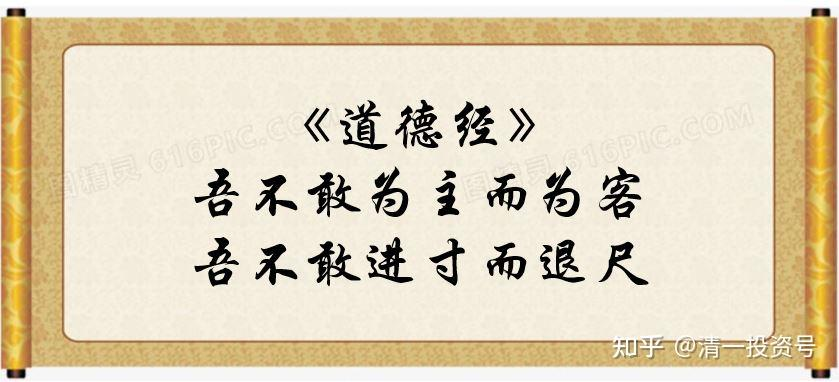

**原专栏16篇.我为什么不敢买汽车股？**

清一山长 2017年11月18日

我一直不敢买汽车股。造车的股不敢买，卖车的股，倒是低位买了（正通），现在也基本上卖掉了。因为我认为，十年后，现在的燃油汽车，就要开始被替换掉，甚至可能政府出台文件，不许生产新的燃油汽车了。今年我换车买本田URV的时候，就告诉老婆：这辆车，应该是我们在国内买的最后一辆传统汽车了。我相信十年之后，满大街都是“非传统车”，说不定连司机都没有了。现在的传统汽车企业积累了上百年的优势，可能转眼间就完全消失了。就像是沃尔玛面对阿里巴巴们一样，原来的历史积累越厚实，实力越强大，可能未来的新前途就越差。屌丝逆袭传统贵族的故事，将在汽车业中冒出来。数百年来，一直以来用资金和技术堆积自己优势的传统汽车柏林墙，会快速地挂掉，传统汽车业不得不毫无防御地投降屈服！

未来一定属于电动车，或者燃料电池车。但谁会赢，我不知道。这里面的利润大极了。你问我：现在不敢投资传统汽车企业，敢投资新能源汽车吗？比如像巴菲特投比亚迪，外国人买特斯拉一样？

我真的很想这样做——投资未来会成功的新能源汽车。如果赢了，回报率可以达到100倍。不过赢家通吃，输家会输的连裤子都没有的。问题是：我不知道谁会赢。特斯拉？比亚迪？我看未必！

电动汽车，核心元素，并不是汽车，而是电池，是人工智能控制系统。这个东西，随时出新的概念。现在无论投多少钱，都无法维持“护城河”。新东西一出来，原来的投资越大，越倒霉，转身都转不过来的。

所以，我知道这个行业会赢，但我不知道谁会赢。大概率不是现在的玩家。谁冒出来了真说不定的。

比如，宁德时代，是目前最有可能赢的电池专家。比亚迪的技术已经被它超越了。目前很多人已经投了很多钱在它身上。但他未来会赢吗？我看未必。假如下面这一家万向的新技术出来，他怎么办？恐怕未来只有“去死”了。“各领风骚数几年”，大约就是这些领袖者们的命运了。

下面这家很有可能赢。但也许明天你又会看到新的“专利突破”。所以，我永远无法弄清谁最终会赢。未来太复杂。唯一不复杂的，就是未来的世界教育方向，我觉得更容易把握一些。我觉得我会赢。

转发：近日，中国万向集团旗下、位于美国加州的电动车制造商菲斯科（Fisker）提交的专利申请文件显示，其固态电池技术将实现2.5倍于传统锂电池的能量密度，续航里程长达500英里（805公里），相当于从北京一口气开到西安或者安徽那么远。且充满电仅需1分钟！该公司计划在2023年前将该电池商业化应用。

相比之下，特斯拉Model S如果使用充电速度最快的超级充电桩，充满电目前也需要1个小时15分钟，续航为300英里（483公里）。
