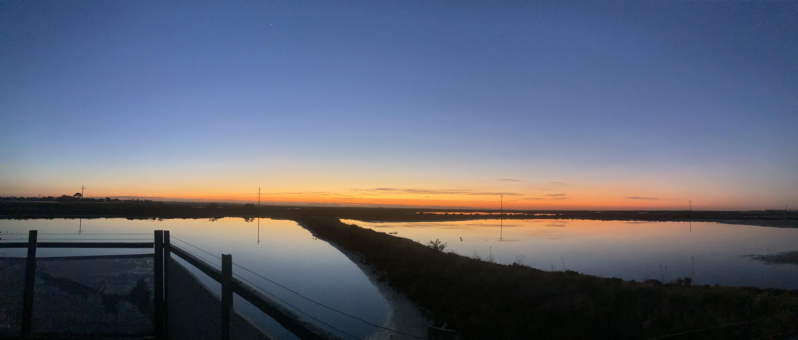

**题记：**

山长分享出来的2年前的旧信，让大家看到的更多的真相，更让攻击者的恶意诋毁不攻自破。

真正的善良和真诚，不需要堆积什么修饰的词汇，只是平淡说出来，就能让看者感动和深深的折服。王某、丁某、他们集结的那些清黑水军，所有他们写出来的文字，对比山长的两年前的旧信、群里各位学长表达的真诚和感动，谁是真，谁是假，谁是善，谁是恶，如此明显。

网络有长久的记忆，虽然它本无好坏本无立场，但它只能记住被记录下的东西，所以有心之人，会利用善良人的忍让、无欲者的不争，制造大量虚假的信息和发言，颠倒黑白，甚至利用自己的网络资源，封锁当事人的证明信件，以期达到自己破坏的效果。

但是，能封锁一篇乃至百篇，能禁言一人乃至百人，但一定不能全部封锁、全部禁言。只要我们每个人都真诚表达自己经历的事实、自己体验的感受，那么，网络就能把这些内容的大部分记住并呈现出来，让更多人感知善良、辨别是非。

如果您心中有正义、如果您曾在清一投资号的整理文、在山长的分享中有所收益，请您支持这篇有关旧信的文章，给予点赞、分享或评论。请用您在清一投资整理文中学到的逻辑和理性，用您在新教育圈中感受到的善良和文明，行使自己表达的权利。我们虽然都很平凡，但众多平凡的真实就是力量，让正气长存，让邪念无所遁形。

清一山长的正文链接：

[清一投资号：一封还原真相的旧信](http://link.zhihu.com/?target=https%3A//xueqiu.com/2017773236/337112293)

其他转发此文的链接：

[Linda逸凡：万字黑茶文与清一山长的6000字师徒书！王大茶的前世与今生！](https://zhuanlan.zhihu.com/p/1912198962934419997)[Ella：转载自山长：万字黑茶文与清一山长的6000字师徒书！王大茶的前世与今生！](https://zhuanlan.zhihu.com/p/1911822070498698220)[清一山长的QQ空间原文](http://link.zhihu.com/?target=https%3A//user.qzone.qq.com/1920602454/blog/1748734048)

**参考链接：**

[山长 清一：爱出者爱返：万字黑茶文与6000字师徒信能量对照！](https://zhuanlan.zhihu.com/p/1912435745265792280)

[山长 清一：理想不会自动实现，绿茶也是新教育的一页历史！](https://zhuanlan.zhihu.com/p/26836470372)

[山长 清一：捞女与慧芳谁更有福？宇宙真是公平的吗？](https://zhuanlan.zhihu.com/p/27197245622)

[山长 清一：世界名校正在浮出水面&把钻石送给猴子会是啥结果？](https://zhuanlan.zhihu.com/p/27700654632)

[李海-大道至简：如何看待王某的师徒风波](https://zhuanlan.zhihu.com/p/1911837250884469301)
