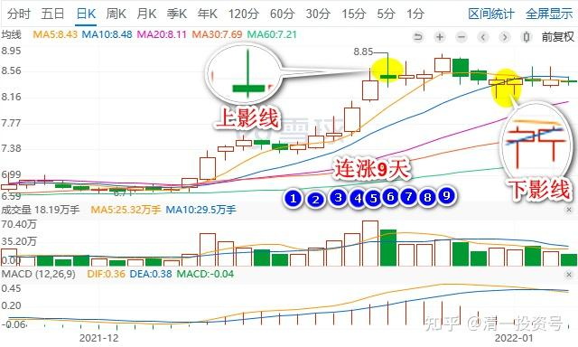

专篇18.突破9元是燕京的基本目标

清一山长 2022年1月9日

上次燕京连涨9日，让我以为它要把9元作为调整中枢了。这种调整需要一定的时间，就判断它7个交易日内会破九。结果是打脸了。现在我继续坚持：**突破9元肯定是燕京的基本目标。**而且经过这一段时间的调整，应该会在未来7个交易日内超越这个压力线的。前几天的下影线，是在测试底部。最近几天的上影线，是在测试上方压力。我看测试结果基本出来，拉升的线，也越来越陡峭。试跑了这么多次，再试几次也可以理解，但应该不会超过7次了。看看这次准不准吧？欢迎燕京主力继续让我打脸[憨笑]。真不知道这群人是何方神圣，操控得如此得心应手。连重阳这样的大主力，重仓多年，都被他在启动前轻易赶走了。真牛[赞]

**东2022/1/9 18:13:40

感恩山长分享！看山长解盘是一种享受。

对传统的技术分析，一直不是特别感兴趣，虽然有老师对我很好，并愿意教，自己一直没努力学，只学了点表皮，现在留下来的记忆更少了。下面是我本月6日发在雪球的，大家可以对比一下：从技术分析来看，燕京日线调整非常强势。MACD今日见蓝色柱状体（我有独特的参数体系），K线收红，RSI不下20，60分钟MACD不下底线。股价始终在10日均线附近，距离30日均线7.68元很远。以我三脚猫的技术分析来看，已经是最强势的调整了。

**云2022/1/9 19:27:02

感恩山长的思维分享。

**雷2022/1/9 22:09:34

主力能赶走重阳，封山长的号，控盘技术又一流，碰到这么牛的庄家也是我们的幸运吧！山长又说燕京可能是他入市最看好的股，期待接下来的故事情节，不管如何，我们能跟随高人共舞了！高手对高手，共赢的可能性很高吧！

山长一直在用投资教我们生活和做事的思维，经历了多次也逐渐知道了不贪的重要性，大家从这篇文章能看到什么？傻猫境界或许就是我们努力的目标，也会让我们越来越幸福。几人能教我们当傻冒，唯有感恩。

**林 2022/1/9 23:38:43

感觉这帮神圣不只是想赶走重阳，还想请山长下车，因为山长的仓太重了。

**参考链接：**

专篇1 [306篇.前缘1.雪球的最后一贴--胜利曙光都已经出现](http://link.zhihu.com/?target=https%3A//xueqiu.com/2017773236/247159187)

专篇2 [307篇.被特别关照的股--前缘2](http://link.zhihu.com/?target=https%3A//xueqiu.com/2017773236/247387457)

专篇3 [308篇.立此存照--前缘3](http://link.zhihu.com/?target=https%3A//xueqiu.com/2017773236/247580614)

专篇4 [309篇.见识传说中的拖拉机账户](http://link.zhihu.com/?target=https%3A//xueqiu.com/2017773236/247973779)

专篇5 [310篇. 拉升在即](http://link.zhihu.com/?target=https%3A//xueqiu.com/2017773236/248351982)

专篇6 [311篇. 进入右侧投资时代](http://link.zhihu.com/?target=https%3A//xueqiu.com/2017773236/248658236)

专篇7 [313篇. 小主力进货的阶段](http://link.zhihu.com/?target=https%3A//xueqiu.com/2017773236/249221851)

专篇8 [316篇.两轮回调对比](http://link.zhihu.com/?target=https%3A//xueqiu.com/2017773236/249675370)

[专篇9.主力的水军](https://zhuanlan.zhihu.com/p/619400004)

[专篇10.主力完成筹码收集](https://zhuanlan.zhihu.com/p/629948708)

[专篇11.主力、游资、右侧投机客纷纷进场](https://zhuanlan.zhihu.com/p/631628731)

[专篇12.进入震荡期](https://zhuanlan.zhihu.com/p/633057526)

[专篇13.永远回避风险，不亏损第一](https://zhuanlan.zhihu.com/p/635191087)

[专篇14.高位十字星缩量及主力操作的三个阶段](https://zhuanlan.zhihu.com/p/635191930)

[专篇15.准备起跳](https://zhuanlan.zhihu.com/p/636886203)

[专篇16.大幅回调，老手加高手](https://zhuanlan.zhihu.com/p/638552635)

[专篇17.股东数所传递的信息](https://zhuanlan.zhihu.com/p/639002631)

