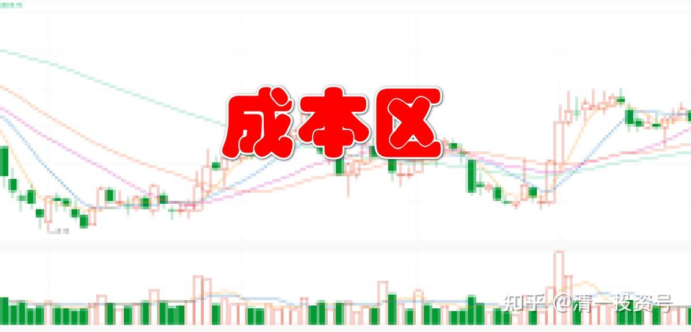
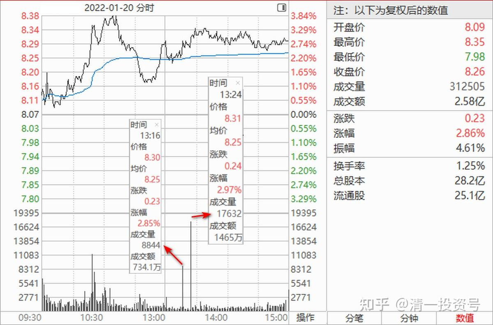
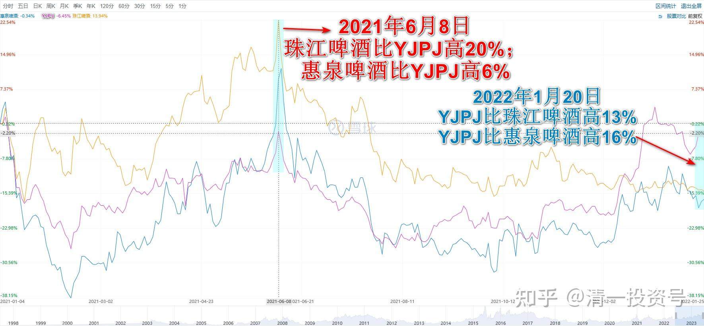

专篇21.现在是新主力的成本区

清一山长 2022年1月20日

今天上午做私人辅导去了。接下来吃午饭，刚回来看看盘面。我看到YJ涨到8.26元的时候，上方一直到8.31元的价位的压单，这个价位都只有区区几万股压单。盘面很轻。但突然有一根8000多手的成交出现，价格是8.30元，股价接下来居然是僵持，并没有上攻迹象，这笔成交，显然就是“换庄倒手”。应该是老庄原来已经拿走了很多的低位筹码，要吸引新人进来一起拉升，但新人没有好处（底仓）是不愿意参与这种游戏的，只做拉升有点接盘侠的味道。所以老庄要让一些货出来给新伙伴，作为“诚意金”。**市场上，有一些资金是打前站的——负责去找到标的，打压吸货，一些资金是负责拉升的，各司其责。**

我认为**换庄现象的出现，应该是YJ要进入拉升期的迹象**。这几天的成交都有一些异常的地方，你们留心观察就是了。目前价位，是双方都不吃亏的价位，进入之后，大家也长期锁仓，涨到高位之后再震荡出货。你们留心成交量就行了。如果明显放大，就是开始出货了。马上我又看见一根179万股的成交，但盘面上根本就没看见卖单。就是倒手，接近三百万股已经完成倒手了。价格并未明显上升。好玩[憨笑]。

这也说明：现在虽然涨了一点，洗盘已经结束，但还没有到“拉升期”。不然这些资金，如果是用来拉升，吸走小散的散货，可以涨不少的。不至于几乎原地徘徊。**主力还在慢慢布局，现在的价位，依然是一些新主力愿意买进的价位，现在可以算是新主力的成本区。**我们不用急的。我们就傻等看戏好了。新主力成本区，未必就不不会下跌了，如果主力要更多的股，可能依然会打压的，只要股，不要钱，账面会绿油油的。**这个价位抢进来的新主力，短期的目标价至少要涨30%以上。所以，你们可以再涨30%就出掉一点。肯定会回调的。**

YJ在涨，惠泉跌。为啥？惠泉恐怕是出货的样子，利用YJ涨了的人，追不上就来追惠泉补涨。这种样子，恰好说明惠泉不能买。珠江也死气沉沉的。目前看YJ比它们俩都强势多了，一年前是完全两样的。

**参考链接：**

专篇1 [306篇.前缘1.雪球的最后一贴--胜利曙光都已经出现](http://link.zhihu.com/?target=https%3A//xueqiu.com/2017773236/247159187)

专篇2 [307篇.被特别关照的股--前缘2](http://link.zhihu.com/?target=https%3A//xueqiu.com/2017773236/247387457)

专篇3 [308篇.立此存照--前缘3](http://link.zhihu.com/?target=https%3A//xueqiu.com/2017773236/247580614)

专篇4 [309篇.见识传说中的拖拉机账户](http://link.zhihu.com/?target=https%3A//xueqiu.com/2017773236/247973779)

专篇5 [310篇. 拉升在即](http://link.zhihu.com/?target=https%3A//xueqiu.com/2017773236/248351982)

专篇6 [311篇. 进入右侧投资时代](http://link.zhihu.com/?target=https%3A//xueqiu.com/2017773236/248658236)

专篇7 [313篇. 小主力进货的阶段](http://link.zhihu.com/?target=https%3A//xueqiu.com/2017773236/249221851)

专篇8 [316篇.两轮回调对比](http://link.zhihu.com/?target=https%3A//xueqiu.com/2017773236/249675370)

[专篇9.主力的水军](https://zhuanlan.zhihu.com/p/619400004)

[专篇10.主力完成筹码收集](https://zhuanlan.zhihu.com/p/629948708)

[专篇11.主力、游资、右侧投机客纷纷进场](https://zhuanlan.zhihu.com/p/631628731)

[专篇12.进入震荡期](https://zhuanlan.zhihu.com/p/633057526)

[专篇13.永远回避风险，不亏损第一](https://zhuanlan.zhihu.com/p/635191087)

[专篇14.高位十字星缩量及主力操作的三个阶段](https://zhuanlan.zhihu.com/p/635191930)

[专篇15.准备起跳](https://zhuanlan.zhihu.com/p/636886203)

[专篇16.大幅回调，老手加高手](https://zhuanlan.zhihu.com/p/638552635)

[专篇17.股东数所传递的信息](https://zhuanlan.zhihu.com/p/639002631)

[专篇18.突破9元是燕京的基本目标](https://zhuanlan.zhihu.com/p/640000051)

[专篇19.YJ、惠泉今天盘面语言对比](https://zhuanlan.zhihu.com/p/640550916)

[专篇20.暗示洗盘快结束](https://zhuanlan.zhihu.com/p/641509884)

