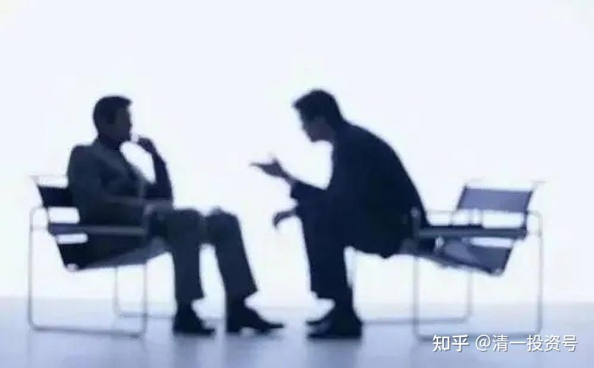

[原雪球专栏](https://zhuanlan.zhihu.com/p/569432171/edit)**[144篇.人生转轨：关键处只需要一场谈话搞定！](http://link.zhihu.com/?target=https%3A//xueqiu.com/9310099567/177361148)**

清一山长 2021年4月17日

**人的一生，其实重要的地方、关键的地方，也就几步而已。如果走错了，可能就一生失败。如果走对了，就一生的好运气。**

许家印，如果当年决定留在舞阳钢铁厂继续当技术员，而不是辞职丢掉铁饭碗，下海去广州、深圳闯天下，这一个选择，基本上就决定了他后续的命运。可能他依然是一样的努力，但得到的，是完全不一样的结果。**所谓命运，其实是自己选择的。**

马云当年高考失败，去拉手推车送货，觉得实在太累了。他发现：**不想吃读书的苦，就要吃生活的苦。**于是马云决定拼命复读，拼命学他最不喜欢的数学，再战高考。如果他当年，父母帮他找了个舒服体面的工作，或者他选择了屈服命运，不再努力，今天的杭州，可能多了个开饭馆的小老板，但肯定没有马云的阿里，可能是“牛云”的阿里了。

10年前，明一班的一个女孩，比明颖年龄大四岁的一个学生，挺有才华的。当时16岁，突然要退学回家“追寻梦想”。因为她的父母，想要她去考美国的大学。她自己想去“当国家地理的摄影师”。我知道父母想要的是美国留学的面子，看不起我的学堂的实力。至于这孩子，只是青春期来临，内心不安定，总想去外面瞅瞅热闹。但我直说出来，家长会认为我自私，为了我的学堂收点学费，就要阻止他们孩子去美国发展的“美好前途”。孩子会认为我胡说八道，不尊重她的理想。而且——**今日学堂当年，也只是灰姑娘。虽然我知道异日必放光芒，但家长并不相信我。他们只是觉得，今日只是一个中转站**。所以，我**只能随顺因缘，不多说什么**，祝福他们家一切如意！

新教育，选择一心一意跟下来，或者一心一意读体制，都没毛病。最怕是喜欢跳来跳去的人。一旦把心态弄坏了，怎么弄，都弄不好了。一步错，步步错！所以，关键时刻，选择不得不慎重！

10年过去了，当年比这女孩差得多的小女生，如明颖、明仪。可以出来拿千万年薪“卖掉”自己，可以叫板挑战全国3700万大学生。而当年才华过人，傲气十足的这个女生，随后并没有真的去出国留学，因为当年青春期来临，春心大动。哪里有心情去静静地读书、考学？但家长无条件地宠她，给她报名去付费高价培训，去学了一堆“高大上”的玩意，什么深层沟通之类的东西，成为了“历史上年龄最小的沟通师”。全然忘记了我告诫**“普通人千万别去玩灵性”**的提醒。后来这学生差点疯掉，差点自杀，导致抑郁症。十年过去了，一事无成，心态彻底坏掉。

这几乎就是必然的局面——**青春期，一旦控制不良，让孩子任性去发展、发泄，特别是脱离理性的指导去乱做事，这一生，基本就是毁掉了。这个社会，给你一生的机会，真的是有限的，有些机会丢了，就一生也捡不回来了。**

还有，大约四年前，清一书院的一个学生，16岁多，突然改主意，不想踏踏实实地学习锻炼了。要去社会上做生意，要赚大钱。说自己一定可以做到地区的首富。我认为就是疯了，完全不现实。以为家长不知道孩子疯，就跟家长联系----偏偏家长还挺支持孩子的梦想，觉得自家孩子了不起，志向远大，这就没办法了。此人还把清一书院的其他学生们都藐视了一通，认为其他人都没她有出息。因此——想走就走吧！现在如何了？就不谈了。此人根器其实很一般，唯一优点就是她很努力，如果信任老师的指导，补上短板，她还是可以有一番成绩的。现在却放弃了踏实的优点，想玩聪明，出去在这个险恶的世界单打独斗，自高自大，能有啥好下场？

这种人，其实每年都会出现。说穿了，就是青春期萌动，孩子们会干出很多很不理性，注定会让家庭和自己都绝望的事情来。但我们学校，**作为一个教学服务机构，基于自尊，我们不能干预家长和学生的自主选择。有时候，只能看着这些家庭自己跳坑。**

后来，我就提醒家长和学生：想做什么重大决定，最好花点小钱，找我私人咨询一次，免得用大钱去瞎折腾。我保证以中立方的立场，给你最好的建议和帮助。在脑子被荷尔蒙刺激混乱的时刻，不仅仅官员们会闹出很多导致丢官、坐监狱的蠢事。更多的年轻人，会做出让自己一生都后悔的“英明决策”。比如上述的——“想去美国当国家地理摄影师”。还有一些人，要从今日退学的理由，是要去“当导演”等等。如果我能够帮助他们理清思路，大多数人会冷静下来，认真思考的。这等于就是帮他们改变命运走向了。

我听说，居然有一个家长，要给某中介80万元中介费，帮助自家孩子出国留学。我觉得特别的傻气。您不如给我一万元，我教您该咋办好了。想留学，还不容易吗？国外的大学，好上得要命——还是正规的大学。野鸡大学，推荐人还给回扣。上大学，你把钱交给留学中介？大脑进水了吧？所以，给我一万元咨询费，总比交给骗子好吧？我也不要这些钱，直接转给武道馆生活和训练使用了。让您出钱，您我彼此两不相欠，生意而已。认为划算就找我，不划算就别找我，这样大家都轻松。我认为：基本上找我的人，都认为太划算了（估计认为不划算的人，都不找我咨询的）。

今年，又有一个学生出状况了。今年15岁，原来一直很用功的，今年突然就成绩下降，行为不正常。一直跟家长闹要退学，去追求自己的理想，过“自己想要的生活”。家长对此焦虑和无奈，也无法沟通处理，就找我联系，进行了一场私人咨询服务。这是我第一次接单，咨询和解决孩子的心理和青春期逆反问题，原来都是成人和老板找我解决重大问题。

今天我也在帮一个从腾讯辞职出来的人提供咨询，解决人生重大的选择问题。
我咨询的结果怎样？我是有正规服务程序的，既然作服务，当然就是要让顾客满意了。所以，我是学习西方的高层社会，要求顾客事先提出咨询申请，列出希望我帮忙解决的问题。我看这些问题，是我能解决的，我就接单，我不能解决的，我就不接单（比如，您花一万元问我，下周一，[中国建筑](http://link.zhihu.com/?target=https%3A//xueqiu.com/S/SH601668%3Ffrom%3Dstatus_stock_match)会不会涨？涨多少？我只能说：我不知道！我没有能力处理这个问题，退回您的咨询申请。如果您要提问的是：持有中国建筑，五年内会不会赔钱？能不能赚一倍？这个问题我就可以回答，就会接单了）。

事前审查还不够，还要有事后评估：我完成咨询服务后，要让顾客写服务反馈回来，是否解决了顾客事先提出申请的问题？对我的咨询是否满意？如果没有解决顾客的问题，顾客对我的咨询服务不满意，就可以拒绝支付咨询费，算我白干了。

下面是一份顾客的售后服务反馈，各位可以看看我的咨询服务是怎样运行的（事前申请问题部分，由于涉及私人信息，就不公布了。）

我的助理的报告：C家庭的咨询费已到武道馆的账户上。以下是孩子的咨询反馈，供您了解。

**事主（学生）的咨询评价：**

一、请问您对本次私人咨询的评价？是否解决了您想要解决的问题？提供的解决方案，是否具有实操性？可详细描述。

是解决了我想解决的问题。有实际操控性。

比如跟别人一样努力，我也有能力做到。早上同学5点30前就去跑步，会有更多的学习时间，今天我也可以做到。

跟自己比也可以做到。跑步的时候就会关注有没有跑到腿酸，可以不去管谁有没有超过我。

二、您结束私人咨询后，当下的心境是怎样的？是否能够轻松面对您原来认为很困难，几乎无力解决的困难了？

放松的。当下是可以轻松面对原来的困难了。

三、山长对您所说的语言和表达方式，使用的词汇等，您是否能够理解？是否超过了您的理解力，还是使用了您完全能够理解的词语和方式来解释的？

使用了可以理解的方式和词汇。

四、您对本次咨询服务，是否有不满意的地方？您希望我们后续提供什么样的改进意见？

没有。

五、经过本次咨询，您对老师的整体印象是怎么样的？有何感觉？您是否希望下次有问题的时候，继续找老师进行咨询？
我感觉老师很清楚问题是什么，可以一起讨论、解决问题（不是只说“这样不好、怎么可以这样说”这类的话就没了的那种）。

有何感觉？感觉如果有问题愿意问他的感觉。

您是否希望下次有问题的时候，继续找老师进行咨询？希望。

**调查二：**

家长旁听的反馈意见

**C家长的服务反馈意见：**

一、请问您对本次私人咨询的评价？是否解决了您想要解决的问题？提供的解决方案，是否具有实操性？可详细描述。

答：对本次咨询非常满意！不但解决了孩子的问题，也一并解决了我们家长的问题，走出了认识误区，看清了孩子的等级，努力、态度是自己可以做到的，接纳天资是改变不了的这个事实，尽人事，只管付出，不在意结果。

二、您结束私人咨询后，当下的心境是怎样的？是否能够轻松面对您原来认为很困难，几乎无力解决的困难了？

答：非常激动，这段时间因为孩子的事情，心里面像压着一块石头，咨询结束后，犹如堵在心中的一个石头吐出来了，一身轻松。也看到孩子的神情发生了明显的变化，压在她身上的石头也挪走了。

三、山长对您所说的语言和表达方式、使用的词汇等，您是否能够理解？是否超过了您的理解力，还是使用了您完全能够理解的词语和方式来解释的？

答：能够理解。

四、您对本次咨询服务，是否有不满意的地方？您希望我们后续提供什么样的改进意见？

答：没有

五、经过本次咨询，您对老师的整体印象是怎么样的？有何感觉？您是否希望下次有问题的时候，继续找老师进行咨询？

答：在咨询前，感谢校长和灿老师也做了仔细的引导，使我们有了更充分的准备以及思考。咨询过程，山长很亲切幽默，令人很放松。下次有问题，愿意找老师进行咨询，寻找支持。感谢老师们的付出！

**第三份考评：**

今天上午完成的咨询任务

时间：2021年4月17日上午

交流方式：网络视频

一、请问您对本次私人咨询的评价？是否解决了您想要解决的问题？提供的解决方案，是否具有实操性？可详细描述。

咨询非常有价值，既解决了我想解决的问题，也解决了我意想不到的更根本的问题。

解决方案很有实操性，道路很清晰，而且完全清楚为什么要这样走，具体怎么走。

二、您结束私人咨询后，当下的心境是怎样的？是否能够轻松面对您原来认为很困难，几乎无力解决的困难了？

结束咨询后心情非常畅快，心中很通畅。之前压抑很久的一些想法被打开了，能够很开心很轻松地面对生活。

三、山长对您所说的语言和表达方式，使用的词汇等，您是否能够理解？是否超过了您的理解力，还是使用了您完全能够理解的词语和方式来解释的？

山长使用的语言很清晰易懂，完全可以理解。

四、您对本次咨询服务，是否有不满意的地方？您希望我们后续提供什么样的改进意见？

没有不满意的地方，服务太好了。就是似乎知道用这个渠道咨询的人不多，感觉对大家来说很遗憾。

五、经过本次咨询，您对老师的整体印象是怎么样的？有何感觉？您是否希望下次有问题的时候，继续找老师进行咨询？

之前比较害怕当面问山长，这次之后心更放下了。山长很直接也很清晰地解答我的问题，而且完全是站在我的立场上帮我。对于比如为什么我不能进今日这样的问题也给了很诚恳的答案。我觉得这样非常好。下次有问题的时候一定再找山长咨询！

而且山长也让我意识到了，什么样的问题是真正的困扰，是真正需要山长解决的。比如我写了七个问题，只有一个问题是根本，其他的问题，根本的障碍也是同一个，但都是表象。所以下次找山长的时候会更清晰要问什么。

（以下内容为编者收录）

**评论回复：**

**[九个瓶子八个盖](http://link.zhihu.com/?target=http%3A//xueqiu.com/n/%25E4%25B9%259D%25E4%25B8%25AA%25E7%2593%25B6%25E5%25AD%2590%25E5%2585%25AB%25E4%25B8%25AA%25E7%259B%2596)回复[清一山长](http://link.zhihu.com/?target=http%3A//xueqiu.com/n/%25E6%25B8%2585%25E4%25B8%2580%25E5%25B1%25B1%25E9%2595%25BF)：**

老师，您在文中说：“**全然忘记了我告诫‘普通人千万别去玩灵性’的提醒。**”对于这句话能否多讲些？我们正在跟随刘明慧老师自学。[清一山长](http://link.zhihu.com/?target=http%3A//xueqiu.com/n/%25E6%25B8%2585%25E4%25B8%2580%25E5%25B1%25B1%25E9%2595%25BF)[¥200.00]

**[清一山长](http://link.zhihu.com/?target=https%3A//xueqiu.com/9310099567)[2021-4-17 21:49](http://link.zhihu.com/?target=https%3A//xueqiu.com/9310099567/177427249)回复[九个瓶子八个盖](http://link.zhihu.com/?target=http%3A//xueqiu.com/n/%25E4%25B9%259D%25E4%25B8%25AA%25E7%2593%25B6%25E5%25AD%2590%25E5%2585%25AB%25E4%25B8%25AA%25E7%259B%2596)：**

**人，分为身、心、灵三大组合。只活在身体层次，是无明。修心，就是修理性，修智慧，修无畏，修无欲等。这一关没过，直接去玩灵修。特别是欲望大的人去学灵修，就是找死。**我已经见过太多的人修得疯疯癫癫的。身体也极差。家庭、事业、子女等，也一塌糊涂。

刘老师是身、心、灵一体的，没有分开。而且不教你们灵修。有人不满足，乱找老师学灵修，就很危险。刘老师只有在学员有身心良好的基础之后，才有可能会教灵修的法（现在都没有教人的）。你们现在学的，是“慧心”的层次，并不是“灵”的层次。这个“灵”，不要去去追求。该有就有，层次到了就能出来的，勉强求来的，是灾难。（声明：本回复仅代表该作者观点，不构成任何投资建议）

**[玖君](http://link.zhihu.com/?target=http%3A//xueqiu.com/n/%25E7%258E%2596%25E5%2590%259B)回复[清一山长](http://link.zhihu.com/?target=http%3A//xueqiu.com/n/%25E6%25B8%2585%25E4%25B8%2580%25E5%25B1%25B1%25E9%2595%25BF)：**

非常赞同山长收费咨询。不收费，你提的建议再有道理，别人也不一定当回事，这既浪费了被咨询者的时间和精力，更浪费了咨询者的机会，甚至是生命！

**[清一山长](http://link.zhihu.com/?target=https%3A//xueqiu.com/9310099567)[2021-04-18 08:07](http://link.zhihu.com/?target=https%3A//xueqiu.com/9310099567/177436046)回复[玖君](http://link.zhihu.com/?target=http%3A//xueqiu.com/n/%25E7%258E%2596%25E5%2590%259B)：**

[献花花]。收费就是为了排除干扰，也为了自尊尊人。想要免费的，就读我写的文章去。读懂了，也一样有收获。[笑]

**[菠萝小牛](http://link.zhihu.com/?target=http%3A//xueqiu.com/n/%25E8%258F%25A0%25E8%2590%259D%25E5%25B0%258F%25E7%2589%259B)回复[清一山长](http://link.zhihu.com/?target=http%3A//xueqiu.com/n/%25E6%25B8%2585%25E4%25B8%2580%25E5%25B1%25B1%25E9%2595%25BF)：**

一万元就可获得山长一个小时的陪聊时间，还能解决问题，怎么算都是超值的呀！[合十]山长，是不是清一圈外围，只要是信任您的，都有机会享受这一服务？如果有意者，暂无您助理的联系方式，我们是否可以转介，或代为联系您的助理，促成该咨询？中介人可先把咨询人的准入关，再把问题初筛一遍，并且不收中介费或其他附加费用，让咨询人的钱能够用在实处！[大笑][大笑]

**[清一山长](http://link.zhihu.com/?target=https%3A//xueqiu.com/9310099567)[20221-04-18 08:09](http://link.zhihu.com/?target=https%3A//xueqiu.com/9310099567/177436091)回复[菠萝小牛](http://link.zhihu.com/?target=http%3A//xueqiu.com/n/%25E8%258F%25A0%25E8%2590%259D%25E5%25B0%258F%25E7%2589%259B)：**

我只对清粉聊，不对外。我没你这么多时间到处陪聊。[捂脸]

**礼敬2021-04-17 20:53清一山长**

二零零三年，鬼使神差，在我困苦了三五年后，在我亲戚的床上，只有我一个人，突然映入眼帘一本书《世界上最伟大的推销员》，虽然不解，因别无他法，当时已经到了走投无路的地步，随后按要求读了一年。我最关键的一步。后面遇到山长再上台阶，就顺理成章了。

**坚守绿地1500天2021-04-17 21:56礼敬：**

“二零零三年，鬼使神差，在我困苦了三五年后，在我亲戚的床上，只有我一个人，突然映入眼帘一本书《世界上最伟大的推销员》，虽然不解，因别无他法，当时已经到了走投无路的地步，随仍按要求读了一年。我最关键的一步。后面遇到山长再上台阶，就顺理成章了。”——怎么从困苦解脱的？怎么上台阶的？详细说说。

**[礼敬](http://link.zhihu.com/?target=http%3A//xueqiu.com/n/%25E7%25A4%25BC%25E6%2595%25AC)2021-04-17 21:59回复[坚守绿地1500天](http://link.zhihu.com/?target=http%3A//xueqiu.com/n/%25E5%259D%259A%25E5%25AE%2588%25E7%25BB%25BF%25E5%259C%25B01500%25E5%25A4%25A9)：**

“怎么从困苦解脱的？怎么上台阶的？详细说说”买一本我说的书按书中要求读，作者是奥格·曼蒂诺。

**[清一山长](http://link.zhihu.com/?target=https%3A//xueqiu.com/9310099567)[2021-04-18 08:11](http://link.zhihu.com/?target=https%3A//xueqiu.com/9310099567/177436155)回复[礼敬](http://link.zhihu.com/?target=http%3A//xueqiu.com/n/%25E7%25A4%25BC%25E6%2595%25AC)：**

不如去念《公主经》、《王子经》[俏皮]。

**[佛系小资](http://link.zhihu.com/?target=https%3A//xueqiu.com/1566609429)2021-04-18 08:25清一山长：**

洗脑经

**[郭凌奇](http://link.zhihu.com/?target=http%3A//xueqiu.com/n/%25E9%2583%25AD%25E5%2587%258C%25E5%25A5%2587)回复[佛系小资](http://link.zhihu.com/?target=http%3A//xueqiu.com/n/%25E4%25BD%259B%25E7%25B3%25BB%25E5%25B0%258F%25E8%25B5%2584)：**

您难道没有发现您身边的“洗脑经”吗？比如美食广告、游戏广告、电视剧、流行歌曲？这些东西在不知不觉中对您进行了洗脑，掏空了您的腰包、消磨了您的意志、让您心甘情愿地跳入利益集团的陷阱，您这么聪明的人发现了吗？另外，请问《王子经》/《公主经》您读过吗？

**[建芸](http://link.zhihu.com/?target=https%3A//xueqiu.com/1713727777)[清一山长\[¥200.00\]](http://link.zhihu.com/?target=http%3A//xueqiu.com/n/%25E6%25B8%2585%25E4%25B8%2580%25E5%25B1%25B1%25E9%2595%25BF%3Fpaid_mention%3D1)**

您好！山长。我是学习深层沟通的受益者，同时也看到很多学习后的受害者。我想问：为什么会这样？我在以后的学习中又应该注意什么才不会走偏呢？谢谢！

**[清一山长](http://link.zhihu.com/?target=https%3A//xueqiu.com/9310099567)[2021-04-18 09:02](http://link.zhihu.com/?target=https%3A//xueqiu.com/9310099567/177437314)：**

我是十几年前见过林显宗老师的人。刘老师跟他学课程的时候，我去参加过林的演讲。我当时跟刘老师就说：他的这个法不究竟，自以为可以拯救人。其实慧根强的人，可以从这个方法中得到帮助；慧根不足的，知道这些前世的东西，可能反而害人害己。

他的理论是：把藏识里面的东西，各种负面的垃圾，拿出来晒晒，看清了，就会慢慢消失了。

问题是：**大多数人智慧修养不高的人，看到了一些信息，是看不清的，只会越来越乱，脑子越来越糊涂。**

**相当于你家里有一大堆垃圾，本来是封起来的，你没有处理垃圾的能力，却不断把垃圾堆扒开，只会让家里臭得无法居住。**

**只有很有智慧的人，才能有处理能力，才能去处理垃圾。或者你找到人帮你清除垃圾，才能去扒开垃圾。**

可是，很多学这个课程的人，根本连佛经都不看，有啥处理能力？得了一些神通，知道了一点前世的东西，就自大起来，感觉自己了不起，这不是找抽吗？

十几年前，我就说：林的深层沟通，需要有一个很有智慧的人，在旁边用佛学来解说，做助教，帮助当事人“转识成智”。如果做不到这一点，打开潘多拉的盒子，就会乱套。这个帮助事主的人，比沟通师的价值更重要。可林的体系，却没有这种人（这种人很难得）。而且，为了商业的需要，只要掏钱上完他课的人，不管心性如何，都可以去做沟通师，去赚钱帮人沟通。这就是让有妄心的人更多。很多人沉迷于找前世的记录，玩感觉。哪有啥智慧之光展现？

其实，无论是学佛也好，学智慧也好，解决自己的困惑也好，我认为：**最究竟的道路，就是自己读佛经，并照做，“信受奉行”。**

我认为：**最适合中国的人去读的佛经，就是《六祖坛经》。文字很简单，但智慧不简单。照着去做就行了。**（声明：本回复仅代表该作者观点，不构成任何投资建议）

**[清一山长](http://link.zhihu.com/?target=https%3A//xueqiu.com/9310099567)[2021-04-18 12:09](http://link.zhihu.com/?target=https%3A//xueqiu.com/9310099567/177444031)回复[郭凌奇](http://link.zhihu.com/?target=http%3A//xueqiu.com/n/%25E9%2583%25AD%25E5%2587%258C%25E5%25A5%2587)：**

**很多人，都很喜欢对自己完全无知的东西乱下结论。所谓的无知者无畏**[大笑]。

**[十一面](http://link.zhihu.com/?target=http%3A//xueqiu.com/n/%25E5%258D%2581%25E4%25B8%2580%25E9%259D%25A2)回复[清一山长](http://link.zhihu.com/?target=http%3A//xueqiu.com/n/%25E6%25B8%2585%25E4%25B8%2580%25E5%25B1%25B1%25E9%2595%25BF)：**

山长是走南怀瑾老师的路线？三教兼修？

**[清一山长](http://link.zhihu.com/?target=https%3A//xueqiu.com/9310099567)[2021-04-18 12:18](http://link.zhihu.com/?target=https%3A//xueqiu.com/9310099567/177444310)回复[十一面](http://link.zhihu.com/?target=http%3A//xueqiu.com/n/%25E5%258D%2581%25E4%25B8%2580%25E9%259D%25A2)：**

我还读《圣经》，看《可兰经》，看印度教的经典，奎师那的著作。有多少个“教”了？**我无门无派，啥教我都尊重，但我啥教都不入。我不信宗教，只信真理！**

**[可爱SongSong2](http://link.zhihu.com/?target=http%3A//xueqiu.com/n/%25E5%258F%25AF%25E7%2588%25B1SongSong2)回复[清一山长](http://link.zhihu.com/?target=http%3A//xueqiu.com/n/%25E6%25B8%2585%25E4%25B8%2580%25E5%25B1%25B1%25E9%2595%25BF)：**

[清一山长](http://link.zhihu.com/?target=http%3A//xueqiu.com/n/%25E6%25B8%2585%25E4%25B8%2580%25E5%25B1%25B1%25E9%2595%25BF)山长您好，现在有很多灵性的课程，讲究提升能量，祛除内心的负面情绪，给宇宙下订单，随心所动等，听起来像对宇宙人生有了新的解读，当时感觉很好，但是回到生活，又是很难过好，是不是这种灵性的课程虽然道理是对的，但是一帮人修容易走火入魔？普通人是不是只能渐修，按照《六祖坛经》里讲的不断“净心”，后面智慧自然会显现，以至于“开悟”。

**[清一山长](http://link.zhihu.com/?target=https%3A//xueqiu.com/9310099567)[2021-04-18 13:13](http://link.zhihu.com/?target=https%3A//xueqiu.com/9310099567/177445951)回复[可爱SongSong2](http://link.zhihu.com/?target=http%3A//xueqiu.com/n/%25E5%258F%25AF%25E7%2588%25B1SongSong2)：**

**用强烈的欲望，来修“提升生命能量”，越修，能量越低**吧？[大笑]

**[璇三星之家](http://link.zhihu.com/?target=http%3A//xueqiu.com/n/%25E7%2592%2587%25E4%25B8%2589%25E6%2598%259F%25E4%25B9%258B%25E5%25AE%25B6)回复[清一山长](http://link.zhihu.com/?target=http%3A//xueqiu.com/n/%25E6%25B8%2585%25E4%25B8%2580%25E5%25B1%25B1%25E9%2595%25BF)：**

我就是文中的C家庭家长，咨询后的第二天孩子状态就非常好！今天周日和孩子通话，孩子全程轻松愉快地和我分享(我已经好久没听她笑了，今天这种状态，原来在她最努力的那个阶段也是没有的，就是打开了心门，豁然开朗的那种感觉，原来一直是比较紧的）她分享将咨询的收获落实在学习，运动、做事，各各方面中去的感受，当观念转变后，同样的事情，前后完全不同的心态对比。一场谈话，改变了一个孩子的人生方向，避免了乱做主张，给自己以及家庭带来的灾难性后果。感恩山长！何其有幸，人生得遇名师指路！感恩老师们，在孩子出现问题时，及时的为我们提供的各种支持与协助！感恩！

**[清一山长](http://link.zhihu.com/?target=https%3A//xueqiu.com/9310099567)[2021-04-18 19:41](http://link.zhihu.com/?target=https%3A//xueqiu.com/9310099567/177458607)回复[璇三星之家](http://link.zhihu.com/?target=http%3A//xueqiu.com/n/%25E7%2592%2587%25E4%25B8%2589%25E6%2598%259F%25E4%25B9%258B%25E5%25AE%25B6)：**

能帮到你们就好[献花花]。其实，**只要真诚的去理解和支持孩子，就没啥大问题。每个孩子，内心深处都是想上进的。给他们符合自己条件的支持和理解就好。**毕竟孩子小，需要有聪明的家长指导、疏通。家长做不到，就请“外脑”援助。别搞成只会自己孤独地面对。无助地走向灾难。**中国的家长，都不善于沟通、交流。希望我们的下一代好一点。**

今天本来也有家长咨询的，但我把周日的时间给了清一塾的孩子们聊天。轻松地解决了不少孩子的纠结。类似的集体辅导，如果还是解决不了的问题，家长要学会主动找我帮助。有些孩子就是不善于利用公共资源[大笑]。家长就需要开通私人渠道解决了。但有些孩子很大方，公开表达也没问题，这些就可以公开处理掉了。但别指望我一个一个的去找学生聊，疏通心结。最多整个班级聊，就不错了。

**[琳溪](http://link.zhihu.com/?target=http%3A//xueqiu.com/n/%25E7%2590%25B3%25E6%25BA%25AA)回复[清一山长](http://link.zhihu.com/?target=http%3A//xueqiu.com/n/%25E6%25B8%2585%25E4%25B8%2580%25E5%25B1%25B1%25E9%2595%25BF)：**

每天阅读山长的文章，都像在给自己充电，喜悦无限。山长文中讲的其中一个孩子，我在参加山长课程时亲眼见过，那时孩子很精进，我惊叹佩服。听同学讲山长是全免费当自个孩子培养她，还计划花巨资请专业高手同时训练培养。过了不知多久，忽然听说这个孩子不学了，要回家赚大钱。我吃惊一番，同时极度为这孩子家长惋惜。山长亲自培养的机会犹如天上掉馅饼，这种福气世间难遇。遗憾这家长和孩子却把这机缘白白扔了，如山长讲“关键点选错了，一生没好运了”。感恩遇到山长“真”人，余生绝不放弃跟随山长学习，期待再上山长的清心课，把自己的“心”继续清洗一番，有觉知的活在世间。

**[清一山长](http://link.zhihu.com/?target=https%3A//xueqiu.com/9310099567)[2021-04-18 19:52](http://link.zhihu.com/?target=https%3A//xueqiu.com/9310099567/177458999)回复[琳溪](http://link.zhihu.com/?target=http%3A//xueqiu.com/n/%25E7%2590%25B3%25E6%25BA%25AA)：**

最根本的缘由，是这孩子的家族，福报不够。不够我送给她的大名（她如果留下来，就会是现在的太极实战第一人），这种名望太高了，他家应该德不配位。所以——接不住这么高贵的礼物。

举个例子：这孩子考上原来的今日高中，当时的高中并没有提供免费条件。家长在考上了，才说没钱上学，申请免费。所以我给了全免。但这孩子出去闯商界，想当首富。没多久就觉得没希望（她真没商业天赋的），就“退出商界”了。听说家长后面是拿钱送出国去上国际学校。这——意思就是：家长让孩子上今日学堂，是没钱的。但把钱送给鬼佬用，却很大方。家长实在是看不起我们，自然得不到我们的宝贝了。

目前，接续她练格斗太极的，有四个女生已经超过她当年最高的水平。未来一年内就要出山了。现在，已经没有“第一人”，而是只有“第一批”了。当年我重点培养，现在是多元发展。谁出来，就算谁的。[笑]

**[zheng茱茱](http://link.zhihu.com/?target=http%3A//xueqiu.com/n/zheng%25E8%258C%25B1%25E8%258C%25B1)回复[清一山长](http://link.zhihu.com/?target=http%3A//xueqiu.com/n/%25E6%25B8%2585%25E4%25B8%2580%25E5%25B1%25B1%25E9%2595%25BF)：**

山长，你好！你的文章，我从2014年就开始关注，2016年也上过你的财富课程。这几年也一直不断地学习你的文章，一直都很欣赏，我本身也是深层沟通的学员，平时你写的文章我其实大部分都比较认可的，但今天看到你说深层沟通，你从十几年就见过林老师，然后对这个技术印象如此，从十几年前到现在，人都会有进步，十几年前也许是你所看的样子，但十几年后深层沟通技术包，括林老师自己也有很多的突破和进步！现在的深层沟通的技术已不再是你当年所看到的样子了！

你所讲的：历史上最年轻的沟通师，我也见过，当时她来学习的状况是带着青春期的叛逆，学习靠个人，她个人的执念还带着以前的想法，学习之后，愿不愿意改变执念，也要看她自己是否愿意。

有些人学深沟学得并不好，而大部分改变意愿强烈的人，还是有很大的转变，所以才会说我们是深层沟通的受益者！

**[清一山长](http://link.zhihu.com/?target=https%3A//xueqiu.com/9310099567)[2021-04-18 23:29](http://link.zhihu.com/?target=https%3A//xueqiu.com/9310099567/177468319)回复[zheng茱茱](http://link.zhihu.com/?target=http%3A//xueqiu.com/n/zheng%25E8%258C%25B1%25E8%258C%25B1)：**

的确，这十几年深沟如何发展，我也没去了解。**任何方便法门，都只付有缘人。再好的东西，也有人就是往歪处学，这不能怪老师不好，法门不对，只能怪人心的错乱。有些人，就是学什么都不像什么的。六祖好好传的禅宗，到了中后期，多数也是变成了野狐禅、狂禅、口头禅。误人也自误。**[捂脸]

**[金淼儿](http://link.zhihu.com/?target=http%3A//xueqiu.com/n/%25E9%2587%2591%25E6%25B7%25BC%25E5%2584%25BF)回复[清一山长](http://link.zhihu.com/?target=http%3A//xueqiu.com/n/%25E6%25B8%2585%25E4%25B8%2580%25E5%25B1%25B1%25E9%2595%25BF)：**

老师，看问题一下就看到实质，你是咋做到的？

**[清一山长](http://link.zhihu.com/?target=https%3A//xueqiu.com/9310099567)[2021-04-19 11:12](http://link.zhihu.com/?target=https%3A//xueqiu.com/9310099567/177501474)回复[金淼儿](http://link.zhihu.com/?target=http%3A//xueqiu.com/n/%25E9%2587%2591%25E6%25B7%25BC%25E5%2584%25BF)：**

如果你多年来的习惯，就是一年要看上数百本书。加上喜欢不断去思考，再加上年龄的积累，你也可以这样看世界的[大笑]。

**[蛰伏2020](http://link.zhihu.com/?target=http%3A//xueqiu.com/n/%25E8%259B%25B0%25E4%25BC%258F2020)回复[清一山长](http://link.zhihu.com/?target=http%3A//xueqiu.com/n/%25E6%25B8%2585%25E4%25B8%2580%25E5%25B1%25B1%25E9%2595%25BF)：**

有幸在2018年国庆财富课上听到山长讲课。[清一山长](http://link.zhihu.com/?target=http%3A//xueqiu.com/n/%25E6%25B8%2585%25E4%25B8%2580%25E5%25B1%25B1%25E9%2595%25BF)当时还带着些许“疑惑”给我们分析着新能源车的未来，让我印象深刻。山长当时指出“新能源汽车胜出者不会是传统汽车厂商，有可能是一个从不造车的入局者，判断大概率会是华为，可惜华为没上市，所以不知道谁会赢，华为买不了，只能大买特买给车提供更轻、更好材质的中国宏桥，因为不管谁赢，都需要铝板来造车，中国宏桥都是最大的受益者，传统汽车股一个都不敢买。”三年过去了，一切迷雾都在慢慢地一层层解开，答案也快出现了。感恩山长再次对新能源汽车的分享[献花花]

**[清一山长](http://link.zhihu.com/?target=https%3A//xueqiu.com/9310099567)[2021-04-19 11:59](http://link.zhihu.com/?target=https%3A//xueqiu.com/9310099567/177507691)回复[蛰伏2020](http://link.zhihu.com/?target=http%3A//xueqiu.com/n/%25E8%259B%25B0%25E4%25BC%258F2020)：**

[献花花]，你们都记得这么清楚，我都忘了。当年我如此精准地预测华为会造车，而且会成为赢家。当年，华为还没有要造车的任何消息出来呢！押宝中国宏桥，的确帮我赚了很多钱，实现了超过原来的A股第一重仓中国建筑的利润冠军纪录。所以，看样子眼光还是很重要的。**看不清，赚钱赚小钱，赔钱赔大钱；看得清，未必不会赔钱，起码赔钱赔小钱，赚钱赚大钱。**

**[lucky-ji](http://link.zhihu.com/?target=http%3A//xueqiu.com/n/lucky-ji)回复[清一山长](http://link.zhihu.com/?target=http%3A//xueqiu.com/n/%25E6%25B8%2585%25E4%25B8%2580%25E5%25B1%25B1%25E9%2595%25BF)：**

谢谢山长慈悲循循善诱的教导我们，但是作为青春期的孩子特别不喜欢家长给他们讲的一些“不要在意别人的言行，做好你自己就可以的”、“你改变不了其他人，只能改变你自己的内心”......类似这样的话，她们说是不喜欢鸡汤，不喜欢洗脑，怎么办？

青春期的孩子涉事太浅，遇到的班级小团伙孤立，遇到春心萌动的事情，孩子自己真的是非常焦虑和痛苦，以至于引起身体不适的严重症状，严重失眠和吃饭吸收不好，好像对青春期孩子没法用直接击中痛处的方式唤醒她们，在大人眼里这都是小事，可对青春期孩子来说就是不能承受之重，最近在反复体会山长文章和刘老师书籍，也发出了申请，希望有机缘得到山长或者刘老师的疗愈。
感恩山长和刘老师！

**[清一山长](http://link.zhihu.com/?target=https%3A//xueqiu.com/9310099567)[2021-04-19 17:17](http://link.zhihu.com/?target=https%3A//xueqiu.com/9310099567/177545569)回复[lucky-ji](http://link.zhihu.com/?target=http%3A//xueqiu.com/n/lucky-ji)：**

“不要在意别人的言行，做好你自己就可以的”、“你改变不了其他人，只能改变你自己的内心”

这些话，没人喜欢听，很空洞。**除非，你能用他们理解，并认同的方式，把这个原则换一种简单通俗，她完全能够共振的方式来告诉她。**

孩子不是不知道这种原则，文字谁都知道。是不知道如何具体实施这个原则，也不知道她内心的感受。你该告诉她具体怎样理解，怎样做。而且同情和理解她的感受，这样她才会听你的。不然的话，自然跟你逆反。因为你没真正帮到她。

你们看我跟孩子沟通，可能会说：“我也是这个意思！”、“这样也不难嘛？”都是大白话。但为啥孩子不听你的，听我的？因为你们只会贴标签，我会**落到实处，跟孩子的心相映。**

**清一山长[2021-04-19 18:08](http://link.zhihu.com/?target=https%3A//xueqiu.com/9310099567/177552258)回复[lucky-ji](http://link.zhihu.com/?target=http%3A//xueqiu.com/n/lucky-ji):**

谢谢你提供的这个信息，我让我们学堂的预备教师们、实习教师们，去把你说的这两句话（原则话），用跟青春期学生沟通交流的模式，写出来两个不同的情景对话。作为对他们学习和工作的考评，每次作业都要排名，一直排名末位的就要被淘汰，失去实习教师资格（当然，不止一次考评。而是这个作业总也做不好的人，我们不能聘用来当教师）。我认为：这个能力对于新教育教师很重要。只会跟你们家长一样说话，说大话，他们是无法赢得学生的心的，我要教会他们说“小话，贴心话”。[笑]

**[唐若闲](http://link.zhihu.com/?target=http%3A//xueqiu.com/n/%25E5%2594%2590%25E8%258B%25A5%25E9%2597%25B2)回复[清一山长](http://link.zhihu.com/?target=http%3A//xueqiu.com/n/%25E6%25B8%2585%25E4%25B8%2580%25E5%25B1%25B1%25E9%2595%25BF)：**

感恩山长给到为清一塾孩子们答疑解惑的机会！
听孩子们分享，感受到山长运用“捭阖之道，以阴阳试之。故与阳言者，依崇高；与阴言者，依卑小＂，针对孩子们的不同问题，用阴阳捭阖之道去因材施教，既随顺和接纳孩子有平庸者的念头，又激发孩子们内在有追求卓越的灵魂需求，以让大家扮演不同角色、不同立场的方式激发和引导孩子们去思考、去选择自己要成为什么样的人，去对自己的人生负责任，帮孩子们既清理了平庸者的杂念，又坚定了成为卓越者的信念！特别感恩山长对孩子们的循循善诱，给予到孩子们的帮助。

也感恩山长对不同孩子的不同问题的回答方式的亲自示范，也给了我们家长思考和学习的机会：既能入孩子们的心、举重若轻巧妙地化解了孩子所有的情绪，又能给到孩子们充足的力量，还引导孩子们学会换位思考去体谅家长的感受并以感恩之心去看待家长的高要求；**对孩子过往被人欺负的事实，也鼓励孩子自强自立成为强者，并将这段经历转念当成一种体验而已，并从中发现正面的价值**……每个问题的回答都值得我们好好消化学习，感恩山长的亲自示范给到我们学习的宝贵机会。

**[清一山长](http://link.zhihu.com/?target=https%3A//xueqiu.com/9310099567)[20221-04-20 08:56](http://link.zhihu.com/?target=https%3A//xueqiu.com/9310099567/177597318)回复[唐若闲](http://link.zhihu.com/?target=http%3A//xueqiu.com/n/%25E5%2594%2590%25E8%258B%25A5%25E9%2597%25B2)：**

谢谢家长们的关心和支持。孩子们难免有种种的情绪和不满，新教育，就是要让教师，**在尊重孩子的原则下，发掘出孩子内心深处最强大的一面。**对教师要求也相对更高。我的目的，也是示范给老师，如何跟学生沟通。达到教学的目标，也不压抑孩子。**对排名靠前的孩子要减压，让她们接受自己的不完美；对排名靠后的孩子，要让他们发现自己的优势，也找到他人值得学习的一面。**现在的孩子，都早熟。独立性、自我意识都很强。所以不能一味的说教，只能用“太极”了——舍己从人！过于“有我”，只会下命令和要求，就跟孩子们顶抗上了。

家长们要**从这个原则来引导孩子**：

**我们要变得更优秀，是因为我们要打败美国人。所以要付出更多的努力。如果不想努力，如果不想打败美国人，平庸一些，跟周围人一样，也可以。只是这样就太遗憾了，有机会没有去抓住，不是谁都有这种机会的！**

**鼓励孩子为自己而活。**

这样，孩子就觉得受到了尊重。愿意努力了。当然，还会有一些人贪图舒服。所以，回家后就**让孩子体验“平庸的代价”**，**了解社会多了，就会越来越热爱学习**，真的要去打败美国人了。我们**必须家校配合，慢慢堵掉孩子逃避的通道，才能让孩子精进**。马上就进入青春期，难免会出状况，家长们要做好准备。**不要唠叨，而要用同情、理解和支持，巧妙地引导孩子。家长多上示范班的课程，会有帮助的。**内容都是我们教师引导孩子的正向价值观的方式。

**冯瑞丽回复璇三星之家：**

清一山长，我家女儿是山长文字里提到的“贪图舒服”的那个类型，前段时间在学堂呈现出极度混日子的状态，我们跟老师商量，把她接回家，让她体验“平庸的代价”，全程完全遵照雨晴老师的思路和方法，在家调整40天，现在回到学堂，状态明显好转，用她自己的话来说[心心]：“我要开始逆袭了”！

作为家长，在孩子在家调整的过程中，也有很大的收获，最大的感触是：全然相信老师，听话照做，结果自然呈现！特别感谢雨晴老师[心心]，手把手的教我，每一步要怎么做，才会有如此明显的调整效果。感恩山长创建新教育平台，我们家庭受益匪浅！感恩！[心心]

**清一山长2021-04-21 11:13回复冯瑞丽：**

**孩子逃避的时候，家长要做“狠心虎妈狼爸”；孩子心情压抑，遇到困难的时候，要做“知心姐姐”，帮助解决。这样的家长，就是优秀的家长。**

**学堂不许老师做虎妈型的，学堂教师，只能做知心姐姐。**因此，会偏于宽松一些。家长要设法补上学堂的漏洞。现在的清一塾，正在改革教学方案，会让教师改变原来“很厉害”的形象，主要用于沟通辅导，帮助孩子。这种转变，未来更需要家长的配合协作。[献花花]
