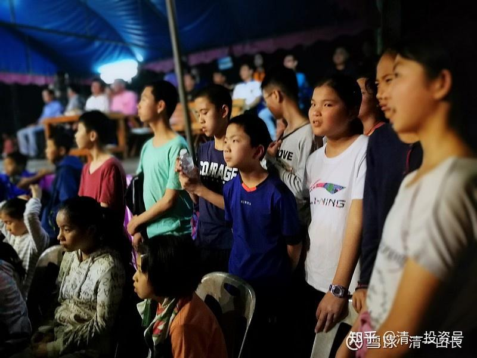

原雪球专栏[148篇.踩着别人的尸骨入坑，还是踩着自己的血泪前进？](http://link.zhihu.com/?target=https%3A//xueqiu.com/9310099567/178197312)

清一山长2021年4月26日

我教导小女儿：**不要自己去吃了亏，才会改自己的毛病，这太傻了。要学会看别人吃亏，让自己长教训；看别人生病，就自己先吃药，这是成本最低的改错！**别人掉坑里了，就提醒自己：千万别也跳进这坑！要学会绕过去。

不过很多家长，不是我这样想的，他们都太自信了，就像股民一样，以为买股亏钱的都是别人。自己买了的股，是一定赚钱的。儿女也一样，别家的儿女有不成器的，但自家的儿女，一定是最棒的，就像是自己买的股一样，一定是赚钱的！

我其实，一直会担心自己的孩子会不成器，自己的股票会不赚钱。所以，我一直小心地防范这种情况出现。

最近，一个大城市的年轻人找我咨询，父母似乎是行政官员。这孩子，自称是我原来大学的学生。其实我没有啥印象了。现在她大学毕业已经十几年了，居然一直在家里啃老，30多岁了，觉得都得了抑郁症了，很不好过，就找我付费咨询，解决她的问题。

说实话，我挺震惊的。当年考上武大，家长不知道有多幸福和光荣，以为远大前程就在眼前，不知道这孩子毕业后，居然找不到工作（应该是吃不了工作的苦，无法适应职场生活），家长居然就让孩子养在家里了，应该养得不错。比如可以找我咨询，出一万元的咨询费，肯定家长是支持的。

30多岁了，还要靠父母养活，有羞耻心没有呀？我当年读研究生，连回家的路费都没有，父母给我，我都觉得很耻辱。所以研究生没毕业，就业余兼职，下海打工赚钱去了。首份工作，是给一个小学都没毕业的老板打工，帮他修理游戏机。

我问这孩子：你父母总有一天要死的，不能养你一辈子吧？这孩子没脸没皮的，居然说：如果父母死了，她就来找我和刘老师，在一起生活[吐血]。

我只好告诉她：我自己的儿女，1**8岁以后，都要自谋生路。活不下去，就别活了。我才不养一个没用的闲人呢！**我凭啥来养着你？就因为原来当过你的老师，我现在就应该这么倒霉吗？何况，我并不比你父母更年轻！[滴汗]

结果，不出意外，这人是花钱来被我骂了一顿。当然，我会骂得更友好一点，别人毕竟是我的客户，虽然拿的是家长给的钱支付的。我告诉她：“**自己不缺少手脚，自己养活自己，是起码的天道。如果靠父母养活，自己不出来工作、做事，自己的灵魂都要谴责你自己的，生病、郁闷、想自杀，都是正常的。关键要学会自食其力。赚多赚少没关系，但要有自尊的生活，就必须自立才行。**”

我很想奉劝各位今日新教育的家长：你们现在眼里面，不要只盯着孩子考大学，国际名牌大学，给您脸上增光。别上完大学后，回家啃老，您看您的苦日子就无穷无尽，到死方休了。中国的大学，包括武汉大学在内，都是很好混日子的。**海外的大多数大学，也就是一个“青少年快乐生活营”，学不了啥真本事的**。**只有最自觉的学生，才会努力学习上进。如果您的孩子没有认真学习、认真生活的态度，不具备吃苦耐劳的素质和个性，去上什么大学，都是找抽的**，信不信由您！

我们家，就只敢让小女儿去上大学，这孩子的欲望很低，心不花，自我控制能力还行。所以我放心她去上大学。我们家的大女儿和儿子，都不让他们上大学（我不出学费，让她们想上自己去。结果他们自动放弃上大学的机会，只上了我开办的免费的清一大学，就早早毕业去工作了，都赚钱养活自己去了）。如果您认为您的孩子，肯定比我教了十几年的孩子更有出息，去上大学会不染各种坏毛病，您们就去上大学去，我没意见！[大笑]

国际今日的明莉校长，跟我联系，说现在示范班学生的假期安排问题：她带班的学生其实成绩很优秀，前段时间学堂的内部考评，示范班的学生们，新开始学一部电影，总共差不多有一个小时的内容，她的学生只需5天就学完了。这样优秀的学生，家长还不满意，要求假期如何训练孩子，让孩子更加精进？这就是说：有些人，真的比您聪明，比您成绩更好，同时还比您更勤奋、更精进、更努力！如果您的孩子，接回家后，只知道成天好吃好喝的伺候起来。您以为：将来他们进入职场，同场竞争，会是一个级别的吗？

转：明莉校长问题7：这次的暑假假期有三个月（我们没有放寒假，补的假期一起放的），需要完成2部新电影的学习，以及新概念第2册的学习（自学），压力并不大。家长们计划搞徒步或是社会实践等活动，也想询问我们怎么做会更好？

建议把学生分开处理。比如：本次期末考查学习成绩不好的学生，有可能考不上挑战班的学生，主要是被教师评定为：学习不够努力、不勤奋、不踏实的学生，建议这些家庭的家长，就玩一个感受生活艰难的游戏——处罚这批偷懒的学生，必须徒步走回家（比如设定走到深圳，因为深圳的家庭最多，其他人从深圳再坐飞机各回各家，家长们负责陪同走回家的路，做好后勤保障，每天给孩子20元伙食费，自己安排伙食、干粮，想做好吃的就自己煮饭。每天都要自己搭建帐篷，过最低标准的生活），这种走路回家，不追求速度，不安排进度，只追求过程的完全自立，家长不插手，只负责安全问题，全程让孩子们自己安排食宿起居。让学生感受人生的大道理——“**不吃读书的苦，就必须吃生活的苦**”。我相信：这一节毕业课程，是他们一生中记忆最深的课程！

其他学习好，很努力、很认真的孩子，让他们回家继续努力，多学一点课程，创造更新的学习纪录。为开学的时候，彻底击败清一学塾多做努力。除非是自己表示不想多学的，更想徒步的，可以自愿跟着其他学生徒步回家！这样分开对待，会建立起信念：不好好学习很倒霉，会被整死的。这样学生就会变得热爱学习了，不会逃避去选择更艰苦的“徒步走回家之路”。

说明一下：**“需要完成2部新电影的学习，以及新概念第2册的学习（自学），压力并不大”**，这些刚进校才一年的学生，就已经达到了这种水平，等于背诵完两部电影和一册课文，学习的速度和效率很惊人了。可是天使班的学生，有人就是学两年了，都没好好地完成两部电影，差距为何如此巨大？就因为天使班的孩子，是从小娇宠过来的孩子，学习就是打酱油。老师很费心，效果还很差。根本就**不是智力高低的问题，而是学习态度的问题**。天使班，其中一些懂事一点的，两年来改变和进步很大，基本上赶上了正式班相对靠后的一批孩子的水平和成绩。但是少数差的学生，依然在混日子，混一天，算一天[捂脸]。这种孩子，就算推送上大学，有啥意义呢？

照片是现在高中班的学生，两年半以前（还没有上高中之前）。在泰国看泰拳比赛的照片：图中心位置的，是班上年龄最小的孩子，原来是首届明珠班的学生，去年取得了西语C2的成绩，是班上年龄最小的三语学生。他的右手边站着的，是三年多前还拿过成绩班级第一的学生，当年的成绩很优秀，人也很聪明。两年前，突然就跟家长表示“不想学了，只想舒服过日子”，家长就真地接回家，好好地养起来了。因为家长一直对这孩子宠爱有加，舍不得磨炼。这就是我们身边的故事。导致这孩子跟原来的同学相比，已经是天上地下一样的差别，再也没法重新聚在一起了。小男生左手旁的这大一点的女生，是他们班的同学，今年高中班级综合第一名的学生，她是四语学生，英语、泰语、西语、汉语全通。去年的西语，拿了C1证书。现在正在一个全国知名的“问题孩子学校”当带班教师，实习锻炼自己的带班能力。因为她不想去读啥海外大学，只想早一点当新教育教师。这些孩子，正在开始“冒头”。很快就要走上正式的职场了。这个结果，就是“大浪淘沙”。社会和生活在考验的，不仅仅是今日学堂的教学能力，更主要的是：家长到底是什么级别的家长，懂不懂基本的家庭教育。表现良好的这两位学生，都是很小就送来今日学堂上学的孩子，而且**家长跟进学习新教育思想学得很不错。**跟不上的那个退学宅家的学生家长，我跟他们交流、指导，就觉得家长似乎就听不懂我说的语言一样。他们假装懂我教的东西，让我说了也白说。他们家，这样子下去，也就只能培养啃老族了。不知道什么时候能醒悟过来，把真正的心理和行为学到身上。

附录：网友交流记录：[@向日葵sz ：](http://link.zhihu.com/?target=https%3A//xueqiu.com/9936747717)关于啃老

“这类事我也听说过，还有养两代的，感觉那个爷爷有问题。”

现在养两代的人多了。找我的这孩子，没嫁人（恐怕连嫁人这个技术活都不会[捂脸]）。如果她嫁了，还趁结婚的新鲜劲，生了孩子，又离婚了（现在很多这样的孩子），这一家的父母，不就养两代人了吗？

其实，孩子不结婚，宅在家里，是这种家庭的福气。不然添个小孙子，您老了，是不是还要考虑是否养第四代的问题？看这种自以为“有钱”的父母，到底能养几代人[加油]。

我的资产超越绝大多数中国家长，我都叫穷，不敢养孩子一辈子。**只敢穷养孩子，让孩子自生自灭，我只管在18岁以前，不惜代价地教好她。18岁后，好和不好都是她自己的生活**。

上面谈到的这个家庭，虽然父母的地位、职业都不错。虽然赶不上我，但比我娇养孩子多了。**但这个家庭的未来希望，已经完全地断绝了，已经注定成为“断子绝孙”的绝户了。父母有啥财产、地位，甚至基因，都注定消灭了。**我不知道她父母有多少钱，有多少房子，但有多少，重要吗？重要的是：您已经断子绝孙了。唯一区别就是：将来不知道是**“黑发人送白发人”**，还是凄凉到**“白发人送黑发人”**。这种下一代，生活作息都很差，也不锻炼身体。就算不自杀，我看不一定活得过老人家！
