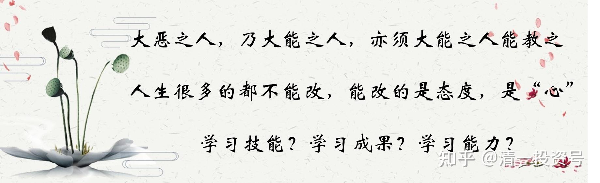

13篇.人生很多的都不能改，能改的是态度，是“心”

清一山长 2021年4月13日

清一山长雪球非专栏帖子整理文章，第13篇《人生很多的都不能改，能改的是态度，是“心”》

此文整理自山长专栏文章《你家孩子，是第几等人？要用几等的教育适配？》[https://xueqiu.com/9310099567/176986672](http://link.zhihu.com/?target=https%3A//xueqiu.com/9310099567/176986672)跟帖评论

**一、大恶之人，乃大能之人，亦须大能之人能教之**

**[月亮的未来](http://link.zhihu.com/?target=http%3A//xueqiu.com/n/%25E6%259C%2588%25E4%25BA%25AE%25E7%259A%2584%25E6%259C%25AA%25E6%259D%25A5)回复[清一山长](http://link.zhihu.com/?target=http%3A//xueqiu.com/n/%25E6%25B8%2585%25E4%25B8%2580%25E5%25B1%25B1%25E9%2595%25BF):**

请问老师，一等、二等、三等、四等、五等的孩子，是天生的，还是家庭教育的结果？因为家里的孩子是属于三等，我一直觉得是我不会教育的结果。但今日的老师，是懂教育的，孩子是四等，那么是如何变成四等的？

**[清一山长](http://link.zhihu.com/?target=https%3A//xueqiu.com/9310099567)[2021-04-13 11:30](http://link.zhihu.com/?target=https%3A//xueqiu.com/9310099567/176988933)回复[月亮的未来](http://link.zhihu.com/?target=http%3A//xueqiu.com/n/%25E6%259C%2588%25E4%25BA%25AE%25E7%259A%2584%25E6%259C%25AA%25E6%259D%25A5):**

有天生的，也有后天教的。爷爷奶奶，最喜欢按照废物级别来教孩子。只是毒物级别，谁都受不了。

**[王林夕](http://link.zhihu.com/?target=http%3A//xueqiu.com/n/%25E7%258E%258B%25E6%259E%2597%25E5%25A4%2595)回复[清一山长](http://link.zhihu.com/?target=http%3A//xueqiu.com/n/%25E6%25B8%2585%25E4%25B8%2580%25E5%25B1%25B1%25E9%2595%25BF):**

这么看，大宅门的白景琦就是第五类人了，后面碰到能辖制住他的老师后，才开始变好。

**[清一山长](http://link.zhihu.com/?target=https%3A//xueqiu.com/9310099567) [2021-04-13 12:33](http://link.zhihu.com/?target=https%3A//xueqiu.com/9310099567/176994254)回复[王林夕](http://link.zhihu.com/?target=http%3A//xueqiu.com/n/%25E7%258E%258B%25E6%259E%2597%25E5%25A4%2595):**

大恶之人，也是大能之人。收拾过来了，比一般人更强，能做一般人不能做的事情；无能之人，想干坏事都不会干的，所以叫废物。恶人没有收拾过来，就是害人精。白景琦如果小时候家长没有请来高手教育好，将来不知道要闯多少祸。

大恶之人，必须大能之人，才能对付他们。一般人，是根本搞不定的。我们学堂两坏孩子，没有老师能搞定，学堂最优秀的老师，可以教优等生，但教不了这种坏学生。全学堂都是要找我想办法来对付。去年，坏孩子是在泰国，我亲自来对付的（谁让他爹妈，是我的学生、助手，我只能代管教）。我管的时候要乖巧很多。我打屁股特别狠，打完一定屁股上要留印子的。孩子被打的时候，会痛得话都说不出来。但孩子后来回国后，居然说：他最喜欢的老师是我。

**[龙心ecw](http://link.zhihu.com/?target=http%3A//xueqiu.com/n/%25E9%25BE%2599%25E5%25BF%2583ecw)回复[清一山长](http://link.zhihu.com/?target=http%3A//xueqiu.com/n/%25E6%25B8%2585%25E4%25B8%2580%25E5%25B1%25B1%25E9%2595%25BF):**

山长说的大恶之人也是大能之人，收拾过来比一般人都厉害，那么可以理解成五等人如果遇到了好的老师，也是可以被教导成二等，甚至一等人吗？

**[清一山长](http://link.zhihu.com/?target=https%3A//xueqiu.com/9310099567)[2021-04-13 12:48](http://link.zhihu.com/?target=https%3A//xueqiu.com/9310099567/176995229)回复[龙心ecw](http://link.zhihu.com/?target=http%3A//xueqiu.com/n/%25E9%25BE%2599%25E5%25BF%2583ecw):**

有可能，但很难，代价极高。

让我来做的话，纠正一个坏孩子的精力，我可以用来教好几十个好孩子！所以，你给我十倍的学费，我都亏了！

**[王林夕](http://link.zhihu.com/?target=http%3A//xueqiu.com/n/%25E7%258E%258B%25E6%259E%2597%25E5%25A4%2595)回复[清一山长](http://link.zhihu.com/?target=http%3A//xueqiu.com/n/%25E6%25B8%2585%25E4%25B8%2580%25E5%25B1%25B1%25E9%2595%25BF):**

大恶之人，大能之人才能对付他们。两个学生喜欢的是您，白景琦对最后一位老师也是很恭敬喜欢，白景琦对最后一位老师的态度反转，简直不可思议，现在理解了，太有意思了

[清一山长](http://link.zhihu.com/?target=https%3A//xueqiu.com/9310099567)[2021-04-13 13:07](http://link.zhihu.com/?target=https%3A//xueqiu.com/9310099567/176996587)回复[王林夕](http://link.zhihu.com/?target=http%3A//xueqiu.com/n/%25E7%258E%258B%25E6%259E%2597%25E5%25A4%2595):

跟坏孩子斗，你要处处都比他厉害，害人都比他更会害。他挖坑，你就让他自己跳坑，站在旁边笑话他，他就佩服你，就把你当老大，当你的小跟班了。时间长了，就慢慢变好了。如果没有能够制服他，他就自己要当老大，对谁都要怼的，对着干！

所以，**恶人必须恶人磨，对付恶小孩，你必须比他更恶才行。“以德服人，感化坏孩子”，这是书呆子干的傻事。**我有把恶小孩变好小孩的成功案例。

但一般人，一般的家长，都喜欢装好人，做不了这事的。

**二、人生很多的都不能改，能改的是态度，是“心”**

**[ellhll李华丽](http://link.zhihu.com/?target=http%3A//xueqiu.com/n/ellhll%25E6%259D%258E%25E5%258D%258E%25E4%25B8%25BD)回复[清一山长](http://link.zhihu.com/?target=http%3A//xueqiu.com/n/%25E6%25B8%2585%25E4%25B8%2580%25E5%25B1%25B1%25E9%2595%25BF):**

谢谢山长分享。

山长是真正的道家人：说真话，做真人。

“山长的女儿是二等人、学堂老师的子女有最末等的五等人”这样的陈述，没人问也没预期山长说出来，但山长就是没有一丝不自在，坦坦然，不粉饰学堂的完美形象，也不塑造自己的全能完美。山长还说过**“我知道我能力有限，没办法照顾所有的人，我不是神，我不负责拯救世界。当我这样想的时候就很淡定，就老老实实做好我自己的事情”**这两个表达，示范的正是坦荡磊落，事实就是事实，接受现实，合一地做人。

一、

1.一等学生，能力态度上等。精品

2.二等学生，能力态度一个上等一个中等。优品

3.三等学生，能力态度中等。中品

4.四等学生，能力下等，态度中等。次品

5.五等学生，能力上等，态度品质下等。毒品

山长在元旦分享会说，教育有三等：一等教育教会做人；二等教育教育做事；三等教育教会读书。看山长分析的新教育对五等学生的教育，一、二、三等的学生得到了【做人做事读书】的全等教育；四等的学生得到了【做人做事】的教育；五等人至少得到了【做人】的教育。所以在新教育，不管哪等学生，都得到了一等【做人】的教育。

二、

**体制教育的弊病，大家是知道的，社会现实、家庭情况，让大部分人虽然知道有问题，仍然要继续留守其中，期望孩子的能力和大部分人不同，期望孩子的运气不同。其实是选择性的眼盲**。

孩子不管根器如何，接受明显有问题的的大众教育，就是选择了降一个等级的教育。

**古语“取乎上，得乎中；取乎中，得乎下；取乎下，无所得”**

留在有问题的教育体制中，相当于直接选择下降一个等级，不**“取乎上”**，而是从**“取乎中，取乎下”**来接受教育，教育结果当然就是下降一个等级。

新教育却把这句话反过来实现，是超等的教育。

无所得者，得乎下；下等者，等乎中，中等者，得乎上；上等者，人上人。

三、

我们的父母，出生时就定下，不可改；

我们的孩子，出生时就定下，不可改；

我们的资质，不可改；

孩子的资质，不可改；

这些都是不可变的条件。

但是，环境可以改，追随的老师可以改，接受的教育可以改，是可变的条件。

人＋教育（老师伙伴环境）＝教育结果

我们想改变教育成果，唯有从教育这个条件去改变。

要下等、中等、上等、超等，是自己的选择。

选择什么样的因，就会有什么样的果。

您为自己选择了什么？您又为孩子提供了什么样的选择可能呢？

**[清一山长](http://link.zhihu.com/?target=https%3A//xueqiu.com/9310099567)[2021-04-13 14:41](http://link.zhihu.com/?target=https%3A//xueqiu.com/9310099567/177011365)回复[ellhll李华丽](http://link.zhihu.com/?target=http%3A//xueqiu.com/n/ellhll%25E6%259D%258E%25E5%258D%258E%25E4%25B8%25BD):**

**人生很多的都不能改，能改的是态度，是“心”。**新教育教心，这才是真正的教育。**要改孩子的心，家长的心也要改**。家长不改心，我们改了孩子的，还是会变回去。家长还可能黑我们。**改心，就改了命。**所以，新教育是心的教育。

**[ellhll李华丽](http://link.zhihu.com/?target=http%3A//xueqiu.com/n/ellhll%25E6%259D%258E%25E5%258D%258E%25E4%25B8%25BD)回复[清一山长](http://link.zhihu.com/?target=http%3A//xueqiu.com/n/%25E6%25B8%2585%25E4%25B8%2580%25E5%25B1%25B1%25E9%2595%25BF):**

谢谢山长教导。

**“要改孩子的心，家长的心也要改。”**

这个原理，山长在清心课就教给了我们，贯穿所有的课程，上到第12天时候，我才真正接收到，一下就清晰起来：教育自己的孩子，最重要、最紧迫的是教育我自己，我自己提高了，心转变了，孩子的教育才能有实质性的变化。因为自己改变提高之后，才能辨别真假教育，才能全然信任老师，才能做出更好的选择。

而且，在能量层面上，孩子是无意识地跟随父母的，父母能量没有提高，孩子会无意识地留在原地和父母共振。父母能量提升，孩子会无意识地自我提高以能追随父母。

最后的两句，第一句很肯定。

第二句只是理论层面上的认识，没有是实践验证。因为现实有的父母能量很高，但是孩子却不尽然。恳请山长指导。

**[清一山长](http://link.zhihu.com/?target=https%3A//xueqiu.com/9310099567)[20221-04-13 15:21](http://link.zhihu.com/?target=https%3A//xueqiu.com/9310099567/177016895)回复[ellhll李华丽](http://link.zhihu.com/?target=http%3A//xueqiu.com/n/ellhll%25E6%259D%258E%25E5%258D%258E%25E4%25B8%25BD):**

**只有善缘的孩子，才会尽量跟你共振；恶缘的孩子，无论父母怎样做，好还是歹，他/她都一门心思跟你反着做。只是父母的能级越高，越不容易被他们控制操纵罢了。否则家长放弃自己提升与坏孩子共振，就是“死”在他们手上，一起堕落苦海。**

**[信1970](http://link.zhihu.com/?target=http%3A//xueqiu.com/n/%25E4%25BF%25A11970)回复[清一山长](http://link.zhihu.com/?target=http%3A//xueqiu.com/n/%25E6%25B8%2585%25E4%25B8%2580%25E5%25B1%25B1%25E9%2595%25BF):**

我就是那种给再好的条件也考不上好学校的人，因为有些科目确实不会学。但是我也没觉得我那几个考上清华的同学比我对社会贡献大。特朗普都认为自己是普通人，不是精英，谁敢说自己是精英。

**[清一山长](http://link.zhihu.com/?target=https%3A//xueqiu.com/9310099567)[2021-04-13 13:24](http://link.zhihu.com/?target=https%3A//xueqiu.com/9310099567/176999317)回复[信1970](http://link.zhihu.com/?target=http%3A//xueqiu.com/n/%25E4%25BF%25A11970):**

别自吹了。不说清北了，你真比复旦的郭广昌对社会贡献更大？清北出身的各种大人物，多得是，成功率比别的大学就是高一些。别拿几个失败者来说事。

特朗普说自己不是精英，这没毛病，因为他就是精英，别人这样说，是谦虚。

你吹自己比清北的精英都厉害，你就真的不是啥。

**[flnankai](http://link.zhihu.com/?target=http%3A//xueqiu.com/n/flnankai)回复[空一秒](http://link.zhihu.com/?target=http%3A//xueqiu.com/n/%25E7%25A9%25BA%25E4%25B8%2580%25E7%25A7%2592):**

特朗普难得的谦虚的话被他听进去了。

[清一山长](http://link.zhihu.com/?target=https%3A//xueqiu.com/9310099567)[2021-04-13 17:29](http://link.zhihu.com/?target=https%3A//xueqiu.com/9310099567/177030835)回复[flnankai](http://link.zhihu.com/?target=http%3A//xueqiu.com/n/flnankai):

特朗普的粉丝中，很多是无脑的下层阶级，他说这话，不是谦虚，而是和这些粉丝拉关系，表示大家是一伙儿的。他跟拜登代表的出身贵族阶层是不一样的。特朗普进入华盛顿，是特别滑稽的，因为这个城市，代表高端阶层的人多，基本上都是不投他票的。他进入的，是一个不欢迎他的首都。他下台，你看挺他的人，都是其他城市进华盛顿的人。警察一封锁道路，挺他的人马，根本进不去首都。

华裔是特朗普的票仓。因为华裔社会地位不高，期待特朗普给更多机会。虽然特朗普对中国很坏，但对国内的下层民众，还是很不错的。

**三、学习技能、学习成果、学习能力**

**[合一塾成偉](http://link.zhihu.com/?target=http%3A//xueqiu.com/n/%25E5%2590%2588%25E4%25B8%2580%25E5%25A1%25BE%25E6%2588%2590%25E5%2581%2589)回复[清一山长](http://link.zhihu.com/?target=http%3A//xueqiu.com/n/%25E6%25B8%2585%25E4%25B8%2580%25E5%25B1%25B1%25E9%2595%25BF):**

感恩山长的分享，让我们对自己的孩子和学生，有一个清晰的认知，不会报有不切实际的妄想，让自己和孩子都很焦虑。

不过这里面有句话不太理解，想请教下山长。为什么说“因为新教育其实改变不了孩子的能力，这是天生的。”那语言能力，五项全能等，不都是新教育带给孩子的能力？

**[清一山长](http://link.zhihu.com/?target=https%3A//xueqiu.com/9310099567)[2021-04-14 11:21](http://link.zhihu.com/?target=https%3A//xueqiu.com/9310099567/177097746)回复[合一塾成偉](http://link.zhihu.com/?target=http%3A//xueqiu.com/n/%25E5%2590%2588%25E4%25B8%2580%25E5%25A1%25BE%25E6%2588%2590%25E5%2581%2589):**

你说的这些是“技能”，是可以教的。但不是天生的“学习能力”，这是不能教的。

比如，本届西语班，学习13个月后，几乎全员通过B2（有一个学生以为过了B2，实际还差两分。第二个月报了C1，结果没过）。但只有40%的学生通过了C1，只有10%的学生通过了C2。

一样的学，一样的老师带班，为何有这个差别？就是每个学生天生的能力不同。这是没法教的。我们只能提供方法，让同样的学生，比体制更优秀。比如我们最平庸的学生，也能通过体制内优秀学生才能过的考试，比如B2。但要一年就达到C2水平，真的靠学生的语言天赋。每个学生都是不一样的，是教师无法要求的。

**[明道如昧](http://link.zhihu.com/?target=http%3A//xueqiu.com/n/%25E6%2598%258E%25E9%2581%2593%25E5%25A6%2582%25E6%2598%25A7)回复[清一山长](http://link.zhihu.com/?target=http%3A//xueqiu.com/n/%25E6%25B8%2585%25E4%25B8%2580%25E5%25B1%25B1%25E9%2595%25BF):**

请教山长，学生的学习能力，从一个学期的短期而言无法改变，但是从十几年的长期来说，还是可以改变的吧？

走体制路线的第一等学生，十几年下来，大部分也变得只是优秀一点点；而走新教育路线的一些第二等学生，不到十年，就有机会打败体制最顶尖的人。

[清一山长](http://link.zhihu.com/?target=https%3A//xueqiu.com/9310099567)[2021-04-14 12:06](http://link.zhihu.com/?target=https%3A//xueqiu.com/9310099567/177102878)回复[明道如昧](http://link.zhihu.com/?target=http%3A//xueqiu.com/n/%25E6%2598%258E%25E9%2581%2593%25E5%25A6%2582%25E6%2598%25A7):

您说的是“学习成果”。这是学生的能力和态度加起来，另外叠加了我们的教育方式与体制不同，三者合一，带来的最终成果，可以称为学生拥有的“综合能力、综合素质”，但不是我说的学生的天生学习能力，这个基本不变的。基本的学习能力，很多学生都有，但体制对学生的学习态度压抑很大，所以影响了发挥，低效。

就像是学生可以有一天搬动1000公斤的体力，我们发挥了学生的积极性，他可以一天真的搬了1000公斤。这个结果，是他天生就有的潜能，我们帮助他实现，表达出来了。体制学校由于厌学，不配合，态度消极，可以被老师逼着干活，也只能搬500公斤。没老师管，就一点也不搬。这个差别，**不能说明他们“能力有差别”，是他们的态度差别，带来的结果差别。**

当然，新教育可能教学生们使用了工具，有可能用了一辆小车来劳动，所以可能一天就完成了一万公斤的任务。你们就称他们是“天才”，其实本质上，他们与体制学生能力是差不多的，发挥出来的结果不一样罢了。

[heroq8z](http://link.zhihu.com/?target=http%3A//xueqiu.com/n/heroq8z):回复[清一山长](http://link.zhihu.com/?target=http%3A//xueqiu.com/n/%25E6%25B8%2585%25E4%25B8%2580%25E5%25B1%25B1%25E9%2595%25BF):

请教山长，孩子是不是到一定年纪才能显现清晰的本质，有没有可能刚开始凭借孩子的思维和行为，我们推测孩子可能是上等的或者是下等的，但是成长到一定的年龄甚至他经历一些事情后，是不是他们还是有自己开窍的可能。

[清一山长](http://link.zhihu.com/?target=https%3A//xueqiu.com/9310099567)[2021-04-14 14:56](http://link.zhihu.com/?target=https%3A//xueqiu.com/9310099567/177122283)回复[heroq8z](http://link.zhihu.com/?target=http%3A//xueqiu.com/n/heroq8z):

您说的是孩子成长过程中，态度的变化，会带来学习结果，成绩的不同。学习的能力（悟性？），几乎是一个定数。但**学习的态度变化，可以让低等生变成优等生，也可以让优等生变成低等生。教师和学校，教学水平，其实主要在态度上做文章。**

不过，体制教育，基本上就不谈态度培养了，都是压抑孩子，造成厌学。只有内在态度很好的学生才能适应。

**[51nxp](http://link.zhihu.com/?target=http%3A//xueqiu.com/n/51nxp):回复[清一山长](http://link.zhihu.com/?target=http%3A//xueqiu.com/n/%25E6%25B8%2585%25E4%25B8%2580%25E5%25B1%25B1%25E9%2595%25BF):**

山长，你的学校最小的学生多大？我觉得孩子要早点送过来，习惯最难得改了。

**[清一山长](http://link.zhihu.com/?target=https%3A//xueqiu.com/9310099567)[2021-04-14 12:15](http://link.zhihu.com/?target=https%3A//xueqiu.com/9310099567/177103518)回复[51nxp](http://link.zhihu.com/?target=http%3A//xueqiu.com/n/51nxp):**

您说的对，越早，教育效果越好。我的孩子，3岁多就上今日学堂了。我专门为她办了一个明珠班，才五个学生。现在在我身边上学，也只有四个同学在一起。今日学堂正式对外服务的部分，正规的教育系统，是只招收11岁的学生入读的。今年也有招生的，对全国公开招考。其他新教育学堂有招少儿班的，您可以了解一下（其实我也不管这些学堂的，都是他们学我自己办学）。

**[清一山长](http://link.zhihu.com/?target=https%3A//xueqiu.com/9310099567)回复51nxp**

为孙子操心的奶奶？[笑]

**[51nxp](http://link.zhihu.com/?target=http%3A//xueqiu.com/n/51nxp)回复[清一山长](http://link.zhihu.com/?target=http%3A//xueqiu.com/n/%25E6%25B8%2585%25E4%25B8%2580%25E5%25B1%25B1%25E9%2595%25BF):**

是的呢！

**[清一山长](http://link.zhihu.com/?target=https%3A//xueqiu.com/9310099567)[2021-04-14 16:31](http://link.zhihu.com/?target=https%3A//xueqiu.com/9310099567/177132757)回复[51nxp](http://link.zhihu.com/?target=http%3A//xueqiu.com/n/51nxp):**

其实，幼儿教育不是太难，自己也能做。**关键是让孩子多运动，少享福。小时候，折腾孩子越多，孩子越强悍。中国的问题**，是**全家从小把孩子当宠物养，大了又要求他“进取”，怎么可能做到？小时候娇养产生的一切负面信念系统，要调整过来费劲极了。**

编者注：幼儿教育——多运动，少享福，多折腾

（标题为编者所加）

参考链接：

[你家孩子，是第几等人？要用几等的教育适配？](http://link.zhihu.com/?target=http%3A//www.360doc.com/content/21/0413/13/55056124_972102215.shtml)

[你家孩子是第几等人？要用几等教育适配？](http://link.zhihu.com/?target=https%3A//www.bilibili.com/audio/au2526693)（音频）

[141篇 你家孩子是第几等人？要用几等教育适配？](http://link.zhihu.com/?target=https%3A//www.ximalaya.com/sound/450942403)（音频）

[喜马拉雅：清一山长雪球专栏](http://link.zhihu.com/?target=https%3A//www.ximalaya.com/album/52603303)（音频）

[哔哩哔哩：清一山长雪球专栏](http://link.zhihu.com/?target=https%3A//www.bilibili.com/audio/am32848405)（音频）
