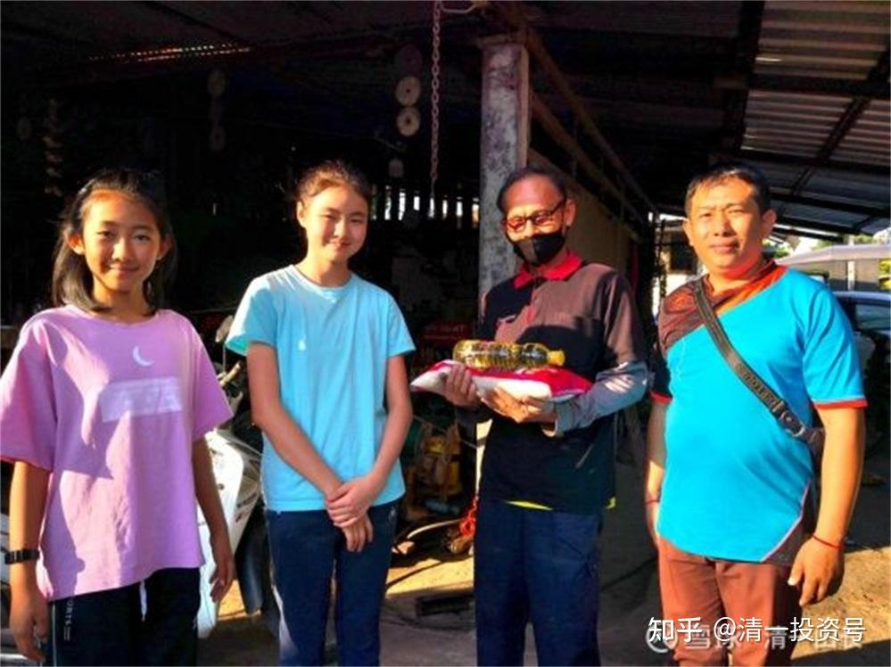

[原雪球专栏](https://zhuanlan.zhihu.com/p/584764784/edit)[199篇.把天使变成废材的“疯妈妈”！](http://link.zhihu.com/?target=https%3A//xueqiu.com/9310099567/197855655)

清一山长 2021年9月15日

今天的咨询案，把我笑坏了。按道理原来会把我气坏了，觉得这些爹妈真蠢，害起自己的孩子来毫不手软。现在我居然会笑，我觉得我能级提高了，慢慢做到了能“容天下难容之事，笑天下可笑之人”。

今天的咨询服务，是一对家长对自家的宝贝女儿不肯上学，才15岁就成天宅在家里不出房门。家长对此却毫无办法，双方僵持了很久，才想到要找我咨询解决问题。这女儿，最近一年多，都没好好上学，闷在家里自己的房间，啥地方都不去。也不见父母，不理睬父母；也不肯去上学，也不出外玩。其实她也找不到合适的学校上。正好原来的初中上完了，现在的高中考不进去，新教育也不肯来，自然就在家呆着了。

家长的咨询希望我帮助解决的8个问题之一，就是“亲子关系方面的，她现在视我们如敌人，不和我们沟通交流，每天把自己关在房间里。我每次想好了找她沟通的，但一面对她就怕，感觉自己的大脑里就是一片空白，原本想好要说的话，结果说不出来了，而且说出来的话，达不到沟通的效果，感觉自己就像奴隶，也不知道为什么。”。

为啥出现这种宝贝？因为这一家父母，从小把孩子顶在头上，当皇子来养的。家长以为自己跪在地上，伺候好孩子，将来孩子长大了，就自动成为人上人了。自己也就升级了，将来就可以由“太监”直接升档为“太上皇”了。

恐怕，现在的很多家长，都是这样做的。让自己当奴才，当“李莲英”，以为家里就能养出一个“太后”来了。家长现在果然如愿以偿，您看上面家长反馈的架势，就是孩子虽然没有“太后”的命，但已经有了“太后”的脾气了。这场景，不就是“家奴李莲英前来叩首汇报：太后不知道咋的，不理奴才了，奴才实在不知道哪里做错了，小的特来叩请丞相，现在小太后正在生气，她谁的话都不听，不见，不理。目前唯一就剩您大人了，小太后还愿意听您的。请您移步出山，帮忙劝解，让太后息怒。救奴才于水火中。现在，小太后看到我就冒火，把我当敌人一样，恨不得把我砍了。我不知太后为何如此恨我。小的一直尽心尽力的服侍太后，向来不敢怠慢。不知太后为啥生奴才的气。但我面对太后，啥也不敢辩解，实在是不敢再去冒犯太后的雌威了，求您大人解救说情”。哈哈，就是这种故事，您现在笑不笑？我笑死了！

这一家的父母，大约经济条件还可以，就**从小把女儿当猪养**（不对，说错了，**是当“太后”养的**）**，基本的生存能力都丧失了。**从小到大，啥事都不用干，啥心都不用操。这些琐事，家长全都代理了。家长唯一的目标、愿望，就是简单地希望她“一心只读圣贤书”，结果却越来越失败。现在不但啥事都不会干，甚至连书都不愿意读了，也读不进去。15岁就宅在家开始“养老”了。俩老人天天还得看她的脸色，觉得孩子脾气怪异，惹都惹不起。一句话说得不对劲，就天下大乱。

还好，孩子还愿意跟我聊聊。我发现，这孩子，其实也没这么难搞的。也还比较真实，不装。我说她的缺点，也可以接受。

我问她有啥本事？她承认自己不喜欢学习，也不爱学习，学习也不好，也不喜欢运动，承认自己啥都不行，身体也不行，啥都不会干。

问她想要什么？自己也不知道想要啥，就是成天躲在屋里生闷气。

我说：是不是她在外面就没朋友？也没人尊重她？没人喜欢她？自己也不喜欢自己？承认是的。有点难过。

其实，**最根本的原因，是因为她没啥本事，不会读书，也不会做人，不会交朋友，甚至连玩都不会玩。属于典型的无能之人**。这种类型，往往都只剩下用脾气来呈现自己的存在。到了青春期，突然发现自己啥都不是，啥都不会，突然有了很强的空虚感、幻灭感，也很害怕去外面的世界，估计上学时期遭受了挫折。也对自己的无能充满了恨意，恨自己的无能，也恨自己找不到方向。家人这时候，往往就成为了她们的出气筒。因为**每个人来到世界上，都是为了来获得成就感的。**但**父母通过从小无微不至的照顾，已经剥夺了她的一切能力，也就剥夺了她的成就感，让她丧失了基本的生活能力**。这种生活，让她非常地讨厌自己的无能和无助，却有没有勇气走出来，她甚至连一个知心朋友都没有。怎么能不难过？

所以，孩子从小没有好好教育带来的问题，都将在青春期突然爆发出来。原来乖乖的孩子，只要发现自己无能、无力之后，都会出现类似的局面。**所谓的逆反，是很正常的，是对家长原来错误教育的报复。**

现在怎么办？读书，她不是读书的料；干活，也不是干活的料，身体还特差，脾气还特大；做人也不行，整一个废材，毫无出路，新教育，老教育，一条路都走不通。家长这一回，才开始着急了。

经过我一个小时的辅导，孩子愿意每天早上起来跑步了，每天五公里。我告诉她：别着急，跑不来，就每天走五公里也行。另外，也愿意跟随示范班去学习了。我说：“示范班里面的这些孩子，全都是学霸，你别着急，跟不上不要紧的。别人学一年的课程，你学两年，勉强跟上也可以了。”而且，她对父母也放下了怨恨的心理。最后我问她，需要我给她父母说什么，她最不喜欢父母的事情？我让父母改过？她居然说：其实父母对她也没做啥不好的事情，主要怪自己没做好，自己心情不好，不再继续跟父母对抗了。

由于这孩子，之前对父母是特别的排斥，连父母旁听咨询都不许的，所以父母也不知道我是咋引导的。但父母对这个最终的结果，还是感到很开心，也很惊讶，1小时就把孩子变过来了。接着，我也需要来解决父母的问题。我第一句话就问：

“你们家是不是很多钱？家里居然像是养皇帝女儿一样养女儿？”

他们特别不好意思，说其实也没多少钱，都是挣的辛苦钱，不是什么大富人家。我说：“溥仪皇帝小时候，就是家里一大堆人伺候着，连鞋带都不会系，牙膏也不会挤。但别人家有钱，全国都是他们家的，可以养一大堆奴仆来帮忙。”我问家长，准备请多少奴仆来伺候孩子，一直到老？家长更不好意思了。说从小都是自己伺候孩子的，的确像是奴仆一样伺候孩子，孩子很不尊重家长。我说：“谁会尊重一个奴仆呢？怪不得给你们脸色看，活该。你们养出了一个无能的‘慈禧太后’，还说不知道咋回事？”

我说，我家女儿，可是货真价实的富二代，比你们家女儿小两岁。可以说，生下来就含着金钥匙。我可以请十个仆人来伺候她，一年所费还不到我一年股票分红的5%，越花越有。可我在小女3岁多，就赶她去学堂过独立生活，还不许保姆特别照顾她。让她要学会洗自己的小衣服。四岁多，就要自己叠自己的被子，做各种事情；每天要翻1000个跟斗，对一个小小孩子来说，这是艰难的生活；她还要看小朋友的脸色，据她后来告诉我说，当时比她大的小朋友，有人就是要她帮洗衣服，因为她最小，大孩子会欺负她，她要学会自保。要学会“服务”别的小孩——虽然在我自家的今日学堂，她也享受不到特权。现在她长大了，才可以回到我身边生活和学习，每天听我上课。现在，她每天早上的第一件事情，就是起床来跑5公里。然后是读书、做事，院子里面的工人做的事情，很多她都要学会做。她们还铺了一条路。我住的**1000多平方的大宅子，孩子每周要跪在地上清扫一遍。**原来是请泰国工人来做的，现在小女和她的小伙伴“承包”了。

我问这对家长：“是不是我穷疯了，连自己的孩子都要剥削？我们这样正宗的亿万家产人家，孩子居然要像工人一样从小做事，从小劳动，锻炼身体，服务他人。您的孩子，贵重无比，却要像溥仪皇帝一样养起来？是不是你们家更高贵？家谱更尊贵？养皇帝吗？”

家长不好意思，说：“我们做错了，以为孩子只要读书就好！别的都不重要。”

我说，在我们家，孩子读书，是要自己抽时间来读。我不太管她读书成绩考试啥的。**只管她每天都要运动、锻炼，待人接物，不运动会挨骂的。**但她读书也不错，对家长很尊重，小朋友也很喜欢她。为啥？就是她很贴心，也很能干，甚至能够看出一些大人都没看出的事情。比如上次花园放石头地砖。大人带了几个孩子帮忙，就她看出来大人教她们放的地砖的方向是反的。这就是早期教育的好处：**积极、阳光，热爱学习，而且有眼光，有思考，不盲从。**她是几个小公主里面最有心眼，最不容易上当的小孩。虽然她年龄最小，就因为**她从小被别的小朋友欺负，学会了很多在父母贴身保护之下，学不会的东西**。她更大一些，我还会放她出去到更广阔的天地锻炼的。去穷游，去打工。不是为了钱，而是为了成为更优秀的人。至于读书，我相信将来她上大学的时候，用个四五年时候，拿到四个不同国家四所不同大学的毕业文凭，是轻而易举的。因为对她来说，从小做事她已经发现了，**读书是最简单、最轻松的事情**，而不是相反！

几个跟她一起在清迈学习的小女生，在我这里都要学干活，最近两个女生被派去工地跟工人一起干活了，还没工钱，就是学习做事。读书需要自己抓时间。我告诉小姑娘们：“**将来你们就是这些泰国工人的管理人员，你要会干活，你才能管他们。如果你不会，直接去管，他们只会骗你，瞧不起你，欺负你。你就啥事都干不成了。只有你会他们不会的东西，他们会的你也会，才能管得住这些工人，才不敢骗你。否则，你就像傻瓜一样，他们就只会糊弄你玩，不会尊重你的。所以，你们现在趁小时候赶快补课，不会干活，就要学会干活，将来你们会干活了，就可以不干了，可以去指挥工人干。但18岁之前，跟我老老实实地学干活。起码知道工人是怎样干活的，好工人跟不好的工人怎样区别。会选人，会用人。**”

昨天，我还买了两箱酒，27瓶中国酒，让她们带到工地去，跟工人拉拉关系。告诉她们：工人是讲感情的，你是主人，但也要有人情，要关心他们。他们才会开开心心的干活。人不是机器，工人有问题，该教训的时候要教训，要奖励的时候就要奖励，这才是优秀的管理者。这几个孩子的年龄，正好就是这个夫妻孩子的年龄。

这就是最正常的教育**：如果你要让人有出息，就必须让人学会做事。不仅仅要学会做事，还要学会读书，还要学会做人**。在我身边，**做人、做事第一位**，学习吗？不学也没事，只要把事情做好就行。不过。这些孩子，读书都是学霸！我根本就不操心她们学习的事情。

固然会做事的人，很多不会读书。但不能证明读书就比做事更重要、更难。实际上，读书人，很多是废物，连自己都养不活。我虽然很会读书，但干活连泰国的民工都不如。虽然我有武功，打人估计能打赢我的人不太多。但我砍树，真不如泰国的农民会砍。证明了会读书没啥了不起，会做事才不容易。从小**我宠爱女儿的方式**，不是把她当小猪养起来，更不是当神供起来，啥事都不做。就**是尽量找事情给她干，找各种锻炼机会去磨练她**。才10岁就让她去泰国菜场帮摊主卖水果，去餐馆洗盘子，而且不要报酬。就是让她学会多做事，多帮助人，学会讨人喜欢，但越是这样要求，她越喜欢读书，她现在最喜欢的还是读书，上我的高中课程（估计她是年龄最小的上我高中课程的人了）。她觉得读书最轻松、最快乐。这也是我大学毕业之后，去工厂工作发现的事情：如果世界上居然你只需要读书，就有人给你发工资，实在是太幸福了。所以我后来非要考上研究生，然后留在大学教书了。不为啥——就为了偷懒。

这个秘诀，现在高中部的学生暑假去海底捞工作，也发现了。他们甚至奇怪，跟干活相比，原来**只读书怎么可能会累？结论就是坐久了累的。所以——要运动！**

现在的家长，就是在家里像奴仆一样伺候儿女，天天吃喝玩乐地捧着，然后指望儿女成为顶尖人才，还成绩优秀，考上名校，似乎就是人上人了。可惜，最终的结果，往往就是上面例子中的孩子，一事无成的废材，啥事情都不会做，书也不会读，人也不会做，连一个朋友都没有，真可怜！这都是家长从小“倾情奉献”出来的废材。这种人去到社会上，中层、上层不行，连下层都当不了，分分钟被人整死了，只好“在家养老”了，你既然从小当皇帝老儿养起来，家长们心想事成了，您就接着养一辈子吧！这孩子算是很幸运的，15岁就来找我，还有改的机会。如果是20多岁，上大学上废了，恐怕连改的机会都没有了。

更搞笑的事情在后面：

我问家长有几个孩子？家长说三个，第一个大孩子上大三了，二女儿在今日高中，读天使班，明年毕业。现在这个是三女儿！

我笑说：二女儿如果不上天使班，恐怕跟你们的三女儿也差不多吧？老爸马上叫起来：不会的，如果二女儿没去天使班，留在家里就是大麻烦了。当年没去天使班之前，就已经让家人头痛死了，会比这三女儿更糟糕的。脾气特别大，如果当年(2019)没有天使班，而是留在家里，现在日子更没法过了。幸亏抓住了天使班的机会，现在已经改变很大，完全不一样了。我估计，二女儿是属于孙悟空型的，会大闹天宫；三女儿属于前苏联型的，善于冷战。都不好对付。

我说：“你们既然二女儿上了今日学堂，知道教育的原则是不一样的，干嘛不让三女儿跟着学？”家长尴尬，觉得孩子上学是孩子上学，似乎跟家长没啥关系，没想到跟随的问题。倒是有点期盼我再开新的天使班，就可以把小女儿也送来了，就省心了。

我说：“天使班就是要用我们的一个实际的示范，来告诉家长一个教育的道理：问题孩子，就算到了15岁，其实也是可以教育的，主要是家长的问题，家长要改变——如果孩子的翅膀被折断了，就是家长干的。只要好好学学新教育，就可以把断掉的翅膀接上来。”我让妈妈好好陪孩子上示范班的课程，一起跟学。别只会管生活，当奴仆。

后来我查了一下高中部女生班的成绩单，发现他们家二女儿排名还蛮高的，女生前10名，完全不比正规班的学生差。说明这两年这孩子的进步的确很大，脱胎换骨了。明年上大学，就开始走上自己正常的人生路了。她妹妹就难说了，没她这么好的机会。也许，这个姐姐，明年不去上海外大学，回家去带她妹妹，帮助妹妹转变，会是她对家庭最好的回报和贡献吧？这就是她们的家事了，我不多过问。

可惜，现在我已经停止招收天使班了。我只是做教学示范的，这一个班，示范完成，就不做了。别你们家长搞坏了，我成天围着家长来替你们收拾残局。**你们家长只管自己吃喝玩乐，不学习，不提升，有啥意思？我知道，现在家长对15岁问题孩子的教育需求很大，我已经示范了方法，你们自己跟着做去。不想跟？就看自己的女儿废掉吧！您都不在乎，我何必替你在乎呢？**家长再有钱，家里出个这样的活宝，我看你有钱也愁死了。看你们自己不学习，不进步的下场，都是自己找抽的。**天底下，很多最重要的东西，是你花钱买不来的**。特别是家长最看重的——**有钱买不来好孩子，你要有心才行！**

上面照片，小女和小伙伴一起，送大米和食用油给泰国的村民，学会做人，学会帮助他人！这才是公主派，不是躺着让人伺候的病公主！（图中的蓝衣服是村长，每周都来我家里一次，我让他来教公主们泰国的礼仪和文化习俗）。

一个笑话：我告诉小女，她是正宗的富二代。小女却并不开心，说：“我早就知道了！爸爸很有钱。”但这对她，一点好处都没有，还要担心别人会绑架她。

我说：“如果你不是富二代，怎么可能生活在这么大的房子和院子，以及游泳池里面？你哪有？”

她说：“我们可以生活在原来租住的泰国小区，这些东西全都有。游泳池更大（公共的小区游泳池），还不用担心园区的事情，少很多工作要做，不用自己去管理院子。”所以，有钱没钱，她认为她的生活都差不多，没啥特别的好处。除了有钱，可以用来帮助人以外（她经常看我用钱帮助人，包括现在清迈的几个小孩子，都是我全额资助，不收学费，还包吃包住的）。对她来说就是，**没钱就少帮几个人，有钱就多帮几个人。有钱没钱对她自己都没啥区别的。**

倒也是，**我家的钱，我们使用的很少，都是公共用途。将来也不会有遗产留给她，都捐给新教育基金会去。所以——她的确没有富二代的感觉，只有富二代的负担！**

（以下内容为编者收录）

**评论回复：**

芙瑜回复清一山长：

说得太对了。可惜看到的太晚。我并不主张溺爱孩子，可周围的同事朋友都是这样，不溺爱孩子显得我这个妈妈不称职。现在孩子已经长大，一点苦都不愿吃。

清一山长2021-09-15 17:49回复@芙瑜：

原来，您就是为了让周围人满意，让别人顺眼，就去胡乱害自己的孩子，最终再让自己来埋单，承担不良的后果。你也把我笑坏了[大笑][大笑]我从小管教女儿，小孩如果哭闹，就丢到屋外去站着，等不哭了，才能进屋。连老人都看不贯，差点怀疑我是后爹[大笑]。但我培养了一个坚强的，善于自处的孩子，你们谁能逗哭她、气哭她、骂哭她，我给你发奖金[俏皮]，打哭的不算。你敢打哭她，我就打你[俏皮]，现在别人才13岁，还经不起打。等她18岁，再来打，看谁能打哭谁？

剑寻回复[@清一山长](http://link.zhihu.com/?target=http%3A//xueqiu.com/n/%25E6%25B8%2585%25E4%25B8%2580%25E5%25B1%25B1%25E9%2595%25BF)：

现在这样的孩子很多，主要是独生子女叠加经济腾飞的问题，其实教育最简单的办法就是引入竞争，多生几个孩子就好了。60后的父母没几个懂教育的，但这样的孩子基本见不到。

清一山长[2021-09-15 21:18](http://link.zhihu.com/?target=https%3A//xueqiu.com/9310099567/197879198)回复[剑寻](http://link.zhihu.com/?target=http%3A//xueqiu.com/n/%25E5%2589%2591%25E5%25AF%25BB)：

我的案主是三个孩子的妈妈！您的发言以及自证其伪。其实，主要是钱多了，烧包烧的。**靠运气赚的钱，靠实力输回去。土豪发财，其实缺乏真正的富人思考，而且这些经营者思维模式，不能传递给下一代。**

龙心Larry回复[清一山长](http://link.zhihu.com/?target=http%3A//xueqiu.com/n/%25E6%25B8%2585%25E4%25B8%2580%25E5%25B1%25B1%25E9%2595%25BF)：

在如今的社会里，你把自己定位成后爹后妈让孩子多做事、多吃苦反而成了异类，甚至经常有人会对你的教育指手画脚，横加干涉，碍于情面也不好意思去跟这样的人硬刚，我自己知道我在做什么就行了，我的孩子我负责。由此也可以看到如今的社会把孩子当“太后”养是主流，是常态，让孩子真正成人的教育方式反倒成了愚昧的做法！不过反过来思考一下，如果没有大多数这样的家长，我们的孩子哪有机会成为精英呢？刀子磨快了要有韭菜割才行啊！不然到处都是刀子割谁去啊？当然我们给孩子这样的教育还是为了能为这个世界培养出正向价值的人才，让我们这个世界更美好！正所谓能力越大，责任越大！相信我们新教育的孩子将来都会成为这个世界的Super hero的！

清一山长[2021-09-15 22:56](http://link.zhihu.com/?target=https%3A//xueqiu.com/9310099567/197890522)回复龙心Larry：

“甚至经常有人会对你的教育指手画脚，横加干涉，碍于情面也不好意思去跟这样的人硬刚”。

**这些人，其实很不懂得尊重的，也不愿意去理解他人。他们的主要目的，只是通过指责你与他不同的教育方式，来彰显自己的“正确”和“爱心”，其实他们根本就不关心自己的儿女前途和命运，只关心自己的表演和面子。最终儿女跟他们的关系都很糟糕。**就如同我文中的父母一样，女儿根本都不理他们。当然，一般是15岁以后。所以，孩子还小的时候，就让他们先享受一下自己的“爱意满满”的人生成功幻梦吧！

参考链接：

[【清一大学少年班】走进我们的日常生活](http://link.zhihu.com/?target=https%3A//www.bilibili.com/video/BV1Hr4y1K769)

[这就是今日学堂](http://link.zhihu.com/?target=https%3A//space.bilibili.com/487498588/channel/detail%3Fcid%3D149241)

[今日明师荟](http://link.zhihu.com/?target=https%3A//space.bilibili.com/487498588/channel/collectiondetail%3Fsid%3D55359)

[清一大学武医学院](https://www.zhihu.com/people/mkaga)

[清一投资号：86篇.知识权力时代，教育战决定胜负!](https://zhuanlan.zhihu.com/p/566819841)

[清一投资号：46篇.新教育送给中国人的礼物——中国公主](https://zhuanlan.zhihu.com/p/553173076)

[清一投资号：47篇.如何用三年学完十二年的课程？](https://zhuanlan.zhihu.com/p/547313287)

[清一投资号：56篇.创造历史的清一大学：首届学生集体合影](https://zhuanlan.zhihu.com/p/551968023)

[清一投资号：65篇.在泰国过春节：请300个大学生吃饭](https://zhuanlan.zhihu.com/p/554009396)

[清一投资号：66篇.如何鉴别优质教育](https://zhuanlan.zhihu.com/p/560659119)

[清一投资号：136篇.转美国教育的⼋宗罪！中国学校会不会更甚之？](https://zhuanlan.zhihu.com/p/581920937)

[清一投资号：143篇.建立中国人自己的平台，才能真正获得尊重和地位](https://zhuanlan.zhihu.com/p/584741008)

[清一投资号：144篇.教育投资也需要算账：别血本无归！](https://zhuanlan.zhihu.com/p/584742375)

[清一投资号：145篇.“海底捞打工仔”用一周备考雅思，拿到两项满分！](https://zhuanlan.zhihu.com/p/584941229)

[清一投资号：147篇.北京年轻打工仔，一周备考拿到雅思单项满分](https://zhuanlan.zhihu.com/p/584960177)
