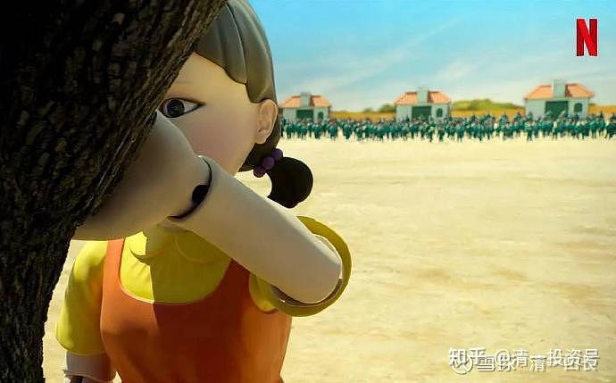

[原雪球专栏](https://zhuanlan.zhihu.com/p/594100189/edit)[226篇.《鱿鱼游戏》也可以成为《心理行为课》的教材](http://link.zhihu.com/?target=https%3A//xueqiu.com/9310099567/201957424)

清一山长 2021年11月3日

本期的心理行为课，花了两天的时间，来让学员学习观看《鱿鱼游戏》。我相信：这是这批学员这一生记忆最深刻的课程。而且是一次性的，下一期就没有了。上一期也没有，上一期，是两部电影，中外电影的对比。居然会有学员傻乎乎地跑来我这里看电视剧当上课？就是有的。因为**这种上课法，就是“借假修真”。**

学员日记总结：“今天山长用读心术的6个心智模式帮同学们分析《鱿鱼游戏》里部分角色的心智模式和我们的作业对照，简直惨不忍睹，难怪山长取笑、挖苦、棒喝我们，因为我们的作业反映了我们真实的状态，明明是在以假修真，却仍然陷入原来的模式不能自拔，很惭愧我的作业都没有做完。”

到底上了什么内容呢？因为太重要了，不便剧透。其实我也没办法几句话就写出来。昨天，我对各种版本的“张德秀”的解析，把学员惊掉了下巴，几乎都要气哭了。今天，我解析杀掉的人，以及要选择的人的作业，又把大家笑死了。

不过，你们想学习的话，还是有机会的。我把作业题目发上来，供你们参考。让你们知道我的心理行为课程到底在上什么。如果你们能够把作业完成得好，也不用来我这里上课了。钱多人傻你才来呢！

**第九讲：用读心术借假修真，从热播剧观察人性和社会**

**《鱿鱼游戏》的热播，其实是《鱿鱼游戏》这个电视剧，打动了很多人的内心，可惜很多人动了两天心，又继续陷入原来的惯性，怎么都唤不醒。人类其实一直在玩真实版本的“鱿鱼游戏”，甚至比剧中的“鱿鱼游戏”更残酷、更无情。比如古代罗马的角斗士，就是专门用鲜活的生命，给达官贵人、市民们观赏和游乐的，人性之残酷可见一斑。非常典型的故事，久经江湖的剧中主角之一，吴一男死前说的话，他说，富人和穷人，其实都是完全一样的，生活都是极度的无聊、无趣。还不如童年的时候，虽然没钱，但可以从游戏中，找到更多的快乐。长大了，只有不富也不穷的人，还在拼命赚钱中，不会觉得人生无趣、无聊。但人们为了赚钱，也变得极其的冷漠，人性都丧失了。他问男主，你还相信人性吗？就是说：人性的确有极为残忍的一面。对地球上的生物来说，人类就是它们的恶魔。其实我们人类，往往也是自己的恶魔，自相残杀起来，比动物之间的杀戮，比非洲草原上的杀戮更可怕。**

**观赏《鱿鱼游戏》，是为了摆脱“鱿鱼游戏”。如果我们不能摆脱“鱿鱼游戏”，就是我们不够理性，不够为自己负责。**

**所以，请大家好好观赏，好好的体会！**

**从《鱿鱼游戏》中，观众“最喜欢的十大人物”，以及“观众最不喜欢的十大人物”的对照，来解析大众的思维方式和信念系统，判断出人性的弱点，人性的黑暗和光辉。解析我们身边的社会性陷阱和人际交往中的注意事项！为了聚焦，可以强烈地对比几乎完全相反的人物出来，成对地进行比较式写作。**

**我们可以专门挑选一些非常有对比性的角度和人物，来解析本戏剧，并不要面面俱到，就可以观察到这个社会的真相和本质。警醒我们的人生！**

**（说明：以下作业，可以不写完。根据你的能力来认真写好一部分即可。）**

**最喜欢的十大人物榜单：**

[《鱿鱼游戏》最受欢迎角色出炉：姜晓位列三甲，李政宰竟不是冠军](http://link.zhihu.com/?target=https%3A//new.qq.com/omn/20211010/20211010A02TJ500.html)

腾讯网页链接：

[https://new.qq.com/omn/20211010/20211010A02TJ500.html](http://link.zhihu.com/?target=https%3A//new.qq.com/omn/20211010/20211010A02TJ500.html)

[概率比较：大多数讨厌的鱿鱼游戏人物](http://link.zhihu.com/?target=https%3A//www.bilibili.com/video/BV1hr4y127jZ)

哔哩哔哩网页链接：

[https://www.bilibili.com/video/BV1hr4y127jZ](http://link.zhihu.com/?target=https%3A//www.bilibili.com/video/BV1hr4y127jZ)

“概率比较：大多数讨厌的鱿鱼游戏人物”**是按照观众讨厌度从低到高排列的**

**作业1：当代社会的强者生存模式解读——从学霸“曹尚佑”和黑帮老大“张德秀”，以及老板“吴一男”，以及管理人“黄仁昊”的行为表现，研究社会的强者生存方式和特点。以及你认为该如何才能适应这样的世界？**

**作业2：当代社会的小人物求生模式的对照：“姜晓”和“阿里”的不同行为模式，反应出来他们的信念系统的区别，以及社会适应性如何？**

**作业3：通过剧中“韩美女”与“姜晓”的比较，你是否发现了：在男权社会中，女性的生存模式，以及生存效果的研究？**

**作业4：男一号“成奇勋”和剧中一号人物老人“吴一男”，分别代表社会上什么样的人的生存模式？请认真解析他们的心智模型。**

**作业5：你能否从信念系统分析中，找到“吴一男”和“曹尚佑”的信念系统异同之处？**

**作业6：你认为：“成奇勋”和“曹尚佑”有何共同点和不同点？他们的命运交汇，说明了什么样的社会问题存在？这一对从小一起长大的朋友，信念有啥区别？**

**作业7：警察的哥哥是被大家列为最讨厌的人物第一名。你认为：他和警察有啥异同之处？你怎么评价这一对兄弟？他是否就是一个六亲不认的混蛋？**

**作业8：“成奇勋”和“姜晓”，他们都排在最被讨厌的人物最末位两个。而在最被喜欢的榜单上，他们排名也靠在一起。你认为他们两人“被人喜欢，被人讨厌”的原因，很可能是因为啥？他们两人有何异同点？这反映出我们的社会集体意识，有啥特征？**

**作业9：最被观众粉丝仇恨的前三名，都得到了超过了97%的仇恨率，倒序分别是经理人，贵宾以及“曹尚佑”。爱与恨，特别能够代表“灵魂的感受”，你认为这三个人被仇恨的原因是什么？**

**作业10：如果把观众最喜欢的三个人，与观众最恨的三个人，放在一起做一个对比的话，你能得出什么样的结论？发现什么样的奇妙结果？这代表了我们社会的集体意识（集体信念）和核心价值观是什么？这会导致什么样的社会结果？【提示：设想你愿意去做你最喜欢的这些人吗？还是更愿意去做你不喜欢的这几个人？从中你可以发现：你的人格分裂情况有多深？】**

**作业11：如果你有权力，可以从《鱿鱼游戏》里面的人物中，选出三个人来直接杀掉，再选出三个人来和你成为合作伙伴。其他人，可以继续玩他们的“鱿鱼游戏”。你会选哪三个人杀掉？会选哪三个人来做你的伙伴？**

**观众十大喜欢人物：**

**1、阿里**

**2、成奇勋**

**3、姜晓**

**4、智英**

**5、黄俊昊**

**6、韩美女**

**7、曹尚佑**

**8、黄仁昊**

**9、张德秀**

**10、吴一男**

**观众讨厌人物排名**

**成奇勋0.5%**

**姜晓0.6%**

**阿里0.8%**

**成奇勋女儿0.9%**

**智英0.9%**

**尚佑妈妈1%**

**小智1.1%**

**黄警官1.2%**

**一血黄毛1.2%**

**成奇勋妈妈1.3%**

**游戏中的那对夫妻1.5%**

**在糖游戏中摘面具被杀的警卫2%**

**成奇勋朋友3%**

**帮成奇勋染发的发廊老板娘5%**

**警官1（打出“鱿鱼游戏”电话的那位）8%**

**警官28%**

**孔刘10%**

**银行老板13%**

**医生15%**

**木偶娃娃20%**

**成奇勋前妻25%**

**警卫们35%**

**成奇勋前妻现夫39%**

**韩美女40%**

**解刨手术摘面具的三角形43%**

**德秀小弟45%**

**弹珠游戏德秀的同伴55%**

**吴一男65%**

**阿里老板70%**

**德秀的长发小弟70%**

**向成奇勋要债老板75%**

**张德秀85%**

**曹尚佑97%**

**贵宾们98%**

**黄仁昊99%**

**最终总括式论文作业：为什么男一号，会得到观众非常广泛的认同和喜欢？并获得了排名第二的地位？为什么阿里会成为剧中“观众最喜欢的人物第一名”？这代表我们这个社会的“集体性思维和信念系统”是什么？这将导致什么样的社会后果？对我们融入社会生活有啥重要的启发？警示？**

**每一题，均需要使用我们的读心术——六个心智模型的解读分析模式，来写出一份具有足够分量的分析。（如果时间不够，你们可以写得马虎一些，勉强完成作业即可）。**

**第六层：呈现（你看到的这个人的结果是什么？）**

**第五层：行动（这个结果，是他做了什么样的行动导致的？）**

**第四层：知识与能力系统（他认为他知道些什么？）**

**第三层：身份角色定位（他自己认为他是谁？）**

**第二层：信念方法路径系统（他相信什么才是正确的？）**

**第一层：愿景人生目标系统（他想要什么？——人生系统设计）**

