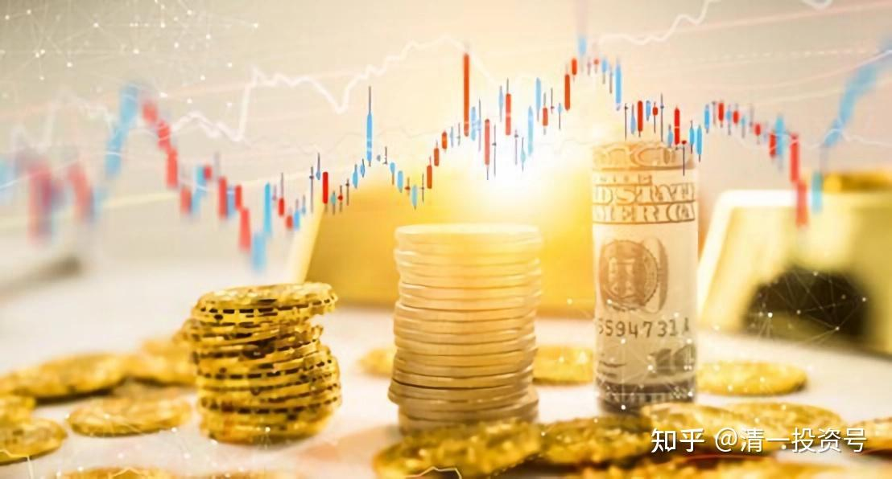

29篇.[《人生十二讲》](https://zhuanlan.zhihu.com/p/608151379)自由讲投资：（3）张氏投资法：看大势的“基础研究”加“心理分析”

清一山长 2007年9月30日

各位，前面已经告诉大家一些投资的基本概念，但现在我觉得大家应该还有问题，有什么疑问？

**一：对中国股市预判和案例分析**

学生：我们都知道，一个经济体从实体经济向虚拟经济转化的过程中，会产生虚拟泡沫。美国这样，日本也这样。我好奇的是，你怎么在2003年的时候，判断中国会有这样一次机会呢？因为在2003年的时候所有人都不会看好股市，2004年甚至有人说股市不会高于2000点。

张老师：2004年的确没到2000点，到了1780点就转头了。

1. 这个情况就跟你的功力有关了。1998年以来，国家的经济迅速地上升，一年比一年强。但中国的股市是不断走熊，越走越差。炒股的人都特别不好意思，都损失惨重。我很幸运，没受太多损失，而且在糟糕的时候买的品种，让我避过了灾难。
比如说我在2003年的时候买的是武钢。你们炒股就知道，武钢让我成了唯一在那一年还赚了71%的人，我也成了我们证券营业部中，几乎是唯一赚钱的人，他们都觉得我像神话似的。**但是我买它，是因为它太安全了，买它吃不了亏。**那么，为什么一个强大的国家必须要有一个强大的金融体系？中国这个金融体系已经出了问题，国家又在想办法解决。比如说金融体系必须是对国家、人民和炒股机构都有利。但是现在对国家没利，金融体系已经瘫痪，已经没办法实现融资功能。

2. 股民都一塌糊涂，券商、机构、那些大户也是一塌糊涂。一个市场都不行就意味着什么呢？**意味着拐点即将到来，而且中国未来的强大一定会有这一波。**这一波是什么时候？我觉得从2004年开始，结果从2005年末开始，还是有问题。但有问题总比错好，总比2007年才发现问题好。

**二：张氏投资法：看大势的“基础研究”加“心理分析”**

有这个眼光其实不难，如果是我坐在下面，听完上面讲课，你知道我想什么？

学生：我也能。

张老师：对，每个人都可以说：我也能做到。

但你们没有钱，也缺乏这些知识，因此现在要做的是另外一件事情，你们不想知道吗？

有人给我提这个建议，而且我也希望将来中国有一批人，在金融上面能够跟国外抗衡，这是我们唯一可以和国外进行抗衡的地方。就像巴菲特，我要去跟他进行实力上的竞争，我一辈子都不是他的对手。但是我去跟他进行别的竞争，还是有机会的。

比如，我刚才说的那个“股神”林园，在今年上半年，做了一支基金，他的基金成长率大概是58%。今年以来，半年多，我的成长率是400%以上。在这个意义上说，我觉得我不比“股神”差，这是从绝对数字上来说。

这意味着什么呢？我们有机会去和那些很高的人，包括巴菲特，在同一个领域里面进行同台的博弈。在资金量上，我比不赢你，但是在倍率上，我可以比赢你，而且在投资上，我会更加灵活。

因为在这方面，我的大脑可以得到最充分的使用，而在别的方面，我根本不行，别的方面需要一个大的机构来做。比如说我现在去做一家房地产，根本没办法，但是我会去投资，在投资上取得最好的回报，取得回报后就退出来，因此我的收益绝对要比武汉钢铁高得多。就比例而言，他们不可能有这样的比例，这是我们唯一可以和世界级对手竞争的场地。

所以我希望未来有这样的人，但中国忽略了这一点，中国人对金融的理解，很少是像我今天讲的。

**今天我没给你讲什么K线图，没讲什么KDJ技术指标，为什么不讲？这些东西都是小儿科、小菜，我们不需要搞这样的东西。我们需要搞什么？看大势！要掌握一个真正的动态！**

**这个时候你要研究一些行业，研究最基本的东西，同时还要掌握心理学。我的派别是一种很奇怪的派别，叫“基础研究”再加“心理学”。**

比如我刚刚说的，国家、股民、炒股机构三方面的人都输，从心理上来说，谁都不愿意承认，国家一定会想办法来改变，这就是心理学，跟基本面没关系。这里面的心理分析，是非常重要的。

这是我的一派，我不搞技术，技术我不是不懂，我还有一种能力，这种能力大家学会了就可以炒股了。

看到股市在动，我看得出它有性格、有个性，知道它在说什么话。如果不知道它在说什么，我不动它、不理它；我看懂了它在说什么，我才会介入。

你达不到这样的水平，只知道它是价格上上下下的这些东西，那就不对，就太水了，你千万不要动。想达到这个水平，你就慢慢去研究吧！这就是两个结合的结果，这两个结合之后，你就会很稳定地获得挺好的收益。

这种研究就叫战略研究。这种战略研究在中国很多人不注意，包括你们看到一些电视上推荐这个、推荐那个的，很多东西都是屁话，骗人的、忽悠人的，而且那些人成不了大器，不可能成就。

**大投资家要用这种“基本面”加“心理分析”，而且对个人来讲，还要加个人修炼等一系列的本事，慢慢地五到十年以上的磨练才能成功。**很难，为什么很难？说出个道理来，为什么这个领域很难？

**三：金融投资的巨大陷阱**

金融投资不是一般的投资。今天两个投资都讲了，但是我**现在特别强调金融投资很难，一定是绝大多数人都失败的行业。请注意，这个行业是绝大多数人失败！**为什么？

因为金融投资风险大。

比如我可以做到，一个人赚的利润比一家几百人公司赚的利润都多的局面。但是我做了什么？我游山玩水，然后在键盘上滴滴答答地打。

就说上一次在六月底，低谷的时候，我全仓买进几个我看中的股票，然后我旅游去了。我玩了两个月，根本看都不看，回来就看见我账户上增加了一倍，很舒服的。

好了，你看我做了什么？我对社会好像没做什么贡献，而且这任务太轻松了，我就按按键盘，输进去，然后别的时间不管。在座的告诉我，谁不会做这种事情？按按键盘，输进几个数字，就把这事做完了，体力劳动就那么一点点，耗费的工时可以算出来，然后再跑去玩。玩的时候我看都不看，我到云南的大山里面去，连信号都没有。虽然带着笔记本电脑可以无线上网，但我很少看它，看了也没用。容不容易啊？不容易啊！

经济学上，有一个基本的原理，就是说**每一种获得都不是凭空的，都一定有它的道理**。如果一件事情看上去太容易了，一个老太太都会，有些老太太退休了，坐在那里傻傻地看着炒股，千万别以为这是一个低技术含量的事情。恰好证明：如果一个老太太没多少学问，都能去炒股，绝对不是说这个市场挣钱简单，反而是我们要有高度的警惕，这里面肯定有陷阱。

**一件事情看上去太容易了，就一定有很大的陷阱**。比如到目前为止，大家看我觉得好舒服啊、好轻松啊！你甚至也想去。注意了，这里面一定有陷阱，陷阱是什么呢？**这个陷阱是——这件事一定是绝大多数人都做不了的，一定是！所以这样的局面，你就要想一下你能不能做，能不能成为其中少数的幸运儿？难办，绝对是这样的，因为太简单了。有人说投资很简单，我就不承认。不可能的，世界上没有这么容易的、大家都可以做的事。**

**四：如何培养成功投资者的素质**

我认为金融投资难就难在：

**第一，对人性的弱点要有一个认知。**

比如说，我们都不喜欢学习，对新东西我们无法去研究，大多数人都喜欢接受现成的答案。这些结论保留在你身上，就一定是导致你失败的因素。我们必须把这些全部都换掉，我们只有把自己的个性、品质换到只有极少人才有的地步，才可以参加这一行业，这是一个很简单的道理。所以必须在技术上、知识上、心态上都达到最佳状态。

但有些人会提出相反的例子，比如一个目不识丁的老妇人，买了几百股深发展的原始股，放在箱子里面十年，她忘了，后来翻出来一看，哇！价值一百万了。这种例子，我认为挺难，不可操作，起码是不可复制。

不可复制的东西，别人没法学，可以复制才有可能学。但是对于投资这一类大的东西，你只看上几眼，是很难懂的。像巴菲特，他做到什么地步了？他不是科班出身，很业余，很多经济学家看不起他。但是最后经济学家发现他能够挑出的股票（公司）都是最有前途的，而且是最有价值的，世界上再没有一个人能做得到，他是唯——个能做到如此成功地步的人。

所以短期之内，做得比他风光的人，大部分都失败了，包括索罗斯。他短期之内，在上世纪九十年代，1997年、1998年的时候，厉害得不得了，别人都觉得他比巴菲特厉害，但是现在回头一看，还是巴菲特最厉害。这里面就有很多经济管理的（GMAT）研究，所以如果你要做投资，你必须要成为一个很少数的人，这是第一个。

**第二，你必须有一种不断地挖掘自己身上缺陷，并加以改进的习惯。**

这对于每一个人来说都是痛苦的，每天看镜子里面的这个人，就觉得不舒服，发现有什么毛病，马上改掉。必须有这种习惯，习惯性地找自己的茬，习惯跟自己过不去，你才能做这一行。

如果你是习惯性的比较自恋，那也有一个很好、很赚钱的行当可以去做，那就是做明星去。但是做投资不行，做投资的都不自恋，没办法自恋。我说：我多漂亮，像芙蓉姐姐一样。这样有用吗？

你们有了做投资的概念后，能做什么？如果你们有投资的概念、想法，我建议大家去参加武汉大学天健学社准备组织的一个投资俱乐部，可以参加这个俱乐部的活动，去研究学习。我希望大家将来都成为很厉害的人，成为巴菲特第二、索罗斯第二。

我给你们做垫脚的石头，挺好的。但这个活动不要把它当课来听，每个人都在那发呆。在这个投资俱乐部就像在火车上，我来给大家作引导工作，不是老师。**股市上没有专家的，金融上没有专家，只有赢家和输家。投资只有两种可能：要不赚了，要不就赔了，没有更多的可能。**

所以不要抱这种态度，不要像今天大家只是来听，光听没用，而应该参与，不断地发问，不断地提出自己的疑问，自己提出疑问才能成长。

我无非是比你先走几年，多走这几年，**我有自己的经验，可以告诉你：我是怎么想的。但是我怎么想的，你也不要去做我，你可以去思考：我为什么这样想。然后看看别人为什么这样想，你能成就出来，那就肯定很厉害。如果你只是听我的，那没用的。**

**参考链接：**

[25篇.《人生十二讲》自由讲投资：（1）复利的魅力](https://zhuanlan.zhihu.com/p/606914565)

[27篇.《人生十二讲》自由讲投资：（2）金融投资和实业投资的差别](https://zhuanlan.zhihu.com/p/608151379)

[30篇.](https://zhuanlan.zhihu.com/p/612686722)[《人生十二讲》](https://zhuanlan.zhihu.com/p/608151379)[自由讲投资：（4）自我投资和人生目标](https://zhuanlan.zhihu.com/p/612686722)

[32篇.《人生十二讲》自由讲投资：（5）学生自由提问](https://zhuanlan.zhihu.com/p/613765261)

[34篇.《人生十二讲》自由讲投资：（6）投资杂问（完结）](https://zhuanlan.zhihu.com/p/615302216)

