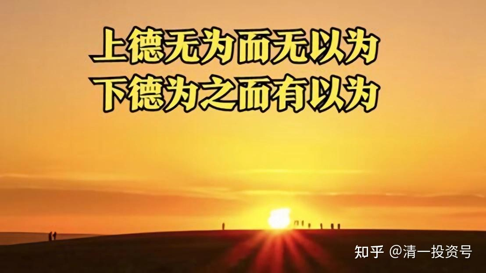

49篇.今日网校课程：查理•芒格的成功秘诀6——上德不德

清一山长2018年

**一、看透生活本质——大道至简**

你不让我去做点事情，让我在那儿一天到晚跟别人说闲话、去消费，让我去打高尔夫，我会觉得这些东西是干什么的呀？我跟他们去逛过高尔夫，练了几个小时。**因为我想去研究他们的生活到底是怎么回事,我跟着他们去逛过——高尔夫,完了，那几个小时。然后，我觉得浪费时间，毫无意义。我说我还不如在这儿打打太极拳呢！又节省功夫、精力，又节省时间。**

然后他说，哇！山长你好至上，你好简、好朴——人生简朴，道德至上。给我颁一个道德楷模的奖章。我会怎么做？我把它丢掉——什么垃圾、什么乱七八糟的。我觉得我是在过我舒适的生活，我还觉得我蛮自私的呢！我在过我想要的生活，对不对？

刚刚我讲的东西，我也讲了《道德经》了，这就叫“**上德不德**”。**最有道德的人，根本没觉得自己是有德，他觉得是自然——我就应该这样生活。**我干嘛要找一大堆小蜜？我干嘛要一天到晚吃喝玩乐？神经病。我干嘛要去买个好车？我干嘛要为自己买一个大豪宅？

比如我看别人的大豪宅，我看着都累！

**（学生1），昨天你看到的恒大的豪宅，如果是你一家三口住在里面，你有什么感觉？那么，你看的第一个地方，那四层楼，全部是一家人住，你会有什么感觉？就是我们那一套，前面那四层全是一家人住，你有什么感觉？

一套房你就觉得大极了，是吧？你在里面跑，我看你就会觉得像迷宫似的，怎么这有个房间、那有个房间。一套房子里面有五六个卫生间，每一个房间里面都有一个卫生间，是吧？到处看都是卫生间。甚至在那么近的距离内，这边有一个，那边有一个。中间隔了三米，因为它属于不同的房间。是不是很搞笑？但是很多人喜欢。

然后**（学生1）在那儿使劲问我，为什么这个房子里面有那么多卫生间？我说估计他们认为这里面的房主人都有前列腺炎，要就近随时找到厕所。会不会是这样？这一套房子里面有那么多卫生间！

好了，现在回过头来说，真的有我们前面的四层楼合起来那么大的房子，但是不是一层一层的，每一层都是三四百平方，然后四层楼在一起，一整套，属于一家人的，真的有，得有一千多平方一家人，而且是国内，国外更多。你知道这件事情让我想到了什么？我想打扫卫生我都累死了。你们会不会这样想？

我再告诉你们一件更搞笑的事情。有一个人，一家人，他的房子差不多是一万个平方，最顶上的那一套是他自己的，差不多有一千平方左右，下面的都是他的员工、他的佣人、他的厨师，他的这个，他的那个，有好几百人——家里面的仆人。我看了之后，你知道我在想什么？我说他负担好重啊！他一家人要养那么多人，要给这么多人发工资。

而且**我觉得他都好可怜啊！你要什么？你不就要一个床睡觉？要一个小房间得啦！你要那么一个大大的房间，养那么多的仆人——有专门的厨师团队，有专门的这个那个团队，娱乐团队什么的，一大堆人。几百个人围着他转，他的房间到处都是游泳池——国外的一个富豪。我看了我说，天哪！这样的东西真的太累了。**

这个时候我们观察这些人，是不是有时候他们不明白生活的本质是什么？像**芒格他懂得生活的本质是什么，就是很朴素的东西，最基本的东西——我们要的真是这些东西。你要吃，像你们知道，吃点稀饭，吃点最简单的东西，你就很满足了，是不是？生活可以过得很好。你硬要这么多东西干嘛呀？**

**（学生1），我跟你说，你认为这种事情绝对没可能，真的有。

还有一些，比如昨天有一个大老板，他的房子更搞笑。他的房子两层楼，有电梯。上面有电梯，下面是地下室，地下室也有个电梯。所以他的楼只干两件事情，往上走一层，往下走一层，也要配个电梯。你要问我为什么这些豪宅的楼都应该有电梯呢？我终于想了一个理由，原来这些富豪们都是半身不遂者，所以他们上下楼梯很不方便，所以要个电梯摇进去，上去，“咚”再摇出来。我的理由怎么样？我说至于吗？往上面一层，往下面一层，都要搞电梯！

所以，**当我们只要一个小小的房间的时候，其实就是我们了解生活的本质。因为我们本来就只需要最朴素的东西。当你穿着的是简单的衣服、保暖的衣服、合适的衣服的时候，你是懂得生活的本质的。**

**二、上德不德，下德不失德**

当你去穿，比如说世界上最贵的衣服，是一亿元的衣服。我不知道你们喜不喜欢穿，谁想穿一下？真的不想吗？不要钱给你穿，静慧，你穿不穿？为什么？不能干别的事情，反正就让你穿一下，你穿不穿？穿一天，别那么低调嘛！穿一天好不好？**（学生1）穿吗？她的理由不对，她的理由是说不好意思，总觉得是个陷阱。

学生1：一亿元不能拿来干别的？

张老师：对，只能拿来穿，所以不要东想西想。你想不想穿穿试试？

学生1：穿着舒服吗？

张老师：嗯，**（学生1）比你强哦！她在关注这个衣服的本质是什么，就是衣服的本质要穿得舒服。还有第二个本质是什么？要保暖，对吧？

那我就告诉你那个衣服是怎么做的。那个衣服是金线穿着钻石、宝石、珍珠，然后反正到处是洞。挂在身上叮叮当当的，又重，但是又亮晶晶的，又硌人，又冰凉。好吧！这就是一亿元的衣服，我见过。它贵就是因为它全是一堆珍珠、宝石和金线。

你想想，你穿着这一身矿物组成的衣服在身上，特别是它比较长，你一屁股坐地上，屁股都被弄几个包起来了。你跟人打架，摔一跤在地上，哇，身上一大堆的伤口。那些钻石们都在你身上毫不客气地割出几个伤口来。就是这件衣服，没有一丝布料，而且它价值一亿元，你们有什么感觉？

天哪！告诉我这叫衣服吗？这叫受罪，对还是不对？而且这件衣服还重达几十斤。当然重了，全身上下，这么多的石头在上面挂着，又是那么多的金属在上面挂着。所以，你不穿的理由是因为这个东西，像**（学生1）问的那句话，它舒服吗？它保暖吗？而不是它穿着亮晶晶的吗？

它穿着当然亮晶晶的。穿着它出来全身金光闪闪，特别是灯光一照，哇！特别漂亮。所以，它就是让你穿着在灯光下面、舞台上走一走。下来的时候，连这个模特都要赶快把它脱下来——硌得好难受，又冰凉，又难受。你以为她回家还穿着它？你让她回家穿着它睡一觉，第二天起来，那可惨死了。

这不能叫衣服了，对不对？但人类就会搞这样的东西。为了什么？为了人的贪欲。

那么，这个时候一个有道德的人，比如**(学生1)，你拒绝去穿，然后他们说“哇！**(学生1)，你太有道德了，一亿元的衣服你都不穿，你真节俭，你真是老子的好徒弟”，你怎么说？

**(学生1)：只是穿着不舒服。

张老师：你不会觉得你那么有道德，你说，啊？我觉得我很正常，我只是觉得穿着挺硌人、挺冰凉、挺难受的，我还是穿我几十块钱的衣服舒服些。跟道德没关系，跟我的品质高尚更没关系，跟我拒绝泡沫这些美好品质都没关系。就是因为什么？因为我是一个正常的人。

所以，**对于真正卓越的人来说、对于真正至上的人来说，他心中根本没有“至上”这个概念。**

你要说山长你好至上啊！“我没觉得我很至上啊！我只是觉得你蛮堕落的。”这句话很伤人，是吧？你们经常会发现我说我觉得我只是正常而已，我只是普通而已，我觉得你不正常。我觉得这样想才是正常。

比如，吃东西吃的是什么？**吃东西就是让自己吃得舒服呗！吃得让自己身体好呗！**哪有吃东西是想让自己吃得难受的？你偏要吃到难受，我说你不正常，你有毛病。你喝酒，你喝白酒，咕噜咕噜灌下去，把自己灌得晕头晕脑，傻不拉几的，你还拼命要喝，还告诉我你不得不喝。我说谁逼你了，你不得不喝？见你的鬼！你们喝酒谁舒服？我想起码喝白酒舒服的一个都没有！但就是喜欢喝。所以我只是正常。

**记住：“上德不德”。内心深处，根本没有道德的观念。**所以，**内心深处还有道德的观念，你就不是“上德”，是“下德”。“下德”叫“不失德”，下德怎么叫“不失德”呢？我守得住它，我装得跟“上德”的人一样，但心中我很想要。**

比如说**(学生1)说我很想穿那件衣服，但是不好意思，我不要它。静慧，就是你，你不是从内心深处说我不要它，你说不好意思，穿出去多不好，会被别人笑话的，这是不是个陷阱。你用这些东西限制了你，所以，**你不够卓越跟你的心有关，你的心没有进入那种朴素自然的内境。**

**朴素自然就是我觉得这样才正常，至上就是我觉得这样才是正常的人生。**就像那些极客，你说你们好卓越呀！他只会觉得我们一点都不卓越，只不过是人类太堕落了，是你们太放纵自己了，你们太不愿意要求自己，你们其实也可以跟我一样。

有没有发现很多圣人说的是类似的话？真的至上，他忘记了他的至上；真的卓越，他忘记了自己的卓越。他觉得人应该这样活才正常，才理所当然。

你们出去当老师，如果你无法把这种东西教给你的孩子，把骨子里面的这种教给你的孩子，你永远也培养不出至上的学生来，你就无法再创造一个今日学堂。

如果你们离开今日学堂，你们只能做到中间，甚至做到别人满意就可以，而无法让它变成真的至上的学堂，是因为你骨子里面没有至上。

而**骨子里面有至上，你根本就忘记了至上。你剩下的东西，叫自然。而且你不觉得你在努力。**像在家长群里有人说了刘老师很多好话，你们知道刘老师回家对我怎么说？刘老师回家说这些家长怎么反应那么激烈，跟我说一大堆好话，说刘老师像菩萨一样，她说这个东西她觉得太不好意思了，她说这不对——我只是觉得能够做一点事情，或多或少做一点得了。这恰好代表她心中的“上德不德”，她心中没有这些概念。但是没有这些概念，反而是她自己的至上，所以她自己越来越卓越了。

但是想想刘老师如果是另外一种人：“嗯，你看，我就是菩萨心肠，我就是最伟大的人，我就是来拯救孩子们的，我就是今日学堂最不可或缺的、最重要的人……”她抱着这种心态去的话，她就会变成另外一种人，了不起她是“下德不失德”，有面子，讲礼貌；或者让别人觉得她也很重要，然后很虚伪地应酬。但是我们很难看到她内心深处发出来的那种**自然的光辉、自然的亲切、自然的优雅**。对还是不对？因为她把它当成责任，甚至她脸色会很苦——这是我的责任，我必须得做，真麻烦！

她没有把它当成自己的责任，她说我去尝试一下。

好了，你们做我的学生和弟子该怎么做，自己就清楚了。**如果我是这样的人，显然你应该成为这样的人。忘记自己的至上，你只追求朴实的提升。或者说，你只是说我不想浪费我的一天。我作为人，我怎么能浪费我的时间呢？因为我不是猪，不是动物。当你变成平平常常的人了——你脸上再也没有骄傲自负，更没有吹嘘的东西的时候，你就更像我的学生，更像我的弟子。**

别人在吹嘘你的时候，你反而觉得没什么，“我觉得是正常的。如果你努力，你可以跟我一样。本来我们人骨子里面都差不多的。”你就得到了真传了。而且是**心里面真的这样想，不是假装的，你骨子里面真心实意地觉得就应该是这样的。**

其实也真的是，跟你们相同的很多小男生、小女生，如果他们是五六岁就进学校（今日学堂），家长只要正常一些，就是懒一些，无为一些，长到十年之后，跟你们一样，有什么稀奇呢？这就叫正常嘛！

所以你们在这边，别人表扬你们说，你们很厉害很厉害，你们没什么好得意的，你们只不过是机会好一些。

所以，我们又发现了卓越的人的另外一个特征，**很卓越的人总会把他的成功归结为他得到了好的机会，只是比别人更幸运一些而已，**而他不认为“我比你更强”——其实他很自强。

反而是那些不自强的人、不自尊的人，他会说：“这是我的本事，这是我的牛气，我最牛，我最有本事，我最横！”但这些人，跟他在一起你就知道，他违背了天道，起码他的境界没有上升。而且他身上就会流露出不够亲切、不够让你融合，甚至你不愿意跟他在一起，尽管他可能有些本事。

所以，你们要观察自己，不要因为自己有点小本事，就在那看起来了不起。**你那点小本事，第一，别人可能不见得看重；第二，就算你有点小本事，也不是你自傲的理由；第三，本来你有本事，别人可能也需要，但是因为你这种自豪，因为你这种感觉良好和想象，你希望让所有人认为你的东西是天底下缺一不可的东西的时候，别人反而就转身而去了。因此你千万别自己以为，这世界离了你就玩不转的。**

你们也一样，不要以为世界离了你就玩不转。将来要嫁人的时候——那些自杀的人就是这样想的哦！谈恋爱，然后别人不要她，或者恋爱失败之后，她就去自杀的人，挺奇特的，其实她心目当中是把自己看得很重的。她是不是觉得，“好吧！我自杀了，然后让你伤心，让这个世界因为失去我而感到悲哀。”结果我们发现什么都没发生。他们不是林嘉文那种自杀。

包括那些父母宠爱的孩子自杀，为什么？父母骂了他一句，或者父母对他哪点不好了，突然一生气，他们说：“我要自杀了，我要用这个方法来惩罚你。”**其实也是他们内在的不自强，内在的把自己看得太重。当你不把他看重，或者他不把自己看重的时候，这种事情不会发生，对吗？家长给他了一种错误的观念——你是世界上最重要的人。他就会用这样的东西来报复世界。**

**参考链接：**

[39篇.今日网校课程：查理•芒格的成功秘诀1——逆向思维](https://zhuanlan.zhihu.com/p/641398367)

[41篇.今日网校课程：查理·芒格的成功秘诀2——清一派成功学思维模式](https://zhuanlan.zhihu.com/p/642327054)

[43篇.今日网校课程：查理·芒格的成功秘诀3——理性（1）](https://zhuanlan.zhihu.com/p/642327095)

[45篇.今日网校课程：查理•芒格的成功秘诀4——理性（2）](https://zhuanlan.zhihu.com/p/643847923)

[47篇.今日网校课程：查理•芒格的成功秘诀5——自尊](https://zhuanlan.zhihu.com/p/643859353)

