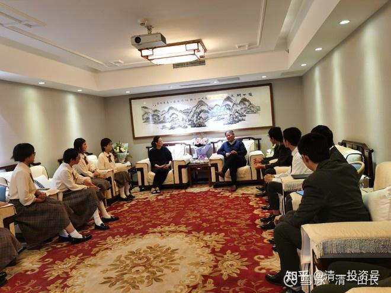
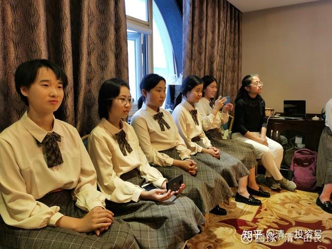
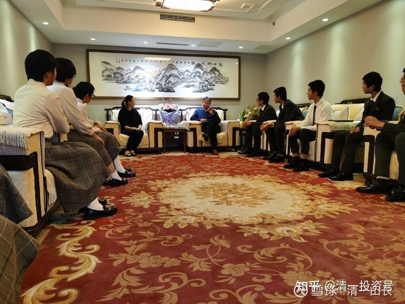

[原雪球专栏](https://zhuanlan.zhihu.com/p/547314723/edit)[87篇.北外西语院长：三语高中“远超北外西语专业毕业生”！](http://link.zhihu.com/?target=https%3A//xueqiu.com/9310099567/163597273)

[清一山长](http://link.zhihu.com/?target=https%3A//xueqiu.com/9310099567/column) 2020年11月20日

三语高中西语班的学生，本周在北京参加西语国际证书考试C1级的笔试和面试。由于笔试完成后，考生们等面试的时间有几天空缺（因为是一对一的面试），家长们就专门联系了北京外国语大学的副院长面谈，想请中国最顶尖外国语大学的专家们，现场看看我们的三语学生，给我们新成立才一年多的三语高中，检验一下学习成果，把把关！也希望专家们对我们学生未来的教学内容，以及发展方向，提一些教学建议。毕竟，三语高中没有一个懂西语的教师，对于学生们到底学到什么样的水平了，老师们心中也没底。就请中国最牛外国语大学的西葡语学院的副院长来检验成绩，去参加西班牙的国际标准语言考试来检验成果，这是我们开放和自信的表现。但最终的结果，还是超出了我们开办专业时候的预期：我们原来希望通过一年的学习后，学生们能够通过B2就不错了。没想到学生们顺便就拿下了C1，甚至有学生还想要去考C2。而外国语大学副院长的评价，也超过了我们的预期！

西语和葡语学院的常副院长，今天热情地接待了三语高中的家长和学生们，现场考察了学生们的交流能力和水平。常副院长高兴地表示：这些学生让他大开眼界！没想到一个高中，取得了远远超过北外西语专业大学生毕业水平的教学成绩。

家长在现场传递的信息：

今天上午西语班同学与北外西葡学院常副院长交流顺利。常副院长的教学思路与新教育理念接近，大赞了学生们的西语学习成果，坦言：交流中学生们展示出的西语听说能力，已远超过北外西语专业大学毕业生的水平！同时给了学生们很好的建议：西语只是工具，现在孩子们西语已经很棒了，可以扔掉西语，去提升自己的专业学科能力，如法律、欧洲历史、经济政治。现在和未来，国家都很需要这样的外交人才。很期待孩子们可以在不久的将来为国效力。

这些话，肯定不是客套话。因为常副院长直接就让孩子们扔掉西语，去提升自己的专业学科能力。这说明他认为孩子们经过一年的西语学习后，语言能力已经完全过关了，达到了应该进行专业学习的程度了。不再需要继续学习语言。这个专业学习目标，就是外国语大学语言教学的目标。但很遗憾：很多外语学习者，甚至一辈子都没达到这个水平（包括我在内，我的英语能力，就无法达到正常进行专业课程学习的程度）。进入外国语的专业学习阶段，其实是大学里面的研究生阶段教学任务。这也是我们三语高中后两年的教学任务——未来，哲学、心理学、文化历史等，是学生们的学习重点。这样到了18岁，他们去考海外专业大学，去深入发展专业学术能力和水平才能轻松匹配。这都说明：三语高中这一群平均年龄才16岁的学生，已经完美地完成了中国大学的学习任务。**三语高中，只是名义上的高中，实际程度，是大学级别的**。当然，学生们考三语高中的难度，也是大学级的难度。因为我们的**入学标准，是不低于美国前100大学的录取分数线。**

欢迎各位入读三语高中。我们正走在快速树立中国新教育标准和高度的路上！我们是教育界的华为！

[https://www.ximalaya.com/shangye/52603303/470400793](http://link.zhihu.com/?target=https%3A//www.ximalaya.com/shangye/52603303/470400793)（音频）

**评论回复：**

**静心禅意回复清一山长**：

尊敬的山长老师，非常高兴三语高中的孩子们取得这样的成绩，我一直想着能否有幸让我读初中的儿子也能有幸去泰国参加您的新教育学习深造，不知老师可否告知我相关的申请条件或要求或相关老师的沟通渠道，不知道犬子够不够格，如果能去的话就太好了，我个人也特别盼望能有机会去泰国听您的课程，就是不知道怎么申请。另我现在在听您的《道德经》讲解，非常受益，非常感恩老师您的法布施。[心心][心心]收起

**清一山长2020-11-18 15:49回复静心禅意**：

**三语高中入学标准：面对全国公开招生。入学基本要求是：入学年龄15岁以下，SAT考试成绩1200分以上，半马3小时完成。就可以入读远程教育班了，免费入读，我出钱支持**！**如果要上全日制寄宿班，有人数限制。目前的入读要求，是SAT1400分，半马2.5小时，年龄一样，不超过15岁。就可以获得免费入读资格，食宿我负责出钱来招待**。以后的入学条件，随着达到此成绩标准的学生增多，要求可能会更高的。但远程教育学生人数不受限制，只要达到SAT1200分，就可以录取。欢迎各位申请。

不过，提醒一句：这个入学考试的成绩，如果您的孩子，是跟学示范班的，是很容易达到的。跟学三年以上就可以了。但如果您指望靠体制学校达到这个成绩，基本上没门[俏皮]。

反正示范班您也是免费跟学，你们就先跟吧！别学生和家长，自己都不努力，就直接来找我出钱出力的，让我全程负责，帮你完成理想的学霸之路。我还没这么贱的[滴汗]。**你们就算跟不上示范班的进度，也没关系，自己努力多学两年就行了；考三语高中，就算考不上也没关系。至少考海外大学，绝对没问题**。泰国排名第一的朱拉隆功大学，入学SAT成绩只要1000分就够了，比我的三语高中要求低。其他泰国大学就更不用说了。

**清一山长 2020-11-18 16:32**

三语高中西语班的家长对孩子参加考试后的感言：“新教育的语言学习法，不同于传统的方法。记得李天健刚进入三语高中学西语，就吐槽说西语太变态了，和英语不一样，发音虽然和拼写很一致，但语法太复杂了（动词变位就有184种），连西班牙人也经常搞错。所以感觉学习起来挺有压力。一学期之后，学了三部电影，虽然快达到B2级别了，但看到很多同学还只是A1、A2级别也感到很着急（他理工科线性思维比较严重，实际体验以前，不能完全理解新教育的电影表演法的学习效果是非线性的。）。就是今年八九月份备考前，也对班级整体进度忧心忡忡，认为有三分之一学生可能通过B2有困难。但十月初第一次官考却让他大跌眼镜，大多数同学表示可以轻松通过B2考试。十一月份这次官考，大多数学生都选择突破C1考试。现在看起来考试效果还比较满意，发挥正常。这完全颠覆了李天健这个亲历者的认知。可以看出，**新教育的外语学习法，是一种越学越快的加速的学习方法**。这其实也不难理解，全脑学习法，自然比体制死记硬背要高效得多。更重要的是，孩子们通过电影表演，还相当于学习了心里行为的课程，对人性有了直接的体验和了解，相比体制孩子被格式化成机器的呆板相比，更加灵动，有朝气。以上是我作为三语高中西语家长的观察结果，供大家参考[抱拳]”

**三语学校的三语，是汉语、英语为标配，另外加上“任何一国的外语”**。今年有西语班、泰语班。明年就改为法语班、日语班了。一般来说是每年换学一门欧洲语言，一门亚洲语言。将来我们的学校，就是联合国学校。学生去向是全世界的大学，而非锁定英美（反正英美现在也正在限制中国学生入读优势专业，而且收的学费很高）。**法国、西班牙的顶尖大学，都是免费入读的。但必须通过他们的语言考试。主要是这一点，限制了海外学生的入读。**

**艳丫裙芳回复清一山长**：

首先申明，我跟着山长您抄作业两年了，我是赚钱的，感恩遇见您。同时我也开始关注新教育，有一个问题不解，（不是故意抬杠）我一直觉得教育不论哪国的都有利弊。您的新教育我觉得是很厉害，起码在语言学习和让孩子从思想上自主自发内驱力这么强地学习绝对[很赞]，但好像没有看到您有说过有什么不足或是要改进的方面。没有其他意思，真心请教！

**清一山长2020-11-20 12:04回复艳丫裙芳**：

我们的缺点可多了，比你想象的还要多。每天，我们老师们，主要任务就是找毛病，找我们的缺点，都在改进。每天学生都在反省自己今天的不足。别忘了我们学堂是文武双全的，每个教师和学生都练武。练武的重要特点，就是天天找自己的毛病。因为自己不找，你的对手会找。假装没缺点没用的。**我们这个学校，就是通过找自己缺点来发展，壮大的，说好话，我们也会，不要钱就送给您。**

西语班，北外教授说学生很好，很优秀。但今年新开的第二届西语班，我们又再次改进了方法，跟你看到的这一批学生又不一样了。所以，**我们都是一群有很多缺点的人，非常的不完美，只是我们愿意改正**。所以，如果您要想找完美的教育，千万别理我们这一套。中国有很多高大上的国际学校，这些学校比我们更美好。

我们只适合10%不到的人，其他90%的人都不适合。这也是我们最大的缺点，不适合大多数人的需要。而且**我们学校是素食学堂**，生活条件差；学校坐落在边远山区，郊区，小国，穷国。**离城市较远，购物娱乐，都很不方便**；**学生也没网吧去玩；家长不能天天见到孩子，没多少机会亲热，可能会影响亲子关系**。这些都是我们的重大缺点。不知您了解了这些缺点后，是否会满意一些了？[笑]

祝福您和您的孩子吉祥如意！[献花花]

**参考链接：**

[清一投资号：2篇.清华钱颖一：人工智能将使中国教育优势荡然无存](https://zhuanlan.zhihu.com/p/535092937)

[清一投资号：14篇.中国人用一年学完美国K12课程，骗子还是疯子？](https://zhuanlan.zhihu.com/p/537055255)

[清一投资号：23篇.教育是分层的：底层应试教育，中层素质教育！](https://zhuanlan.zhihu.com/p/537522662)

[清一投资号：26篇.国际今日——做最好的中国人](https://zhuanlan.zhihu.com/p/537994917)

[清一投资号：41篇.亲历者自述：两种教育模式下的教师与学生的区别](https://zhuanlan.zhihu.com/p/545608877)

[清一投资号：44篇.史上最牛外国语学校：免费课程分享直播开启](https://zhuanlan.zhihu.com/p/546933970)

[清一投资号：46篇.新教育送给中国人的礼物——中国公主](https://zhuanlan.zhihu.com/p/553173076)

[清一投资号：47篇.如何用三年学完十二年的课程？](https://zhuanlan.zhihu.com/p/547313287)

[清一投资号：51篇.学一门外语：四个月真的够了，还有千万奖学金在等你！](https://zhuanlan.zhihu.com/p/549087817)

[87篇 北外西语院长：三语高中“远超北外西语专业毕业生”！](http://link.zhihu.com/?target=https%3A//www.ximalaya.com/shangye/52603303/470400793)（音频）
