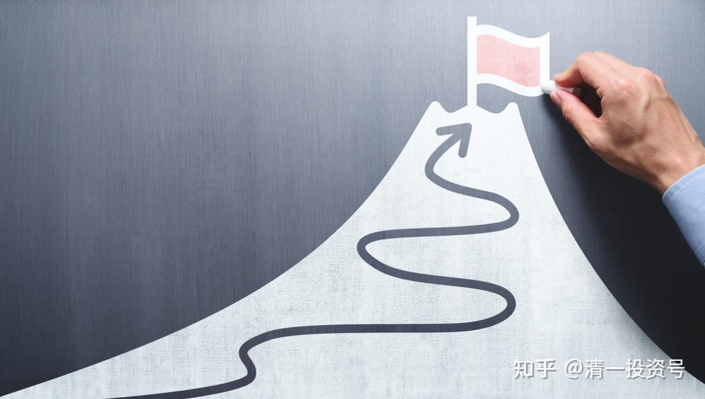
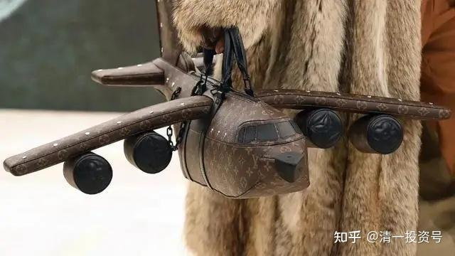
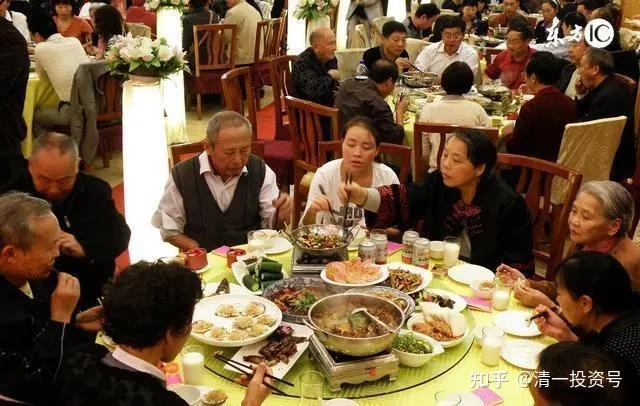

原专栏**157篇.财富最终讲：中国人赚钱的目的是什么？反思中国人的金钱心理行为，及其结果！**

[清一山长](http://link.zhihu.com/?target=https%3A//xueqiu.com/9310099567)2021年5月8日

如果有一个宇宙银行，您认为宇宙银行会如何运作？天道、人道与财之道！

全世界的中国人，为啥都活成了一个模样？（全世界华人，似乎都是金钱的奴隶）

人活一世，肯定要做点什么才行。**如果我们只会做动物做的事情。不管您贴上多高的标签，本质上都是动物，其实连动物都不如**——**是被愚弄的动物，被奴役的动物。**

比如说“吃喝”。您**吃10块钱一份的饭，与吃10万元一餐的饭，与野鸟吃免费的虫子，本质上没差别的，本质上都是为了满足生存的需要**。但您如果以为您必须吃1万元一餐才够档次，您就被“食品利益集团”所绑架和奴役了。巴菲特坚持吃最简单的汉堡包，就是看透了这一点。

比如“玩乐”。穷孩子免费去河里玩乐，与您有钱人花十几万元，一家子去高档的海南海滩游玩，本质上也是一样的。穷人泡个妞，花几十元钱，您找个模特、女明星陪玩，花上数百万元，与小狗找个免费的“女狗”一起玩，本质上也是一样的。别**以为您花钱多，档次就高了。这是骗人的，您依然停留在动物级的繁殖能量阶层！**

比如“住行”。您住香港一千平方米的超级豪宅，花费数亿元，与清迈人花上20多万，住一个40多平方的蜗居，以及与一只鸟，自己打造一个免费的鸟巢，本质上，大家都是一样的！但您付出的生命价值，差别可大了。香港的年轻人，要为一小套房子打一辈子工，被地产利益集团奴役到死。您以为他们是两种人，其实是一种！

您用几十万一个的包包，真的与别人用几百元的不一样吗？下图这个丑死了的飞机包，卖价25万元人民币。您认为您买了，就提高了您的身价吗？恐怕别人只会觉得您更蠢了。

我有一种对自己消费的生命质量的算法：您去买一些没啥实质意义的东西所花的钱，别以为自己提高了档次，可能你消耗了自己的能量。您应该用**“生命工薪”**来对您的消费进行算账。比如您是上海人，您可以用**“2019年上海市城镇非私营单位就业人员平均工资为149377元”**，来算您用一个上海工薪阶层一年半的“工薪生命”，换了一个这样的包，您实在太不尊重劳动者了。其实，这也是不尊重您自己。从轮回的角度来说，您得到的一切，都要还回去的。天道是很公平的，别以为您天生高人一等。上帝面前，是人人平等的!

您可以想象自己：如果将来福报享尽，您透支了您做人的资产享福，需要做牛做马来偿还这些债务，你需要多少年才能还掉你买一个LV包的生命价值？现在一头肉牛的价格，大约卖4000到一万多元而已（大小不同，价格不同）。如果您就是想把这25万花掉，是不是用来买您的人生价值，不是更有意义？对您更有价值吗？比如您设法去买到，将来你不用做牛的机会！

别以为您就不会做牛，我们见到的人变牛的，牛变的人都太多了；还有变猪的，以及猪变的人[滴汗]。别以为您今天的地位高贵，也难免死后直线下降，直接变动物——我们在泰国见到一头白色的大象，行为举止有点奇特。用神通去看，居然她的前世是泰国的一位国王[哭泣]。

我说这些，你们可以不相信。毕竟**您完全闹不懂，宇宙是怎样运行的。您现在连一个包都看不穿，一套房子也看不穿，您怎么可能看穿宇宙的奥秘呢？**

好吧！我就只说现实的利益好了。国人追求钱财，没啥问题，金钱代表能量。但有了钱，只会用来吃喝玩乐，只做动物都会做的事情，是不是太动物性了一点？华人有啥精神追求没有？华人有啥文化追求没有？除了钱，我们还剩下一些什么？

如果您在精神上是还没有脱离动物性的话，堕落成动物，是没啥奇怪的。

如果您用钱，只知道用来买动物都能够拥有的一切，你有啥“人类的光辉”？比如：您会吃昂贵的澳洲龙虾，其实海里的动物也会，它们的大餐还是免费的。别以为这个，能代表您做人的档次。

泰国的华人，据说控制了泰国80%的财富。但我奇怪的是：我没看到华人创造了什么样的文化和教育。连一所像样的，具有国际影响力的华人国际学校都没有！泰国倒是有很多的中文学校，但教室的配备，基本上是乞丐一级的。教师，也差不多乞丐一样。跟欧美国际学校的配备，根本就不是一回事情。跟泰国普通的公立学校相比，也完全没法比，就是破破烂烂的样子，真的很掉底子。华人的钱，花到什么地方去了？

朋友带我去过一个潮州人办的华人餐馆：奢华至极，是我在泰国见到的最豪华的地方。占地十亩左右，像个小花园。跟普通泰国餐馆简单的风格相比，完全是另外一个档次，像是国内的高级餐馆的样子。所以，我认为，华人认为吃的地方，比学校重要，也更舍得投入。另外，买各种高级的东西，买土地，盖房子，做生意，华人都干得不错。就是精神上的投入，对人类的理性和思考上的投入，几乎没有！华人认为教育，就是生意的一种——要花最少的钱去获得文凭，不是要获得文化！所以，华人在泰国，其实没啥文化影响力的，也不受尊重！

在全世界范围来看，似乎也是一样的。中国人对于文化和教育的投资，没啥兴趣。我们**所谓的重视教育，其实是重视文凭、资格、地位，要用来换一份高薪的工作。并不是真正的对教育和文化有兴趣！**

我在清迈买书房的书柜和书桌，惊动了一个台湾的华裔泰国人。因为家具厂的老板是他的邻居。听说有一个中国人，居然花了几十万泰铢，买了泰国最好的一批十个柚木书柜和十个柚木书桌，供养给我们的学生学习用。他认为非常的奢华。跟我联系，来我这里参观看了一次。他很惊叹！说没见过这样舍得花大钱支持办学的人。没错，我吃很简单，但做教育投资很舍得。如果他知道我在国内是买了一大批红木家具来做课桌、餐桌和会议室的椅子，价值数百万泰铢，不知道会咋想？大家看的清一大学的视频，就是我在国内投入数千万的结果，房子加上环境，硬件和软件，都要到位。其实，我的想法也很简单：我希望我死了，这些东西依然可以留下来，就像明代的家具一样。

今年我的教育投资，因为国际学校要开办，建设费用很多，投入已经超过一个亿人民币了（不是泰铢），未来几年都是高投入时期。我办私学，一直是负的现金流。因为我可不想弄成泰国华人私立学校的样子：寒酸气重！让别人一来就看不起。至少我的学校，得赶上像样的公立学校的水平，而不是贫民窟的样子。

看到下面这篇萧功秦的文章，我希望财富学员们好好地想一想：你的**生命，用来追逐钱财，真的有意义吗？我们能不能用生命去做一些比吃喝玩乐更有价值的事情？我们能不能用钱去做一些动物不能做的事情，去维护一些人类的高贵和尊严？而不是做跟动物一样的事情？人，其实没办法去吃动物吃不到的东西。我们只要去创造一些动物没法做的事情，才配称为“人”吧！**

华人，要想得到世界的尊重，也要拥有一些高贵的品质吧？而不是仅仅是：活下来，活得好！**更要活得有尊严，要活得让世界仰望！**

今天的作业，就是阅读下文：

**作业一：从下文中，解析中国人的信念系统，找到这些中国人行为习惯后面的信念和心理因素。找到华人在全世界勤奋努力赚钱的最终目标是什么？他们是否得到了自己想要的东西？怎样才能得到他们想要的东西？**

**作业二：您认为，你要怎样才能活出你的人生风采？怎样活，才能对得起你这一生？**

**作业三：看了本文，你已经知道了全世界的中国人，都差不多。您从中发现了什么样的机会？让你可以更容易把这一生，活得比普通的中国人更成功？名与利，谁重谁轻？**

**作业四：如果有天道，如果你相信天道公平，你认为下文中的这种生活的中国人，及其子孙后代，会有什么样的人生和命运？您应该怎样驾驭和使用金钱，才不至于成为金钱的奴隶？怎样才能潇洒自如地活在人间？**

**作业五：请设想“宇宙银行”是怎样运行的？假如你相信神是公正的，祂会用一种更高级的方式，来评估每个人的人生价值、存在价值。比如，可能用一种“宇宙币”来奖励你，来衡量你生命的价值，而不是用金钱。你认为：你应该去做一些什么样的事情，才能得到更多的“宇宙币”？**

**作业六：“富贵修道难”，啥意思？“无财不足以养道，无道不足以存财”。赚钱和存财的奥秘是什么？该怎样做？您拥有的财富，放在何处才最安全？假如您在“宇宙银行”存了足够的款，您要用来干啥？你提款出来的目的是什么？**

**作业七：中国人的命运，是有命赚钱，无命花钱。就是不懂“财道”的关系。隋、唐、宋、明，都是世界顶尖富裕和发达的国家。为何中国人在最富裕的顶峰，会遭到“天谴”？天降煞星是咋回事？造成人民90%的死亡是偶然吗？这是违反了什么样的天道原则才导致的结果？**

**[萧功秦：十几亿中国人，为何活成了一个人？](http://link.zhihu.com/?target=https%3A//www.wenzhangba.com/yuanchuangwenzhang/201809/398745.html)**

——为什么中国人追求的都是庸俗的“成功”

2015年6月6日

不久以前，我们去看一位从美国回上海探亲的朋友。这位和我从小一起长大的朋友二十年前赴美留学，他谈到多年以来在美国的生活，感触最深的是：

**在美国的中国人的生活追求，与西方人相比，有一个相当大的区别**，那就是旅美中国人无论事业成功与否，无论属于哪一个阶层，似乎都**非常重视物质生活方面的追求。**

只要中国人在一起，无论是台湾人、香港人、大陆人还是多年旅居美国的华侨，都非常实际，**讲求生活的享受与安乐。**

**中国人平时谈话的内容不外乎是房子、汽车，在世俗生活的享受方面似乎有很强的从众心理，不像西方人在人生追求方面那么多元化。**

在西方，确实有不少人只关心自己的物质生活，但也确实有为数不少的人在追求其他东西。

例如有的人喜欢冒险，而在日常物质享受方面则相当随便，有的人成了亿万富佬，但生活却十分朴素，始终开一部普通的车子，钱赚得再多也不会想到买什么高级轿车。

他们对于别人以何种方式生活，追求什么，物质生活如何好，完全不在乎。每个人都以自我为中心，追求自己觉得值得追求的价值。

**中国人的人生追求相对而言则十分单一**，而且很在乎别人如何看自己。既然社会上以物质生活为中心，在从众心理的支配下，人们也就自然会去摆阔，以此来显示自己的成功。

**1、世俗功利为王，中国人的同质化。**

**当下中国人的价值追求的单一化、同质化**，我在日常生活中就有深切的体会。

去年有一天，我的一个发了小财的初中同学请我和其他几位同学吃饭，在开往一家大饭店的出租车上，他突然大发感叹……在他看来，在当今中国（像我这样）读历史书又能赚多少钱？

对此我一时语塞。不知如何回答才好，我确实找不到合适的语言来对他的想法提出反驳，因为这实在不是一个简单的常识问题，而是一个不同的生活价值态度问题。

这个例子之所以特别有意义，是因为这位朋友在中学时期是全校最杰出的优等生，他的作文常常被语文教师当作全校高中生的范文印出来让大家欣赏。

而现在他却非常真切地把金钱与享受，作为人生唯一值得追求的价值，并相当自然地以此作为唯一的尺度，对别人幸福与否、可怜与否来进行评价，丝毫不觉得这样做有什么不妥。

**这种一元论的拜金主义、功利主义、世俗化的价值观如同潮水一样已经渗透在我们活着的一代人中。以至于这种价值优势已经取得可以指点江山、臧否人物的霸权地位了。**

另一个例子是，记得有一天晚上，我的自行车坏了，正在车摊修车时，放在车架上的一本《西方哲学史》的书，给一位路旁休息的中年人看到了，他好像是突然发现外星人似的惊讶地看着我，并自言自语地说：“哈！哲学！现在是什么时代了，居然还有人在读哲学！”

这件事至少可以说明两点，一是这位市民周围、确实长期以来没有人对于纯粹属于人文领域的事物有兴趣，否则他不会把我看成异类，并如此真切地感到惊讶。

其次，**他非常自然地认为，所有的人都理应追求与他所追求的同样的价值。他无法理解别人追求一种与他不同的价值是合理的、自然的。**他的表现正是他的人生态度的一种最自然的反应。

我用这个例子只想以此来说明，中国人在人生价值方面，确实相当普遍地存在着一元化、板块化、同质化现象，中国人的价值观分化程度很低。用这个例子可以从反面来说明，什么是“特立独行”的生活态度。

前不久我见到的一位来上海开会的美国女教授。十八年以前，我在南京大学读研究生时，就与这位研究中国历史的留学生成为好朋友。

她现在在美国新英格兰地区一所不太有名的大学任教，她说，她希望的是提早退休，这样，她就可以有足够多的时间来自由地研究中国文化与历史，因为她现在上课太忙了，最缺少的是自由支配的时间。

她还说，她生活很简朴，只要再积攒一些钱，提前退休以后的生活不会有问题。这种把学术视为生活中最重要的价值追求的生活态度，在美国并非少见。

**在美国大学里，人文学科的助理教职的收入并不那么有吸引力，然而往往会有数十个博士或博士后宁愿不要去公司赚大钱，而要前来应聘，大学教职竞争非常激烈。**

我曾向一位美国朋友提出这样一个问题，既然获得一个大学文科教职是如此困难，为什么在美国还是会有那么多人选择去读文科学位呢？

这位朋友告诉我，这是因为他们确实有志于哲学、历史、文学与艺术专业，确实以此种学科作为自己由衷的爱好，他们才会做出这种选择。

去年七月我在旧金山硅谷参加了一个中国新侨民举办的家庭聚会。我满以为这些旅居海外的朋友会由于我这位刚从国内的老乡的到来，而问及有关中国的一些话题。

然而在整个聚会中，人们谈的只是各自如何赚钱，刚买不久的房子又涨价了，附近什么地方的托儿所最便宜，等等。

人们几乎完全没有注意到一位中国大陆来客的存在。也根本没有想到问问自己的故乡有什么新鲜有趣的事情，中国有什么变化，中国有什么问题，未来会怎么样。

回来的路上，我对此十分感叹，询问带我来参加这次聚会的朋友，这是为什么？我的朋友一时也回答不上来，只是说，“这里大多数中国人圈子谈的都是这些。不谈这些他们还有什么可谈的？”

**2、你所听到的那些说法，都不是真相。**

为什么会这样？有人说，这是由于中国人长期以来太穷了，穷怕了。所以会以十倍的努力，来追求自己从来没有真正享有过的东西。将来中国人富了以后，一切都会变的。人们的追求会多元化的。

**但这种解释却不能说明，为什么那些已经相当富裕的海外中国新侨民中产阶层仍然如此强烈地追求实惠？在他们身上，似乎丝毫看不出有什么新的价值观出现的迹象。**

就拿香港来说，我在香港作了三个月的访问学者，使我最惊异的一大发现是，号称为世界上第一自由港的香港，拥有六百万高素质人口的特大都市，除了一份《二十一世纪》外，居然找不到一本本地人办的纯人文刊物。

有人说这与中国文化中缺乏宗教因素有关，这样的解释也有一定的道理。因为宗教对来世，对超越性的彼岸世界的追求与信仰，往往能培育人们超越功利的价值观。

中国人与其他民族相比，宗教心理确实是相对淡漠的。佛教并不是中国的国教，**在中国，人们即使信佛，也往往是怀着某种相当具体的功利的目的来求神拜佛的。**

一个结婚几年没有生儿子的中国人去观世音像前烧几柱香，与其说是出于对超然世界的追求，不如说是一种对神灵的贿赂，体现的恰恰是最功利的态度。

一个缺乏彼岸观念的国度里，讲求实惠、注重于现世的生活，务实而少幻想，便成为我们中国人的民族性品格。

**如今又处于一个商品世俗化成为潮流的时代，那么，走向全民性的物质财富的追求也就自然而然了。**

有人说中国人的价值同质化这种现象与大一统的儒家价值有关，因为儒家文化与其他文化相比，由于没有宗教作为自己的形而上的存在基础，儒家缺乏强烈的宗教情怀，缺乏超越功利的价值。

深受儒家影响的中国文明，因而与其他文明相比，无疑是一种世俗化程度最高的文化。**然而，当我们追溯到孔子的思想中去时，却会发现孔子恰恰是一个具有特立独行的人生态度的人。孔子本人是有强烈的超越功利的价值追求的**。例如孔子说“朝闻道，夕死可矣”，在儒家先贤那里，对形而上的道的信仰与追求是相当执着而且强烈的。

“一箪食，一瓢饮，在陋巷，人不堪其忧，回也不改其乐。”一个像颜回（孔子弟子）那样有精神信仰的君子，会生活得相当充实并具有人格力量。

**3、还原真实的孔子和真实的儒家文化**

**孔子从来对超功利的艺术与精神领域的追求看得远比物质上的收获更重要**，他说过“饭疏食，饮水，曲肱而枕之，乐亦在其中矣。”他还意识到，“知之者不如好之者，好之者不如乐之者。”

在他看来，贵在自得之乐，一个人的追求才具有真正的动力。他对音乐的热爱可以使他“三月不知肉味”的地步。在《论语》中，人们可以找到这方面的许多言论。

**另一方面，孔子对“道”的追求又并没有使他成为禁欲主义者，他从来没有单纯地拒绝过物质上的享受。**

他并没有像后世的佛教徒那样，一般意义上反对“富且贵”。他只是说“不义而富且贵，于我如浮云。”毋宁说，他主张在现世生活中，在追求崇高的超越性的“道”的同时，仍然保持着一种有节制的世俗物质生活。

这是一种相当乐观的、积极向上的、既有精神追求又有物质享受的人生图画。一个以原典意义上的儒家作为安身立命的基础的君子，他希求的是在精神与物质方面达到平衡和谐的状态。

这使我想到了我的祖父。直到（二十世纪）六十代年初期过世，可以说他属于中国最后一代的受儒家影响的老式读书人。

根据家人的回忆与我小时候对他的依稀的记忆，他是一个乐天的老人，自命为“谑翁”，喜欢喝酒，喝得过量也会发酒疯，对人非常善良。读书甚勤，拥有万卷藏书，购书成为生活中最大的爱好。

每次发薪水就用来购书，购书之后往往是身无半文。反过来还要向子孙辈“借钱”。吃的则基本上是粗茶淡饭。高兴时会眼泪纵橫。对子女又非常宽容。

早在上世纪二、三十年代他就鼓励自己的女儿（即我的姑妈）去读易卜生的《傀儡家庭》，去追求自由恋爱，他从来不以自己的意志要求他人。朋友很多，见到别人有难总会尽力相助。

现在想来，祖父正是在精神上最接近于孔子原本意义上的那种儒者了。他对他所理解的“道”的诚挚信仰，与对现世生活的热爱、对现世价值的享受有机地结合到一起，并达到和谐的地步。

他从来没有压抑自己的个性，他的这种自由舒展的个性与他的人生意义的追求结合到一起，形成一种乐天的生活态度与生活方式。

这种生活态度的意义就在于，对天道的尊崇，使一个人可以摆脱那种单纯的物质金钱的追求，而对现世人生的热爱与乐天的态度，又使人不至于变成“道”的殉葬者而不自知。

**我想，这种和谐的生活，可以产生一种真正意义上的自由的人格，一种不是刻意包裹与修饰自己，以迎合世俗生活的人生风格。一种有着丰富的精神追求的，达到“乐以忘忧，不知老之将至”的人生境界。**

可惜，这一种类型的儒者与我们之间已经出现无法接合的断层。

**4、被严重曲解、强奸的儒家文化。**

二十世纪以来，士绅文化终于彻底消亡了，取而代之的是一种带了革命特色的农民文化。

而农民不得不为稻梁谋的生活处境，使这种文化注定具有相当实用性与功利性特质。当然，这一点肯定不能解释我们提出的问题的全部，但也许可以解释部分。

当然，**从总体上来看，中国的儒家走向了“律则化”，即把儒家的“道”变成官学化的政治意识形态，变成为统治者的工具，变成一种硬化了的“君尊臣卑”的纲常伦理。其结果就是儒家自身的异化。**

一种重发舒（指充分发展）的、通达而多少富有人性味的原典儒家，在西汉以后演变为“重一道同风”的、以“律则化”的方式，来限制人的自由发展的官学化的儒家。

于是，中国文化就显示出这样的特点，**禁欲式的“律则化”对人性的压抑，形成机械式的人格特质。这种格式瓦解后，则呈现为不受精神力量制约与节制的逐利趋势。**

在乱世时代，这种物质追逐表现为没有章法的不开化的利己主义；在一个商品化的世俗承平时代，则表现为“天下攘攘，皆为利往，天下熙熙，皆为利来。”

而无论在禁欲主义的格式化约束力有效的时期，还是在其失效的时期；无论在乱世还是承平时期，国民人格的表现都体现为同质化。中国有的是贤臣、烈妇，营利之徒或官学化的儒生，但就是极其缺少特立独行的自由人格。

在当今时代，一个长期受僵化甚至异化了的制度与律则支配，在市场化、电视文化的影响下，只能导致人文精神的缺乏，对超然的、超越功利的审美追求的缺乏，务实的传统品格传承下来，也只有逐利一途。

其实，我们现代中国人中并不是没有特立独行的人，每一个民族的文化中总有一些超越性价值的因子。只是我们没有去发掘它们。

我们历史中有过屈原的浩渺无涯的想象力，有过《史记》中的豫让那种充满悲剧性格的侠义英雄，有过竹林七贤的真潇洒，有过李白的真浪漫。

**只是这些文化因子逐渐消失了,消失在金榜题名与洞房花烛的世俗追求之中了......难道到了今天，我们芸芸众生注定只能把坐在沙发上看电视作为唯一的生存方式？**

中国人什么都不缺，智慧、毅力、勤勉、奋发、这些东西都有，缺少的就是一种对人生的浪漫主义态度。事实上，特立独行的人生态度乃是创造之母。

有没有这种多元化的生活态度与人生哲学，有没有对生活本身的富于诗情的理解，在很大程度上将决定我们生活方式的丰度与深度；决定这个民族对人类的文明是否能提供更多的具有原创性的东西；决定我们的生命有没有一种立体感。

一个终日在电视机旁的看“会动的图画”的两脚动物是不会有原创性的；一个不能宽容特立独行的人生态度的民族，是很难产生天才的。天才就是那些具有常人所没有的思想与行事方式的人们。

**他们对于社会的意义在于，他们以全部的心思投入到自己的事业中去，并经由这种超越来达到常人难以达到的境界。只有在那种境界中，才有可能发现常人难以发现的事物的本质。**

作者介绍：萧功秦，历史学者、政治学者，上海师范大学人文学院历史系教授、复旦大学当代中国研究中心特聘研究员、上海交通大学国际与公共事务学院政治学教授，博士生导师。

**中国人极具仪式感的“吃”文化——其实不是为了吃，而是为了秀吃！秀存在感。除了中国人，全世界，似乎没有任何一个国家，有这种古怪的“吃文化”。我猜想古代中国，也不会这样吧？**
