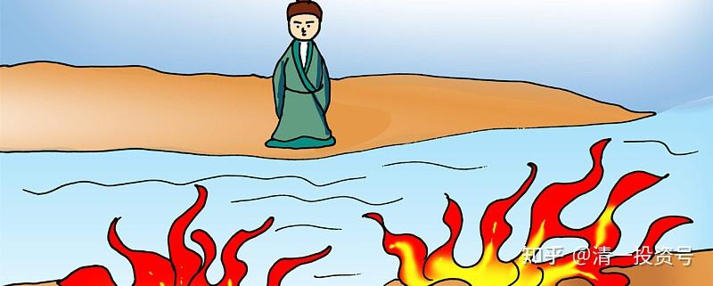
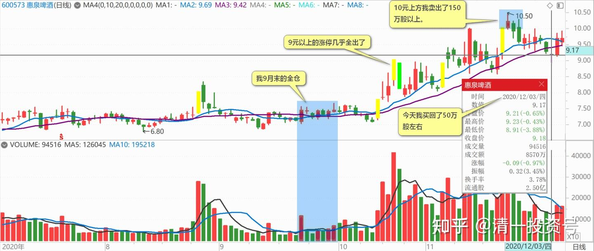

70篇.隔山观火，不投入情感

清一山长2020年12月03日

**一、惠泉破九**

[$惠泉啤酒(SH600573)$](http://link.zhihu.com/?target=http%3A//xueqiu.com/S/SH600573) 好吧！惠泉你赢了！我打脸了。我判断的极限价格是9.3元的，你今天非要来个破九，破就破呗！我承认被打脸。我就多买点股票，算是陪陪罪。**我9月末的全仓，9元以上的涨停几乎全出。**你破9，我就多买一点，大不了无非把利润贴上去，成本不会增加的。百万股持仓，居然零成本，也不成样子。所以加一点补成正数，今天又买了50万股左右，可惜破9的我就是买不到，只能高一点买了。**平价买回9.03元的出仓算了**，算我上次卖错了，我输了。高价本不想买回来的，最后还有几万股，我挂9.17元追，都没有成交，太抠门了。**不过，10元上方，我卖出了150万股以上**。您总不能让我这笔股票亏掉吧？[加油]

**二、隔山观火，不投入感情**

感谢讨论7%的逻辑。我原来还真不明白，以为是市场竞争激烈，中建没有信心保持原来的成长率了。如果是差生加进来了，降低门槛给这后进生机会，而不是降低标准，就证明中建比原来更强了。多谢晕大姐解析，细节研究非常到位。

小笑话：原来我不太了解中建的时候，做T中建，很顺手，赚了多次差价。学了您的中建思维后，就不敢T了，跟您一样做电梯了。5.6元的时候，我在看盘的，盘感明明告诉我，可以出一些。但理性告诉我：何必出！费事儿！

其实也是：没必要为了一点小小的做T利润，错失看好的股票。特别是现在出掉后换什么还没有找到的情况下，就不敢换了。

**惠泉啤酒，我隔山观火，不投入情感，也不了解公司，反而敢大进大出，根据K线图做判断，不断做T，反而赚到超常的收益。**所以，**股市就是一个很奇怪的地方，想投机的话，所有的常识和逻辑都失效。赚到看不懂，但赔也可以让你赔到搞不懂。**所以，最保险的，想要长命百岁的方式，让心情保持最佳的方式，就是晕大姐这种方式：俺就是个拿养老金的。管你跳上跳下的，玩什么猴子把戏，都不理。这样，心情好！

祝您健康快乐！吉祥如意[献花花]

三、**最精彩，最激烈，利润也最高的时候，我就闭嘴了**

某球友评论信息

[$惠泉啤酒(SH600573)$](http://link.zhihu.com/?target=http%3A//xueqiu.com/S/SH600573)刘存的抢帽子交易，确实过分了。很多粉丝被卖了，还在给他洗地，这就是高明之处。

清一山长（评论上贴）

我也觉得我挺过分的，抢了主力的这么多钱，有点过意不去。但别人花了钱砸我的正主儿，都没说我过分，还给我比我想要的更多的礼物。您确定，您的钱真的是输给我了吗？要真输了，别以为我会同情你。谁让你跑出来冒充主力的？涨停买货，跌停卖货？除了这种自不量力以为自己是主力的人，谁跟我同向操作的，是真亏了的人？

看您的网名，就是个还在青春逆反期的家伙吧！看啥传统，都想反过来，反骨很重喔！而且，你还是一个爱欺负弱者，鄙视女人的角儿，当男人要打女人。我还真瞧不起这种人。真有本事，起码去打雷雷呀[俏皮]！打个女人，算啥爷们？[为什么]

本来，我很享受看您跑来这里看我操作示范的：这种见不得我发酒财，又拿我没办法的样子。但为了您的身心健康，我还是替您拉黑我自己吧！

如果您是替主力来代言的，也**请主力放心：您要拉到10元以上了，主战场开打。最精彩，最激烈，利润也最高的时候，我就闭嘴了**。毕竟我赚的就是主力打赏的钱，我犯不着跟主力唱对台戏唱到底。有人总喜欢跟我反做着，也让他们去反向指标。我闷声大发财就行了。10元上方，你就出来多多的叫唤，喊多，喊空的随您了。[俏皮]

(标题、图片为编者所加)

**文章音频**：

[460篇.隔山观火，不投入情感](http://link.zhihu.com/?target=https%3A//www.ximalaya.com/sound/740398589)

**参考链接：**

[61篇.顺鑫农业记录七——机构坐庄三招：养、套、杀](https://zhuanlan.zhihu.com/p/556331421)

[62篇.看一看典型的骗线](https://zhuanlan.zhihu.com/p/698011435)

[63篇.为啥我认为是假出货](https://zhuanlan.zhihu.com/p/699291708)

[64篇.看懂长牛股的走势](https://zhuanlan.zhihu.com/p/700510263)

[65篇.多空交战依然没有完成](https://zhuanlan.zhihu.com/p/701863047)

[66篇.讲鬼故事还是真减持](https://zhuanlan.zhihu.com/p/703026413)

[67篇.开盘这十分钟，才是最重要的时刻](https://zhuanlan.zhihu.com/p/704358659)

[68篇.中国的啤酒迟早会赚钱](https://zhuanlan.zhihu.com/p/705635827)

[69篇.炒股惠泉，长持燕京，珠江居中](https://zhuanlan.zhihu.com/p/706901073)
